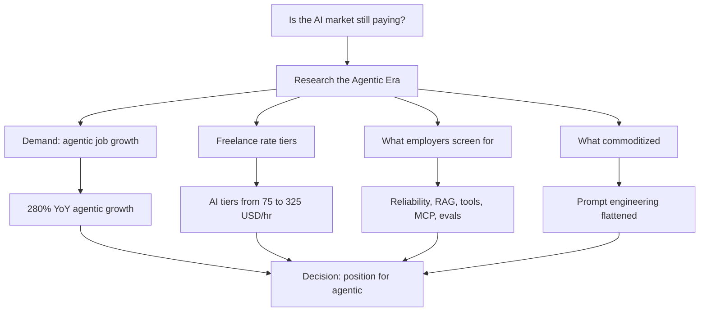
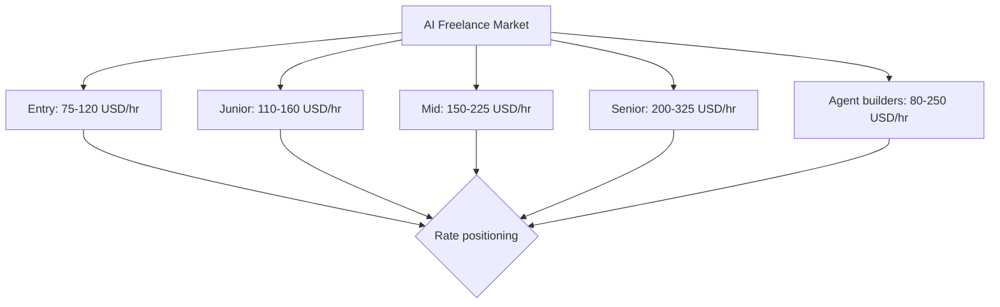
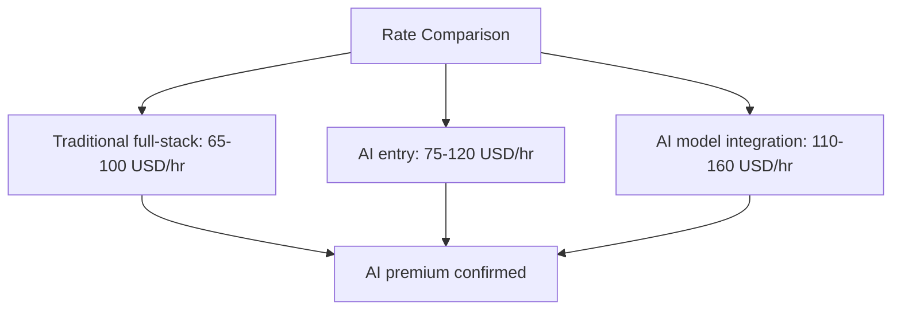
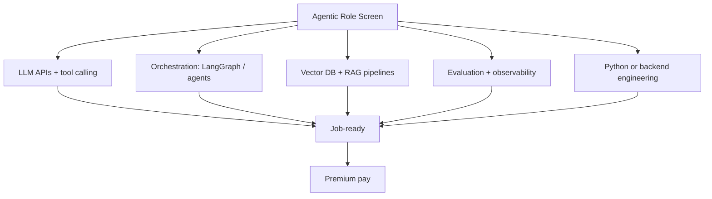
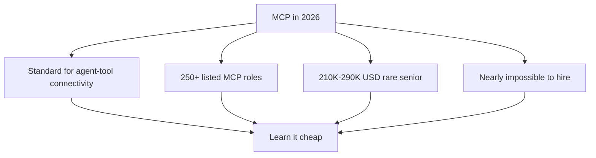
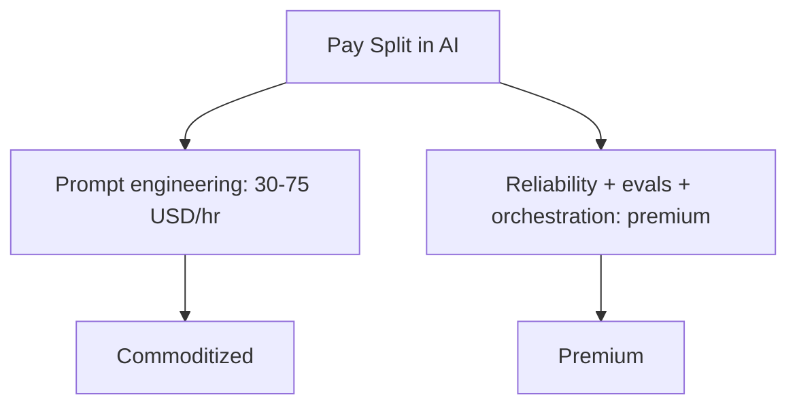
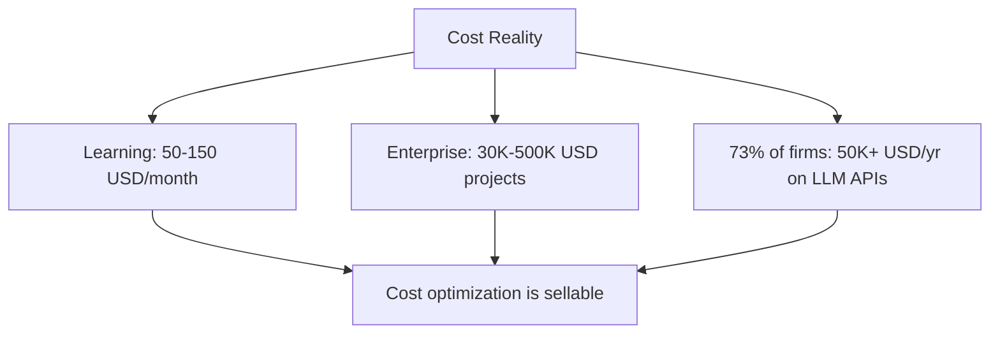
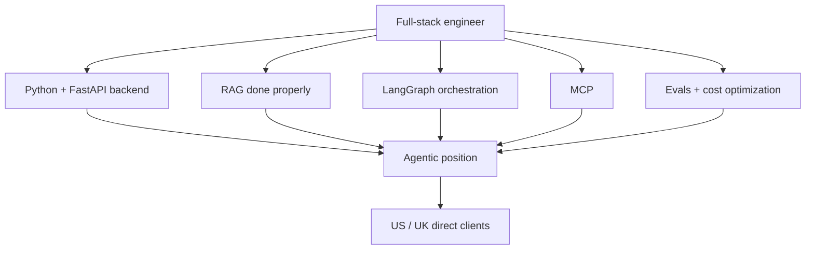

# Market Research: The Agentic AI Engineer Market in 2026

The previous article answered "should I expand into Python?". This one answers the follow-up: should a software engineer position toward AI work, and does the freelance market still pay for it in 2026? The short answer from the job data is yes, at rates well above traditional web development. The long answer is that the market pays for reliability, orchestration, and evaluation, not for the ability to write prompts.

## What Problem This Solves

Traditional web development salaries grew 3-5% in the past year, roughly tracking inflation. Meanwhile the fastest-growing job category in software changed shape entirely. Job postings for agentic AI roles grew 280% year over year to roughly 90,000 US listings. The Q3 Stack Overflow survey confirmed the direction: "AI Engineer" was the fastest-growing developer role by hire rate, and "Developer with agentic workflow integration" the fastest-growing role category overall.

If you are building a skill set for the next two to three years, this is the single most important question to answer: is the premium real, is it reachable from a traditional software engineering background, and what exactly does it pay for? This article walks the evidence and resolves it into a concrete action plan.

## The Freelance Rate Tiers

Comparing freelance and employer rates across 2025-2026 sources gives a stable tiered picture of what AI work actually pays.

The tier definitions are consistent across sources:

- **Entry (0-2 years AI-focused)**: Python and ML fundamentals, LLM API integration, single-model prototypes. The market pays $75-120/hr.
- **Junior (2-4 years)**: Building on a solid backend background, LLM integration, RAG pipelines that run in production. $110-160/hr.
- **Mid (4-7 years)**: Production AI systems, MLOps, vector search at scale, evaluation of model output. $150-225/hr.
- **Senior (7-10 years)**: AI architecture, leading AI teams, cost and latency optimization across systems. $200-325/hr.
- **Agent builders**: Teams and individuals shipping agentic workflows show $80-250/hr globally, with the expert tier from $180-250/hr.

The key signal for a traditional software engineer: **entry-level AI freelance rates start above the mid-tier of traditional full-stack pay**. Traditional React and JavaScript work on freelance platforms sits at $65-100/hr. The AI layer pays a premium for the same underlying engineering.

## What Employers Actually Screen For

The hiring data for agentic AI roles is specific. Survey data from 2026 puts the required competencies on agentic-role postings as: LLM APIs and tool calling, AI orchestration frameworks, vector databases and RAG pipelines, model evaluation, plus at least one of Python, big-data tooling, or backend engineering.

Three skills carry disproportionate weight:

- **Production reliability and MLOps.** The market complaint is consistent: "building a demo is easy, making it reliable is the hard part." Engineers who can ship something that stays up and stays accurate under load are scarce.
- **RAG done properly.** Chunking strategy, hybrid search (keyword plus vector), and reranking. This is the line between job-ready engineers and tutorial-completers, and employers cite it directly as the screening filter.
- **Evaluation and observability.** The unsolved problem at the heart of production AI. How do you measure quality, regression, and cost of a system whose output is stochastic? Companies pay a premium for engineers who can answer this.

A real, current full-stack AI freelance posting asks, verbatim, for: React + TypeScript, Python, LLMs, AI agents, RAG pipelines, LangChain, vector databases, and AI-assisted dev tools (Cursor, Copilot), with 4+ years commercial experience. This is the exact shape of a full-stack backend skill set with an orchestration and retrieval layer on top.

## The New Role: MCP

Model Context Protocol (MCP) turned into a hiring category of its own in 2026. It standardizes how AI agents connect to external tools and data. Salaried roles such as "Agentic AI Engineer" and "MCP Protocol Engineer" appear across 250+ listed positions, with compensation in the $210,000-290,000 range for the rare senior cases. One 2026 benchmark, Benchling's "Agentic AI Engineer" posting, lists $182,000-265,000 for remote US work.

The hiring note repeated by companies: MCP engineers are "nearly impossible to hire." The demand is real, the supply is thin, and it is cheap for an individual developer to learn. MCP is a protocol, not a framework. It rides on top of skills you already build.

## What Has Commoditized

Not everything in AI pays premium. Prompt engineering collapsed into the entry tier, $30-75/hr, as the market realized that writing a better prompt is cheap while making a system reliable is not.

This is a critical sanity check. The parts of AI that generate buzz on social media are not necessarily the parts that pay. The durable value is in the engineering around the model: retrieval, orchestration, evaluation, cost, and reliability.

## The Cost Reality

Learning to build this stack is cheap. The bill is an LLM API token spend plus a small VPS, roughly $50-150 per month. Enterprise RAG project costs of $30,000-500,000 are what you sell and ship, not what you learn with.

One more fact worth knowing: 73% of enterprises report spending over $50,000 per year on LLM APIs, and cost is routinely the bottleneck that stops production rollout. Cost-optimization engineering, whether semantic caching, model routing, or cutting token usage by 30-50%, is a premium freelance niche with rising demand. Your cost-estimation instinct maps directly to a paid pain point.

## Direct Billing vs Platform-Fee Erosion

At $50/hr, platform fees matter. Upwork takes roughly 10% of the freelancer take, turning $50 into $45. Direct invoicing with US and UK clients keeps the full amount. The research repeatedly notes that the jump from $80/hr platform-mediated work to $150/hr direct work is "mostly a positioning problem, not a skills problem."

The strategy that falls out: land the first direct client at $50/hr to extend runway and build portfolio evidence, then use shipped work to raise the rate with the next clients. The market data says the ceiling is far above the entry point, and the reason to start low is to buy evidence, not because the skill is worth only that.

## What This Means for a Full-Stack Engineer Moving into AI

The research resolves to a clear priority order.

1. **Finish the Python + FastAPI + PostgreSQL backend.** This is the proven base. AI engineering without a backend is a demo.
2. **Learn RAG properly.** Chunking, hybrid search, reranking. This is the screening filter that separates job-ready from tutorial-completer.
3. **Add orchestration and evaluation.** LangGraph for agent workflows, LLM-as-judge and RAGAS for evaluation, observability for cost and latency.
4. **Learn MCP.** It is cheap, rare, and on the front edge of the fastest-growing role category.
5. **Optimize cost.** Semantic caching, model routing, token discipline. It is a premium niche on its own.

Your $50/hr is an entry stepping stone, not a ceiling. The same RAG, orchestration, and evaluation skills that justify $50/hr for the first client command $110-160/hr once there is shipped portfolio evidence behind them. The premium is real, the path is the same engineering you already do, and the two words to add to your plan are MCP and evals.

## The Caveat

The fastest-growing category is also the most crowded and the fastest-moving. Market research answers "what is on the table right now," not "what will you be good at in three years." Chasing only the highest-paying label without the underlying engineering is a poor bet.

The durable strategy is to keep the TypeScript, Python, and backend foundation strong, and to express it on top of real products: an agentic workflow with human-in-the-loop, a RAG system with production evals, a cost-optimized deployment. The market pays for people who can ship working, reliable systems. The research tells you where to point your effort. It does not replace doing the work.