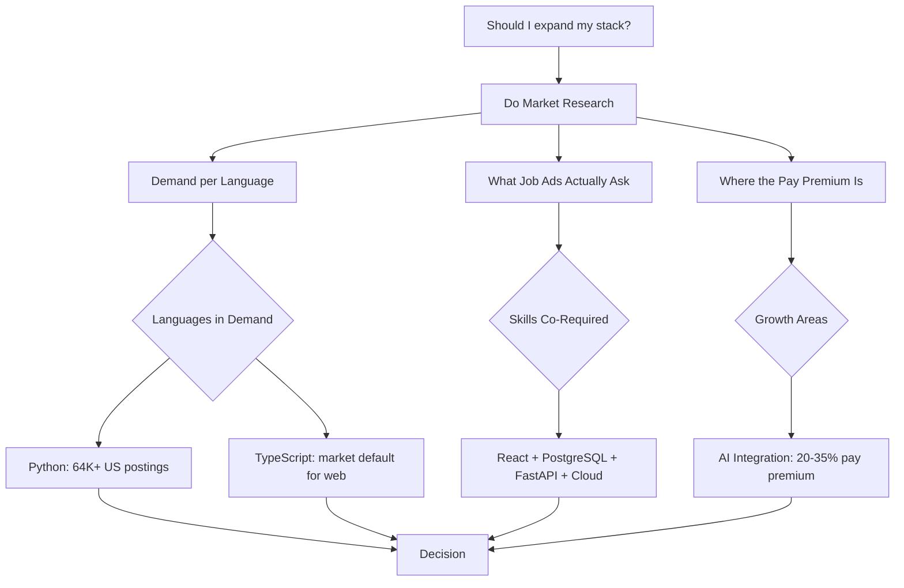
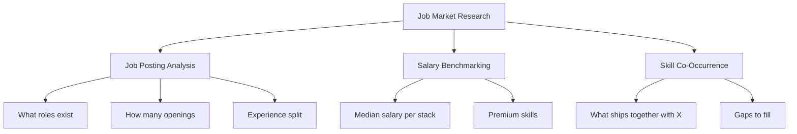
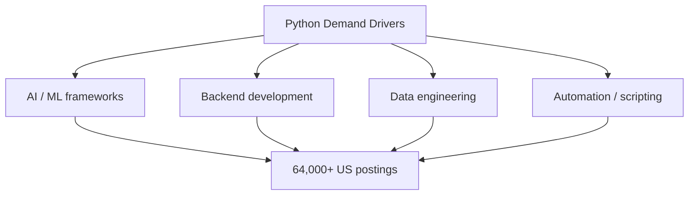
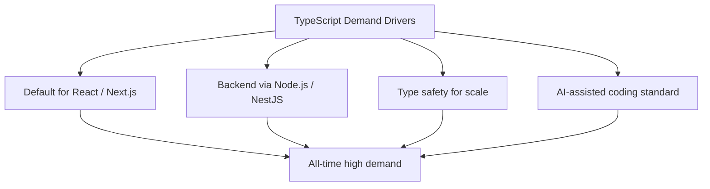
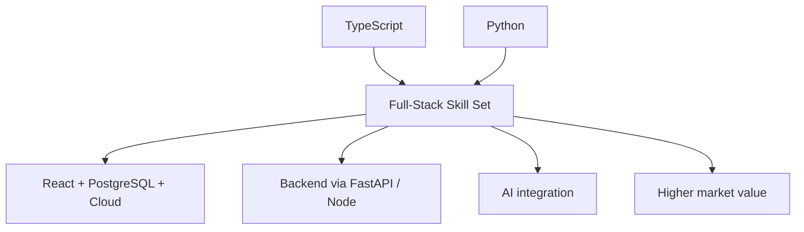
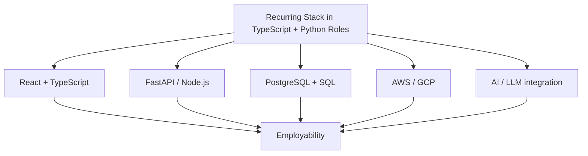
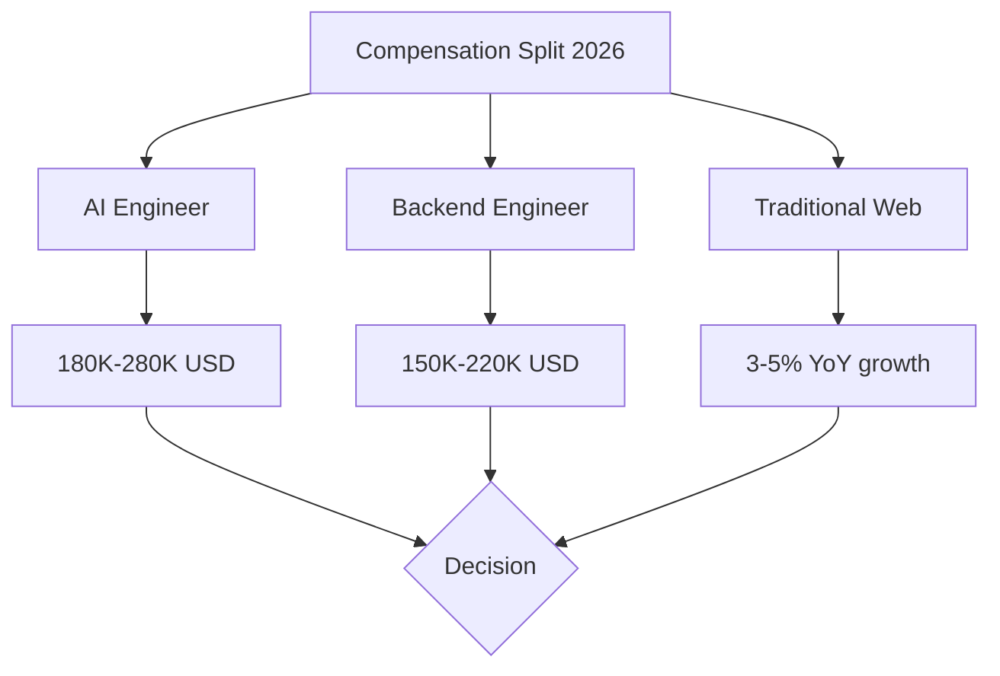
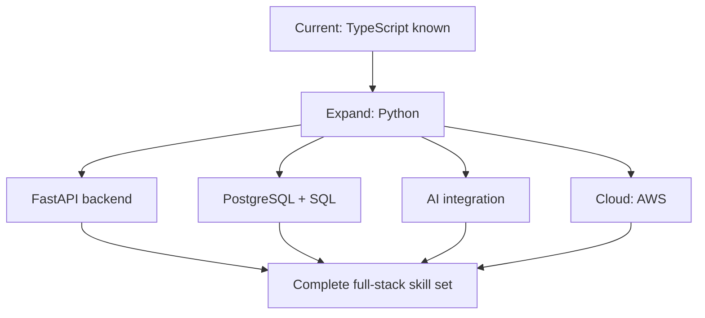

# Market Research: TypeScript and Python in 2026

Doing market research for a career decision. Should a software engineer with TypeScript (already known) expand into Python? What does the job market actually demand in 2026?

## What Problem This Solves

Market research for a technical career is the same as market research for a product. You have a skill set, which is your product. You want to know:

- Is there demand for what I have?
- What do buyers actually ask for?
- Where is the price rising?
- What should I build next to increase my value?

Without this research, you spend months learning something the market does not value, or failing to learn the one thing that would double your leverage. This article walks through the method and the findings for one specific case: an established TypeScript developer expanding into Python.

## The Method

The mistake most developers make is trusting popularity surveys. A Stack Overflow survey tells you what developers enjoy using. It does not tell you what employers pay for. The two diverge.

The reliable source is **job posting analysis**: counts of real active listings, the skills they request together, and the salaries they quote. This is the difference between "what is trending" and "what is on the table."

## Demand per Language

### Python: the demand leader

Python leads US employer hiring with 64,000+ open job postings, ahead of Java (43,000+) and JavaScript (30,000+). It grew adoption by 7 percentage points year over year, the largest single-year gain of any major language. The driver is AI: every major AI framework, from PyTorch and TensorFlow to LangChain and Hugging Face, is Python-native. When an industry is built in one language, the job market follows.

Python median salary in the US is roughly $130,000. In the UK, a Python Software Engineer commands a median of £85,000, with London at £100,000.

### TypeScript: the market default for web

TypeScript became the number one language on GitHub by contributor count in 2025, surpassing both Python and JavaScript for the first time. Every major web framework now scaffolds in TypeScript by default: Next.js, React, Angular, SvelteKit, Remix. Demand is at an all-time high. TypeScript median salary in the US is roughly $125,000.

TypeScript is no longer a "nice to have" that employers treat as interchangeable with JavaScript. In 2026 it is a functional requirement for most mid-to-senior frontend and full-stack roles.

## The Combined Signal

Here is where the research becomes useful for a specific decision. Analysis of thousands of job listings shows that **Python appears in roughly 30% of TypeScript job postings**. One analysis found that 81% of companies hiring TypeScript developers pair the language with Python.

This matters because it reframes the decision. Expanding from TypeScript into Python is not choosing between two separate markets. It is completing the stack that a large chunk of the market expects you to have.

## What the Job Ads Actually Ask

Real postings for a "TypeScript + Python" full-stack engineer share a consistent shape. This is the recurring stack:

- **Frontend**: React with TypeScript. React appears in roughly half of all TypeScript listings, and in an overwhelming majority of frontend listings.
- **Backend**: Python with **FastAPI** (the dominant framework in this combination) or Node.js.
- **Data layer**: PostgreSQL and SQL. SQL ranks third by overall US employer demand, behind only Python and Java, because data problems never go away.
- **Cloud**: one major provider. AWS is the clear leader, mentioned roughly seven times more than Azure. GCP appears in AI-leaning roles.
- **AI integration**: increasingly a baseline expectation, not a specialization.

## Where the Pay Premium Is

Not all skills carry equal weight. The research shows a clear split:

- **AI-related roles** have seen 15-25% salary increases over the past year.
- **Traditional web development** salaries have grown only 3-5%, roughly matching inflation.

A senior **AI Engineer** in the US commands $180,000-$280,000, compared with $150,000-$220,000 for a senior backend engineer. The AI Engineer sits between traditional software engineering and data science. What does the market require for that role? Strong backend skills in **Python, Go, or TypeScript**, plus vector databases, embeddings, LLM integration, and evaluation. In other words, the same TypeScript and Python foundation, with an AI layer on top.

Beyond AI, the recurring differentiators are **system design** (which commands top salaries at around $246,000 in TS listings) and **observability/reliability** engineering.

## What This Means for a TypeScript Developer Expanding into Python

The research resolves to a clear priority order.

1. **Finish the backend with Python + FastAPI + PostgreSQL**. This completes the stack that a large portion of TS-focused employers already expect.
2. **Add SQL discipline**. It is high in demand, always, and underpins the data layer.
3. **Layer in AI integration**. LLM APIs, retrieval-augmented generation, vector databases. This is where the pay premium and the fastest-growing roles are, and it builds directly on the Python foundation.
4. **Get hands-on with a cloud provider**, AWS first.

TypeScript is not a skill to drop. It covers the frontend and the type-safe full-stack expectation. Python is the expansion that unlocks the higher-value half of the market. Together they form a combination that roughly a third to four-fifths of relevant employers are already asking for.

## The Caveat

Market research answers the question "what is on the table right now." It does not answer "what will you be good at in three years." The fastest-growing category, AI integration, is also the most crowded and the fastest-moving. Chasing only the highest-paying label without fundamentals is a poor bet.

The durable strategy is to keep the TypeScript and Python foundation strong, and to express it on top of real products. The market pays for people who can build working systems, not for people who can name frameworks. The research tells you where to point your effort. It does not replace doing the work.
