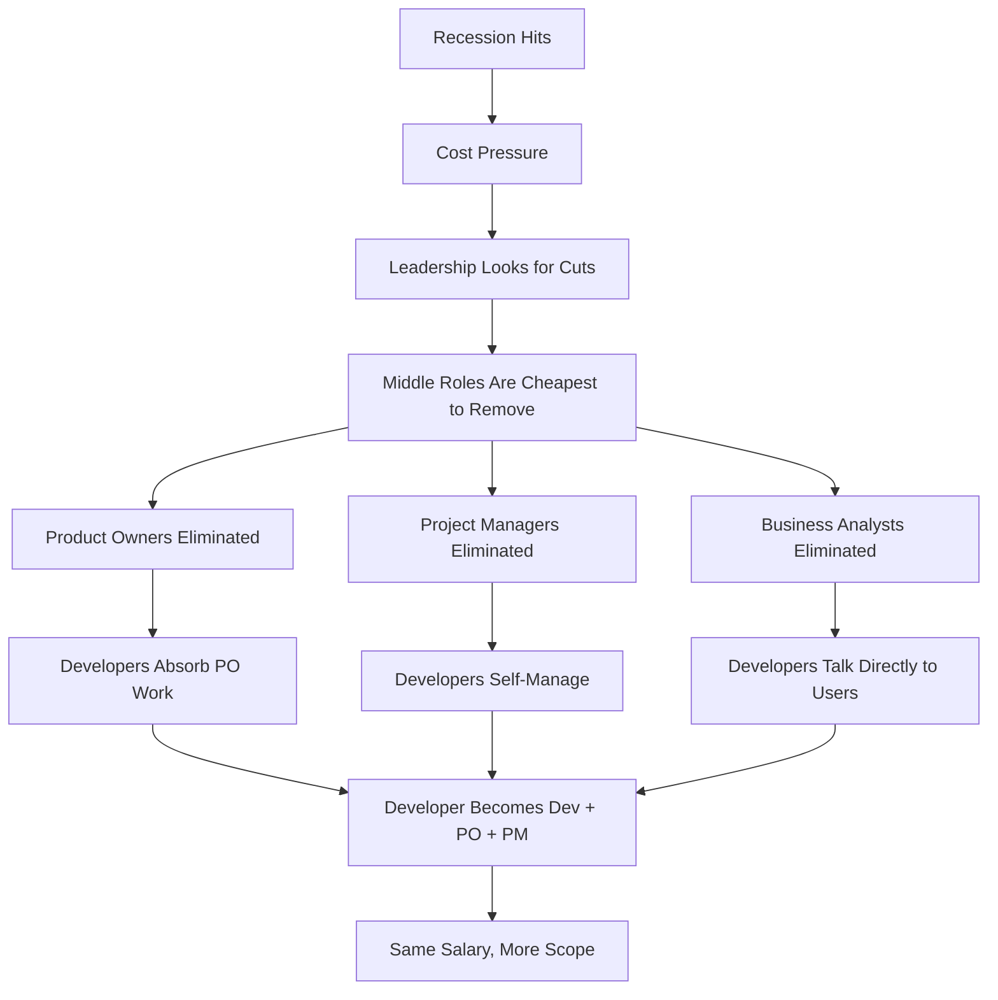
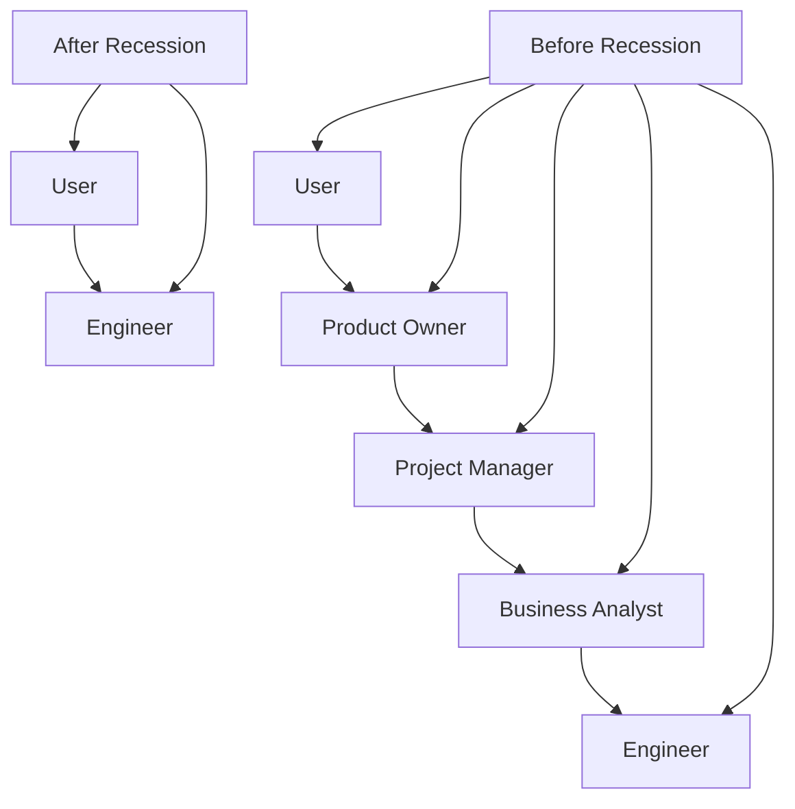
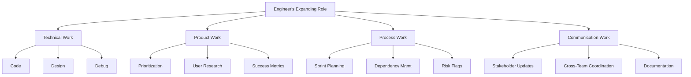
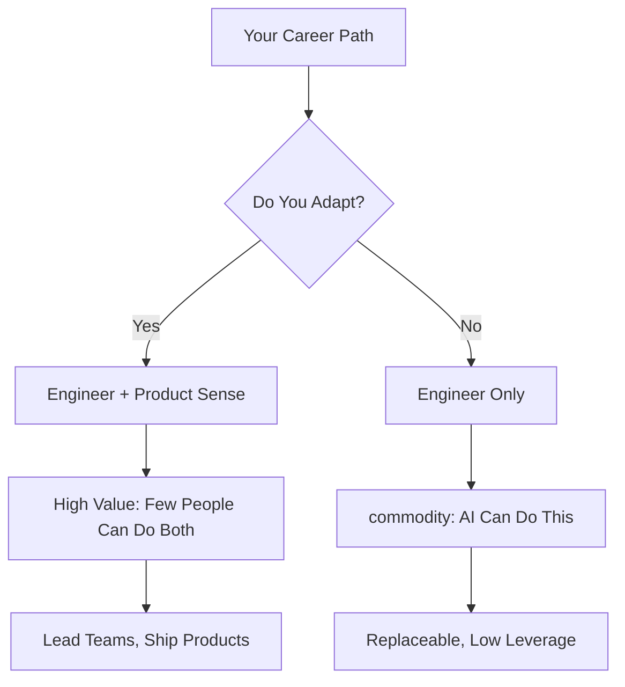

# Why Middle Roles Disappear in Recessions

What happens to product owners, project managers, and middle-layer roles when the economy contracts. How developers end up absorbing their responsibilities. What this means for your career.

## The Pattern

This is not new. It happened in 2008. It happened in 2001. And it is happening now with AI.

The pattern is always the same:

1. Company has layers: engineers, tech leads, engineering managers, product owners, project managers, business analysts
2. Recession hits, revenue drops, board demands cost cuts
3. Leadership looks at headcount
4. Middle roles are the easiest to cut because their output is hardest to measure
5. Engineers are harder to cut because they write the code that ships product
6. Middle roles get eliminated
7. Engineers absorb the work

The result: fewer people, same output, more responsibilities per engineer.

## Why Middle Roles Are Vulnerable

Middle roles exist to bridge gaps:

- Product owners bridge the gap between users and engineers
- Project managers bridge the gap between leadership and teams
- Business analysts bridge the gap between domain experts and technical teams

But here is the thing: these gaps are not structural. They are organizational. A good engineer can talk to a user. A good engineer can manage their own work. A good engineer can understand a business problem.

The reason these roles exist is not because engineers cannot do the work. It is because organizations grew and added layers to manage complexity. When the economy contracts, those layers get compressed.

## What Engineers Actually Absorb

When product owners are eliminated, engineers take on:

- **Prioritization**: Deciding what to build next instead of being told
- **User research**: Talking to users, understanding pain points
- **Success metrics**: Defining what "done" looks like
- **Stakeholder communication**: Reporting progress to leadership

When project managers are eliminated, engineers take on:

- **Sprint planning**: Breaking work into tasks
- **Dependency management**: Coordinating with other teams
- **Risk identification**: Flagging blockers early
- **Status reporting**: Keeping leadership informed

When business analysts are eliminated, engineers take on:

- **Requirements gathering**: Translating business needs into technical specs
- **Domain modeling**: Understanding the business deeply
- **Acceptance criteria**: Defining what the system should do
- **Edge case identification**: Finding what can go wrong

## The AI Parallel

The same pattern is repeating with AI:

**2008 recession**: Middle management eliminated. Engineers absorbed management tasks.

**2024 AI wave**: AI tools eliminate routine coding tasks. But the real impact is on middle roles again.

- AI can write boilerplate code (engineer still reviews)
- AI can generate reports (product owner was doing this)
- AI can summarize meeting notes (project manager was doing this)
- AI can draft requirements (business analyst was doing this)

The roles most at risk are not engineers. They are the roles that exist to translate between humans and machines, between business and technology. AI is becoming that translation layer.

## What This Means for Engineers

If you are an engineer, this is both a threat and an opportunity.

**The threat**: You will be expected to do more. Not just code. Product thinking, user research, stakeholder management. Your job description will expand.

**The opportunity**: You become more valuable. An engineer who can do product work is worth more than an engineer who only codes. An engineer who can talk to users is worth more than an engineer who only talks to the compiler.

## How to Prepare

You do not need to become a product manager. You need to develop product intuition.

1. **Talk to users**: Not through a product owner. Directly. Understand their pain.
2. **Understand the business**: Read the P&L. Understand unit economics. Know why the company makes money.
3. **Own outcomes, not outputs**: Do not just ship features. Ship results. Measure what happens after you ship.
4. **Communicate upward**: Do not wait for a PM to report your work. Tell leadership what you did and why it matters.
5. **Say no to low-value work**: When you absorb PO responsibilities, prioritize ruthlessly. Do not just add to your plate.

## The Uncomfortable Truth

Middle roles were organizational lubrication. They made communication smoother. But they were not essential. When pressure comes, organizations find they can function without them.

This is not about whether those roles provide value. They do. It is about whether the organization can survive without them when money is tight.

The answer, historically, is yes.

Engineers who recognize this early and develop the skills to absorb these responsibilities will thrive. Engineers who wait to be told what to build will find themselves with no one left to tell them.

The recession does not create new work. It compresses existing work into fewer people. The question is whether you are ready to be one of those people.
