# Modular Monolith

A modular monolith is a single deployable unit with explicit internal boundaries. The code runs in one process and deploys as one artifact. But inside, modules are organized by capability, each with its own data, its own interfaces, and its own internal structure.

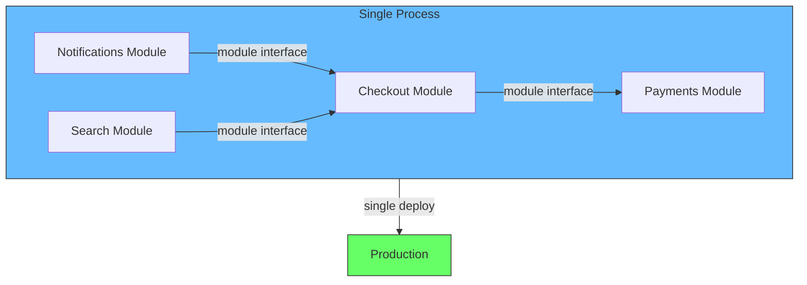

This is not a compromise. It is a deliberate choice. A modular monolith gives you the deployment simplicity of a monolith and the structural discipline of a service-oriented system. It is the most undervalued architecture in software.

## The problem it solves

[When the Monolith Breaks](/docs/software-engineering/when-the-monolith-breaks) covers the seven ways a monolith can fail. Most of those failures are not caused by the deploy model. They are caused by the absence of boundaries.

Layered monoliths group by technology -- all controllers together, all services together, all repositories together. The layers are tidy but the dependencies are not. Every module reaches into every other module's data. A change in one domain leaks into unrelated domains because there is no wall between them.

[Architecture by Neglect](/docs/software-engineering/architecture-by-neglect) describes how this happens: the default structure (layers) guarantees that any future split will be expensive.

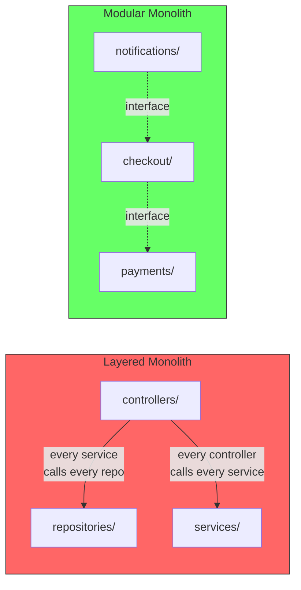

### Data ownership is the dividing line

The fundamental difference between these architectures is **who owns the data**.

| | Layered monolith | Modular monolith | Microservices |
|---|---|---|---|
| **Data ownership** | Nobody. Any code can query any table | Each module owns its tables. Access goes through interfaces | Each service owns its database. Access goes through network calls |
| **Enforcement** | None -- conventions at best | Module boundaries and import rules | Database server isolation (separate credentials, separate hosts) |
| **Violation** | Cross-layer queries inside the same database | Direct table access across modules | Shared database between services |
| **Cost of mistake** | Hidden until you try to split | Creates coupling that blocks extraction | Creates coupling that blocks independent scaling |

In a layered monolith, the database is a shared resource with no owner. The checkout code, the payment code, and the reporting code all query the same tables because they can. There is no mechanism to prevent it. The result is invisible coupling -- the system works until you try to separate anything.

In a modular monolith, each module is the sole owner of its tables. If the reporting module needs order data, it asks the checkout module through its interface. The interface is the contract. The checkout module controls the queries, the schema, and the access patterns.

In microservices, the same principle applies but enforced by network boundaries. The checkout service owns its database and exposes an API. The reporting service calls that API. There is no direct database access because the database is not accessible from outside the service.

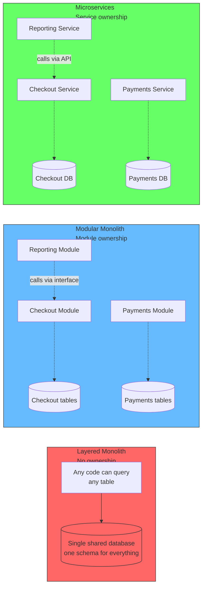

The modular monolith solves this by drawing internal boundaries before they are needed externally. The same discipline is required whether you eventually extract services or not.

## Core principles

### 1. Boundaries by capability

Modules are organized by what they do, not what technology they use. The checkout module owns everything related to checkout: the HTTP handler, the business logic, the data access, the database schema, the events it emits.

[Cohesion: Capability vs Layer](/docs/software-engineering/cohesion-capability-vs-layer) explains this in depth. The key insight: two files that change for the same reason belong together, even if one is a controller and the other is a repository.

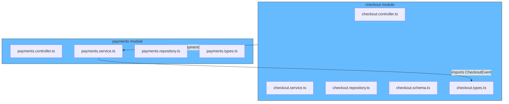

### 2. Explicit interfaces between modules

Modules communicate through interfaces, not through shared state or direct access to internals. The checkout module does not import the payment repository. It imports a `PaymentService` interface.

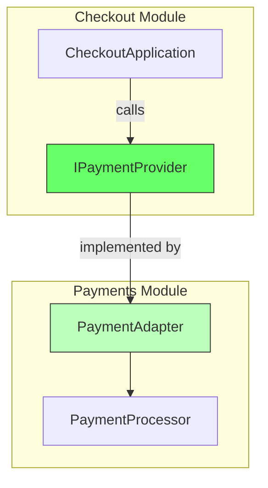

### 3. Encapsulated data

Each module owns its database tables. No module directly queries another module's tables. If the payments module needs data from the checkout module, it calls the checkout module's interface.

This is the single most important rule. Breaking data encapsulation creates invisible coupling that no interface layer can fix.

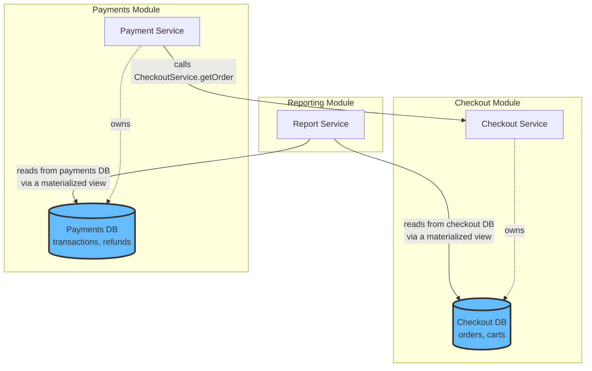

### 4. Single deployable unit

Despite the internal structure, the system deploys as one artifact. There is one build pipeline, one deploy, one process to monitor. The operational complexity is the same as a simple monolith.

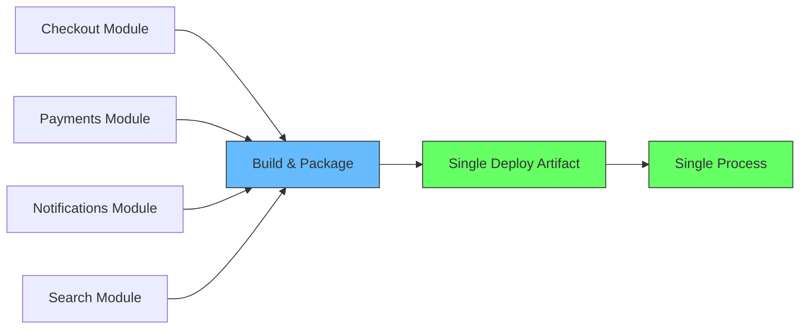

## Module structure: a concrete example

```
orders/
  application/
    create_order_handler.ts
    cancel_order_handler.ts
  domain/
    order.ts
    line_item.ts
    order_status.ts
  infrastructure/
    order_repository.ts
    order_schema.ts
    kafka_event_publisher.ts
  interfaces/
    ipayment_service.ts
    inotification_service.ts
  index.ts       # public exports only
payments/
  application/
    process_payment_handler.ts
    refund_handler.ts
  domain/
    payment.ts
    transaction.ts
  infrastructure/
    payment_repository.ts
    stripe_adapter.ts
  public/
    payment_service.ts  # implements IPaymentService for other modules
  index.ts
```

Each module has:
- An `index.ts` that exports only what other modules should use
- An `interfaces/` directory for contracts consumed from other modules
- A `public/` directory for contracts it provides to other modules
- No direct access to internals of any other module

## Module communication patterns

Modules need to communicate. The goal is to make the communication explicit and testable.

### Synchronous: interface calls

Module A calls Module B through a defined interface. The implementation is registered at startup through dependency injection.

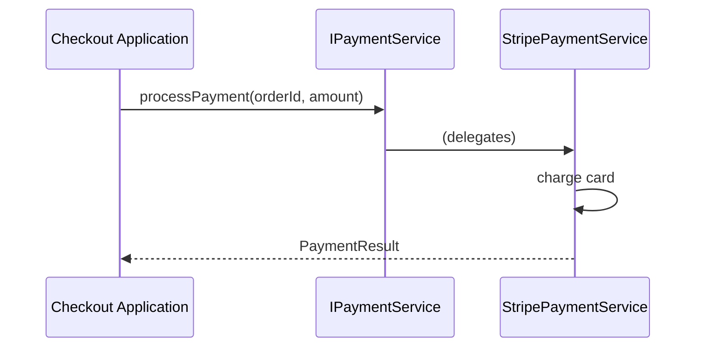

### Asynchronous: events

Modules emit events for things that happen. Other modules subscribe. The events can be in-process (simple EventEmitter) or through a message bus.

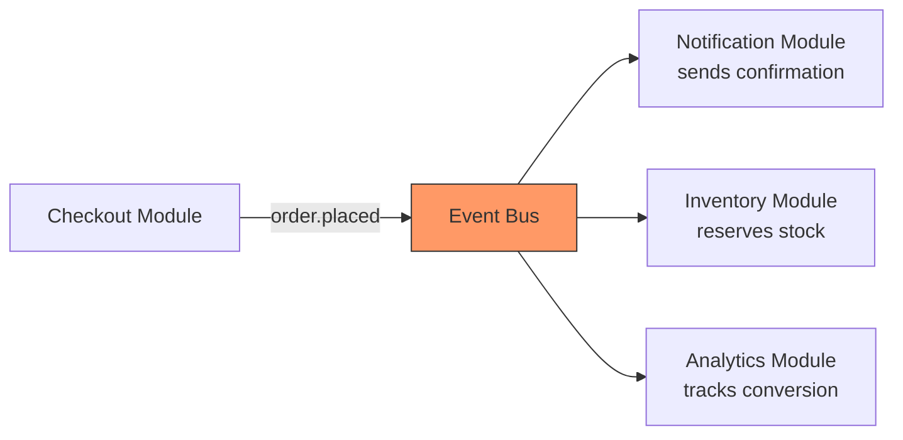

In a modular monolith, events can start as in-process calls (no network overhead, no serialization) and be promoted to a message bus when the module is extracted as a service.

## Data ownership: the hardest rule to follow

The evolution from layered monolith to modular monolith to microservices is largely an evolution of data ownership.

| | Layered monolith | Modular monolith | Microservices |
|---|---|---|---|
| **Who owns the orders table?** | Everyone | The checkout module | The checkout service |
| **How does reporting get data?** | Direct SQL | Calls checkout module interface | Calls checkout service API |
| **Schema change impact** | Affects all code that queries the table | Affects only the owning module | Affects only the owning service |
| **What enforces the boundary?** | Nothing | Import rules, module structure | Network, separate credentials |

In a layered monolith, the database is a shared resource with no owner. The checkout code, the payment code, and the reporting code all query the same tables because they can. There is no mechanism to prevent it. The result is invisible coupling -- the system works until you try to separate anything.

In a modular monolith, each module is the sole owner of its tables. If the reporting module needs order data, it asks the checkout module through its interface. The interface is the contract. The checkout module controls the queries, the schema, and the access patterns.

In microservices, the same principle is enforced by network boundaries. The checkout service owns its database and exposes an API. The reporting service calls that API. Direct database access is impossible because the database is not accessible from outside the service.

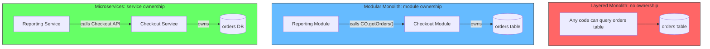

The most common violation of data ownership is shared tables. It is tempting to let the reporting module query the checkout tables directly. But direct table access between modules creates invisible coupling.

| Situation | Modular monolith (correct) | Layered monolith (violation) |
|---|---|---|
| Querying another module's data | Through its public interface | Direct SQL against its tables |
| Schema changes | Module migrates its own tables | Global migration that affects all modules |
| Joining across modules | The owning module joins its own data, returns results | A cross-module SQL join |
| Reporting | Materialized views or event-sourced read models | Direct queries against transactional tables |

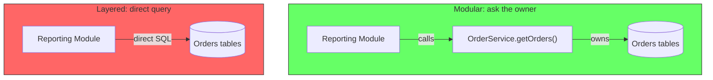

## Testing without the pain

Because modules communicate through interfaces, testing is straightforward. Each module can be tested in isolation with its dependencies replaced by test doubles.

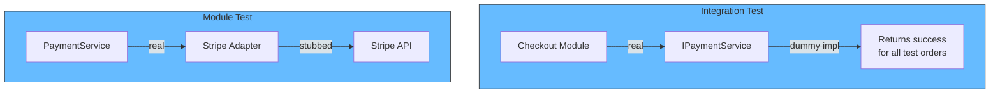

The deployment test remains simple: start the process, hit the endpoints. There is no need to orchestrate multiple service startups, network dependencies, or container orchestration.

## When to use a modular monolith

A modular monolith is the right starting point for almost every system.

| Situation | Recommendation |
|---|---|
| New system, unknown scaling needs | Modular monolith. Draw boundaries now, extract later if needed |
| Existing layered monolith | Refactor to modular internally before considering services |
| Team of 2-15 engineers | Modular monolith. Microservices overhead is not worth it |
| Team of 15+ engineers | Modular monolith is still viable if boundaries are respected |
| Need independent scaling | Modular monolith is insufficient -- you need services |
| Need independent tech stacks | Modular monolith is insufficient -- you need services |
| Need independent deploy cadences | Modular monolith is insufficient -- you need services |

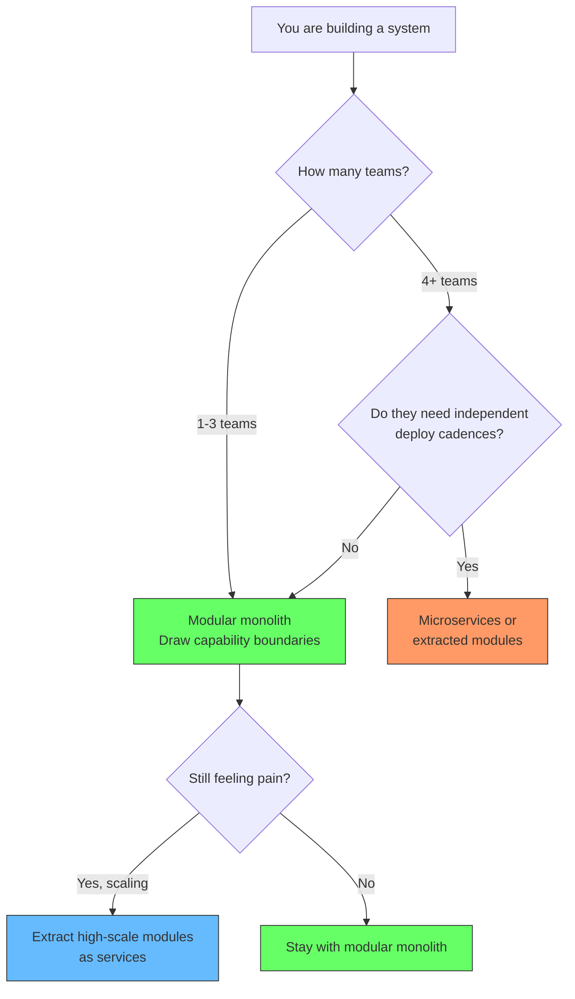

## When to extract services

The modular monolith is not a permanent state. It is a stepping stone. Extract a module as a service when:

1. **The boundary is clean** -- the module has a well-defined interface and no hidden dependencies. If it is tangled, fix the boundaries first.

2. **The pain is specific** -- you need independent scaling, a different tech stack, or independent deploy cadence for that module. Not because "microservices are good."

3. **The interface is stable** -- the API between the extracted service and the monolith will not change weekly. Frequent API churn in a distributed system is expensive.

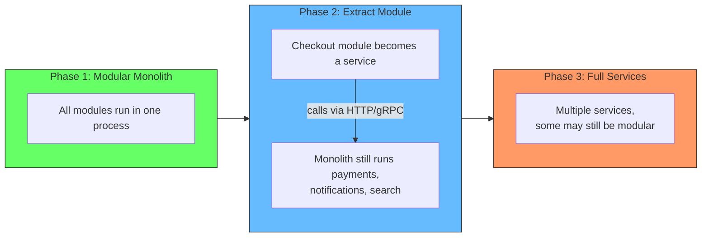

Amazon Prime Video's 2023 case study is the counter-example for a reason: when the boundaries are clean, you can collapse services back into a monolith. That option exists only if the code was modular to begin with.

## Relationship to monorepo

A modular monolith and a monorepo are orthogonal. A modular monolith can live in a [monorepo](/docs/software-engineering/monorepo) or in a single-project repo. A monorepo can contain a modular monolith, microservices, or both.

| | Modular monolith in a monorepo | Modular monolith in its own repo |
|---|---|---|
| Cross-module refactoring | Single PR across all modules | Single PR, same repo |
| Shared types | Natural -- workspace packages | Natural -- same project |
| CI | One pipeline | One pipeline |
| Module extraction | Move code to new service in same repo | Move code to new repo |

The common sweet spot is a monorepo containing a modular monolith. As modules are extracted to services, they stay in the same repo with independent CI pipelines. This is covered in detail in the [Monorepo article](/docs/software-engineering/monorepo).

## Summary

A modular monolith is the architecture most teams should start with and most teams should stay with. It gives you:

- **The operational simplicity of a monolith**: one deploy, one process, one stack to monitor
- **The structural discipline of services**: capability boundaries, encapsulated data, explicit interfaces
- **A clear migration path**: extract modules to services when and only when there is a specific reason

The alternative is not layered monolith vs microservices. It is intentional architecture vs architecture by neglect. The modular monolith is the tool for practicing intentional architecture without paying the distributed systems tax.

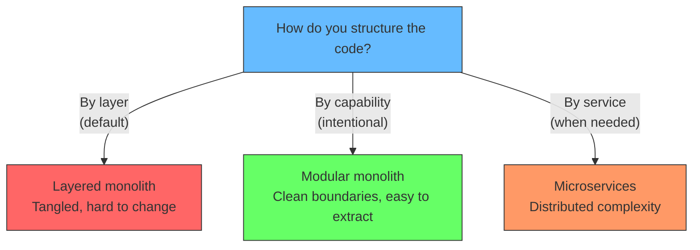
