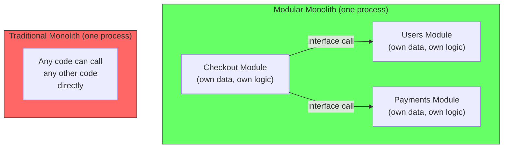
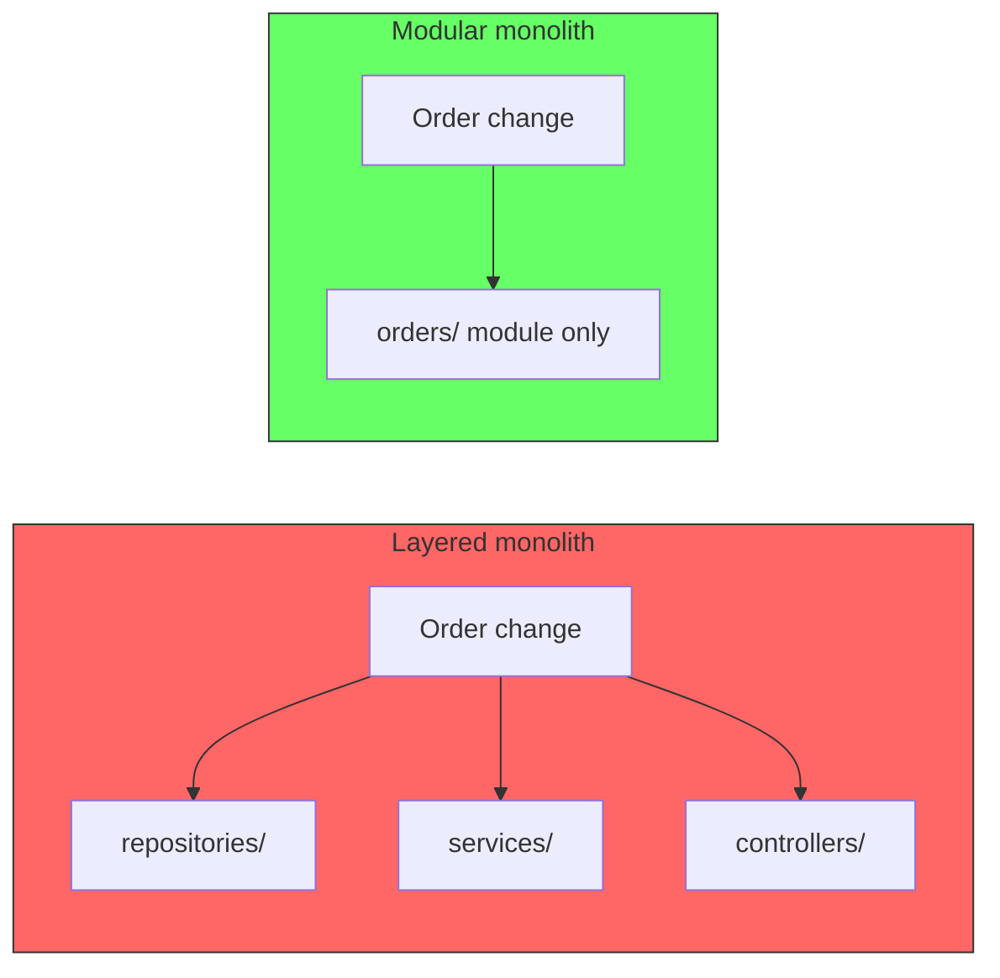
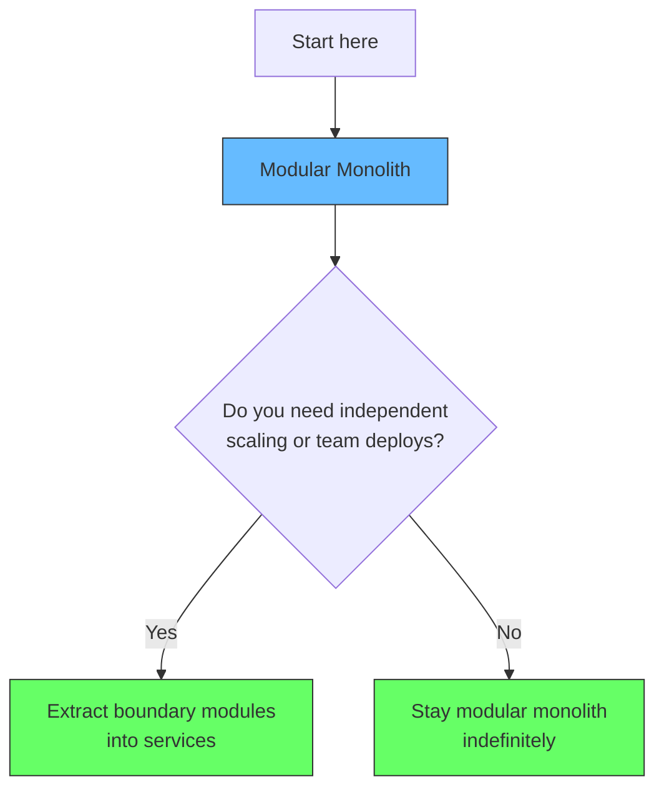

# Modular Monolith

A modular monolith is a single process that internally enforces capability-based module boundaries. It deploys as one unit but is structured as if it were multiple services -- each module has a well-defined interface, owns its data, and communicates with other modules through explicit contracts.



The key difference from a traditional monolith is **discipline**. In a ball of mud, a controller can directly call a repository from another domain. In a modular monolith, each module exposes only a public interface, and all cross-module communication goes through that interface. Internally, a module can be as messy as it wants -- the boundary is what matters.

```
src/
  checkout/
    public/
      CheckoutService.swift     # published interface
      CheckoutDTOs.swift
    internal/
      CheckoutRepository.swift  # not visible outside module
      CheckoutValidator.swift
      PaymentGatewayAdapter.swift
  users/
    public/
      UserService.swift
      UserDTOs.swift
    internal/
      UserRepository.swift
      UserProfileService.swift
  payments/
    public/
      PaymentProcessor.swift
    internal/
      StripeGateway.swift
      PaymentRepository.swift
```

## How it differs from a layered monolith

A traditional monolith groups code by technical layer (repositories, services, controllers). All repositories go together because they access data. All services go together because they contain business logic. A change to the order flow touches `repositories/order_repo.py`, `services/order_service.py`, and `controllers/order_controller.py` -- three modules for one conceptual change.

A modular monolith groups code by capability. Everything related to orders lives in the orders module. Everything related to users lives in the users module. A change to the order flow stays entirely within the orders module.



This is covered in depth in [Cohesion: Capability vs Layer](/docs/software-engineering/cohesion-capability-vs-layer).

## What it solves

A modular monolith solves the **coupling problem** without introducing distributed systems complexity.

| Problem | How modular monolith helps |
|---|---|
| Cross-domain dependencies | Modules only communicate through published interfaces |
| Database coupling | Each module owns its schema (can be same physical DB, separate logical schemas) |
| Unclear code ownership | Module boundaries define who owns what |
| Hard to extract services later | Modules already have clear boundaries -- just extract one into a service |

## It is not a stepping stone

A common framing is: "modular monolith is what you build before you extract microservices." That is true but incomplete. Many teams should stay with a modular monolith indefinitely. If you never need independent scaling or independent team deploys, the modular monolith gives you all the architectural benefits of microservices with none of the network overhead.



Amazon Prime Video's 2023 case study is instructive: they consolidated microservices back into a monolith and cut costs by 90%. The key was that their monolith was **well-structured** -- it was a modular monolith, not a ball of mud. The boundaries were clean enough that merging services back into one process did not create coupling.

## Relationship to monorepo

A modular monolith is an **architectural pattern** (how you structure code at runtime). A [monorepo](/docs/software-engineering/monorepo) is a **repository strategy** (where you store code at rest). They are orthogonal -- you can have either, both, or neither.

| | Monorepo | Multirepo |
|---|---|---|
| **Modular Monolith** | Most common sweet spot. One deployable unit, shared tooling, shared types, clear module boundaries. | Module boundaries are clear but each module is its own repo. Versioning and publishing needed for internal modules. Rarely worth the overhead. |
| **Microservices** | Common at scale. Independent deploys with shared types and tooling. Requires build system and ownership tooling. | Maximum independence. No shared code -- duplication is the cost of autonomy. |

## Summary

A modular monolith is the default starting point for most projects. It gives you architectural discipline without distributed complexity. Stay in it until you can measure concrete pain from the lack of independent scaling or independent team deploys.
