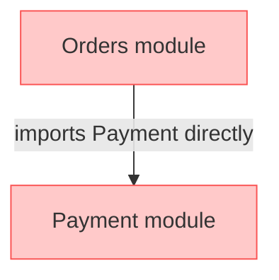
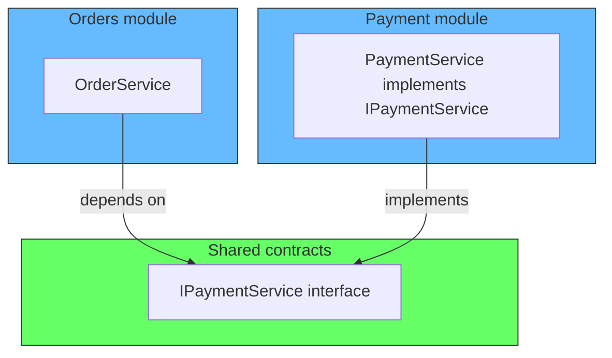
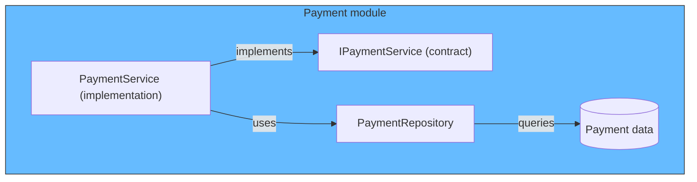
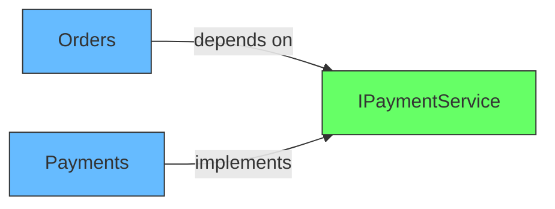

# Building Public APIs for Modules Using Interfaces

## The problem: modules calling each other directly

In a modular monolith, if the Orders module needs to check whether a payment exists, it might import the Payment class directly. This creates a dependency. If the Payment module changes, Orders breaks. There is no boundary.



Shopify had this exact problem. Modules were calling into each other directly. They fixed it by requiring every module to expose a public API through an interface, with the implementation provided by the same module.

## The solution: interface per module

The pattern is simple:

1. The module defines an interface (the contract)
2. The module provides the implementation
3. Other modules depend on the interface, not the implementation
4. The interface lives in a shared location visible to all modules
5. The implementation is internal to the module



## TypeScript example

**Step 1: Define the interface in a shared location.**

```typescript
// src/modules/payments/contracts/IPaymentService.ts
export interface IPaymentService {
  getPaymentStatus(orderId: string): Promise<'pending' | 'paid' | 'failed'>;
  processPayment(orderId: string, amount: number): Promise<void>;
}
```

**Step 2: Implement the interface inside the module.**

```typescript
// src/modules/payments/infrastructure/PaymentService.ts
import { IPaymentService } from '../contracts/IPaymentService';

export class PaymentService implements IPaymentService {
  async getPaymentStatus(orderId: string): Promise<'pending' | 'paid' | 'failed'> {
    // database query, business logic, etc.
    const payment = await db.query('SELECT status FROM payments WHERE order_id = ?', orderId);
    return payment.status;
  }

  async processPayment(orderId: string, amount: number): Promise<void> {
    // process payment logic
  }
}
```

**Step 3: Register the implementation in the module's composition root.**

```typescript
// src/modules/payments/PaymentsModule.ts
import { IPaymentService } from './contracts/IPaymentService';
import { PaymentService } from './infrastructure/PaymentService';

export class PaymentsModule {
  static initialize(container: Container) {
    container.register<IPaymentService>('IPaymentService', PaymentService);
  }
}
```

**Step 4: Consume the interface in another module.**

```typescript
// src/modules/orders/application/AddOrderItem.ts
import { IPaymentService } from '../../payments/contracts/IPaymentService';

export class AddOrderItem {
  constructor(
    private orderRepo: OrderRepository,
    @inject('IPaymentService') private paymentService: IPaymentService,
  ) {}

  async execute(command: { orderId: string; productId: string; quantity: number }) {
    const paymentStatus = await this.paymentService.getPaymentStatus(command.orderId);
    if (paymentStatus !== 'paid') {
      throw new Error('cannot add items to an unpaid order');
    }

    const order = await this.orderRepo.findById(command.orderId);
    order.addItem(command.productId, command.quantity);
    await this.orderRepo.save(order);
  }
}
```

## Why the same module provides the implementation

The interface is the contract. The implementation is the fulfillment. The same module owns both because:

1. The module knows what the interface means. Nobody else should implement it.
2. The module can change the implementation without breaking consumers. As long as the interface holds, the implementation is free to change.
3. The module controls its own data access. The implementation uses the module's repository, its database, its internal state.



## What goes in the interface

Only the operations other modules need. Not everything the module can do.

```typescript
// Good: what other modules need
export interface IPaymentService {
  getPaymentStatus(orderId: string): Promise<'pending' | 'paid' | 'failed'>;
  processPayment(orderId: string, amount: number): Promise<void>;
}

// Bad: exposing internal details
export interface IPaymentService {
  getPaymentStatus(orderId: string): Promise<'pending' | 'paid' | 'failed'>;
  processPayment(orderId: string, amount: number): Promise<void>;
  getPaymentById(id: string): Promise<Payment>;  // internal
  updatePaymentRecord(record: PaymentRecord): Promise<void>;  // internal
  getInternalAuditLog(orderId: string): Promise<AuditEntry[]>;  // internal
}
```

The interface should be thin. It exposes what other modules need to know, not everything the module can do.

## The dependency direction

The dependency always points inward. The consuming module depends on the interface. The implementing module depends on nothing from the outside.



Orders does not know about PaymentService. It does not know about the database. It only knows the interface. If the Payment module switches from PostgreSQL to Redis, Orders does not care. The interface stays the same.

## Related

- [Module Wiring: Ports and Adapters](module-wiring-ports-adapters.md) - the ports and adapters pattern
- [Shopify: From Monolith to Modular Monolith](shopify-modular-monolith.md) - how Shopify implemented this pattern
- [Data Ownership in Redis](redis-data-ownership.md) - how modules own their data
