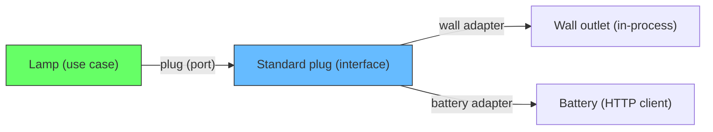
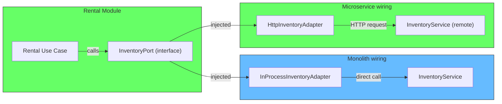
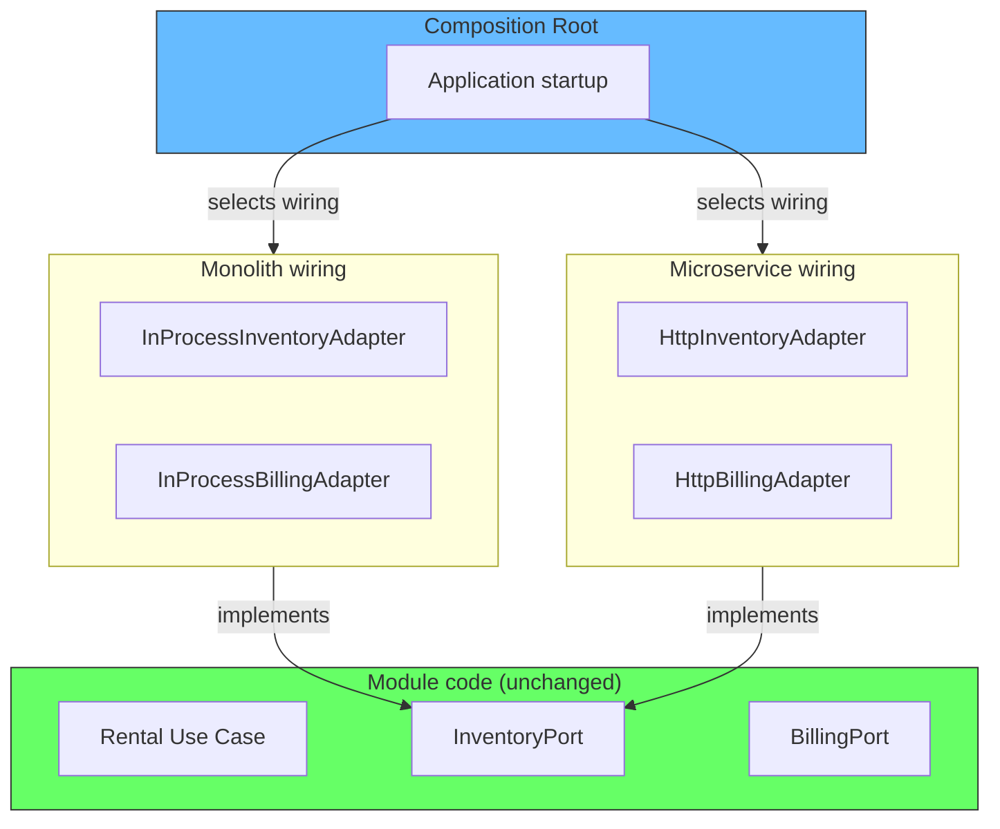
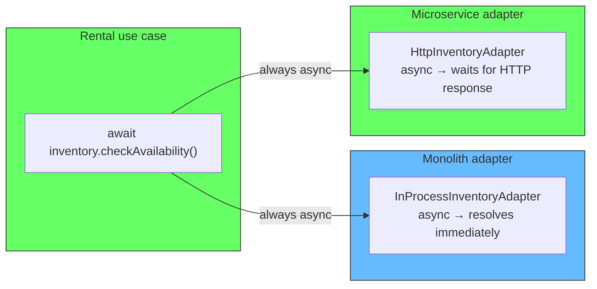
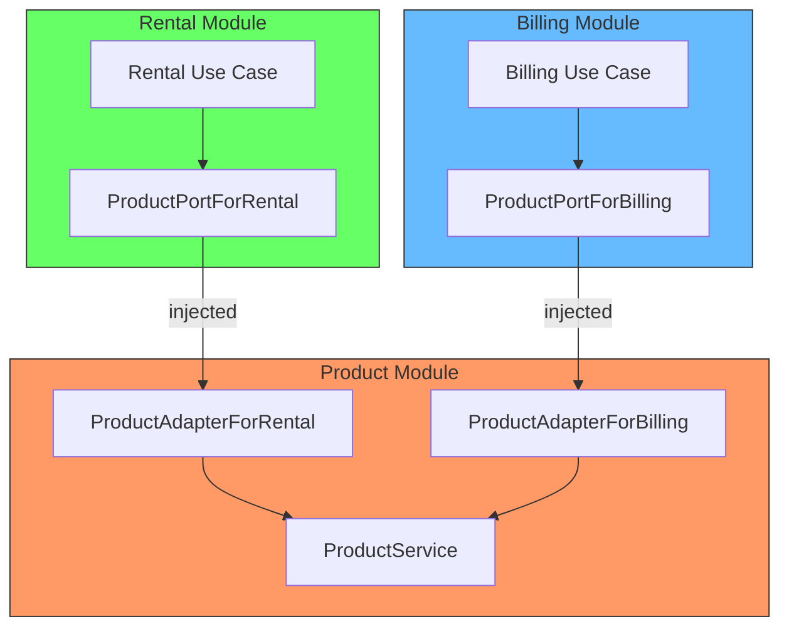

# How Module Wiring Works: From In-Process to Network Calls

## The problem: how do you actually switch from monolith to microservices without rewriting?

The article **Deployment is a Configuration Choice (If You Have Boundaries)** makes the claim that the same module code can run as a monolith or as a microservice by changing the wiring. But what does that wiring actually look like? How does a module call another module in-process, and how does that same call become an HTTP request without the module knowing?

The answer is the **Ports and Adapters** pattern (also called Hexagonal Architecture), combined with **Dependency Injection** at the composition root.

## Understanding ports and adapters

The concept is simple. Imagine a lamp. The lamp needs electricity to work. It does not care where the electricity comes from — a wall outlet, a generator, or a battery. The lamp defines a **port**: a standard plug shape. The **adapter** is whatever connects that plug to the actual power source.



The lamp never rewires itself. You just swap what is on the other end of the plug.

In software, the **port** is an interface (the plug shape). The **adapter** is a class that implements that interface and connects to the real implementation. The use case (the lamp) calls the interface and never knows what is on the other side.

```typescript
// PORT: the plug shape -- defined by the consumer, not the provider
interface InventoryPort {
  checkAvailability(sku: string, dateRange: DateRange): Promise<Availability>
  reserveVehicle(sku: string, reservationId: string): Promise<void>
}
```

```typescript
// ADAPTER (in-process): connects the plug to the real service in the same process
class InProcessInventoryAdapter implements InventoryPort {
  constructor(private inventoryService: InventoryService) {}

  async checkAvailability(sku: string, dateRange: DateRange): Promise<Availability> {
    return this.inventoryService.checkAvailability(sku, dateRange)
  }

  async reserveVehicle(sku: string, reservationId: string): Promise<void> {
    return this.inventoryService.reserve(sku, reservationId)
  }
}
```

```typescript
// ADAPTER (HTTP): connects the same plug to a remote service
class HttpInventoryAdapter implements InventoryPort {
  constructor(private baseUrl: string) {}

  async checkAvailability(sku: string, dateRange: DateRange): Promise<Availability> {
    const response = await fetch(`${this.baseUrl}/inventory/check`, {
      method: 'POST',
      body: JSON.stringify({ sku, dateRange }),
      headers: { 'Content-Type': 'application/json' },
    })
    if (!response.ok) throw new Error(`Inventory service error: ${response.status}`)
    return response.json()
  }

  async reserveVehicle(sku: string, reservationId: string): Promise<void> {
    const response = await fetch(`${this.baseUrl}/inventory/reserve`, {
      method: 'POST',
      body: JSON.stringify({ sku, reservationId }),
      headers: { 'Content-Type': 'application/json' },
    })
    if (!response.ok) throw new Error(`Inventory service error: ${response.status}`)
  }
}
```



The rental use case calls `this.inventoryPort.checkAvailability()`. It does not know whether that resolves to an in-process call or an HTTP call. It does not import anything from the inventory module. The only thing it knows is the interface.

The critical rule: **the port is owned by the consumer, not the provider**. The rental module defines what it needs from inventory. The inventory module implements an adapter that fulfills that need. This is the Dependency Inversion Principle from Robert C. Martin (2017) — high-level modules should not depend on low-level modules. Both should depend on abstractions.

## The composition root: where wiring happens

The wiring is done at the composition root — the place where the application starts up. This is the only place that knows about the deployment topology.

```typescript
// Monolith composition root
async function startMonolith() {
  const db = await createDatabaseConnection()

  // Create real module services
  const inventoryService = new InventoryService(db)
  const rentalService = new RentalService(
    new InProcessInventoryAdapter(inventoryService), // in-process adapter
    new InProcessBillingAdapter(billingService),
  )

  const app = new express()
  app.use('/api', rentalService.getRouter())
  app.listen(3000)
}
```

```typescript
// Microservice composition root (Rental Service)
async function startRentalService() {
  const db = await createDatabaseConnection()

  const rentalService = new RentalService(
    new HttpInventoryAdapter('http://inventory-service:3001'), // HTTP adapter
    new HttpBillingAdapter('http://billing-service:3002'),
  )

  const app = new express()
  app.use('/api', rentalService.getRouter())
  app.listen(3000)
}
```



The composition root is the only file that changes when switching deployment topologies. The module code — the rental use case, the inventory service, the billing service — never changes.

## The async problem: in-process is sync, network is async

You noticed a real issue. In the monolith, calling another module is a fast in-process method call. The caller gets the result immediately. In the microservice, the same call goes over the network. The caller must await a response that could take milliseconds or fail entirely.

If the port interface returned a value directly (synchronous), the caller would have to change its code when switching to an HTTP adapter. That defeats the purpose.

```typescript
// WRONG: sync port -- forces the caller to know the deployment topology
interface InventoryPort {
  checkAvailability(sku: string, dateRange: DateRange): Availability // sync
  reserveVehicle(sku: string, reservationId: string): void           // sync
}
```

The standard solution: **all port interfaces must be async, always**. Every port method returns a Promise (or Task in C#, CompletableFuture in Java). The in-process adapter still returns a Promise — it just resolves it immediately.

```typescript
// RIGHT: async port -- caller always awaits, regardless of deployment
interface InventoryPort {
  checkAvailability(sku: string, dateRange: DateRange): Promise<Availability>
  reserveVehicle(sku: string, reservationId: string): Promise<void>
}
```

The caller always uses `await`:

```typescript
// The use case always awaits -- it never knows if the call is in-process or remote
async createRental(customerId: string, vehicleSku: string): Promise<Rental> {
  const availability = await this.inventory.checkAvailability(vehicleSku, dateRange)
  if (!availability.available) throw new Error('Vehicle not available')
  // ...
}
```

The in-process adapter wraps the synchronous call in a Promise:

```typescript
class InProcessInventoryAdapter implements InventoryPort {
  constructor(private inventoryService: InventoryService) {}

  async checkAvailability(sku: string, dateRange: DateRange): Promise<Availability> {
    // The 'async' keyword wraps the return value in a Promise automatically
    // This is effectively synchronous -- resolves on the next microtask
    return this.inventoryService.checkAvailability(sku, dateRange)
  }
}
```



This is the standard approach documented across the industry. Microsoft's async/await best practices (2013) recommend "async all the way up" — once you make a method async, all callers should be async too. The Synapse Studios architecture standards (2025) for ports and adapters explicitly state that outbound ports should return Task or Promise types to accommodate both in-process and network implementations. Cockburn's original Hexagonal Architecture (2005) describes adapters as handling all infrastructure concerns, including the sync/async boundary.

## The deeper problem: network calls are not just slower

Switching from in-process to network changes more than sync to async. It changes the failure model:

| Concern | In-process | Network |
|---|---|---|
| Latency | Microseconds | 1-100ms |
| Failure mode | Exception (rare) | Timeout, connection refused, 5xx |
| Partial failure | Impossible | Possible (request sent, response lost) |
| Retry logic | Not needed | Required for transient failures |
| Serialization | Not needed | Required (JSON, protobuf) |

The adapter is the place to handle all of these. The HTTP adapter should include retries with backoff, timeouts, and circuit breakers. The port interface hides this complexity from the caller.

```typescript
// The adapter handles network concerns -- the caller never sees them
class ResilientHttpInventoryAdapter implements InventoryPort {
  constructor(
    private baseUrl: string,
    private retryCount = 3,
    private timeoutMs = 5000,
  ) {}

  async checkAvailability(sku: string, dateRange: DateRange): Promise<Availability> {
    const controller = new AbortController()
    const timeout = setTimeout(() => controller.abort(), this.timeoutMs)

    try {
      for (let attempt = 1; attempt <= this.retryCount; attempt++) {
        try {
          const response = await fetch(`${this.baseUrl}/inventory/check`, {
            method: 'POST',
            body: JSON.stringify({ sku, dateRange }),
            signal: controller.signal,
          })
          if (response.ok) return response.json()
          if (response.status >= 500 && attempt < this.retryCount) continue
          throw new Error(`Inventory error: ${response.status}`)
        } catch (err) {
          if (attempt === this.retryCount) throw err
          await delay(Math.pow(2, attempt) * 100) // exponential backoff
        }
      }
    } finally {
      clearTimeout(timeout)
    }
  }
}
```

Thomas Pierrain (2024) argues for an even more aggressive approach: enable the network layer from the start, even when all modules run in the same process. Route inter-module calls through HTTP locally. This forces you to experience the latency and failure modes early, before you commit to a split. It prevents overly chatty interfaces that work fine in-process but become performance problems over the network.

## What changes and what does not

| Aspect | Monolith | Microservice |
|---|---|---|
| Module code | Unchanged | Unchanged |
| Port interfaces | Unchanged | Unchanged |
| Adapter implementation | In-process call | HTTP/gRPC call |
| Composition root | Wires real services with in-process adapters | Wires HTTP adapters pointing at remote services |
| Deployment config | One Dockerfile, one process | Per-service Dockerfiles, multiple processes |

## The product module example

You mentioned a Product module that gets included in consumer modules. That is one valid approach, but it creates a coupling problem. If every module imports the Product module directly, then changing Product means changing every consumer.

The ports and adapters approach inverts this. Each consumer module defines its own product port with only the fields it needs.

```typescript
// Rental module's product port -- only what rental needs
interface ProductPortForRental {
  getVehicleDetails(sku: string): Promise<VehicleDetails>
}

// Billing module's product port -- different interface
interface ProductPortForBilling {
  getPricingInfo(sku: string): Promise<PricingInfo>
}

// The Product module provides adapters for both
class ProductAdapterForRental implements ProductPortForRental {
  constructor(private productService: ProductService) {}

  async getVehicleDetails(sku: string): Promise<VehicleDetails> {
    const product = await this.productService.findBySku(sku)
    return {
      make: product.make,
      model: product.model,
      year: product.year,
    }
  }
}

class ProductAdapterForBilling implements ProductPortForBilling {
  constructor(private productService: ProductService) {}

  async getPricingInfo(sku: string): Promise<PricingInfo> {
    const product = await this.productService.findBySku(sku)
    return {
      dailyRate: product.dailyRate,
      deposit: product.deposit,
      taxRate: product.taxRate,
    }
  }
}
```



If the Product module is extracted into a microservice, only the adapters change. The ports do not change. The use cases do not change.

## How this looks in practice

The bxcodec/golang-ddd-modular-monolith-with-hexagonal project (2025) demonstrates this exact pattern in Go. Each module is a bounded context with its own ports (interfaces). The payment module depends on the payment-settings module through a port:

```go
// payment module defines its port
type IPaymentSettingsPort interface {
    GetPaymentSetting(id string) (PaymentSetting, error)
}

// Module factory wires the dependencies
paymentModule := paymentfactory.NewModule(paymentfactory.ModuleConfig{
    DB:                  db,
    PaymentSettingsPort: paymentSettingsModule.Service,
})
```

The module factory receives the dependency as an interface. Whether `paymentSettingsModule.Service` is the real implementation running in-process or an HTTP client is invisible to the payment module. The factory does not care. It just calls the interface.

The Software Architecture Guild (2026) describes this as the recommended evolution path: "Start by reinforcing module seams. If evidence indicates a genuine hotspot, extract that module behind its existing contract. Treat extraction as an option unlocked by good modularity, not as the plan."

This is the core idea. The port is the contract. The adapter is the deployment decision. The module sees only the contract. Change the deployment by swapping the adapter at the composition root. No module code changes.

## What this means for your project

When building a modular monolith, follow these rules:

1. Each module defines its own ports for everything it needs from other modules
2. Ports are interfaces owned by the consuming module, not the providing module
3. Adapters are provided by the module that owns the implementation
4. Wiring happens in one place: the composition root
5. The composition root is the only file that knows about the deployment topology

If you follow these rules, you can start as a monolith today. When a module needs to become a service, you write one new adapter class (the HTTP client) and change one line in the composition root. The module code never changes.

### References

- Cockburn, A. (2005). *Hexagonal Architecture (Ports and Adapters)*. alistair.cockburn.us. https://alistair.cockburn.us/hexagonal-architecture/ — The original description of ports and adapters pattern
- Martin, R. C. (2017). *Clean Architecture: A Craftsman's Guide to Software Structure and Design*. Prentice Hall. — Dependency Inversion Principle, boundaries, and plugin architectures
- Tumorang, I. (2025). *Go DDD Modular Monolith with Hexagonal Architecture*. github.com/bxcodec. https://github.com/bxcodec/golang-ddd-modular-monolith-with-hexagonal — Working example combining modular monolith with ports and adapters in Go
- Jovanovic, M. (2026). *Modular Monolith Architecture*. milanjovanovic.tech. — Module communication patterns and extraction strategies
- Software Architecture Guild (2026). *Modular Monolith*. softwarearchitectureguild.com. — Evolution path from modular monolith to extracted services
- Nabrdalik, J. (2017). *Hexagonal Architecture in Practice*. Talk. — Practical implementation of ports and adapters with Spring framework
- Microsoft. (2013). *Async/Await Best Practices in Asynchronous Programming*. docs.microsoft.com. — "Async all the way up" guidance for async method signatures at boundary interfaces
- Pierrain, T. (2024). *Modular Monoliths: Enable the Network Layer from the Start*. Medium. — Advocates running HTTP transport even in monolith mode to surface chattiness and latency issues early
- Synapse Studios. (2025). *Dependency Inversion & Ports/Adapters*. docs.synapsestudios.com. — Standards for defining ports as async interfaces to support both in-process and network adapters
