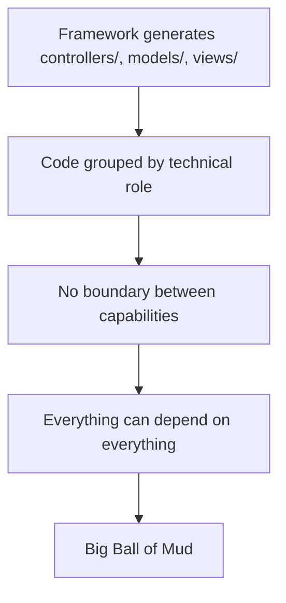
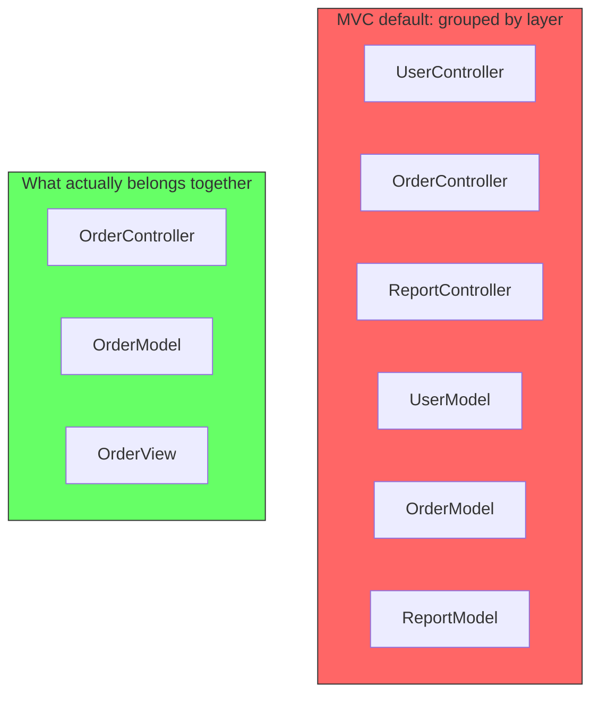
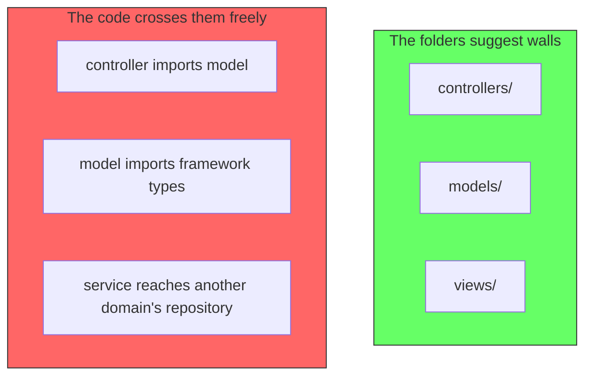
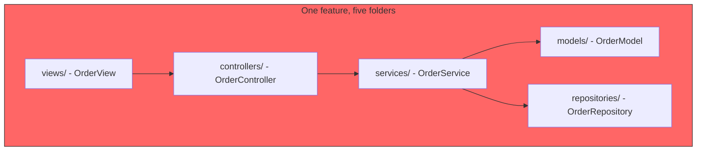
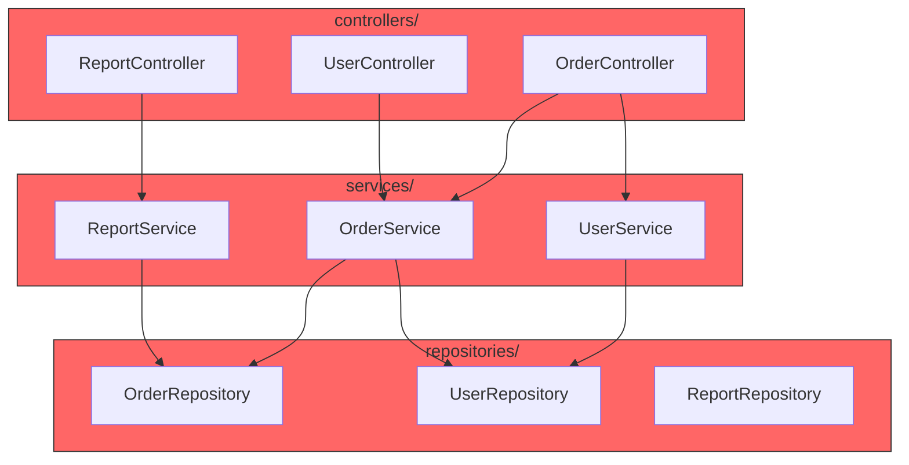
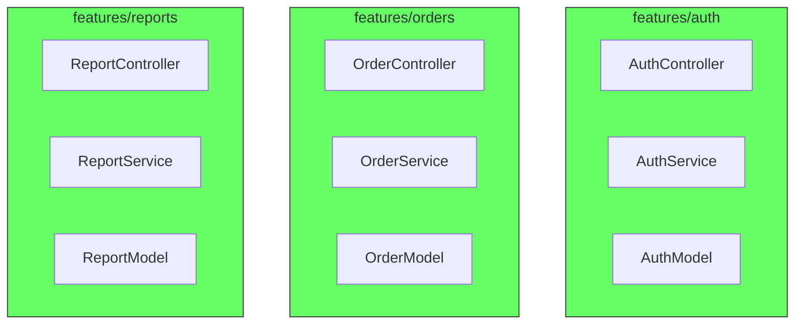
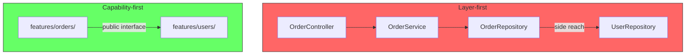
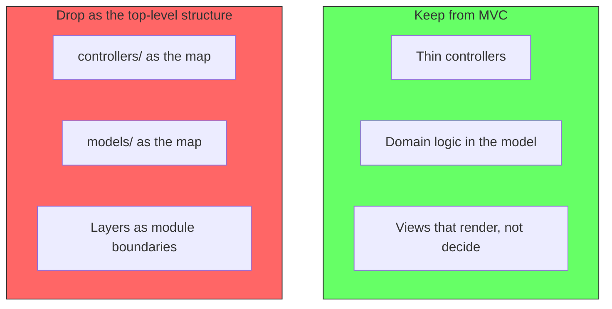

# MVC by Layer: How the Default Structure Becomes a Big Ball of Mud

## The problem: MVC scaffolds the mud

Every new web project starts the same way. The framework generates a controller, a model, and a view, and arranges them in folders named `controllers/`, `models/`, `views/`, and soon `services/` and `repositories/`. Nobody chose this structure. The scaffolding chose it. And the scaffolding chose wrong.

The structure is wrong not because controllers or models are bad concepts. It is wrong because it groups code by technical layer instead of by business capability. All controllers live together because they are controllers. All models live together because they are models. That organizes the code by what it is, not by what it does.

In 1997, Brian Foote and Joseph Yoder named the architecture that predominates in practice: the Big Ball of Mud, "a casually, even haphazardly, structured system... dictated more by expediency than design." The layer-first folder layout from MVC scaffolding is the most common on-ramp to that state. It gives the code a tidy-looking tree and no actual boundaries.

<div style={{display: 'flex', justifyContent: 'center'}}>



</div>

## The root cause: "related" means the wrong thing

When code is organized by layer, the word "related" is defined by technology. A `UserRepository` and an `OrderRepository` sit in the same folder because both touch the database. A `UserController` and an `OrderController` sit in the same folder because both speak HTTP.

But the repository and the controller for the same feature do not live near each other. They are the two halves of the same capability, separated by three folders.

A capability is the thing a user can do: sign in, place an order, generate a report. Each capability has an entry point (the controller), a decision maker (the model or service), and a representation (the view). Those three belong together. The folder layout scatters them.

<div style={{display: 'flex', justifyContent: 'center'}}>



</div>

## The illusion of boundaries

The layer folders look like boundaries, and that is why the structure is so easy to mistake for good architecture. A folder named `controllers/` carries the visual weight of a module boundary. A developer opens the tree, sees a clean separation between controllers, models, and views, and assumes the system has boundaries. It does not.

A real boundary separates things that change independently. Controllers and models do not change independently in the way that matters: when the order flow changes, the order controller, the order model, and the order view change together. The folders pretend these are separate concerns. They are three pieces of one concern, filed in three different places.

Layers are labels, not walls. Nothing stops the order controller from importing the report model, or the order service from reaching into the user repository. The folders describe what each file is; they do not constrain what it may touch. The tree reads as design, while the code follows expediency, which is Foote and Yoder's exact description of a Big Ball of Mud: organization dictated more by expediency than design.

<div style={{display: 'flex', justifyContent: 'center'}}>



</div>

## What the layer structure does to change

The real cost shows up the moment a feature changes. A change to the order flow touches the order controller, the order service, the order model, the order repository, and the order view. That is one logical change spread across five folders.

Meanwhile, inside `controllers/`, twenty unrelated controllers sit shoulder to shoulder. The folder looks organized. It is organized in a way that matches nothing the business cares about.

When one feature's code is scattered, nothing stops it from reaching sideways. The order service calls the user repository because the user data was convenient to reach. The report controller calls three services because everything is one import away. This is what Foote and Yoder describe as information "shared promiscuously among distant elements of the system." The folder tree stays clean. The dependency graph becomes the ball of mud.

<div style={{display: 'flex', justifyContent: 'center'}}>



</div>

The companion article on cohesion makes the distinction precise: two things are related by capability when they change for the same reason, and related by layer when they merely use the same technology. Grouping by the second signal while the business changes along the first is a guaranteed tangle. See [Cohesion: Capability vs Layer](/docs/software-engineering/cohesion-capability-vs-layer).

<div style={{display: 'flex', justifyContent: 'center'}}>



</div>

## The solution: capability first, layers second

The fix is not to abandon controllers, models, and views. It is to stop making the layer the top level of the structure. Make the capability the top level, and let the layers live inside each capability.

Jimmy Bogard calls this a vertical slice: "couple along the axis of change... minimize coupling between slices, and maximize coupling in a slice." Every feature becomes its own slice, and each slice decides for itself how to fulfill the request. The Java packaging community reached the same conclusion under the name "package by feature": place every item related to one feature, and only that feature, in one package, for high cohesion, high modularity, and minimal coupling between packages.

<div style={{display: 'flex', justifyContent: 'center'}}>



</div>

Concretely, the same system restructured:

```
src/
  controllers/            # layer-first (MVC default)
    user_controller.py
    order_controller.py
    report_controller.py
  models/
    user_model.py
    order_model.py
    report_model.py
  services/
    order_service.py
```

becomes:

```
src/
  features/
    auth/
      controller.py
      service.py
      model.py
    orders/
      controller.py
      service.py
      model.py
    reports/
      controller.py
      service.py
      model.py
```

Now a change to the order flow stays inside `features/orders/`. The boundary is visible and enforceable. When a slice needs something from another slice, it goes through the other slice's interface, not through a shared layer where everything mixes.

<div style={{display: 'flex', justifyContent: 'center'}}>



</div>

## What you keep from MVC, what you drop

The lessons MVC encoded are still valuable. A thin controller that translates the request and delegates decisions. A model that owns business rules. A view that renders state instead of deciding. These ideas survive intact inside a vertical slice.

What you drop is the layer as the primary organizing unit. The controller folder stops being the map of the application. The map becomes the feature folders, and inside each one the controller, model, and view still play their MVC roles.

<div style={{display: 'flex', justifyContent: 'center'}}>



</div>

Layering is not useless. It is useful as a concept inside a slice, and for a very small application the framework-generated layout may be fine because there are few capabilities to tangle. The companion guide [MVC: When the Request-Response Shape Fits](/docs/software-engineering/mvc-when-to-use) covers when the interaction shape and the team justify the plain MVC structure. The problem this article names is different: letting the layer become the only boundary, so capabilities have no place to live and the system erodes into a ball of mud by default. That erosion, and the cost of reversing it, is documented in [Architecture by Neglect](/docs/software-engineering/architecture-by-neglect).

## Summary

| | Layer-first (MVC default) | Capability-first (vertical slices) |
|---|---|---|
| Top-level structure | controllers/, models/, views/ | features/auth, features/orders |
| What groups code | Technical role | Business capability |
| A feature change touches | Five folders | One folder |
| Boundaries | None enforced | Visible, per slice |
| Long term risk | Big ball of mud | Modular monolith ready |

The question that decides the structure is not "what technology is this code?" It is "what capability does this code serve?" Group by the second, and MVC's components become the tools inside each slice. Group by the first, and you get the architecture Foote and Yoder warned about: a tidy folder tree hiding a ball of mud.

## References

- Foote, B., & Yoder, J. (1997). *Big Ball of Mud*. PLoP 1997 / Pattern Languages of Program Design 4. http://www.laputan.org/mud/mud.html. The origin of the term and the definition of a casually, haphazardly structured system whose information is shared promiscuously across distant elements.
- Bogard, J. (2018). *Vertical Slice Architecture*. jimmybogard.com. https://jimmybogard.com/vertical-slice-architecture/. Coupling along the axis of change, minimizing coupling between slices and maximizing it within a slice.
- Manu PK. (2013). *Package your classes by Feature and not by Layers*. Java Code Geeks. https://www.javacodegeeks.com/2013/04/package-your-classes-by-feature-and-not-by-layers.html. Package-by-layer versus package-by-feature, and the move toward grouping by feature with internal naming conventions.
- Knowledge base. *Cohesion: Capability vs Layer*. cohesion-capability-vs-layer.md. Related by capability versus related by layer, and the dependency tangle that layer grouping hides.
- Knowledge base. *Architecture by Neglect*. architecture-by-neglect.md. The default to layer grouping when no architectural decision is made, and the compounding cost.
- Knowledge base. *MVC: When the Request-Response Shape Fits*. mvc-when-to-use.md. When the plain MVC structure and its separated presentation principle are the right fit.
