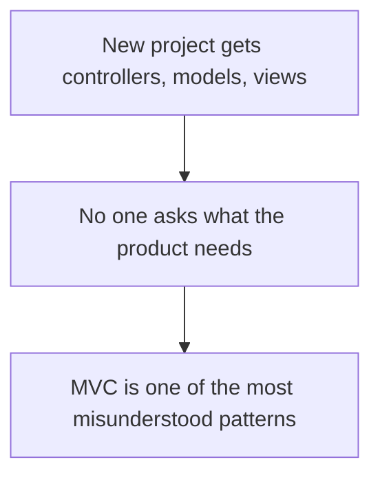
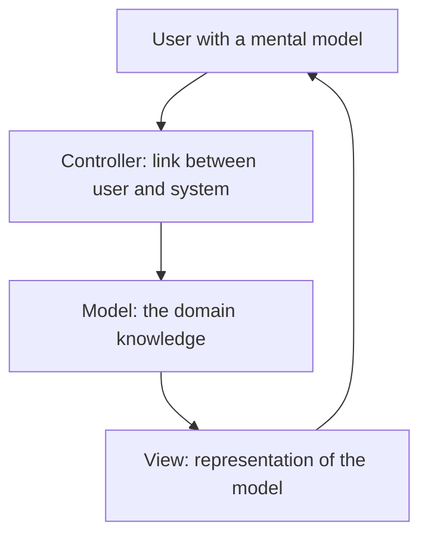
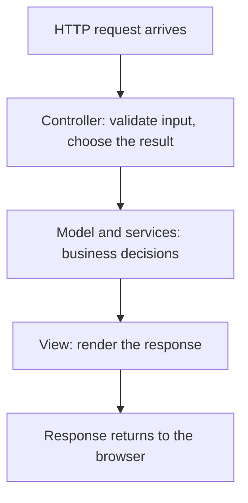
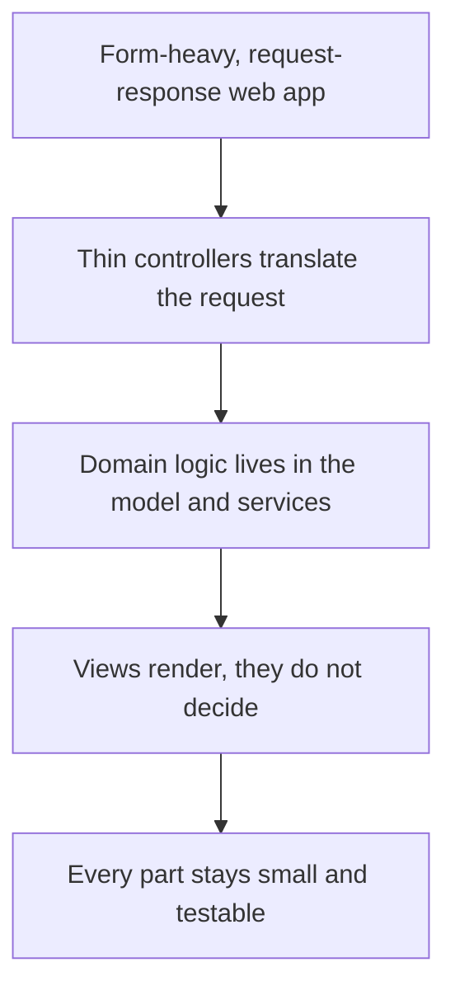
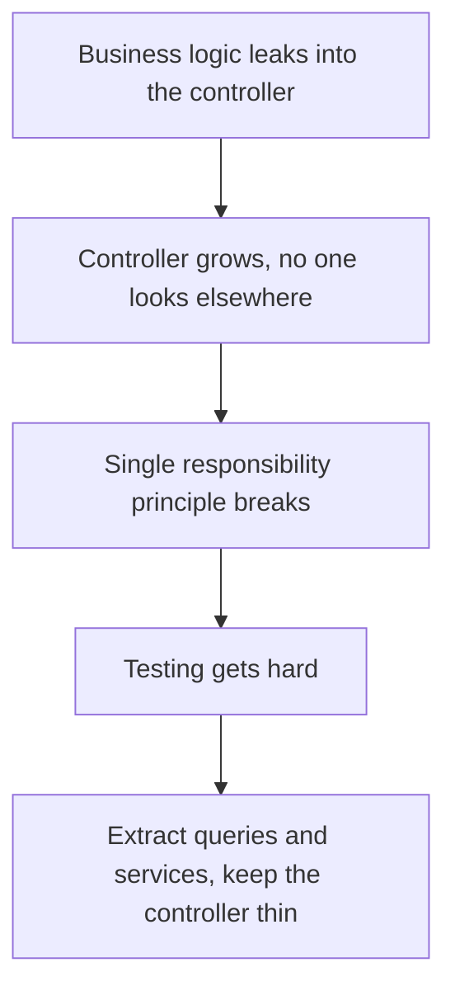
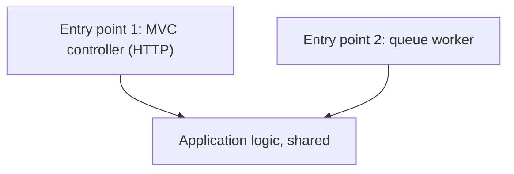
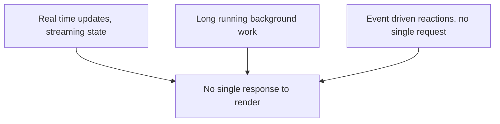

# MVC: When the Request-Response Shape Fits

## The problem: MVC as the automatic default

Every new web project gets the same scaffolding: a controller, a model, a view. A framework like Rails, Spring, or ASP.NET Core generates it before anyone has asked what the product needs. MVC becomes the default, and the default becomes the only answer anyone considers.

Martin Fowler called MVC "one of the most misunderstood architectural patterns around." The misunderstanding is not about how to build an MVC app, it is about when the shape is the right shape at all. The pattern was designed for one particular interaction: a user, a state change, and a response. Applied to software that works that way it is cheap and predictable. Applied to software that does not, it fights back.

This article uses the same method as the other guides in this series: read the situation, name the factor that matters, and decide. The question is not "is MVC good?" It is "does this work the way MVC assumes it does?"



## What MVC actually is

Trygve Reenskaug conceived MVC in 1978 at Xerox PARC. His own description of its purpose: "MVC was conceived as a general solution to the problem of users controlling a large and complex data set." The original design bridged the gap between the user's mental model of the information and the digital model in the computer.

The original note defined four terms, not three: Model, View, Controller, and an ephemeral Editor that the View created on demand as an interface to input devices. The first name for the idea was Thing-Model-View-Editor; after discussion with Adele Goldberg it became Model-View-Controller.



Fowler's reading of what actually survived from MVC is a set of principles, not a rigid shape:

- **Separated presentation**: a clear division between domain objects that model the world and presentation objects the user sees. Domain objects should work without any reference to the UI and should support multiple presentations, possibly simultaneously.
- **Observer synchronization**: views and controllers observe the model. When the model changes, views update without the controller knowing what else needed to change. This is what makes multiple views of one model stay consistent.
- **A controller that takes the user's input and figures out what to do with it**, without deciding everything itself.

The contract at the heart of MVC is one action, one state change, one response. Reenskaug's design was about a user inspecting and editing information, and the web version inherited that: a request arrives, the controller routes it, the model changes or is read, the view renders a response.

## Web MVC is a request-response pattern

On the server side, MVC maps cleanly onto HTTP. The Mozilla documentation describes it directly: in the early web, MVC was mostly implemented server side, with the client requesting updates via forms or links and receiving updated views back to display in the browser. That is the shape MVC assumes: one user action, one state change, one view returned.

Microsoft's ASP.NET Core documentation states the division of labor clearly: the controller is a UI-level abstraction. Its responsibilities are to ensure request data is valid and to choose which view or result should be returned. In well factored apps it does not include data access or business logic; it delegates those to services, and business decisions belong in the model.



The pattern is at its best when every part stays small: the controller translates the request, the model carries the decisions, the view renders. The community word for a controller that stays in its lane is "thin controller." The Envato Tuts+ guide on Rails controller anti-patterns is blunt about it: fat controllers are a known anti-pattern, and the goal is skinny everything, not just skinny controllers. Fat controllers violate the single responsibility principle and grow until they are impossible to test or change.

## When MVC fits

MVC fits when the situation matches the shape it assumes. That means form-heavy, request-response work: a user hits a URL, the system reads or changes state, and a page comes back. This is the classic server-rendered web application, and it is a large and legitimate class of software.



It is feasible when:

- Each user action maps to one state change and one response, so the request-response contract is real.
- The HTTP request is the only entry point, so coupling the application to the web framework costs nothing (CodeOpinion makes exactly this point: if all you ever need is HTTP, MVC coupling is totally fine).
- The team accepts the discipline of keeping controllers thin and delegating decisions to the model and services, as Microsoft and the Rails community both describe.
- The UI is server rendered or mostly static per interaction, so the view stays a renderer and does not become a second application.

For this kind of product MVC is cheap, conventional, and well documented. The framework generates it, the team knows it, and a new developer can find their way around a codebase within an afternoon. Fowler's key point applies: the durable value is separated presentation, keeping the domain independent of the UI so the same model can support a web page, an API, and a command line tool.

## When MVC hurts

MVC breaks down in three distinct ways. Each is a situation where the underlying assumption no longer holds.

### 1. The controllers grow fat

The first failure is the most common and is documented everywhere. The controller starts as a thin translator and slowly becomes the place where everything happens: authentication checks, data fetching, business rules, third party calls, formatting. Envato Tuts+ lists fat controllers as a Rails anti-pattern. AppSignal describes the fat controller as violating the single responsibility principle: too much code and too many responsibilities pile up in one file, and it becomes the only place a developer looks, so it keeps growing.

The fix is not a bigger MVC, it is moving the logic out. AppSignal shows query objects for complex queries and service objects for business actions. The controller becomes a caller, not a brain. The healthy end state is the same shape MVC promised: a thin controller that translates the request and delegates.



The interesting version of this failure is that the opposite extreme is also a failure. The thoughtbot guide "Skinny controllers, skinny models" points out that the "skinny controller, fat model" advice, taken to its limit, moves all the logic into the model, and the model files grow until they become unmanageable god objects. The point is not where the logic lands, it is that the controller should not be the dump site. The business logic needs a home with its own identity, and MVC itself does not give it one beyond "the model."

### 2. The entry point multiplies

The second failure is architectural and comes from CodeOpinion. Frameworks are entry points, not architecture. A controller is an entry point that happens to speak HTTP. If your application logic lives inside the controller, then the controller is the only way to reach it. The moment you need a second entry point, a queue worker, a background job, a CLI, that coupling becomes a problem.

### What the coupling actually is

The coupling is your application code depending on web framework objects. Consider a "Get my orders" action. With a handler, the business logic takes a plain value and never knows where it came from. The controller is just a messenger that pulls the value out of the HTTP context:

```csharp
// Controller (thin): knows MVC, passes a plain value
public IActionResult MyOrders()
{
    return View(handler.GetMyOrders(User.Identity.Name));
}

// Handler (business logic): knows nothing about MVC
public List<Order> GetMyOrders(string username) {
    return FilterOrdersBy(username);
}
```

Now inline that handler into the controller, the way CodeOpinion did when removing MediatR:

```csharp
public IActionResult MyOrders() {
    var username = User.Identity.Name;            // framework object in app logic
    var orders = db.Orders
        .Where(o => o.Owner == username)         // framework types in the query
        .ToList();
    return View(orders);                         // framework call
}
```

Now the business call "give me this user's orders" is mixed with the web mechanism that obtained the user. The logic cannot run without an HTTP request, a session identity, and a controller. That is the coupling: the application code's only way to get a username is through the web framework.

Fetching the same logic from a queue worker, then, is impossible:

```csharp
// A worker that must process the same orders has no MVC context
void Handle(QueueMessage msg) {
    var orders = ???; // the logic above lives inside a controller method
}
```

The worker cannot call `MyOrders` — that method needs MVC's request handling and a rendered view. The logic must be duplicated in the worker or pulled out of the controller, and either way one source of truth splits into two.

This coupling, though, is only a problem in one situation: when you want to move away from the framework later, or reach the same logic from outside it. If the product will only ever speak HTTP, the coupling costs nothing — the framework is the application, and depending on it tightly is the same as using it. As CodeOpinion puts it, if all you ever need is HTTP, MVC coupling is totally fine. The cost appears the day a second entry point or a framework migration becomes real.

This is exactly the temporal decoupling case from the companion guide. An MVC controller can place a message on a queue and a worker can process it, same codebase, two different entry points. When the application logic sits inside the controller, the worker cannot reuse it. The rule CodeOpinion gives: do not put application code in the MVC controller when you need more entry points than HTTP, and do not add an abstraction such as MediatR or a repository just because you fear the controller, unless the abstraction actually solves the problem you have.



### 3. The interaction is no longer request-response

The third failure is the deepest. MVC assumes a request and a response. When the product stops working that way, the shape no longer fits.

- Real time features: a chat, a live dashboard, a feed that updates without a reload. There is no single response to render; there is a stream of state changes, and the observer side of MVC is not built for pushing updates to a browser.
- Long running work: a video encoding job, a report that takes an hour. The client cannot wait for a response that takes that long; the request-response contract is violated, and the queue and worker pattern from the decoupling guide replaces the synchronous round trip.
- Event driven behavior: the system reacts to events, not to user requests. An event arrives, multiple consumers react, none of them is "the controller." The request-response contract has no request to route.

MDN notes that modern web development already pushed a lot of this logic to the client, with client side data stores and the Fetch API enabling partial page updates. The server side MVC is one participant, not the whole shape.



## The decision table

| Situation | MVC fits when | MVC hurts when |
|---|---|---|
| Interaction shape | One action, one state change, one response | Streaming, long running work, event driven reactions |
| Entry points | HTTP is the only entry point, and the product will not move to another framework | Queue workers, CLIs, batch jobs need the same logic, or a framework migration is on the roadmap |
| Controller | Thin, translates the request, delegates decisions | Fat, accumulates business logic and data access |
| Domain logic | Lives in the model and services | Buried in the controller or dumped into god models |
| View | Renders state, does not decide | Carries the application logic or grows into a second app |
| Team | Knows the framework, wants convention | Needs to escape the framework's assumptions |

## How to use this

The method is the same one used across the series: read the situation and match it to the shape, instead of reaching for the default.

- If the product is a form-heavy, server rendered, request-response web app, MVC is the right shape and fighting it is over-engineering.
- Keep the controllers thin and delegate decisions to the model and services. The community sources are unanimous about this.
- The moment a second entry point appears, move the application logic out of the controller so the worker and the web app can share it.
- The moment the interaction stops being request-response, a queue, a stream, or an event replaces the controller, and MVC becomes one participant instead of the whole architecture.

The durable lesson from the original design is not the three letter acronym. It is separated presentation: keep the domain independent of the interface, so the same model serves every interface that exists, and the ones that appear later.

## References

- Reenskaug, T. (1979). *Models-Views-Controllers*. Xerox PARC. https://folk.uio.no/trygver/themes/mvc/mvc-index.html. The original MVC papers, including the purpose of bridging the user's mental model and the digital model, and the Thing-Model-View-Editor prototype.
- Fowler, M. (2006). *GUI Architectures*. martinfowler.com. https://martinfowler.com/eaaDev/uiArchs.html. MVC as a set of principles: separated presentation, observer synchronization, and a controller that takes user input and decides what to do.
- Comartin, D. (2025). *Minimal APIs, CQRS, DDD... Or Just Use Controllers?*. CodeOpinion. https://codeopinion.com/minimal-apis-cqrs-ddd-or-just-use-controllers/. Frameworks are entry points, not architecture; coupling to MVC is fine when HTTP is the only entry point.
- Microsoft. (2026). *Handle requests with controllers in ASP.NET Core MVC*. learn.microsoft.com. https://learn.microsoft.com/aspnet/core/mvc/controllers/actions. The controller is a UI-level abstraction: validate input, choose the result, delegate business logic to the model and services.
- Mozilla. (2026). *MVC Glossary*. MDN Web Docs. https://developer.mozilla.org/docs/Glossary/MVC. Server side MVC: requests via forms and links, updated views returned to the browser, and the shift of logic to the client.
- Envato Tuts+. (2016). *AntiPatterns Basics: Rails Controllers*. https://code.tutsplus.com/antipatterns-basics-rails-controllers--cms-25900. Fat controllers as an anti-pattern and the "skinny everything" guideline.
- AppSignal Blog. (2021). *Ruby on Rails Controller Patterns and Anti-patterns*. https://blog.appsignal.com/2021/04/14/ruby-on-rails-controller-patterns-and-anti-patterns.html. Fat controllers, single responsibility, and extracting query and service objects.
- thoughtbot. (2008). *Skinny controllers, skinny models*. https://thoughtbot.com/blog/skinny-controllers-skinny-models. The opposite failure: logic dumped into models until they become god objects.
- Knowledge base. *Decoupling Moves Complexity*. decoupling-moves-complexity.md. The spectrum that MVC controllers live at one end of.
- Knowledge base. *Decoupling Case Studies: When to Apply Each Level*. decoupling-case-studies.md. The request-response band and the queue/worker case that MVC handles poorly.
- Knowledge base. *Cohesion: Related by Capability, Not by Layer*. cohesion-capability-vs-layer.md. Controllers grouped by layer versus grouped by capability.
