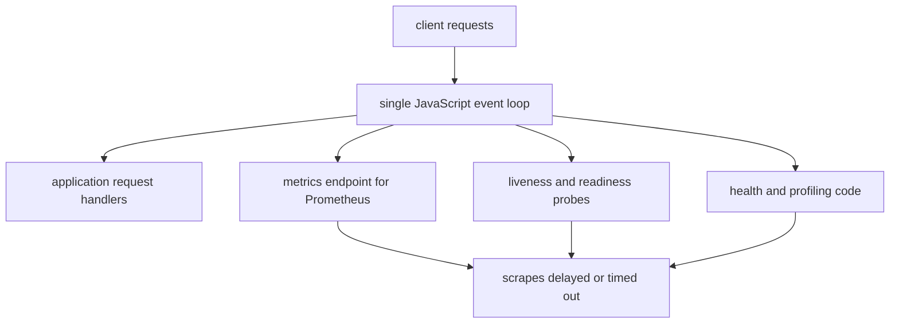
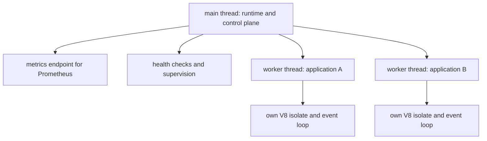
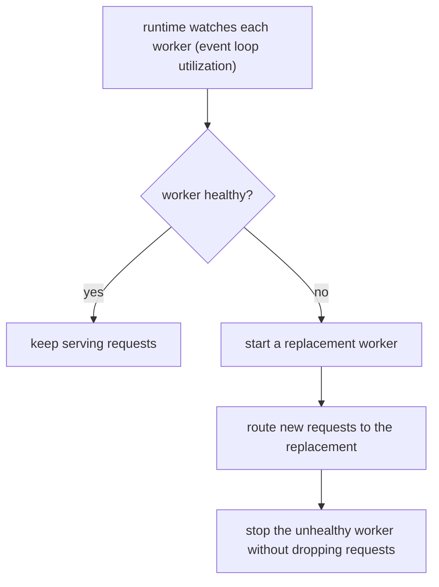

# Why Your Node.js App Can't Monitor Itself

## TLDR

- Node.js runs your application code on a **single JavaScript thread with one event loop**. That same loop serves requests, answers health checks, exposes metrics, and runs diagnostics.
- Under load the loop is busy doing the work you want to measure, so it cannot reliably measure itself. Metrics scrapes time out, liveness and readiness probes stop responding, and degradation goes unnoticed until the process fails. This is the **monitoring paradox**.
- The fix is **separation of concerns**: split the control plane (monitoring, health checks, supervision) from the application layer. Run the app in **worker threads** and keep the main thread as a coordinator that does no application work.
- Each worker thread has its **own V8 isolate and its own event loop**, so a blocked or crashed worker can be restarted or hot-swapped **without dropping requests**, and the coordinator can still answer even when the app is saturated.
- The trade-off: threads share one process, so you get **code isolation, not process isolation**. A native crash, an out-of-memory error, or `process.exit()` takes down every worker in that process.

## The problem: the thing doing the work is also doing the watching

Node.js executes your JavaScript on a single thread. Non-blocking I/O means the runtime does not block that thread while waiting on the network or disk, but every callback, timer, and request handler still runs on one event loop. This is the design that lets a Node server handle thousands of concurrent connections with modest memory, and it is also the source of a production problem.

The same event loop that serves your users also has to do the operational work:

- serve the metrics endpoint that Prometheus scrapes,
- answer the Kubernetes liveness and readiness probes,
- run whatever code collects and reports health data,
- and execute any profiling or diagnostics you trigger.

So the more loaded the application is, the less able it is to report on itself. When the event loop is saturated, a metrics scrape is delayed or times out, the health endpoint does not respond, and the data you need most during an incident is exactly the data you cannot get. The Platformatic Supabase case study frames the same idea with an old question: *quis custodiet ipsos custodes*, who watches the watchmen? You cannot safely monitor or profile from within the same event loop you are trying to observe.

## Why this fails badly under load and on failure

On a single-threaded app, degradation is easy to miss because the signal degrades with the app. The health check stops responding, the app is busy, and things get bad quickly. Worse, failures tend to be catastrophic: the whole process goes down, so the infrastructure has to restart it from scratch. That means cold starts, in-flight requests dropped, and a gap in service precisely when traffic is heaviest. The alternative to a cold restart is a warm one, which requires having a spare, healthy copy of the application already running.

## The fix: separate the control plane from the application

The architecture is separation of concerns. Instead of one thread doing both the work and the watching, split the two:

- A **coordinator or runtime on the main thread**. It owns monitoring, health checks, supervision, and the metrics endpoint. It stays responsive because it does no application work.
- **Application worker threads**. Each one runs the actual application, with its own event loop and V8 isolate.

Because the coordinator has its own event loop, it can measure and act even when an application worker is blocked or saturated. Monitoring moves off the loop it is measuring.

## Worker threads give real isolation

Node's `worker_threads` module runs JavaScript in parallel threads. Each `Worker` is an independent JavaScript execution thread, and in practice each worker gets its own V8 isolate: its own heap, module registry, globals, and event loop. Two workers in the same process cannot see each other's memory, cannot monkey-patch each other's modules, and cannot block each other's event loop. They can even depend on different, incompatible versions of the same library.

That isolation is what makes the coordinator's measurements trustworthy: it is not measuring itself, so its view of a worker's event loop utilization (ELU), memory, and response times does not collapse when the worker is under pressure.

## What the architecture buys you

- **Monitoring that always answers.** The runtime exposes metrics, so Prometheus scrapes the runtime instead of the busy application, and scrapes succeed under load. Readiness and liveness probes respond immediately, so Kubernetes does not kill a healthy-but-busy pod or route traffic to a dead one.
- **Fast recovery instead of cold restarts.** If a worker crashes, the coordinator restarts it immediately. It can also watch health metrics such as event loop utilization and **proactively replace** a worker before it fails, hot-swapping it without losing requests.
- **Horizontal scaling on one machine.** Spawn as many workers as you have CPUs and scale them up or down with load, rather than running one process per core.
- **Several applications in one process.** Each application gets its own worker (own V8, own event loop), so a Next.js frontend, a Fastify API, and a plain `node:http` server can run side by side and scale independently.
- **An internal mesh without sockets.** Applications still call each other over HTTP, but the runtime can route internal requests over a `MessagePort` instead of opening a TCP socket, keeping the call in memory and avoiding the cost of allocating a socket.

## The trade-off: code isolation is not process isolation

Worker threads share one OS process, so they share the PID, the working directory, file descriptors, signals, and the process-wide memory limit. That leads to two limits worth knowing before you adopt this model:

- A native addon segfault, an out-of-memory error against the process heap limit, or anything that calls `process.exit()` kills every worker in the process, not just one. Supervision cannot rescue a process-level failure.
- State kept in worker memory does not survive a worker restart. Sessions, rate-limit counters, and caches need a shared backing store, exactly as they would across separate containers.

If a particular application genuinely needs process-level fault isolation (an unstable native dependency, an untrusted plugin), run it as its own runtime and let it talk to the others over real HTTP. Because the mesh and the network look the same to application code, that is a configuration change rather than a rewrite.

## When to use this, and how to build it

Reach for the thread-per-application model when your app has CPU-bound work (server-side rendering, JSON or image transforms, crypto), when you run in containers or Kubernetes and want reliable probes, or when you want higher compute density than one-container-per-service.

Ways to build it:

- **Raw.** Use `node:worker_threads` and write your own supervisor, health checks, and routing.
- **Processes.** Use `node:cluster`, which runs a process per core and can share a listening socket via `SO_REUSEPORT`. This gives process isolation at the cost of more memory and slower startup than threads.
- **A runtime.** Platformatic Watt implements this model end to end: a main-thread runtime, worker supervision with restart and replacement, ELU-based health checks, a message-based application mesh, and Prometheus metrics. The talk that this article is based on is by Matteo Collina (Node.js TSC chair, creator of Fastify and Pino), and the architecture it describes is the one Watt ships.

## Sources

- Matteo Collina, *Your Node.js App Can't Monitor Itself. Matteo Collina on the Architecture That Fixes It*, JavaScript Conferences by GitNation, [youtube.com/watch?v=z47ZOs3E5no](https://www.youtube.com/watch?v=z47ZOs3E5no) (the monitoring paradox; splitting the control plane from the application; running the app in worker threads with the main thread as coordinator; always-available monitoring and reliable probes; proactive replacement and hot swaps; multiple applications in one process; the internal mesh).
- Platformatic, [Watt Architecture](https://docs.platformatic.dev/docs/concepts/watt-architecture) (a thread per application; each worker gets its own V8 isolate, heap, module registry, globals, and event loop; the runtime is the main thread and owns supervision, shared concerns, and one public surface; internal mesh over `MessagePort`).
- Platformatic, [The Multithread Model](https://docs.platformatic.dev/docs/next/concepts/multithread-model) (what worker threads isolate and what they do not; supervision and replacement; the process-level failure caveat; shared-nothing implications for in-memory state).
- Platformatic, [Supabase: to a billion (requests) and beyond](https://platformatic.dev/case-studies/supabase) (the watchmen dilemma: you cannot safely monitor or profile from within the same event loop; consolidating single-CPU tasks into fewer containers running multiple worker threads; the management plane watching event loop utilization and hot-swapping degraded workers).
- Node.js, [Worker threads](https://nodejs.org/api/worker_threads.html) (the `node:worker_threads` module runs JavaScript in parallel threads; a `Worker` is an independent JavaScript execution thread; inter-thread message passing over `MessagePort`; event loop utilization is available per worker).
