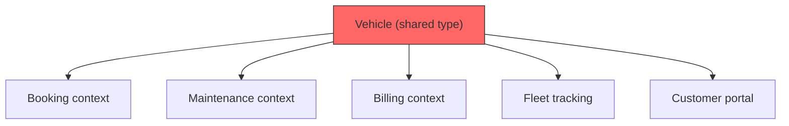
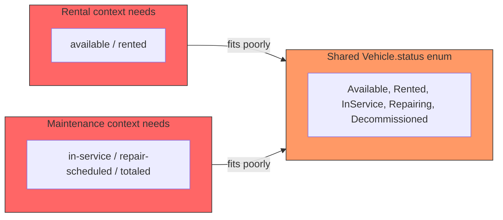
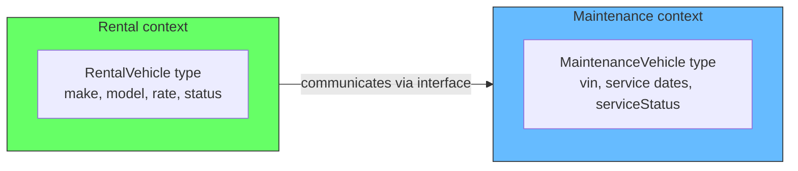
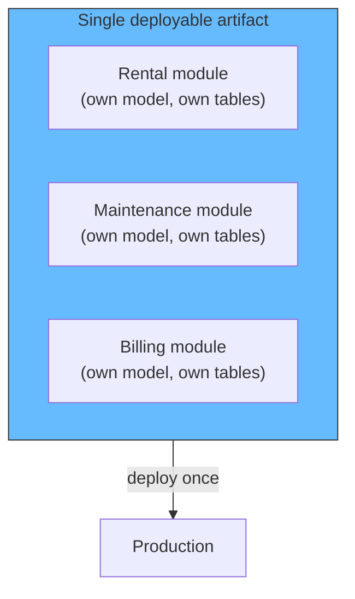
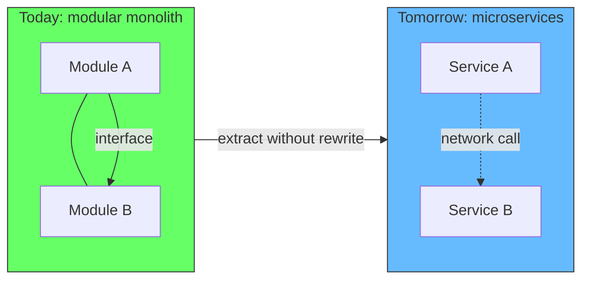
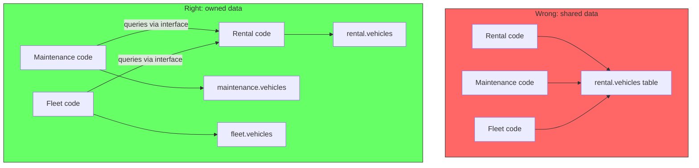

# One Model Per Context

## The problem: one type to rule them all

A common mistake in monolithic applications is sharing a single model across multiple contexts. A `Vehicle` class with fields for every conceivable use case. A `Customer` object that serves checkout, marketing, support, and accounting. One type, everywhere.

```typescript
// The shared type -- tries to serve every context, serves none well
class Vehicle {
  id: string
  make: string
  model: string
  year: number
  color: string
  vin: string
  licensePlate: string
  mileage: number
  fuelType: 'gas' | 'diesel' | 'electric'
  status: 'available' | 'rented' | 'maintenance'
  rentalRate: number
  insurancePolicy: string
  lastServiceDate: Date
  gpsDeviceId: string
  // 20 more fields...
}
```

This type is used by the rental booking flow, the maintenance scheduler, the billing system, the customer portal, and the fleet tracking dashboard. Every consumer sees every field, even fields that are meaningless in their context. The billing system does not need `gpsDeviceId`. The fleet tracker does not need `rentalRate`.

The problems compound:



Every context depends on the same type. Changing the type for one context risks breaking another. Adding a field required by maintenance means recompiling and redeploying the entire application, even for contexts that will never use that field.

This is the opposite of cohesion. Unrelated concerns are coupled through a shared data structure. The application looks like one system on the surface but is a collection of independent workflows forced to share a single vocabulary.

## Why shared types are wrong

When two contexts use the same type, one of two things happens:

1. **The type is a compromise.** Each context gets some of what it needs but not all. The Vehicle type has a `status` field, but the rental context needs `'available' | 'rented'` while the maintenance context needs `'in-service' | 'repair-scheduled' | 'totaled'`. The shared enum is the intersection of both sets, which fits neither perfectly.

2. **The type is everything.** Every field any context might ever need is added to the single type. The type becomes a dumping ground. It has no cohesion. It models nothing. It is just a bag of columns.

```typescript
// Compromise: neither context gets the right type
enum VehicleStatus {
  Available,    // rental uses this
  Rented,       // rental uses this
  InService,    // maintenance uses this
  Repairing,    // maintenance uses this
  Decommissioned  // both?
}
```



Eric Evans describes this problem in Domain-Driven Design (2003). Each bounded context has its own ubiquitous language, its own model. The same concept — a vehicle, a customer, a product — means different things in different contexts. In the rental context, a vehicle has a rate and an availability schedule. In the maintenance context, the same vehicle has a service history and a parts inventory. These are different models that happen to refer to the same real-world object.

Vaughn Vernon, in Implementing Domain-Driven Design (2013), emphasizes that bounded contexts are the primary pattern for managing domain model boundaries. Each context gets its own model, its own types, its own database schema — even if they overlap with other contexts. The overlap is resolved through translations, not shared types.

## The solution: one model per context

Each capability defines its own types. The rental context has a `RentalVehicle`. The maintenance context has a `MaintenanceVehicle`. They share no code, no types, no schema. They communicate through interfaces, not through shared data structures.

```typescript
// Rental context -- its own model
class RentalVehicle {
  id: string
  make: string
  model: string
  rentalRate: Money
  status: 'available' | 'rented'
}

// Maintenance context -- its own model, independent
class MaintenanceVehicle {
  id: string
  vin: string
  lastServiceDate: Date
  nextServiceDue: Date
  serviceStatus: 'in-service' | 'repair-scheduled' | 'totaled'
}
```



Each type is cohesive. Each type contains only the fields relevant to its context. Each type can change without affecting the other. The rental team can add fields, rename methods, or restructure the model without ever touching the maintenance team's code.

Martin Fowler describes this as "Bounded Context" in his 2014 article and in Patterns of Enterprise Application Architecture. The key insight: a model is not a universal truth. It is a simplification of reality for a specific purpose. Different purposes need different simplifications.

## How this connects to logical and physical separation

When every context has its own model, the application has achieved **logical separation**. The code files, the namespaces, and the dependency graphs are clean. The billing module does not import the fleet tracking module's types. Each module compiles independently.

But the application is still a single deployable unit. That is the modular monolith: logically separated, physically together.



Sam Newman, in Building Microservices (2015, 2021), argues that the hard part of microservices is not the deployment topology — it is the logical separation. Teams that cannot separate their models and data within a monolith will struggle to separate them across services. The reverse is also true: teams that achieve clean logical separation within a monolith can extract services later with far less friction.

This is the benefit the architect described. Build with capability-based modules, each with its own model and its own data. Deploy as one artifact today. Extract into separate services tomorrow. The extraction is a packaging change, not a code change.



The deployment flexibility this enables is covered in more detail in the separate article [Deployment is a Configuration Choice](/docs/software-engineering/deployment-configuration-choice).

## Data ownership makes this work

Logical separation means nothing without data ownership. If every module still reads and writes the same database tables, the models are paper-thin. The real coupling is in the schema.

True data ownership means:

1. Each module owns its tables
2. No module directly queries another module's tables
3. Cross-module data access happens through interfaces, not joins
4. Schema changes in one module never require migration in another

```typescript
// Wrong: direct data access across modules
const vehicles = await db.query('SELECT * FROM rental.vehicles WHERE status = $1', ['available'])

// Right: access through the owning module's interface
const vehicles = await rentalModule.getAvailableVehicles()
```



When data is owned, extraction is straightforward. The rental module already has its own tables, its own models, and its own public interface. Wrapping that behind a network boundary is mechanical. No model changes, no schema split, no data migration project.

This point is reinforced by the team at Pendoah AI (2025) in their analysis of modular monolith extraction patterns. They found that teams with clear data ownership within a monolith could extract individual modules into independent services in days rather than months. Teams without data ownership had to untangle shared schemas first, which took weeks per module.

The Flexera 2025 State of the Cloud Report similarly notes that organizations with well-defined domain boundaries in their monoliths report significantly lower migration costs when moving to distributed architectures compared to those with layered, schema-coupled monoliths.

## Summary

| Shared type across contexts | One model per context |
|---|---|
| Compromise type that fits neither | Purpose-built type for each use case |
| Changing one context risks breaking another | Each context changes independently |
| Schema couples unrelated modules | Data ownership enforces boundaries |
| Extraction requires untangling shared types | Extraction is a packaging change |

The rule is simple: if two parts of the system have different reasons to change, they should have different models. Even when deployed as one application, treat them as separate systems that happen to share a process. One capability, one model, one data owner. Always.

### References

- Evans, E. (2003). *Domain-Driven Design: Tackling Complexity in the Heart of Software*. Addison-Wesley. — Bounded Context, Ubiquitous Language
- Vernon, V. (2013). *Implementing Domain-Driven Design*. Addison-Wesley. — Bounded Context implementation patterns
- Fowler, M. (2014). *BoundedContext*. martinfowler.com. https://martinfowler.com/bliki/BoundedContext.html
- Newman, S. (2021). *Building Microservices: Designing Fine-Grained Systems*. 2nd ed. O'Reilly. — Logical separation before physical separation
- Pendoah AI (2025). *Modular Monolith Extraction Patterns*. Industry analysis on extraction timelines based on internal architecture quality
- Flexera (2025). *State of the Cloud Report*. Section on migration costs and architecture readiness
