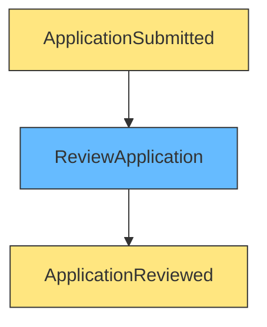
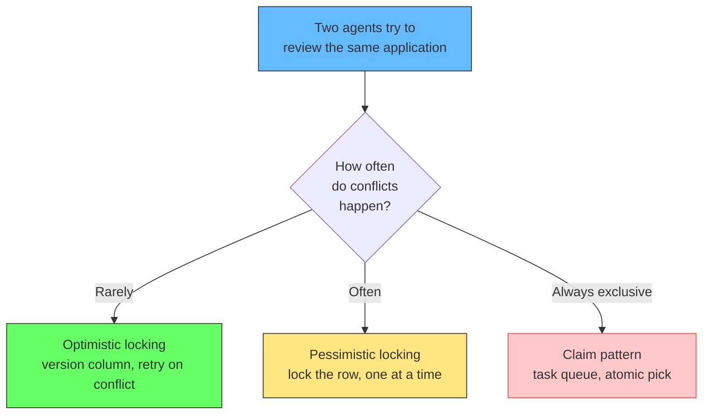
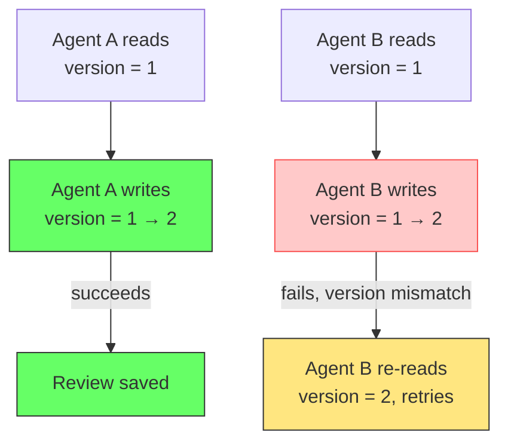
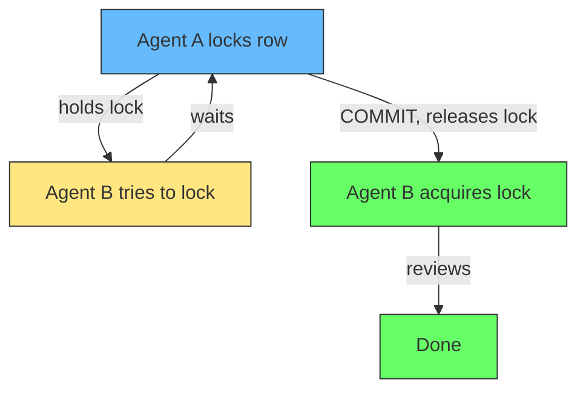
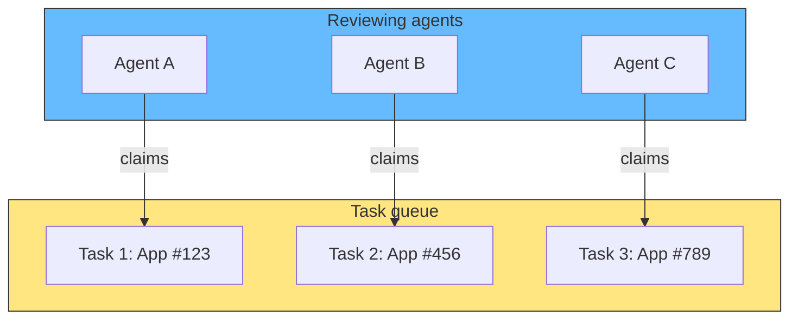

# Parallel Actors and Concurrent Access in Event Storming

## The problem: multiple actors, same task

An event storming wall shows an insurance review process:

<div style={{display: 'flex', justifyContent: 'center'}}>



</div>

One command, one event. Clean. But the business says there are 50 reviewing agents. Two agents can pick up the same application. Both read `status: pending`. Both write `status: reviewed`. The second write overwrites the first. One review is lost.

This is not an event storming problem. It is a concurrent access problem that event storming surfaces. The wall shows what the business does. The code has to handle what happens when two people do it at the same time.

## The three solutions

The right solution depends on how often conflicts happen and what the business can tolerate.

<div style={{display: 'flex', justifyContent: 'center'}}>



</div>

## Solution 1: Optimistic locking (version column)

Assume conflicts are rare. Let both agents read and work. At write time, check if the data changed. If it did, one agent fails and retries.

The aggregate gets a `version` field. Every write increments it. The update only succeeds if the version matches.

```python
# Agent A reads: version = 1
# Agent B reads: version = 1

# Agent A writes first
UPDATE applications SET status = 'reviewed', version = 2
WHERE id = 123 AND version = 1;
# Succeeds. version is now 2.

# Agent B tries to write
UPDATE applications SET status = 'reviewed', version = 2
WHERE id = 123 AND version = 1;
# Fails. version is already 2. 0 rows affected.
```

James Hickey describes this as the standard DDD pattern: "Optimistic concurrency works by allowing each operation to get the current version. Then, the version is tested against the data store whenever the aggregate is being written back. If the version is out of sync, the operation fails."



Use when: conflicts are rare, user think-time is long (agent reads application, thinks for minutes, then submits), and you want maximum read throughput.

## Solution 2: Pessimistic locking (lock the row)

Assume conflicts are likely. Lock the row when the first agent starts reviewing. The second agent waits or gets an error.

```sql
BEGIN;
SELECT * FROM applications WHERE id = 123 FOR UPDATE;
-- Row is locked. Agent A can now review.
-- Agent B's SELECT ... FOR UPDATE blocks here.

UPDATE applications SET status = 'reviewed' WHERE id = 123;
COMMIT;
-- Lock released. Agent B can now proceed.
```

Kamil Grzybek: "Pessimistic Concurrency involves the use of a database transaction and a locking mechanism. In this way, requests are processed one after the other, so basically concurrency is lost and it can lead to deadlocks."



Use when: conflicts are frequent (limited slots, popular items), the cost of retrying is high (complex multi-step transactions), or you need guaranteed exclusive access (financial operations).

## Solution 3: Claim pattern (task queue)

The business rule is that only one agent should review an application. Do not let two agents pick it up in the first place. Put review tasks in a queue. Each agent claims one task atomically.

PostgreSQL's `FOR UPDATE SKIP LOCKED` is the standard implementation:

```sql
BEGIN;
SELECT id, application_id
FROM review_tasks
WHERE status = 'pending'
ORDER BY created_at
FOR UPDATE SKIP LOCKED
LIMIT 1;
-- Agent A gets task 1. Agent B gets task 2.
-- Nobody waits on anybody.

UPDATE review_tasks SET status = 'processing', locked_by = 'agent-7'
WHERE id = 1;
COMMIT;
```

The pattern from the PostgreSQL documentation: `SKIP LOCKED` excludes rows already locked by other transactions, without waiting. Multiple workers can each grab the first available pending task without blocking each other or processing the same task twice.



Use when: the business rule is "only one person does this," conflicts would always happen, or you want to distribute work across a pool of workers.

## Which solution fits the event storming wall

| Pattern | What the wall looks like | In code |
|---|---|---|
| Optimistic | One actor, rare conflicts | Version column on aggregate |
| Pessimistic | One actor, frequent conflicts | `SELECT ... FOR UPDATE` |
| Claim | Multiple actors, exclusive task | Task queue with `SKIP LOCKED` |

The wall shows the business reality: multiple agents, same task. The code has to match. If the business says "only one person reviews," the claim pattern matches that rule. If the business says "two people can review but we need to detect conflicts," optimistic locking matches.

## Related

- [Transaction Locking: How Two Updates Block Each Other](transaction-locking.md) - pessimistic vs optimistic locking in detail
- [Aggregate Sizing: How Big Should an Aggregate Be?](aggregate-sizing.md) - why aggregate boundaries affect locking
- [Data Ownership in Redis](redis-data-ownership.md) - how task queues work with Redis
