# The Real Justification for Boundaries

## The problem: we want changeable code, but we justify it with a future we cannot predict

The goal is simple to state: write code that is easy to change. That goal decomposes into two properties. High cohesion, so that things that change for the same reason live together and a change lands in one place. Low coupling, so that a change in one place does not ripple into many others.

The problem is that when asked *why* we want these properties, the answer drifts toward something much weaker: "so we can split into microservices later." We say we build boundaries today to keep the option of independent deployment and independent scaling tomorrow.

This justification sounds reasonable. It is mostly wrong. It asks you to bet the structure of your code on a future you cannot predict, and then it holds the boundaries accountable for a payoff they never promised.

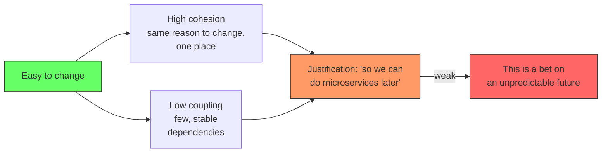

The goal is not "easy to deploy as microservices." The goal is "easy to change." The rest of this article explains why that distinction matters, why the microservices argument fails on its own terms, and what justification for boundaries actually survives scrutiny.

## The framing test: every design decision must translate into a benefit

Before evaluating any justification, there is a test to apply. Some teams accept "high cohesion and low coupling" as dogma, because a well-known author wrote it in a well-known paper. That is not a reason a business will pay for. The business pays for outcomes, and every architectural principle has to be translated into one, or it is not worth the money, the time, and the future maintenance it costs.

This is especially true in the era of agent coding. The cost of development is still there, and every useless abstraction is still built by someone or something. Building for the sake of building is the thing that is hardest to sell and easiest for a future developer to look at and not understand why it exists. So the framing test is: for any design decision, name the concrete benefit it produces. If you cannot, the decision is dogma, and it should be dropped.

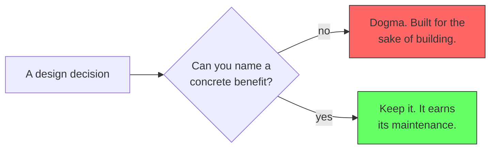

Now apply the test to high cohesion and low coupling. The translation is about the developer, not the code. High cohesion means the pieces that work on one thing live in one place, so the developer assigned there only has to know that one context. Low coupling is what makes that possible: because the context barely depends on the others, the developer does not have to understand the whole system to work in their part. The two principles are not separate goals. Low coupling is the enabler, and high cohesion is the payoff: a developer who knows one context instead of all of them.

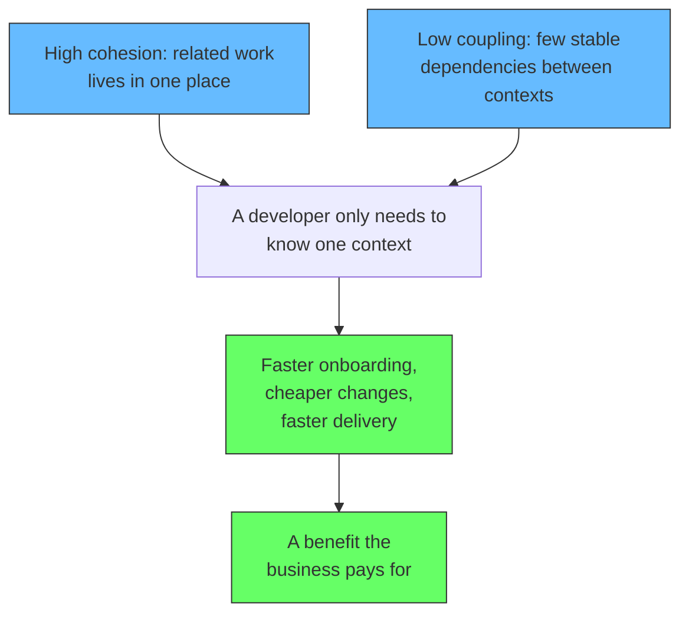

This is the correct framing because it survives the test. A new developer ramps up in one context instead of the whole domain. A change lands in one place instead of rippling everywhere. A team owns a piece of the system and does not block others. Each of those is a real, measurable outcome the business pays for. The principles were never the goal. The outcomes were.

Keep this test in mind through the rest of the article. Every justification below is evaluated against it. The ones that survive are the ones that translate into a benefit a team or a business actually feels.

## The original motivation: communication, not structure

It is worth going back to why Evans introduced Bounded Contexts in the first place, because it confirms the framing test from the source itself. The problem he described was not that software was hard to deploy or hard to scale. It was that software and business spoke different languages. When he looked at the code, it was full of technical names: controllers, services, repositories. When he talked to domain experts, they used their own vocabulary. There was no mapping between the two. A domain expert would describe a business event, and the developer would point at a controller and a service, and neither could see how the other's words related to the same thing. There was no common ground.

That is the motivation. Bounded Contexts and the Ubiquitous Language exist so a model can be stated in the language of the domain, which gives developers and domain experts a shared vocabulary they can both point at. Fowler (2014) states it directly: "A model acts as a Ubiquitous Language to help communication between software developers and domain experts."

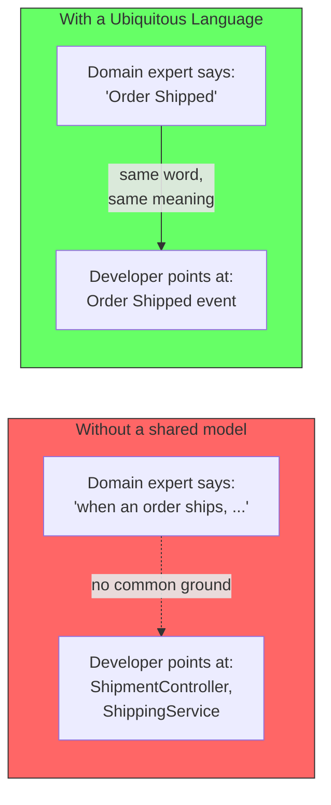

This matters for the argument in this article because it proves the point from the source itself. Evans did not create Bounded Contexts to future-proof an architecture. He created them so a developer and a domain expert could understand each other. The structural benefits, like clear boundaries and changeable code, are consequences of solving the communication problem. The boundary is first a boundary of language, and only later a boundary of code.

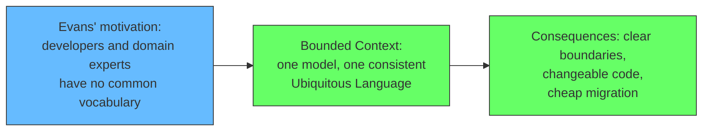

So the "boundaries for microservices" justification is wrong three times over. It is not the reason, because the reason was communication. It is not the mechanism, because the mechanism is a shared language. And it is not the payoff, because the payoff is changeability and shared understanding. The communication framing is the original one, and it passes the framing test: a domain expert and a developer pointing at the same word and meaning the same thing is a benefit the business pays for every single day.

## The tempting justification: build boundaries for the future split

The argument goes like this. A modular monolith draws internal boundaries today. Later, if one capability needs independent scaling, we extract that module into a service. Because the boundary already exists, the extraction is cheap. We are "optimizing for the future" by keeping the split cheap.

This is the argument most often given for modular monoliths. It is the argument on the surface of many architecture articles, including this site's own [Modular Monolith](/docs/software-engineering/modular-monolith) and [Deployment is a Configuration Choice](/docs/software-engineering/deployment-configuration-choice). If the boundary is clean, extraction is a wiring change, not a rewrite.

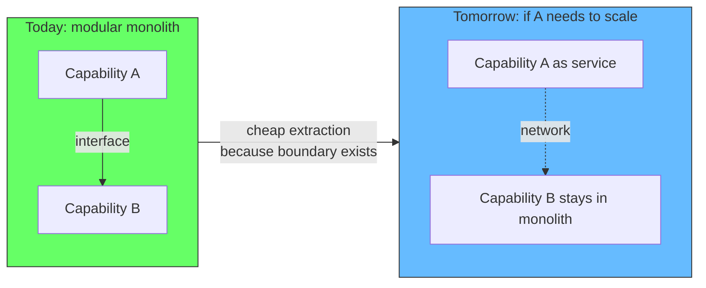

## Why this justification is weak: the future is not a single point

The argument assumes the future has a simple shape: one capability becomes popular, we split it, done. Real futures do not look like that. Consider what actually happens.

First, the unit of scale is not the capability. A capability is a bundle of use cases. A "checkout" context contains cart, address, payment, and order placement. What usually becomes popular is one use case inside that bundle, like payment processing. To scale it independently you would extract *part* of the context, not the whole thing. That is a re-cut of the boundary, not a use of it.

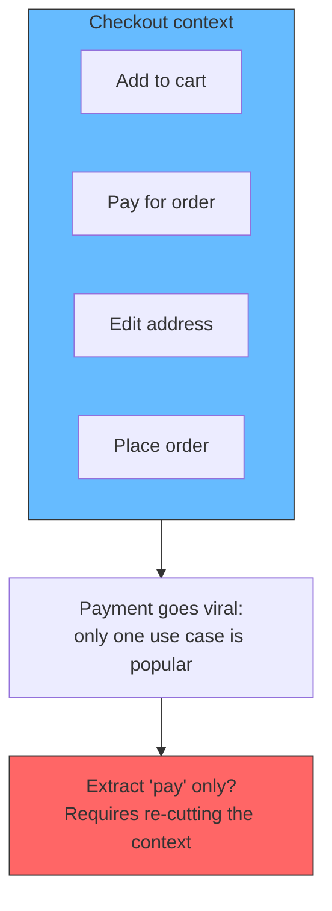

Second, the boundary grows with the context. A bounded context that starts small can grow until only a subset is hot. The original boundary then contains the wrong things. It did not predict which subset would need to scale, and it could not.

Third, the future reason for splitting is rarely scale. It is more often a stack change. One part of the system needs a different language or runtime because of a hiring need, a vendor, or a new requirement. Stack changes cut across capabilities, not along them. The boundary you drew for scalability does nothing for a technology change that spans half of it.

The conclusion is uncomfortable but honest: drawing a boundary today does not guarantee that tomorrow's change is cheap. The change you will eventually need is probably not the one you drew the boundary for.

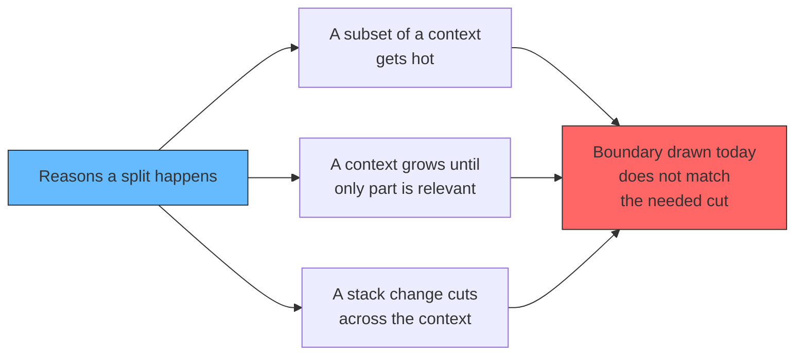

If boundaries are justified by future splits, and future splits rarely respect the boundaries we draw, then "we might do microservices later" is a weak reason to build boundaries at all.

## The budget trap: today's money for today's problems

There is an economic version of the same mistake, and it is the one that shows up in real budget conversations. When a team starts future-proofing, it is solving a problem that does not exist yet, with money that exists right now. The moment that happens, the budget for today's problems shrinks, because the team spent part of it on tomorrow. And tomorrow's problem may never arrive, or it may arrive in a different shape, or it may arrive after the business priorities have moved on. Either way, today's budget was spent on a bet.

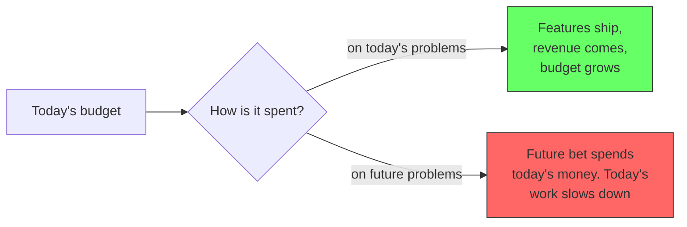

The alternative is to spend today's budget on today's problems, and to let the future budget arrive when the future problems arrive. The money for solving tomorrow's problem does not have to be reserved today. It will come when the problem becomes real, because a real problem is visible, measurable, and fundable. A hypothetical problem is none of those things, which is why it is so hard to justify spending on it. The problems that have not become problems yet cannot be prioritized against the problems that have.

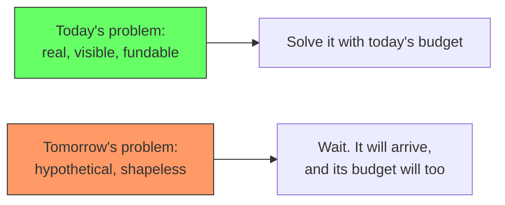

This is the trap that the "boundaries for the future" argument sets. It is not just a technical mistake. It is a budget mistake: reserving today's money for a problem that has not happened, in a shape that cannot be known, and calling it planning. The planning that is actually worth doing is the kind that costs little today and keeps the future cheap, which is what the extraction skill gives you. Everything else is borrowing from today to bet on tomorrow.

The same habit shows up in how people think, not just how teams budget. Minds jump forward in time. They imagine the problems that might come, and they start solving those imaginary problems now, in the present, at full intensity, while the real problems of today sit half attended. The fix for both is the same: solve the problem that is in front of you, with the budget that is in front of you. When the future problem becomes the present problem, it will be time to solve it then.

## The North Star: optimize for what is in front of you, not imaginary growth

The budget trap has a psychological driver, and naming it helps resist it. When a team over-provisions for the future, it is often not responding to anything real. It is responding to the fear of some imagined growth, or to the belief that there is a chance it might happen, or to the fomo that if it does happen and the team was not ready, the team will look unprepared. But a chance is not a guarantee. A possibility of growth is not growth. There is no evidence that the imagined growth will materialize, and there is no reason to provision development capacity for a future that may never arrive.

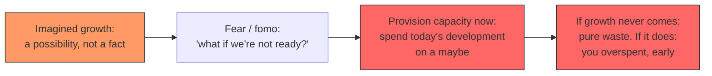

The replacement is to pick the North Star and hold it: the system is being built to deliver something today, to the people who are using it today. That is what the team is optimizing for. Everything that serves that is worth doing. Everything that serves an imagined future is not, because the imagined future has no users, no revenue, and no deadline, and it never will until it stops being imagined.

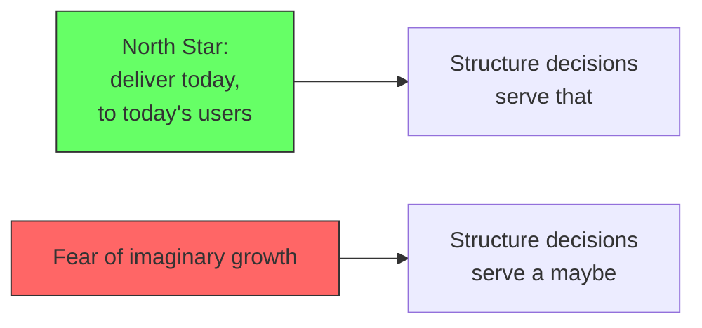

This does not mean ignoring the future entirely. It means not paying for it in advance. The preparation that is worth doing is the cheap kind: keeping boundaries so a migration stays feasible, keeping the extraction skill sharp so the team can move when a need is real. That preparation costs little today and pays only when it is used. Provisioning full capacity for an imagined future is the expensive kind: it spends today's development capacity on a bet, and the bet has no guarantee of materializing. The North Star decides which is which.

## The honest justification: boundaries make today's changes cheap

The real reason for boundaries is present tense, not future tense. A boundary makes *today's* change cheap. When a requirement changes, the change should land inside one context, understood by one team, tested against one model. That benefit is realized every week, regardless of whether the system ever splits.

High cohesion and low coupling are not investments in a hypothetical microservices migration. They are properties that make the codebase cheap to modify right now. This is the original DDD justification, and it is the one that survives. Evans (2003) defines a BOUNDED CONTEXT to keep the model internally consistent: without it, the model gets "bastardized" because every change touches a concept that means different things to different people. Fowler (2014) says a model must be "internally consistent so that there are no contradictions within it." Both are about keeping changes correct and local, not about deployment topology.

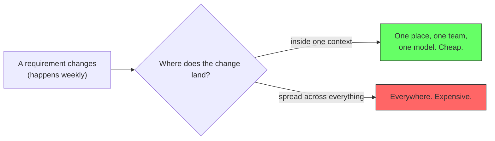

The microservices option is a side effect of this, not the cause. If the boundaries are clean because the code is changeable, then a future split is feasible. If the boundaries are clean only because someone hoped to split later, the code is still changeable now, so the bet was harmless, but it was not the point.

The distinction matters because it changes what you optimize. If you optimize for future splits, you draw boundaries everywhere you *suspect* scale. If you optimize for changeability, you draw boundaries where the *model diverges*: where the same word means different things, where the rules differ, where the owners differ. Those are the seams where changes actually happen.

## What boundaries really give you: containment, not prediction

When someone says "the boundary did not make that change easier," they are usually right, and they are usually measuring the wrong thing. Boundaries do not make *the* change you eventually need easy. No boundary can do that, because you do not know what the change is.

Boundaries make a *class* of changes easy: the changes that stay inside a context. And they make the rest survivable by limiting the blast radius. A stack rewrite of one hot slice is still a big project. But with a boundary, the rewrite touches the Fulfillment context and nothing else. Catalog, Billing, and Identity keep working. That is containment, and it is the actual product of good boundaries.

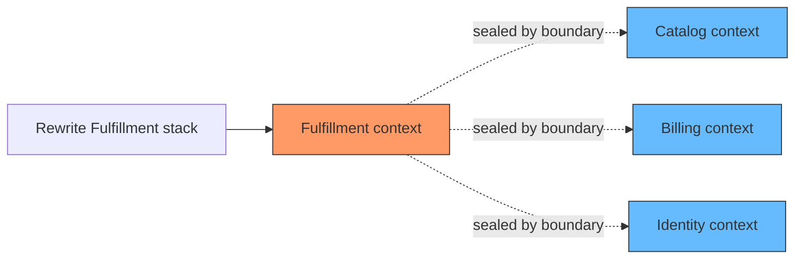

This is insurance, not prediction. You buy insurance against a whole distribution of future changes. You cannot know which claim will arrive, and some claims will be bigger than the policy. But the policy pays out constantly in the present: every change that stays inside a context was cheaper because the boundary existed.

## The real reasons for microservices are organizational, not predictive

It is worth being precise about why microservices exist at all, because it corrects the scaling fantasy. The three classic reasons are independent scaling, independent deployment, and team independence.

Independent scaling is the rarest and the most overrated. Most services never need it. When a system grows, the usual bottleneck is shared and boring, like the database, and no boundary fixes that. The other two reasons are organizational: a team wants to deploy on its own schedule, or two teams cannot share a codebase without stepping on each other. Both are human culture, which is why Fowler (2014) calls culture the dominant boundary driver, not scale.

The unit of these reasons is a *team*, not a capability. A capability is a bundle of use cases; a team is a group of people who need to own something. When the reason to split is organizational, the boundary follows the team. When the reason is scale, it follows the hot use case, which as shown above is often a subset of a capability and therefore a bad place for a stable boundary.

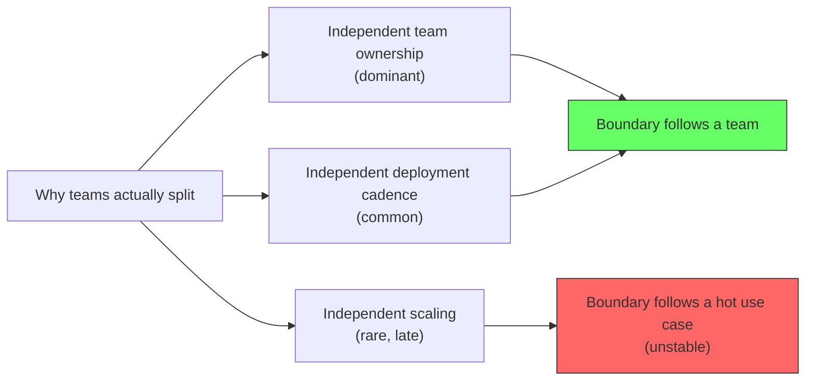

## Ownership: the reason boundaries affect velocity

There is a second strong justification for low coupling that has nothing to do with changeability and everything to do with people. When a piece of code and its data have a clear owner, a group of developers can be assigned to it and work without blocking each other. Two teams editing the same file, the same table, or the same concept cannot move independently. Every change needs coordination, and coordination is where velocity dies.

This is the ownership argument for boundaries. A boundary assigns ownership of data and code. The group that owns a context can change it without asking permission from every other group. They review each other's work, they deploy on their own rhythm, and they are not blocked by a feature landing in an unrelated part of the system.

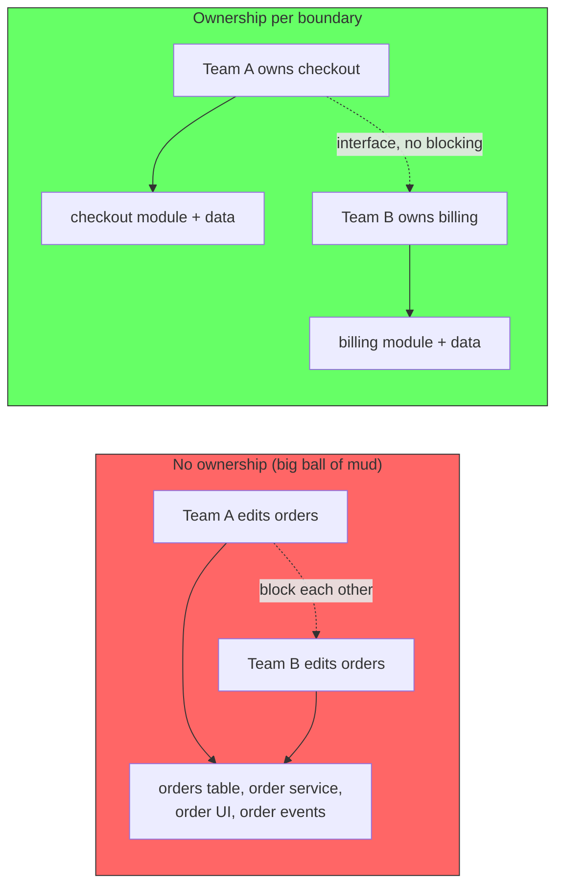

The same reasoning explains the onboarding benefit. In a system with clear boundaries, a new developer does not have to understand the full system before contributing meaningfully. They learn one context, one model, one set of rules, and they can be productive there. Without boundaries, the new developer must absorb the whole domain before their first real change, because every change touches everything.

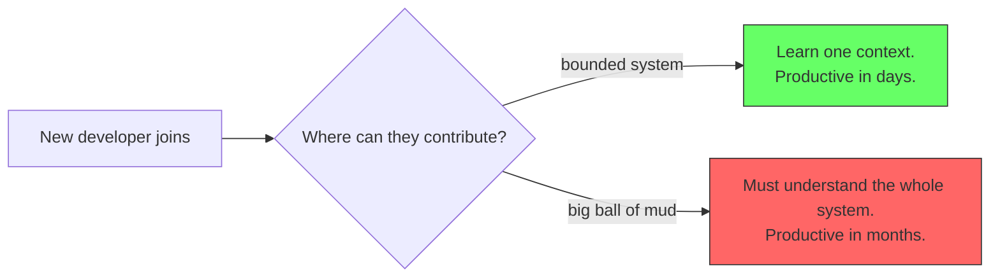

This is why velocity and boundaries are the same story. Velocity is not a property of how fast individual developers type. It is a property of how many things must be coordinated for a change to ship. Boundaries reduce the coordination by giving each change a single owner.

## The knowledge boundary: every feature is a knowledge acquisition

Take the ownership argument one step further, and the boundary question becomes sharper. The unit a team actually manages is not code and not data. It is knowledge: the set of concepts a team must understand to change its part of the system correctly. Every feature a team takes on is an acquisition of knowledge. That knowledge does not leave when the feature ships. It stays, it must be maintained, and every future team member must be onboarded onto it. A team's collective knowledge only grows. It does not shrink on its own.

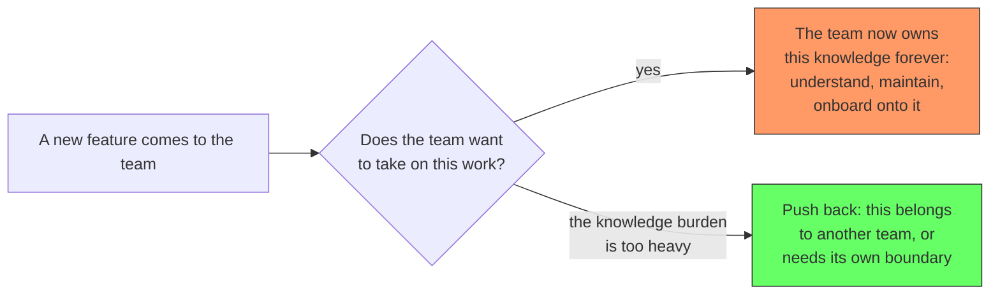

This is the question that almost nobody asks when onboarding a new feature. A developer hears "implement this" and starts building: a controller here, a service there, a repository, a schema. They do not pause to think that the team's collective knowledge is growing, that this new thing will have to be understood by everyone on the team and every person who joins later, and that at some point the team's knowledge capacity is full. The feature is implemented. The knowledge cost is silently accepted.

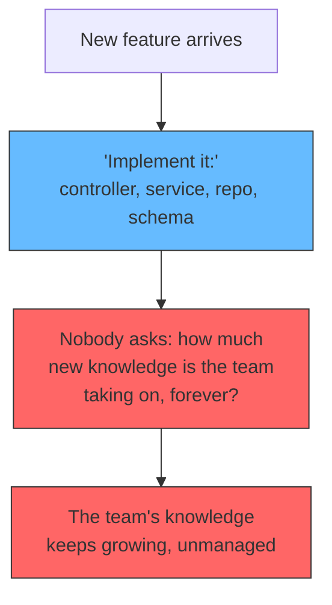

The mechanical pattern that keeps the knowledge boundary in place is the consumer-provider shape. When a team is the consumer of something, it defines the interface it needs. The provider implements that interface, publishes its module, and the consumer imports it and wires it in through dependency injection. The consumer never learns how the provider works internally. The provider never learns how the consumer uses it. Each team carries only the knowledge of its own side plus the small, stable contract in the middle.

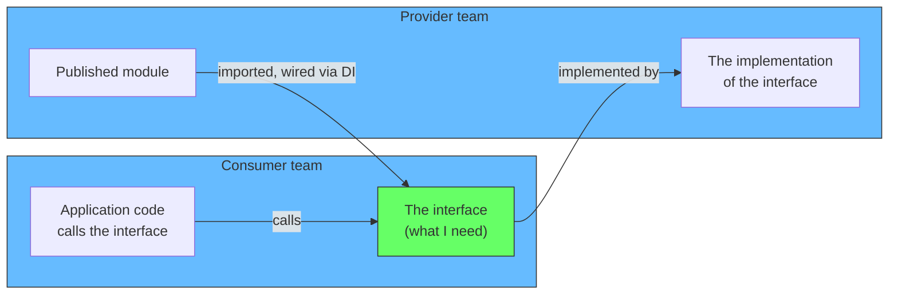

Look at what this actually buys. The team size stays manageable, because no team has to grow to cover a domain that keeps expanding. The knowledge one team has to carry stays manageable, because the contract in the middle is the only thing both sides must understand. Every new feature is then evaluated against the same question: is this adding to our knowledge burden, and do we want that? If the answer is no, the team pushes back, or the feature gets its own boundary and its own team. That decision, made consciously instead of by default, is what keeps a system healthy over years.

```mermaid
graph LR
    BOUNDARY["Where should the boundary be?"] --> ANSWER["Wherever it keeps<br/>team size and team<br/>knowledge manageable"]
    ANSWER --> Q2{"When new work arrives,<br/>does the team accept<br/>the knowledge cost?"}
    Q2 -->|"consciously"| HEALTHY["Knowledge stays<br/>manageable over time"]
    Q2 -->|"by default"| DECAY["Knowledge grows<br/>unmanaged, and the<br/>team slows down"]
    style BOUNDARY fill:#6bf,stroke:#333
    style HEALTHY fill:#6f6,stroke:#333
    style DECAY fill:#f66,stroke:#333
```

So the boundary question has a concrete answer. It is not "where the data divides" or "where the future scale might be." It is where the team's knowledge load stays manageable: small enough that a new person can onboard, stable enough that the knowledge does not keep silently growing, and explicit enough that a team can say no to work it does not want to carry.

## The boundary is not final: a context can become a monolith

Here is the uncomfortable follow-up. Every argument above assumed the boundary stays the right size. It does not. Over the years a context accumulates features. The billing context grows until it is too much for one team to handle, so the team adds people. But adding people to a boundary that has no internal lines does not help. The new people work on the same files, the same tables, the same events. They step on each other. The change becomes slow again. The original problem, the one the boundary was supposed to solve, returns inside the boundary.

```mermaid
graph TD
    START["A correct boundary"] --> GROW["Years of features added"]
    GROW --> TOOBIG["Too much for one team"]
    TOOBIG --> MORE["Add more people to the same boundary"]
    MORE --> NOISE["No internal lines.<br/>People step on each other"]
    NOISE --> SLOW["Change becomes slow again"]
    SLOW --> LOOP["The original problem returns,<br/>one level deeper"]
    style START fill:#6f6,stroke:#333
    style TOOBIG fill:#f96,stroke:#333
    style LOOP fill:#f66,stroke:#333
```

The trap is that more people into one boundary does not create more capacity. It creates more coordination. A boundary with no internal structure can absorb only so many people before the coordination cost cancels the added hands. This is the same curve that killed the original monolith, now playing out inside a single context.

This is why the final architecture does not exist. The product is an evolving thing. Features land, requirements change, and the shape of the domain shifts. The boundaries that were correct at the start stop being correct as the product grows around them. Architecture drift is not an accident that happens to careless teams. It is the default state of any system that is actively being changed. There is a plan needed for this, not an assumption that the boundaries will hold.

### The growth assumption is not universal

The "context becomes a monolith" story assumes a particular dynamic: an organization absorbing new responsibilities into one place until it overflows. That is the startup dynamic, and the product-company dynamic. It is not the corporate dynamic or the government dynamic.

In corporations and government, silos tend to stay the same size. The department boundary exists by organization, and the responsibilities stay assigned to it. A tax department, a licensing department, a procurement department: the scope is set by regulation and charter, not by whatever feature was popular this quarter. The context around such a department does not accumulate unrelated use cases, because the department does not. The growth that drives a context into a monolith simply is not happening at the same rate, or at all.

```mermaid
graph LR
    ORG{"What kind of organization?"} --> STARTUP["Product company / startup<br/>absorbs new responsibilities<br/>fast"]
    ORG --> STABLE["Corporate / government<br/>silos set by charter,<br/>scope stays assigned"]
    STARTUP --> GROWS["Boundary rots,<br/>re-cutting is routine"]
    STABLE --> HOLDS["Boundary holds,<br/>changes are infrequent"]
    style GROWS fill:#f96,stroke:#333
    style HOLDS fill:#6f6,stroke:#333
```

This matters because it changes how much maintenance a boundary needs. In a stable organization, drawing a boundary by department and leaving it is mostly fine, because the department itself is stable. In a fast-moving one, the same assumption fails, because the responsibilities keep moving. The guardrails below should be read with this in mind: their urgency is proportional to how fast the organization is absorbing new responsibilities. A stable context is not a failure to prepare. It is a context that has not been given a reason to change.

## Microservices delay the problem, they do not end it

This is where the "just go to microservices" advice fails. Teams move from monolith to microservices expecting a permanent solution. What they get is a temporary one. A microservice is a bounded context with a network boundary. If a context grows too large inside a monolith, it can grow too large inside a service too. The team working on that service hits exactly the same wall: too many features, too many people, no internal lines, slow changes.

The problem is recursive. A monolith grows, so we split it into services. A service grows, so we split it into smaller services. But nothing changed about the underlying mechanism: a boundary that accumulates features without internal structure eventually slows the team down. The service boundary delayed the problem. It did not remove it.

```mermaid
graph LR
    MONO["Monolith grows"] --> SPLIT1["Split into services"]
    SPLIT1 --> SVC["One service grows"]
    SVC --> SPLIT2["Split again into<br/>smaller services"]
    SPLIT2 --> SMALL["One of those grows"]
    SMALL --> DOTS["..."]
    style MONO fill:#f96,stroke:#333
    style SVC fill:#f96,stroke:#333
    style SMALL fill:#f96,stroke:#333
```

Migration is always there. It is just delayed. The monolith to microservices migration is not the end of a journey. It is the first step of a repeating one. Every boundary, no matter how well drawn, can become a monolith of its own over time, and then it needs to evolve into something else. The honest position is not "draw the boundary and be done." It is "the boundary is a snapshot of the current shape of the domain, and the shape keeps moving."

## Guardrails: what to plan for

If boundaries decay and migration is always pending, the question becomes what to do about it. The answer is not to abandon boundaries. It is to treat them as something that needs maintenance, like any other structure. A few guardrails keep the decay from going unnoticed:

- **Watch the size of the team per context.** When a context needs more people than it can absorb without internal conflict, that is the signal the context is too big, not that the team is too small.
- **Watch the size of the context itself.** When one context accumulates use cases that do not share the same reasons to change, the model divergence the boundary was built on has reappeared inside it. The five checks apply inside a context, not just between them.
- **Re-run the checks on a schedule.** The boundary was justified by divergence at the start. The domain moved. Re-run the checks against the current shape, not the shape you remember.
- **Keep the extraction cheap.** The reason boundaries were worth drawing is that they keep the option of cheap evolution. Do not let that rot: keep interfaces explicit, keep data owned, so that when a context must split or a service must be extracted, it is still a wiring change.

These guardrails do not make the architecture final. Nothing does. They make the decay visible while it is cheap to fix, instead of discovering it after the change velocity has already collapsed.

## The observable signal: velocity over time

The guardrails above are all indicators, but they are indirect. The direct, observable signal is velocity: the rate at which the team ships changes over time. It is measurable, it is tracked anyway, and it is the thing the whole argument is ultimately about. If boundaries make changes cheap, then a healthy system should show a team whose velocity is stable or improving as the team gets better at its own code. If velocity starts to drop, that is the alarm.

```mermaid
graph LR
    TEAM["A team over time"] --> MEASURE["Track velocity:<br/>changes shipped per period"]
    MEASURE --> TREND{"What is the trend?"}
    TREND -->|"stable or up"| HEALTHY["Boundaries are holding.<br/>Nothing to do."]
    TREND -->|"dropping"| INVEST["Investigate the cause"]
    style HEALTHY fill:#6f6,stroke:#333
    style INVEST fill:#f96,stroke:#333
```

A drop in velocity is not by itself a verdict that the system is at fault. It is the start of a diagnosis. The cause has to be found before anything is changed, and the candidates are not all architectural:

- **External blocker.** Another team, a vendor, an approval process is holding the work up. The velocity drop is real but the system is fine.
- **A different reason.** Requirements churn, scope creep, a sudden pile of support work. The work changed, not the code's changeability.
- **A personal reason.** A team member is not performing, is overloaded, or has left a gap. The individual situation changed, not the system.
- **The fault of the system.** The context has grown so large that changes there are hard. This is the only candidate that points back at the boundaries.

```mermaid
graph TD
    DROP["Velocity drops"] --> DIAG{"What is the cause?"}
    DIAG -->|"external blocker"| E["Fix the blocker.<br/>System is fine."]
    DIAG -->|"requirements / support"| R["The work changed,<br/>not the code"]
    DIAG -->|"team member"| P["Fix the people situation.<br/>System is fine."]
    DIAG -->|"context too large"| S["The boundaries are the<br/>problem. Plan the split."]
    style S fill:#f96,stroke:#333
    style E fill:#6f6,stroke:#333
    style R fill:#6bf,stroke:#333
    style P fill:#6bf,stroke:#333
```

Only the last cause points at the architecture. And it only points there after the others are ruled out, because teams are quick to blame the system for what is actually a people or process problem, and vice versa. The diagnostic habit is the guardrail: measure velocity, watch the trend, and when it drops, check the causes in order before re-cutting any boundary. When the context genuinely is the cause, the response is the one this article has been building toward: the team extracts, migrates, and re-cuts while the change is still cheap. Velocity is the only criterion needed, because everything the boundaries are supposed to buy shows up in it.

```mermaid
graph TD
    CONTEXT["A context in production"] --> CHECK{"Does the context still<br/>match its reason to exist?"}
    CHECK -->|"yes"| HOLD["Keep it. Watch size."]
    CHECK -->|"no"| ACTION["Plan the split:<br/>re-cut the boundary,<br/>extract a service"]
    HOLD --> CHECK
    ACTION --> CONTEXT
    style CONTEXT fill:#6bf,stroke:#333
    style ACTION fill:#f96,stroke:#333
```

## What to do instead: draw boundaries where the model diverges

The defensible position is this: boundaries are justified by *model divergence*, not by speculative scale. A context exists where the same word means different things, where the rules differ, where the owners differ. Those are the seams where changes actually happen, so those are the seams that make change cheap.

The five checks from [From Event Storming to Bounded Contexts](/docs/software-engineering/event-storming-read-models-boundaries) identify divergence. Split only when the command, the event, the aggregate attributes, the invariants, or the language differ. If all five match, the two things are variations of one model, and they share a context.

This criterion serves changeability directly. Two aggregates with the same language and rules change together, so they belong together. Two aggregates with different language and rules change for different reasons, so a change in one should not ripple into the other. The boundary is where the reasons to change divide.

```mermaid
graph LR
    SAME["Same command, event,<br/>attributes, rules, language?"] -->|"yes"| ONE["One context.<br/>Changes belong together."]
    SAME -->|"no"| TWO["Two contexts.<br/>Changes stay apart."]
    style ONE fill:#6f6,stroke:#333
    style TWO fill:#f96,stroke:#333
```

The microservices option is then a free rider. Boundaries drawn for changeability happen to preserve the ability to extract. If you never extract, you still benefited from every cheap change along the way. If you do extract, the seams are in the right place because they were drawn at the points where change divides, which is also where a deployable unit should divide.

## The real skill: extracting and migrating on demand

Everything so far has been about boundaries as objects: drawing them, watching them, re-cutting them. There is one more layer to add, and it reframes the whole article. What the business actually needs is not a set of boundaries. It is the *ability* to extract and migrate something independently, on demand, when there is a need.

A boundary is a thing. It can be drawn, and it can rot. The ability to extract is a skill. It lives in the team, not in the code, and it is the thing that actually produces the outcome. If a context needs independent scaling, or a new stack, or a different team, the boundary alone does nothing. Someone has to perform the extraction. That someone needs a repeatable method for moving code, data, and ownership across a boundary, and they need to be able to do it while the system keeps running.

```mermaid
graph TD
    NEED["A concrete need arises:<br/>scale, stack, team, ownership"] --> SKILL{"Does the team have the<br/>extraction skill?"}
    SKILL -->|"yes"| DONE["Extract and migrate<br/>on demand. Done."]
    SKILL -->|"no"| STUCK["Stuck. The boundary is<br/>nice but unusable."]
    style NEED fill:#6bf,stroke:#333
    style DONE fill:#6f6,stroke:#333
    style STUCK fill:#f66,stroke:#333
```

This is why "draw the boundary" was never the solution on its own. It is why the guardrails section listed "keep the extraction cheap" as one item among many, when it should have been the headline. The extraction skill is the mechanism. The boundaries are the precondition that makes the mechanism cheap.

```mermaid
graph LR
    BOUNDARY["Boundary (a thing)<br/>keeps the seam in place"] -->|"precondition"| SKILL2["Extraction skill (a capability)<br/>moves code, data, ownership<br/>across the seam on demand"]
    SKILL2 --> OUTCOME["Independent migration<br/>when the need is real"]
    style BOUNDARY fill:#6bf,stroke:#333
    style SKILL2 fill:#6f6,stroke:#333
    style OUTCOME fill:#6f6,stroke:#333
```

Recognize the separation, because it changes what you invest in. Investing only in boundaries gives you a clean diagram and a team that cannot execute a migration. Investing in the extraction skill gives you a team that can take a tangled system and carve a context out of it, because the skill includes the ability to introduce boundaries where they are missing. The skill is the durable asset. The boundary is where the skill happens to be applied today.

The method for extraction is a separate skill from the one this article covers, but its shape is worth stating so it is recognized as its own thing. It starts with the data: identify what the migrating piece owns, and what it must still reach through an interface. It moves the code: lift the module across the seam without changing its behavior. It keeps the system live: the extraction happens behind a feature that can be rolled back, not as a big-bang rewrite. And it is repeatable: each extraction is practiced until the next one is routine, because as established above, migration is always pending and this will happen again.

There is a simple image that captures the whole position. A bird does not trust the branch it is sitting on. It trusts its wings. The branch can give way at any time, and no bird survives by clinging to it. The wings are what carry the bird when the branch fails, and they are what let it choose a better branch. The system is the branch: it is the current shape of the domain, it can break, and it will stop matching the business. The extraction skill is the wings: it is what lets the team move off the current shape and onto the next one when the need arrives.

```mermaid
graph LR
    BRANCH["The branch (the system)<br/>current shape, will fail<br/>eventually"] -->|"don't cling"| NEED3["A need arrives:<br/>this service is growing,<br/>we must scale it alone"]
    WINGS["The wings (extraction skill)<br/>move code, data, ownership<br/>on demand"] --> NEED3
    NEED3 --> LAND["Migrate: extract, land<br/>on the next branch"]
    style BRANCH fill:#f96,stroke:#333
    style WINGS fill:#6f6,stroke:#333
    style LAND fill:#6f6,stroke:#333
```

This is why the trust goes into the skill and not the architecture. When a service starts getting real traffic and the growth rate says it will need independent scaling soon, the response is not to hope the boundary holds. The response is to perform the migration, using the skill the team practiced. Extract that piece, deploy it independently, and let the rest of the system continue. That is the move. Everything before it, the boundaries, the discipline, the changeability, exists to make that move cheap when it finally has to happen. And that is all there is to the software: a current shape, a skill for changing the shape, and the judgment to know when to do it.

## The resolution

The confusion resolves into a single correction. The modular monolith is not "preparing for microservices." It is being changeable now, with the option value as a side effect.

| Justification | Verdict | Why |
|---|---|---|
| "Boundaries so we can do microservices later" | Weak | The future split rarely respects the boundary you drew. Scale hits subsets, stack changes cut across |
| "Boundaries so a developer and a domain expert share a language" | Strong | This was Evans' actual motivation: one model, one consistent vocabulary, no translation between code and business |
| "Boundaries so changes are cheap today" | Strong | Every change inside a context is cheaper. Realized weekly |
| "Boundaries contain the blast radius" | Strong | A big change is still big, but it stays in one context |
| "Boundaries give ownership and velocity" | Strong | A team owns a context, does not block others, and a new developer learns one context |
| "Boundaries manage the team's knowledge" | Strong | A team's collective knowledge only grows. Every feature is a knowledge acquisition that must be consciously accepted |
| "Boundaries follow the team" | Strong | Team ownership is the dominant reason systems actually split |
| "Boundaries predict which capability scales" | Wrong | You cannot predict it, and the unit is a use case, not a capability |
| "Reserve today's budget for future problems" | Wrong | Tomorrow's problems are shapeless and unfundable. Spend today's budget on today's problems |
| "Provision capacity for imagined growth" | Wrong | A possibility is not a guarantee. Optimize for today's users, the North Star |
| "Boundaries are permanent" | Wrong | The domain moves. A context becomes a monolith, and migration is always pending |
| "Boundaries are the solution" | Half right | Boundaries are the precondition. The solution is the extraction skill that migrates across them on demand |
| "Velocity is the observable signal" | Strong | Track it over time; when it drops, diagnose the cause before touching the architecture |

The modular monolith is not "preparing for microservices." It is being changeable now, with the option value as a side effect. And it is not a final destination. The boundary is a snapshot of the domain's current shape. The domain keeps moving, so the boundaries keep needing to move. Microservices delay that need; they do not end it. The discipline that makes boundaries worth drawing is the discipline that notices when they stop matching the domain and re-cuts them while the change is still cheap.

And the boundary is not the point. The point is the ability to extract and migrate independently when there is a need. Boundaries make that ability cheap. The ability makes the outcome real. A team that can extract on demand does not need perfect boundaries, because it can fix them as it goes. A team that cannot extract does not benefit from perfect boundaries, because it cannot use them.

Every one of these justifications passed the framing test: it translates into a benefit a team or a business feels, and it is stated as an outcome, not as an appeal to authority. The weak justifications failed the same test, because "maybe a future split will use this" is a cost today for a benefit that may never arrive.

The strongest justification is also the original one. Evans built Bounded Contexts so developers and domain experts could speak the same language, not so the architecture could be future-proofed. That motivation survives every objection in this article, because communication is not a bet on the future. It is a benefit realized every day.

```mermaid
graph TD
    GOAL["Why boundaries?"] --> Q{"What is the justification?"}
    Q -->|"'So we can split later'"| WEAK["Weak: you are betting<br/>on an unpredictable future"]
    Q -->|"'So changes are cheap now'"| STRONG["Strong: containment,<br/>changeability, team ownership"]
    STRONG --> F["Free rider: the split<br/>stays feasible"]
    STRONG --> G["Guardrail: watch the context,<br/>re-cut when it stops matching"]
    style WEAK fill:#f66,stroke:#333
    style STRONG fill:#6f6,stroke:#333
    style F fill:#6bf,stroke:#333
    style G fill:#6bf,stroke:#333
```

## Summary

High cohesion and low coupling exist so the code is easy to change. The common justification for them, "so we can extract microservices later," does not survive scrutiny, because the future split rarely matches the boundary you drew. The justifications that survive are present tense: boundaries make changes cheap today, contain the blast radius when a change is large, and give a team clear ownership of code and data, which is what velocity and fast onboarding are really made of.

The filter for every one of these decisions is the framing test: translate the principle into a concrete benefit, and if it will not translate, drop it. High cohesion means a developer knows one context; low coupling is what lets them get away with that; and the business pays for the faster onboarding and cheaper changes that result. That is the whole translation, and it is the only framing that survives. And spend today's budget on today's problems: the future's budget will arrive with the future's problems, and not a moment before.

Hold the North Star. Optimize for delivering today, to today's users. Do not provision capacity for imagined growth, because a possibility is not a guarantee. The preparation that is worth doing is the cheap kind that keeps the future feasible. Everything else is paying today's capacity for a bet that may never land.

And the observable signal is velocity. Watch it over time. When it drops, diagnose in order: external blocker, a change in the work, a team member, and only then the system. When the context is genuinely the cause, re-cut it while the change is still cheap. Velocity is the only criterion needed, because everything the boundaries are supposed to buy shows up in it.

The deepest framing of all comes from Evans himself. Boundaries exist first as a boundary of language, so a developer and a domain expert point at the same word and mean the same thing. Everything structural, from changeability to cheap migration, is a consequence of that communication. Not the other way around.

And the boundary is a boundary of knowledge. A team's collective knowledge only grows, so every feature it takes on is a knowledge acquisition it must consciously accept. The question to ask on every new piece of work is not "can I implement this?" It is "do we want to carry this knowledge?" That is what keeps team size and team knowledge manageable, which is the real reason boundaries exist.

Draw boundaries where the model diverges, not where you suspect future scale. Let the microservices option be what it is: a side effect of changeable code, not a reason for it.

And hold the boundaries loosely. A context accumulates features until it becomes a monolith of its own, and then it needs to evolve. Migration is always there, just delayed. The plan is not "draw the boundary and be done." The plan is to watch the context, notice when it stops matching the domain, and re-cut it while the change is still cheap.

And recognize the solution for what it is. The solution is not the boundary, and it is not the microservices. The solution is the skill of extracting and migrating something independently when there is a need. Boundaries are the precondition that keeps the extraction cheap. The skill is the thing that actually moves the code, the data, and the ownership. Invest in the skill, because it is the durable asset: it survives every boundary that rots, and it is what turns a need into an outcome.

The bird trusts its wings, not the branch. Do the same: trust the team's ability to migrate, not the current architecture. The branch will fail eventually. The wings are what carry you to the next one.

### References

- Evans, E. (2003). *Domain-Driven Design: Tackling Complexity in the Heart of Software*. Addison-Wesley. Chapter 14 — Bounded contexts as the mechanism that keeps a model internally consistent
- Fowler, M. (2014). *BoundedContext*. martinfowler.com. https://martinfowler.com/bliki/BoundedContext.html — "To be effective, a model needs to be unified... so that there are no contradictions within it." Culture is the dominant boundary driver
- Jovanovic, M. (2026). *Bounded Context in DDD: How to Define Boundaries*. milanjovanovic.tech. — Signals for boundary detection: language, data, rules, organizational boundaries
- Newman, S. (2021). *Building Microservices: Designing Fine-Grained Systems*. 2nd ed. O'Reilly. — Team ownership and independent deployment as the reasons services exist
