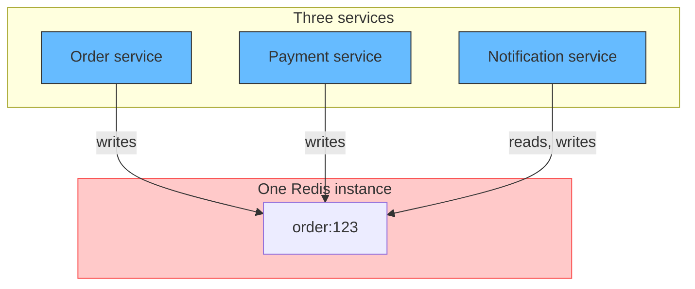
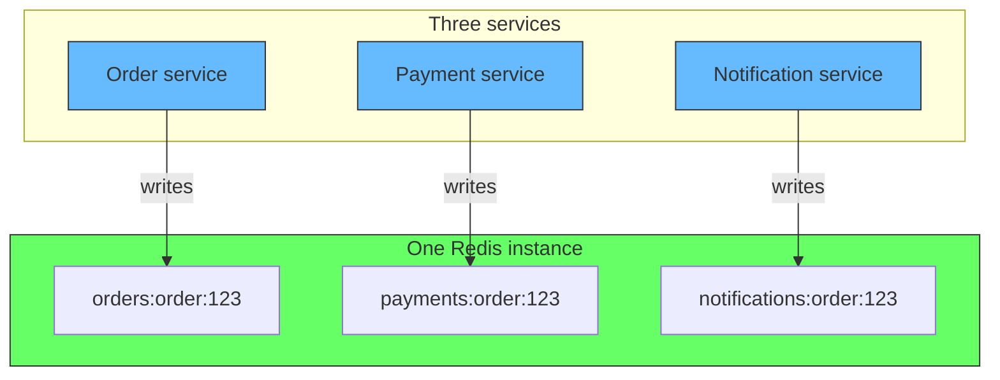
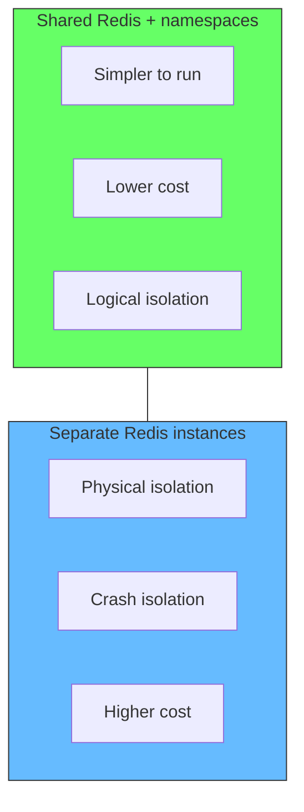
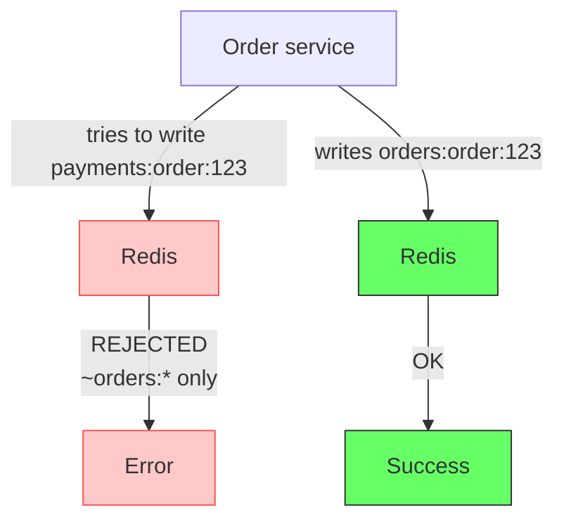
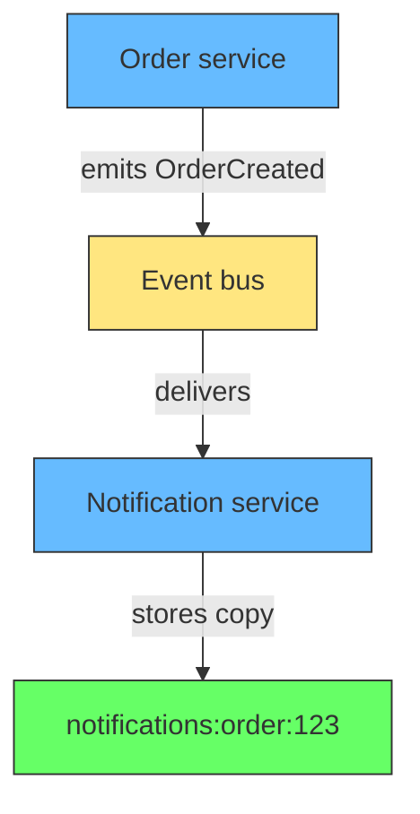
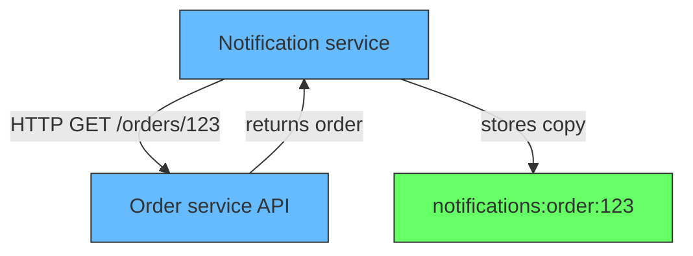

# Data Ownership in Redis

## The problem: shared Redis, no ownership

Three services share one Redis instance. The order service writes `order:123`. The payment service writes `order:123` to attach a payment reference. The notification service reads `order:123` to build an email. One day, the notification service overwrites `order:123` with stale data. The order service reads it back and ships the wrong item.



The problem is not Redis. Redis does not know or care who writes to which key. The problem is that nothing in the system enforces who owns what. Any client with the connection string can write to any key.

This is the same problem databases solve with schemas and permissions. Redis does not have schemas. It has key patterns and access control lists.

## The solution: namespace your keys

Give each service a prefix. The order service owns `orders:*`. The payment service owns `payments:*`. The notification service owns `notifications:*`. No service writes to another service's namespace.

<div style={{display: 'flex', justifyContent: 'center'}}>



</div>

The key pattern is `{service}:{entity}:{id}`. The order service writes `orders:order:123`. The payment service writes `payments:order:123` (its own view of the same order). The notification service writes `notifications:order:123`. Each service owns its keys. No service touches another's namespace.

## Why not just use different Redis instances?

You can. But the question is whether the operational cost is worth it. One Redis instance serving three services is simpler to run, monitor, and scale. The namespace pattern gives you ownership without the overhead.

The tradeoff is isolation. A separate Redis instance gives you physical isolation: a crash in one service's Redis does not affect the others. A shared Redis with namespaces gives you logical isolation: the services share infrastructure but do not touch each other's data.



Start with namespaces. Move to separate instances when you have a concrete reason: different scaling needs, different availability requirements, or compliance.

## Enforcing ownership with Redis ACLs

Redis 6+ has access control lists. You can restrict a client to only its namespace.

```
# Order service can only touch keys starting with orders:
ACL SETUSER order-service on >password ~orders:* +get +set +del +expire

# Payment service can only touch keys starting with payments:
ACL SETUSER payment-service on >password ~payments:* +get +set +del +expire

# Notification service can only touch keys starting with notifications:
ACL SETUSER notification-service on >password ~notifications:* +get +set +del +expire
```

The `~orders:*` pattern restricts the client to keys matching that glob. If the order service tries to write `payments:order:123`, Redis rejects it.

<div style={{display: 'flex', justifyContent: 'center'}}>



</div>

ACLs are enforcement. Namespaces are convention. You need both: convention for clarity, enforcement for safety.

## Cross-service reads

Sometimes a service needs data from another service's namespace. The notification service needs order details to build an email. Two options:

**Option 1: Copy the data.** The order service emits an event. The notification service stores its own copy in `notifications:order:123`. Each service owns its copy. The notification service never reads from `orders:*`.



**Option 2: Read through an API.** The notification service calls the order service's API to get order details. No direct Redis access across namespaces.



Both options preserve ownership. The notification service never writes to or reads from `orders:*` directly.

## The key naming pattern

Use this structure:

```
{service}:{entity}:{id}
```

Examples:

| Service | Key | Value |
|---|---|---|
| Order | `orders:order:123` | `{status: "created", items: [...]}` |
| Payment | `payments:order:123` | `{amount: 99.99, method: "card"}` |
| Notification | `notifications:order:123` | `{email: "...", sent: true}` |
| Cart | `carts:user:456` | `{items: [...], total: 49.99}` |
| Session | `sessions:token:abc` | `{user_id: 456, expires: ...}` |

Each service owns its prefix. The entity name (`order`, `user`, `token`) makes the key readable. The ID links it to the business object.

## Related

- [Bounded Contexts](bounded-contexts.md) - why services need separate data ownership
- [When Events Are Events and When They Are Not](events-are-discovery-not-code.md) - how services communicate across ownership boundaries
- [Transactions Outside the Aggregate](transactions-outside-aggregate.md) - what happens when you need consistency across service boundaries
