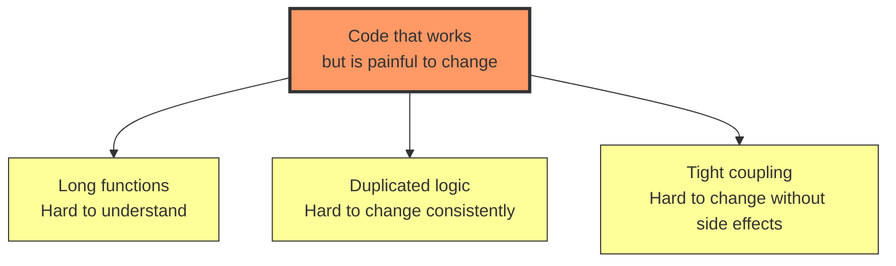
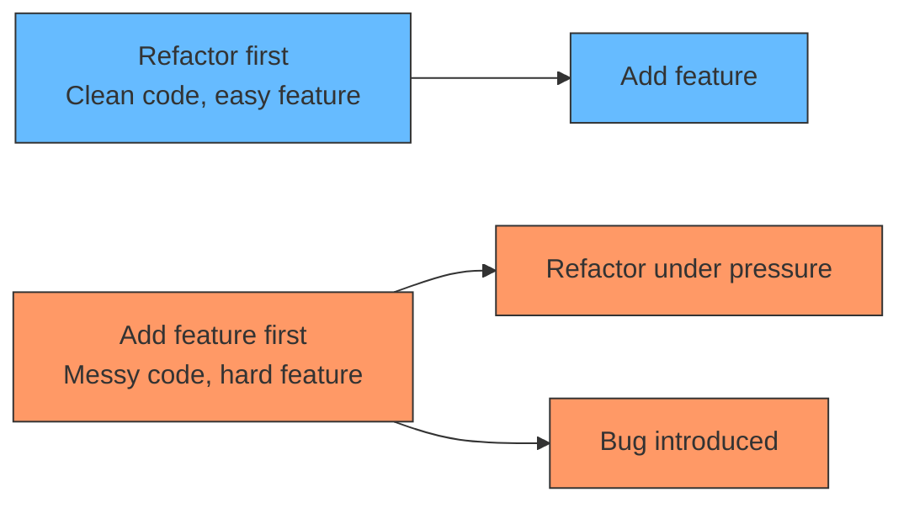

# Refactoring

## The problem: code that works but is painful to change

A feature request arrives. It is small. "Two more filter options on the orders page." The estimate should be one day. It turns into three, because adding the filter means touching a 900-line function, updating a switch statement someone forgot to update last time, copying a block of validation logic, and hoping nothing else breaks.

The code works. Tests pass. It is correct today. It is also expensive to change, and every change makes it worse. This is the real problem refactoring solves: not broken code, but code whose cost of change keeps rising.

Workable code decays in three ways at once:

<div style={{display: 'flex', justifyContent: 'center'}}>



</div>

**Long functions:** a 500-line function does ten things. You cannot hold it in your head. You cannot test one thing without the others. You cannot change one thing without risking the others.

**Duplicated logic:** the same validation appears in three places. You fix it in one, miss the other two, and now the system behaves differently depending on which path the user takes.

**Tight coupling:** changing the order module requires changing the payment module. They are not related by business logic. They are related by code that reaches into each other's internals.

## The rule: refactor before you add, not after

Most teams refactor after the pain is unbearable. The code is already slow, already fragile, already hard to change. Refactoring under pressure is risky. You rush. You miss edge cases. You break things.

The better habit: refactor *before* you add the feature. When the code is clean, the feature is easy to add. When the code is messy, the feature is hard to add, and you make the code messier by adding it.

<div style={{display: 'flex', justifyContent: 'center'}}>



</div>

## The three types of refactoring

### Extract function

The long function does ten things. Extract each thing into its own function. The original function becomes a sequence of named steps. Each step is testable. Each step is understandable.

```typescript
// Before: 200-line function that does everything
function processOrder(order: Order) {
  // 50 lines of validation
  // 30 lines of inventory check
  // 40 lines of payment processing
  // 30 lines of shipping calculation
  // 50 lines of email notification
}

// After: each thing is its own function
function processOrder(order: Order) {
  validateOrder(order);
  checkInventory(order);
  processPayment(order);
  calculateShipping(order);
  sendNotification(order);
}
```

Each function is small, named, and testable. The original function is now a readable sequence of steps.

### Extract module

The duplicated logic appears in three places. Extract it into a module. The three places now call the module. When the logic changes, you change it in one place.

```typescript
// Before: validation logic in three places
function createOrder(data: OrderData) {
  if (data.items.length === 0) throw new Error("No items");
  if (data.total < 0) throw new Error("Negative total");
  // ...
}

function updateOrder(id: string, data: OrderData) {
  if (data.items.length === 0) throw new Error("No items");
  if (data.total < 0) throw new Error("Negative total");
  // ...
}

// After: validation in one place
function validateOrderData(data: OrderData) {
  if (data.items.length === 0) throw new Error("No items");
  if (data.total < 0) throw new Error("Negative total");
}

function createOrder(data: OrderData) {
  validateOrderData(data);
  // ...
}

function updateOrder(id: string, data: OrderData) {
  validateOrderData(data);
  // ...
}
```

One place to change. One place to test. One source of truth.

### Break coupling

The order module reaches into the payment module's internals. They are tightly coupled. Break the coupling by introducing an interface. The order module depends on the interface, not the payment module's implementation.

```typescript
// Before: order reaches into payment internals
class Order {
  process() {
    const payment = new Payment();
    payment.charge(this.total); // direct dependency
    payment.sendReceipt(this.customerEmail); // reaches into payment
  }
}

// After: order depends on interface
interface PaymentProcessor {
  charge(amount: number): void;
}

class Order {
  constructor(private payment: PaymentProcessor) {}

  process() {
    this.payment.charge(this.total);
  }
}
```

The order module no longer knows about the payment module's internals. It depends on an interface. The payment module implements the interface. Changing one does not require changing the other.

## When to refactor

**Before adding a feature.** If the code is messy, clean it first. The feature will be easier to add.

**Before fixing a bug.** If the code is hard to understand, you will miss the bug. Clean it first. The bug will be easier to find.

**When the pain is small.** Refactoring a 100-line function is easy. Refactoring a 1000-line function is hard. Do it early, before the pain grows.

**When you understand the code.** Refactoring code you do not understand is risky. Understand it first. Then refactor.

## When not to refactor

**When you are about to delete the code.** If the code is going away, do not waste time cleaning it.

**When the deadline is tomorrow.** Refactoring under pressure is risky. Ship the feature. Refactor later, when you have time.

**When you do not understand the code.** Refactoring code you do not understand will introduce bugs. Get help first.

## The relationship to DDD

Refactoring and DDD are complementary. DDD tells you where the boundaries should be. Refactoring tells you how to get there.

When you discover a new bounded context through event storming, you need to refactor the code to match the new boundary. When you discover that two modules are tightly coupled, you need to break the coupling. When you discover that a function is doing too much, you need to extract it.

The DDD boundary is the destination. Refactoring is the path.

## Summary

- Refactoring solves the problem of code whose cost of change keeps rising.
- The three types of decay: long functions, duplicated logic, tight coupling.
- Refactor before you add, not after.
- Refactor when the pain is small, not when it is unbearable.
- DDD tells you where the boundaries should be. Refactoring tells you how to get there.
