# Refactoring

## The problem: code that works but is painful to change

A feature request arrives. It is small. "Two more filter options on the orders page." The estimate should be one day. It turns into three, because adding the filter means touching a 900-line function, updating a switch statement someone forgot to update last time, copying a block of validation logic, and hoping nothing else breaks.

The code works. Tests pass. It is correct today. It is also expensive to change, and every change makes it worse. This is the real problem refactoring solves: not broken code, but code whose cost of change keeps rising.

Workable code decays in three ways at once:

<div style={{display: 'flex', justifyContent: 'center'}}>

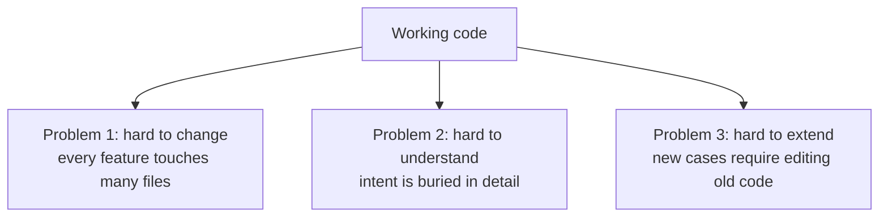

</div>

## What refactoring is

Refactoring is restructuring existing code without changing its observable behavior. The outcome of a refactor is the same program, better organized. You do not add a feature, fix a bug, or change output. You change the structure, and only the structure.

The definition has three parts and every part matters.

| Part | What it means |
|---|---|
| Restructuring | Moving code, renaming things, splitting functions, changing how pieces connect |
| Existing code | You only refactor code that already works. Greenfield code does not need refactoring; it needs writing |
| No behavior change | The inputs and outputs stay identical. Tests must keep passing |

<div style={{display: 'flex', justifyContent: 'center'}}>

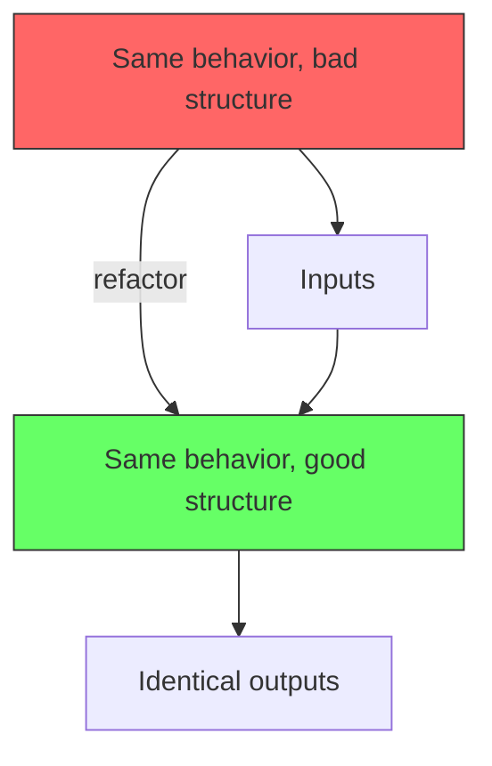

</div>

## Refactoring is not a feature, and it is not a rewrite

Refactoring sits between two things it is constantly confused with.

- **Adding a feature** changes behavior. New behavior, by definition. Refactoring changes none.
- **Rewriting** changes everything. A rewrite throws away the structure and often the behavior contract too. Refactoring preserves both.

The tension is practical. When a function needs a new parameter for a feature, you refactor the function signature first (no behavior change), then add the feature (behavior change). Both activities happen in the same session, which is why teams blur them into one mush. Keeping them distinct is the discipline that makes refactoring safe.

<div style={{display: 'flex', justifyContent: 'center'}}>

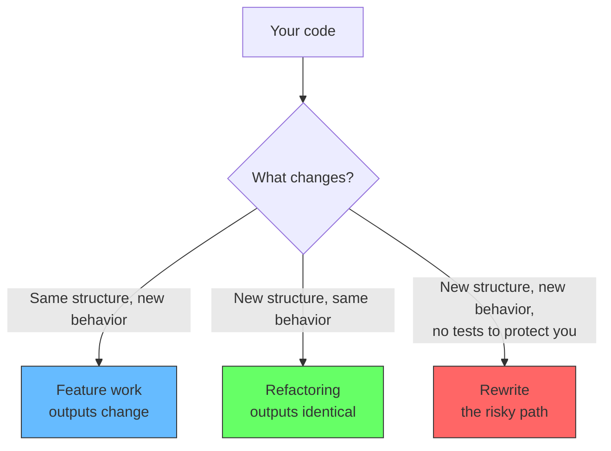

</div>

## Why the distinction matters

The whole safety of refactoring comes from the no-behavior-change promise. If something goes wrong, the cause is the refactor itself, not the feature riding on top. You can debug, revert, or bisect confidently.

When refactoring and feature work are interleaved, you lose that guarantee. A test fails. Is it the refactor or the feature? You cannot see a clean line between the two changes, so you debug both at once.

The practical rule: each change is one activity. Commit the refactor alone. Run the tests. Then commit the feature on top. If the second commit breaks, the refactor is exonerated. This is cheap insurance and it costs nothing but a commit message.

<div style={{display: 'flex', justifyContent: 'center'}}>

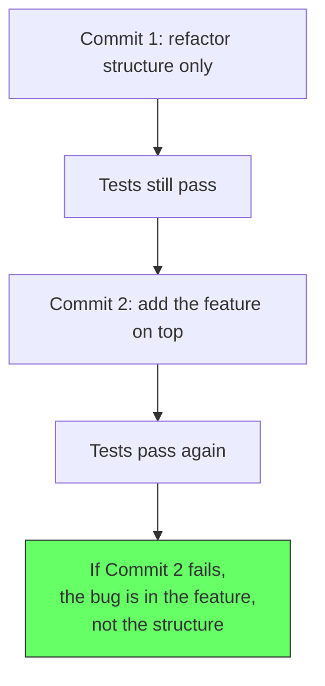

</div>

## When to refactor

### The signal: cost of change is climbing

You spot the problem when a small task demands an outsized amount of effort. The diagnosis is subjective but the pattern is not. Watch for these symptoms.

| Smell | What it looks like |
|---|---|
| Duplicated logic | The same validation in four places, edited separately |
| Long functions | 300-line functions that need a scroll to read |
| Shotgun changes | Adding one field touches ten files |
| Leaky abstractions | Callers know about implementation details they should not |
| Parallel inheritance | A change to one class forces changes in every subclass |
| Feature envy | One class constantly pokes at another's data |
| Conditional sprawl | Switch statements on a type that should be polymorphism |
| Dead code | Branches nobody can prove are still reachable |

Each smell is a small tax you pay at every future edit. Individually they are annoying. Accumulated, they are why estimates drift from one day to three.

### The pattern: red, green, refactor

Refactoring slots into the same rhythm as TDD.

1. **Red.** Write a test that fails because the feature does not exist. This is the only step that creates something new.
2. **Green.** Write the simplest code that makes it pass. Structure at this stage can be ugly. That is fine.
3. **Refactor.** With the test green, restructure the code. The test is your evidence that behavior did not change.

<div style={{display: 'flex', justifyContent: 'center'}}>

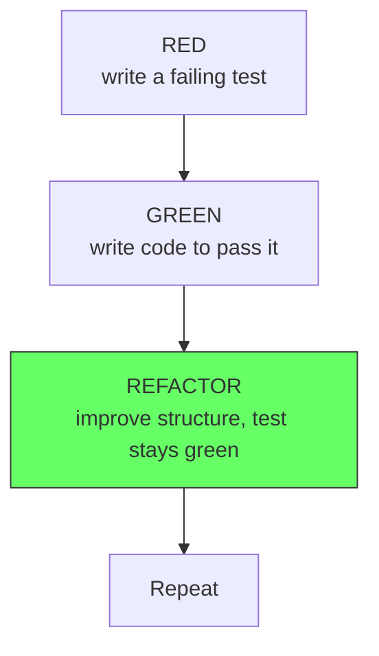

</div>

The test provides the safety net. Without it, step three is guesswork: you cannot tell if you preserved behavior or quietly broke it.

## The role of tests

Refactoring without tests is walking on ice. The no-behavior-change promise is only checkable if something checks it. Tests are that check.

Good refactoring relies on characterization tests: tests that capture the current behavior, correct or not, so you can prove it survives the refactor. If the current behavior contains a bug, the characterization test encodes the bug. You fix the bug later, separately, as a behavior change.

The depth of the net matters. Unit tests cover functions and classes. Integration tests cover how modules cooperate. Characterizing the exact shape of the net is worth its own article, but the principle is: you need enough tests to state with confidence that the structure changed and nothing else did.

<div style={{display: 'flex', justifyContent: 'center'}}>

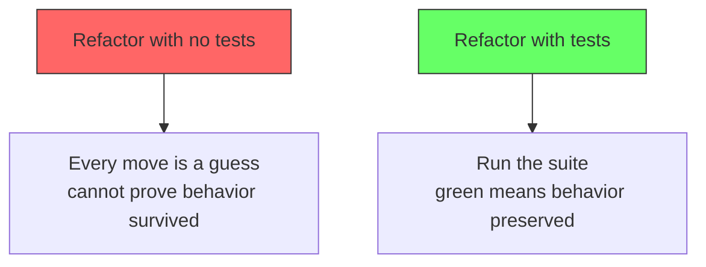

</div>

## The method: small steps

Every refactoring technique is a small, mechanical step that preserves behavior. You compose many small steps into a large improvement. The discipline is the step size. A refactor is not one giant move; it is fifty tiny ones, each individually reversible.

The workflow is:

1. Pick a tiny transformation. Rename this variable. Extract this block into a function. Split this class.
2. Apply it.
3. Run the tests. Green means the step was safe. Red means you made a behavioral change, so you undo and look again.
4. Repeat.

<div style={{display: 'flex', justifyContent: 'center'}}>

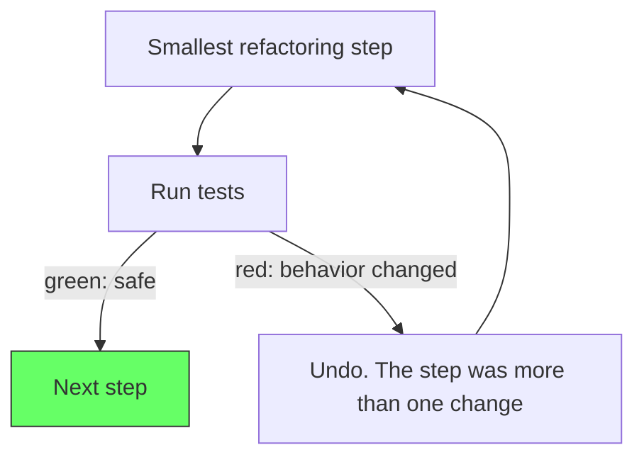

</div>

Two properties make this work.

**The transformation is mechanical.** IDEs automate the common ones. Rename symbol, extract method, extract variable, change signature, move class. Each maps to a key command. A machine can do them, which means you can trust them.

**The change can be reverted.** Small steps mean the blast radius of a mistake is one step. You never find yourself stuck in a half-finished mega-refactor you cannot unwind, because you never started one.

## Common refactoring techniques

### Rename

The cheapest refactor and the one with the highest payoff. Compilers do not care what a function is called; readers do. A name that reveals intent removes a document's worth of guessing.

```python
# Before
def d(x, y):
    return (x * y) / 100

# After
def calculate_discount(price, discount_percent):
    return (price * discount_percent) / 100
```

### Extract function

A long function hides which parts belong together. Extract a block, give it a name, and the block becomes a concept.

```python
# Before
def process_order(order):
    if order.total > 100 and order.customer.tier == "vip":
        order.total = order.total * 0.9
    ...
    # 80 more lines

# After
def process_order(order):
    apply_vip_discount(order)
    ...

def apply_vip_discount(order):
    if order.total > 100 and order.customer.tier == "vip":
        order.total = order.total * 0.9
```

<div style={{display: 'flex', justifyContent: 'center'}}>

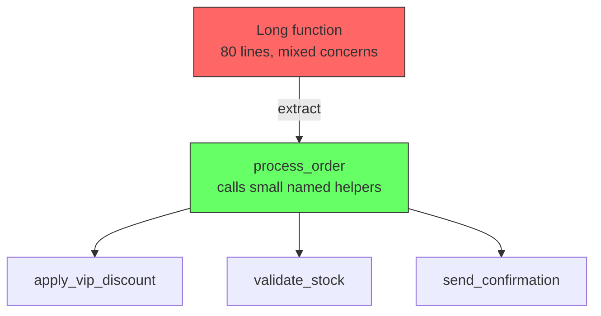

</div>

### Replace magic numbers

A bare literal carries no meaning. Name it.

```javascript
// Before
if (attempts > 3) { lockAccount(user) }

// After
const MAX_LOGIN_ATTEMPTS = 3
if (attempts > MAX_LOGIN_ATTEMPTS) { lockAccount(user) }
```

### Replace conditional with polymorphism

A type switch scattered across the system means every new type edits every switch. Introducing an interface moves the variation into the type itself, and new types arrive without touching existing code.

```python
# Before
def calculate_tax(order_type, amount):
    if order_type == "food":
        return amount * 0.0
    elif order_type == "book":
        return amount * 0.0
    elif order_type == "service":
        return amount * 0.18
```

```python
# After
class Service:
    def tax_rate(self):
        return 0.18

class Food:
    def tax_rate(self):
        return 0.0

def calculate_tax(item, amount):
    return amount * item.tax_rate()
```

<div style={{display: 'flex', justifyContent: 'center'}}>

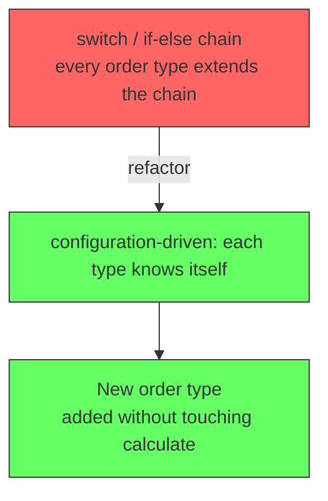

</div>

## Refactoring is code, but it is not the same as adding features

The workflow difference is real and worth internalizing.

During a refactor, the codebase must compile and pass tests at every commit. Refactoring is a series of green states. If you cannot name the exact behavior you preserved, you are not refactoring, you are rewriting. Rewrites are sometimes correct. They are never safe. This is why teams that "refactor" without a net end up with a two-week outage and a resolve never to touch the code again.

<div style={{display: 'flex', justifyContent: 'center'}}>

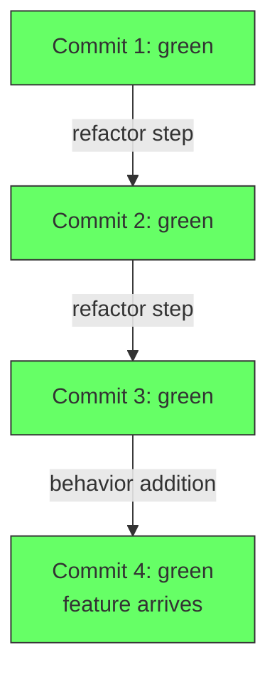

</div>

## When NOT to refactor

Refactoring has a cost. Sometimes it is not worth paying.

**Do not refactor code that is being replaced.** A subsystem on a deprecation path should be deleted, not beautified. Polish on a corpse is waste.

**Do not refactor untested code you do not understand.** Without tests you have no net. Without understanding you have no target. Two missing elements, one operation.

**Do not refactor during a crunch.** The pressure to finish fast encourages skipping the test run and batching steps, which is exactly how a safe activity becomes a risky one. Refactoring requires slack.

**Do not refactor the wrong thing.** Performance hot spots should be profiled, not guessed. A presumed bottleneck you refactor out of intuition is a decision you made without data.

<div style={{display: 'flex', justifyContent: 'center'}}>

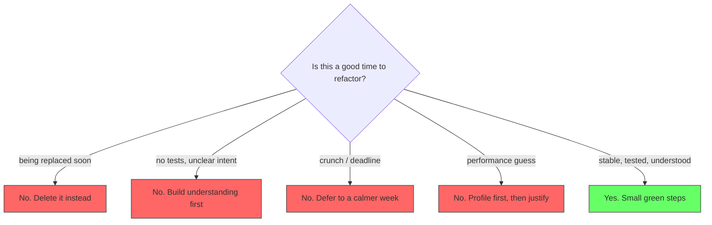

</div>

## The habit

Refactoring is not a project that ends. It is a maintenance discipline, like brushing teeth. The best codebases are not the ones that were designed perfectly once; they are the ones where small improvements land every week, so the structure never gets the chance to rot.

The scout rule applies: leave the code better than you found it. When you are in a method to fix a bug, rename the confusing variable while you are there. When you are adding a feature, extract the duplicated block you just copied. Each act is minutes of work that, done on every trip into the code, keeps the cost of change low forever.

<div style={{display: 'flex', justifyContent: 'center'}}>

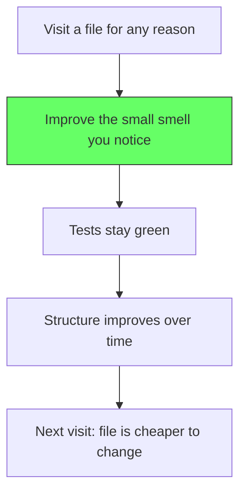

</div>

## Summary

| Refactoring is | Refactoring is not |
|---|---|
| Restructuring existing code | Adding new behavior |
| Keeping behavior identical | Fixing bugs (a separate activity) |
| Many small, tested, reversible steps | One giant rewrite |
| Guarded by tests | Done in the dark without a net |
| A continuous habit | A one-time cleanup project |

Refactoring exists because code rots. Features pile on, names drift, functions bloat, and the cost of every future change grows. The counter-move is small: restructure without changing behavior, prove it with tests, repeat. Teams who master the small steps never fear their own code enough to stop changing it, and that is the real prize. Code that is cheap to change stays alive.