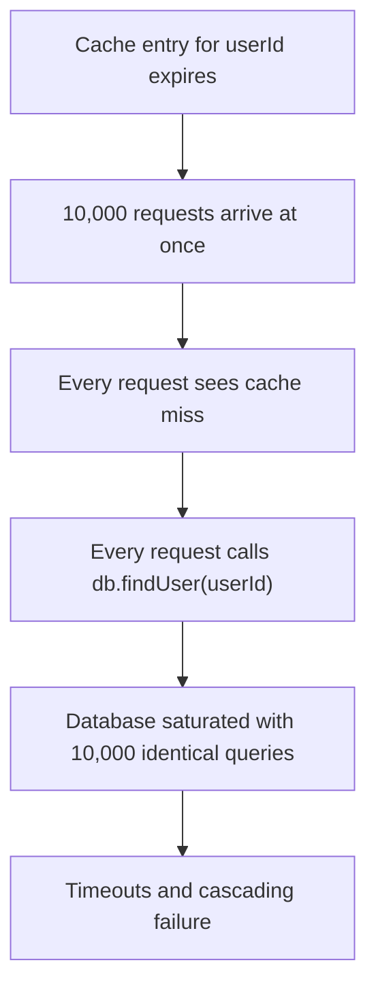
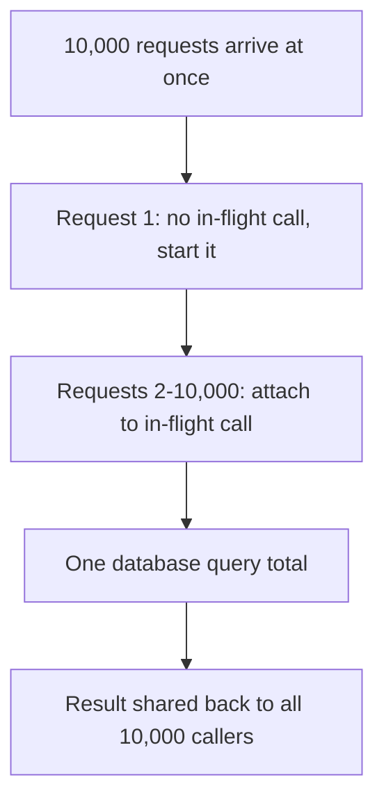
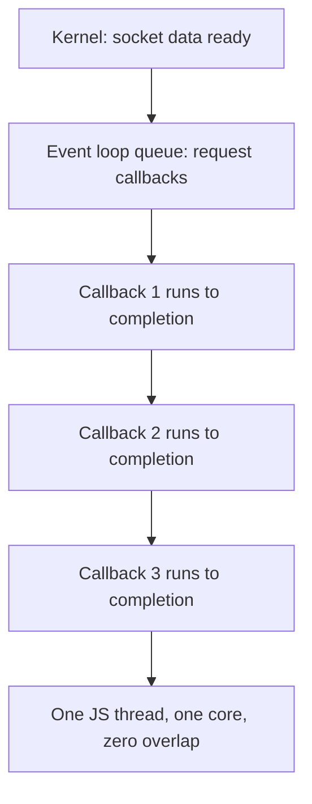
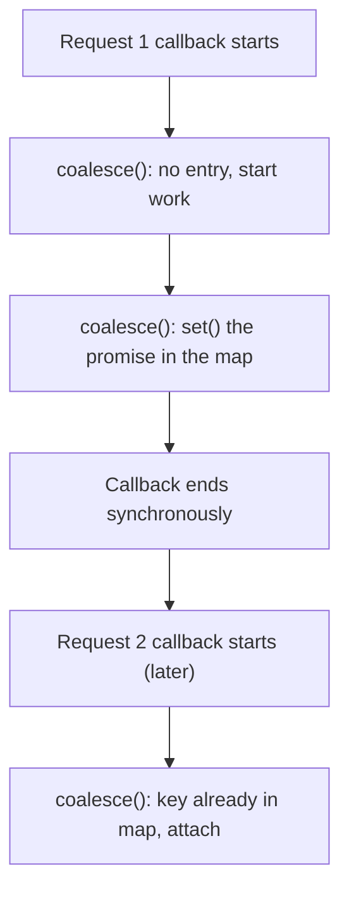
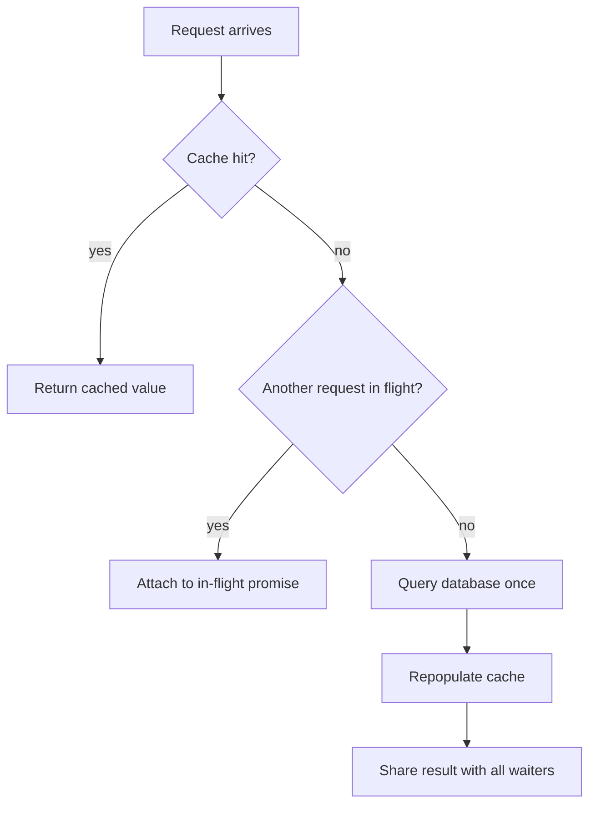
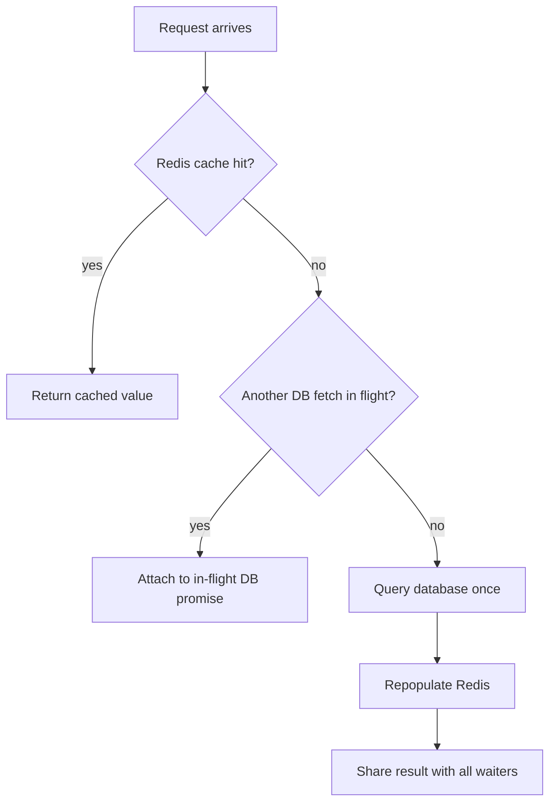

# Request Coalescing: Turning a Stampede into a Single Call

## The problem: the cache expires and everyone hits the database

The code below looks harmless. Read a user from cache. If missing, read from the database and repopulate the cache.

```js
function getUser(userId) {
  const user = cache.get(userId);
  if (user == null) {
    const dbUser = db.findUser(userId);
    cache.set(userId, dbUser);
    return dbUser;
  }
  return user;
}
```

The failure is not in any single request. It is in what happens when the cache entry expires and 10,000 requests for the same user arrive at the same instant. Every one of them sees `null`, every one of them fires the identical database query. This is called a **cache stampede** (or thundering herd). The database was already hot, which is exactly why the cache was added. Now it absorbs a burst of duplicate work at the worst possible moment, and the surge can cascade into timeouts and an outage.

<div style={{display: 'flex', justifyContent: 'center'}}>



</div>

The query itself is cheap. The problem is its volume arriving in a single synchronized burst. Request coalescing removes that burst by guaranteeing that no matter how many requests race for the same data, only one of them ever reaches the source of truth.

## The solution: share one in-flight promise across all callers

Request coalescing (also known as singleflight, after the Go standard library package that popularized it) does one thing: when several identical operations are already in flight, a new caller does not start a second one. It attaches itself to the one already running and waits for its result.

<div style={{display: 'flex', justifyContent: 'center'}}>



</div>

The implementation keeps a map of keys to pending promises. When a key is not in the map, the caller starts the real work, stores its promise, and clears the entry when it settles. When a key is already present, the caller simply awaits the stored promise.

```ts
class RequestCoalescer {
  private inFlight = new Map<string, Promise<unknown>>();

  coalesce<T>(key: string, fn: () => Promise<T>): Promise<T> {
    const existing = this.inFlight.get(key);
    if (existing) return existing as Promise<T>;

    const promise = fn().finally(() => {
      this.inFlight.delete(key);
    });
    this.inFlight.set(key, promise);
    return promise;
  }
}
```

The important detail is the `.finally()`: the entry must be removed whether the operation succeeds or fails. A leaked entry means future calls forever attach to a settled promise and never refetch. A key that errors should be cleaned up so the next caller retries instead of inheriting a cached failure forever.

```js
// With coalescing: one query for all 10,000 callers
const user = await coalescer.coalesce(`users:${userId}`, () => fetchUser(userId));
```

## A runnable version you can verify yourself

The pattern is easy to dismiss until you watch it work. This is a complete, minimal NestJS service that simulates a 100 ms database query with a counter, and exposes one coalesced route. The counter is the proof: it counts real "database calls", so you can see exactly how many a burst of requests produces.

```ts
// user.service.ts
@Injectable()
export class UserService {
  private dbCalls = 0;
  private inFlight = new Map<string, Promise<{id: number}>>();

  private async simulateDbCall(userId: number): Promise<{id: number}> {
    this.dbCalls++;
    await new Promise((resolve) => setTimeout(resolve, 100));
    return {id: userId};
  }

  async findUser(userId: number): Promise<{id: number}> {
    const key = `users:${userId}`;
    const existing = this.inFlight.get(key);
    if (existing) return existing;
    const promise = this.simulateDbCall(userId).finally(() => this.inFlight.delete(key));
    this.inFlight.set(key, promise);
    return promise;
  }
}
```

```ts
// user.controller.ts
@Controller('user')
export class UserController {
  constructor(private readonly users: UserService) {}

  @Get(':id')
  find(@Param('id') id: string) {
    return this.users.findUser(Number(id));
  }
}
```

Fire 400 requests at the same user in a single instant and read the counter. It reports 1. Fire the same 400 at a *different* user on every request and it reports 400, because no two requests share a key and nothing overlaps.

```js
// load-test.mjs - fire N requests at the same instant, then read the counter
const N = 400;
await Promise.all(
  Array.from({length: N}, () =>
    fetch('http://localhost:3100/user/42').then((r) => r.json()),
  ),
);
const {dbCalls} = await fetch('http://localhost:3100/db-call-count').then((r) => r.json());
console.log(`${N} simultaneous requests -> ${dbCalls} database calls`);
// prints: 400 simultaneous requests -> 1 database call
```

The counter is the entire lesson. Every request that attaches to the shared promise costs nothing on the database. Only the request that starts the work pays.

## Single core, single thread: why exactly one promise is created

The mechanism works because of how Node runs on one core, not in spite of it. A Node process is one OS process running one JavaScript thread. The OS may schedule that thread on a single core at any moment. There is no parallelism in user code: two handlers can never be executing their JavaScript at the same instant. They take turns.

That turn-taking happens on the **event loop**. Incoming requests arrive over sockets; the kernel watches them and notifies Node when data is ready. Node does not sit and wait. It runs the callbacks already in its queue, one at a time, each to completion, and only then picks the next one.

<div style={{display: 'flex', justifyContent: 'center'}}>



</div>

This serial execution is what guarantees the single promise. When request 1's callback runs, it calls `coalesce()`, which synchronously starts the database call, stores its promise in the map, and returns. Only after that whole callback finishes does the event loop start request 2's callback. By then the entry exists, so request 2 attaches to the stored promise instead of calling `simulateDbCall` again. It cannot race ahead of request 1, because it literally does not run until request 1 has finished.

Two levels of promise exist, and the single thread is why the cheap ones never reach the database:

- **The caller promise** - one per request, created in the handler. Cheap: it says "give me the result when it is ready."
- **The shared promise** - one per key, the actual `simulateDbCall` call, stored in the map.

All 10,000 handlers create a caller promise and return it to the framework. But only the first handler's `simulateDbCall` promise fires a database call. The other 9,999 handlers get handed the *same* shared promise and await it. One database query total.

The sharpest way to state it: **Node's single thread is not a limitation here, it is the guarantee.** A language with true parallel threads would need a lock to make the map check-then-insert atomic. Node never needs the lock, because only one callback runs at a time, and the whole check-and-insert happens inside that single synchronous window.

## Why it works: the map write is synchronous

The single-threaded event loop is what makes this pattern safe. Each HTTP request runs as its own callback, and the event loop executes each callback to completion before starting the next one. Inside that synchronous run, `coalesce()` does its map lookup and `set()` *before* the handler ever awaits anything. So by the time request 1's callback finishes, the entry is already parked in the map. Request 2's callback runs later, finds the key, and attaches.

<div style={{display: 'flex', justifyContent: 'center'}}>



</div>

The crucial detail: `coalesce()` contains no `await` between the map lookup and the map write. If it did, a later request could run while the entry does not exist yet, and the stampede would slip through. The synchronous write is what guarantees that once any caller is mid-flight, every later caller sees it.

## The timing window: only overlapping requests merge

Coalescing merges requests that are in flight *at the same time*. A request that arrives after the shared promise has settled starts a new call. So the number of database calls is not always one. It is bounded by how the requests arrive in time:

- **A true stampede** - all requests land within the same latency window. Result: one database call.
- **Spread-out traffic** - requests keep arriving after each call settles. Result: roughly one call per latency window, not one call total.

Measured against a real server (NestJS, simulated 100 ms database query):

| Load pattern | Requests | Database calls |
|---|---|---|
| No coalescing | 10,000 | 10,000 |
| 10,000 spread over ~5.5 s (200 at a time) | 10,000 | ~63 |
| 400 fired in the same instant | 400 | 1 |
| 1,000 fired in the same instant | 1,000 | 1 |

The rule to internalize: coalescing replaces the request count with roughly the burst duration divided by the latency window. Under a genuine cache stampede, where everything arrives in the same instant, that collapses to one.

## Keying: the collision trap

Because the service holding the map is typically a singleton, every caller in the process shares the same `inFlight` map. Two different operations that use identical keys will silently share each other's work. That produces correct results only by accident, and stale or wrong results when the two operations are semantically different.

The fix is domain-specific keys. The key must uniquely describe the request, not just the raw ID.

```ts
// UserService
coalesce(`users:${userId}`, () => fetchUser(userId));

// OrderService
coalesce(`orders:${orderId}`, () => fetchOrder(orderId));
```

Using the bare `userId` in both places would collapse two unrelated operations into one. The `users:` and `orders:` prefixes make the key unique to its domain. If you prefer hard isolation, give each service its own coalescer instance instead of sharing one.

## Where coalescing fits next to the cache

Request coalescing and caching are complementary, not alternatives. The cache smooths out repeats over time. Coalescing smooths out the duplicates that arrive at the same moment, which is exactly the window the cache cannot cover, the instant after expiration.

<div style={{display: 'flex', justifyContent: 'center'}}>



</div>

A layered read path checks the cache first, then coalesces the misses, so even under a stampede the database sees exactly one query per distinct key. The techniques reinforce each other: coalescing makes the cache's weakest moment safe, and the cache keeps coalescing from ever being needed on the happy path.

## What about Redis? Same mechanism, smaller window

A Redis call from Node is the same kind of I/O as a database call. It is async, the event loop sends the command and waits on the socket, and a callback fires when the response arrives. Coalescing works identically: one in-flight promise in the map, one `GET` command sent, every late caller attaching to the stored promise.

Two things change the calculus, though.

**Redis is itself single-threaded.** Redis executes commands serially on one main thread. Without coalescing, 10,000 identical `GET`s still arrive as 10,000 network round trips and are processed one at a time. Coalescing cuts that to a single round trip. The saving is real, but the server at the end was never the bottleneck.

**The timing window is much smaller.** Coalescing merges requests that overlap while the promise is in flight. A database query takes ~100 ms, a big window for latecomers to attach. A Redis `GET` takes sub-millisecond to a few milliseconds, so the overlap window is tiny. Requests that arrive just after the promise settles start a new call. Under a true simultaneous stampede it still collapses to one call, but traffic spread over even a few milliseconds produces many more Redis calls than a slow query would. Coalescing wins, just with a smaller reduction ratio against fast backends.

The decision rule:

| Coalesce against | Worth it? | Why |
|---|---|---|
| Database, after a cache miss | Yes | the ~100 ms query is the stampede target |
| Redis repopulation (compute + write) | Yes, if compute is expensive | prevents duplicate work on a cache miss |
| Raw Redis `GET` | Usually not | already sub-ms; tiny window to overlap |

The reason the first row matters most: Redis is usually the *cache*, not the source of truth. The expensive work in a stampede is the database fetch that follows a Redis miss. The canonical pattern keeps Redis on the fast path and coalesces what sits behind it.

<div style={{display: 'flex', justifyContent: 'center'}}>



</div>

Coalescing against Redis itself matters mainly when a burst of misses would each recompute and rewrite the same value, so one request does the work and the rest wait for it. Coalesce the source of truth, and treat Redis as the fast cache in front of it.

## The mental model

Request coalescing is not about making any single request faster. It is about making the worst case bounded: no matter how many requests collide, the work happens once and the result is broadcast. The three things to get right are sharing the promise, using keys that uniquely describe the operation, and cleaning up entries in both the success and failure paths.

The one nuance to keep straight: coalescing merges requests that overlap in time. A true stampede collapses to a single call; spread-out traffic gets one call per latency window. Either way the database load is bounded by time, not by request count, which is the entire point.

## Related

- [Caching, Messaging & Search](/docs/software-engineering/caching-messaging-search)
