# Sagas: Managing Transactions That Span Multiple Services

## The problem: a transaction that crosses service boundaries

Imagine an e-commerce application built as microservices. Customers have a credit limit. The application must make sure a new order never exceeds that limit.

<div style={{display: 'flex', justifyContent: 'center'}}>

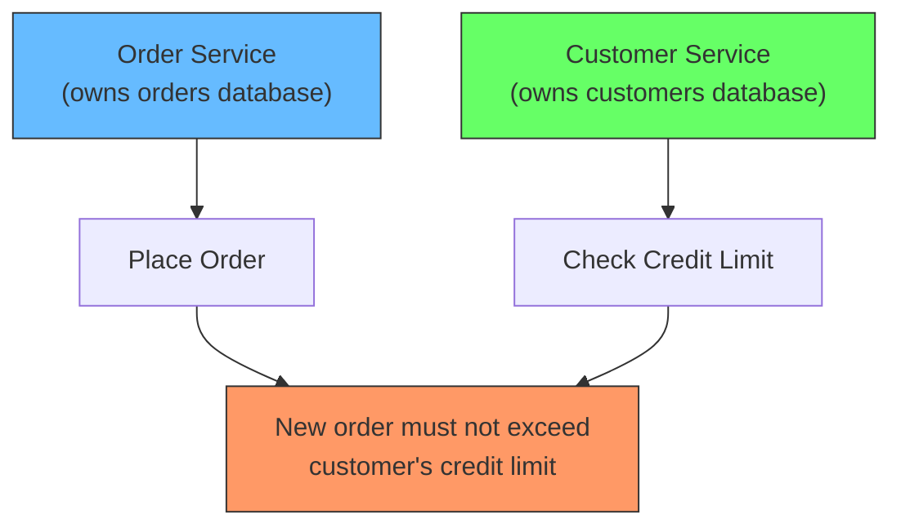


</div>


The order lives in the Order Service's database. The credit limit lives in the Customer Service's database. A single business transaction, "create order within credit limit", touches two databases that belong to two different services. This is the situation that Chris Richardson describes as the context for the saga pattern:

> "You have applied the Database per Service pattern. Each service has its own database. Some business transactions, however, span multiple service so you need a mechanism to implement transactions that span services."

With a monolithic application, one database, and ACID transactions, this is trivial. The database guarantees atomicity: either both the order and the credit reservation commit, or neither does. Once you split data across service-owned databases, that guarantee disappears.

The problem, stated as the question the saga pattern answers: **how do you implement a transaction that spans multiple services?**

## Why the obvious answer fails: two-phase commit

The textbook way to make a transaction span multiple databases is the two-phase commit protocol (2PC). A coordinator asks every participant to prepare, and once all participants agree, it tells them all to commit.

<div style={{display: 'flex', justifyContent: 'center'}}>

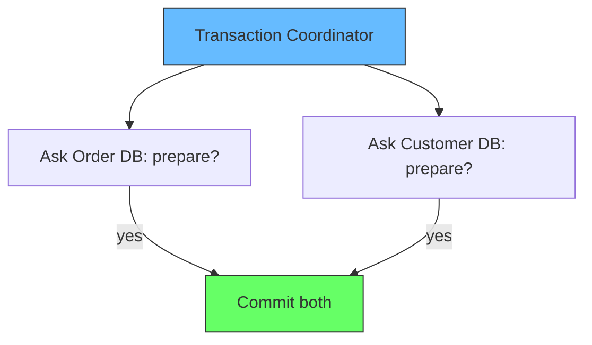


</div>


2PC works inside one organization's data center, over databases you control. It fails in a microservice architecture because:

- **It is synchronous and blocking.** Every participant holds locks on data while waiting for the coordinator. A slow service blocks everyone.
- **It requires a shared transaction manager.** Each service has its own database and usually its own team. Coordinating their transaction managers couples them together, violating the service autonomy that microservices exist to provide.
- **It does not survive network partitions well.** If the coordinator dies after some participants committed, the system can be stuck deciding what to do.

Richardson lists the force bluntly: **"2PC is not an option."** The alternative that handles this is the saga.

## The solution: a saga is a sequence of local transactions

A saga is not a distributed transaction. It is a sequence of local transactions, where each local transaction is a normal ACID transaction inside a single service.

<div style={{display: 'flex', justifyContent: 'center'}}>

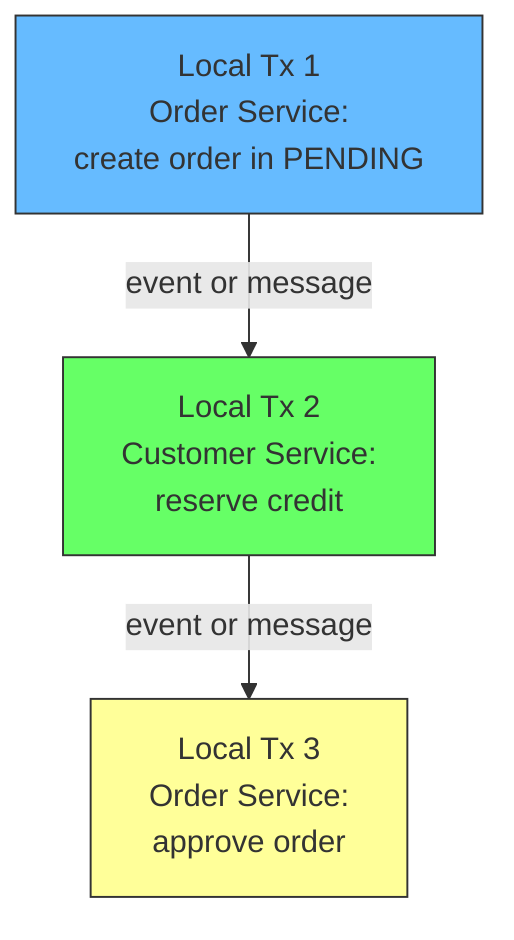


</div>


Each local transaction:

1. Completes its own work atomically inside one service.
2. Updates that service's database.
3. Publishes a message or event that triggers the next local transaction in the saga.

There is no global ACID guarantee. Each step commits independently. This is the defining trade: you give up atomicity across services and instead accept eventual consistency, coordinated by a chain of triggered steps.

The concept comes from a 1987 paper by Hector Garcia-Molina and Kenneth Salem called simply *SAGAS*. They proposed sagas as a way to manage long-lived transactions in database systems, where holding locks for the full duration of a business workflow was unacceptable. A saga, in their definition, was a collection of transactions that can be interleaved, where each transaction can be compensated if a later one fails. The paper's key move was introducing the *compensating transaction*: an explicit, business-level action that undoes the effect of a previous step. The idea was rediscovered by the microservices world because the same constraints (no long-held locks, operations that span multiple stores) apply there.

<div style={{display: 'flex', justifyContent: 'center'}}>

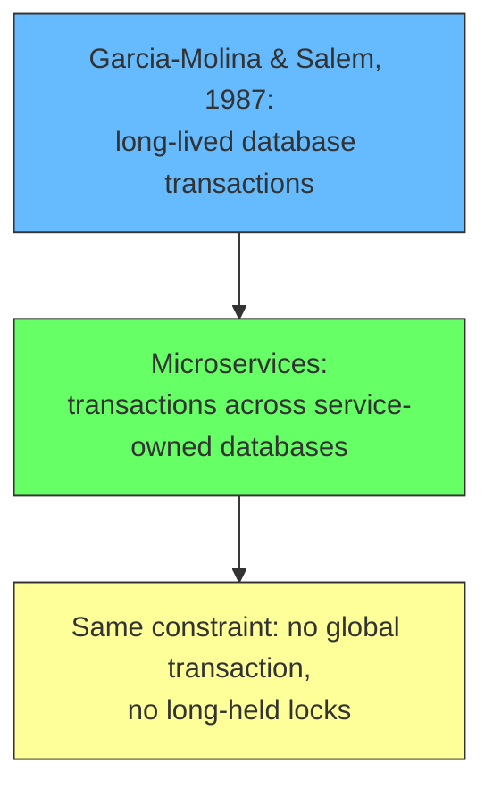


</div>


## Compensation: undoing work without a rollback

In an ACID transaction, a failed transaction rolls back automatically. The database forgets the partially applied work.

A saga cannot do that. Each step already committed to its own database. If step 5 fails, steps 1 through 4 are already committed and durable. The only way to "undo" them is to run compensating transactions that reverse their business effect.

<div style={{display: 'flex', justifyContent: 'center'}}>

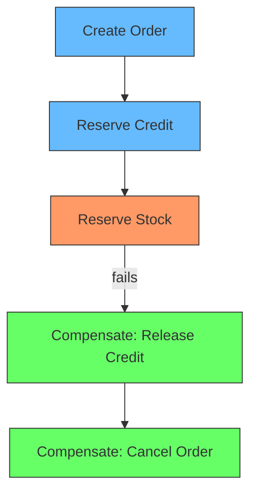


</div>


The compensation for "Reserve Credit" is "Release Credit". The compensation for "Create Order" is "Cancel Order". These are normal business operations, not a database rollback. That is the key difference from ACID: **compensation is explicit, business-level, and must be designed by the developer.**

Richardson is explicit about this cost:

> "This solution has the following drawbacks: lack of automatic rollback - a developer must design compensating transactions that explicitly undo changes made earlier in a saga rather than relying on the automatic rollback feature of ACID transactions."

Not every step needs a compensation. Azure's architecture guidance classifies saga steps into three kinds:

- **Compensable transactions** can be undone by a transaction with the opposite effect.
- **Pivot transactions** are the point of no return. Once the pivot succeeds, compensating is no longer possible; everything after it must succeed for the saga to reach a consistent state.
- **Retryable transactions** come after the pivot. They are idempotent, meaning repeating them does not change the outcome, so temporary failures can be recovered by retrying.

<div style={{display: 'flex', justifyContent: 'center'}}>

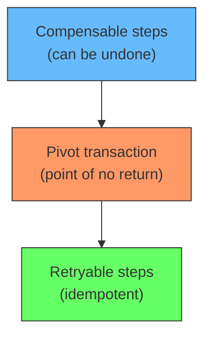


</div>


The Azure documentation says:

> "Compensating transactions might not always succeed, which can leave the system in an inconsistent state."

So a well-designed saga treats compensation as something that itself can fail, and plans for retries and monitoring around it.

## Two ways to coordinate a saga

A saga is just the sequence. You still need to decide who decides what the next step is. There are two standard approaches: **choreography** and **orchestration**. Chris Richardson names both:

> "There are two ways of coordination sagas: Choreography - each local transaction publishes domain events that trigger local transactions in other services. Orchestration - an orchestrator (object) tells the participants what local transactions to execute."

### Choreography: no central controller

In choreography, every service is autonomous. Each local transaction publishes a domain event. Other services listen for events they care about and run their own local transaction in response, publishing their own event when done. Control flows from service to service like a dance.

The classic example is creating an order. The choreography-based saga for an e-commerce site, based on Richardson's example:

<div style={{display: 'flex', justifyContent: 'center'}}>

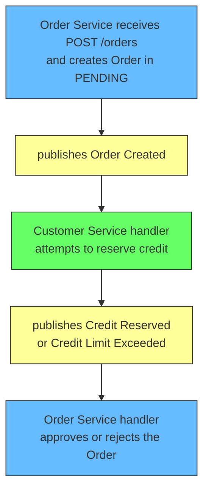


</div>


There is no coordinator. The Order Service and the Customer Service each react to events and publish their own. If the customer's credit is insufficient, the Customer Service publishes an event that leads to the order being rejected, and compensation runs if needed.

A choreographed saga in code looks like two services that each have an event handler. The Order Service side:

```java
public class OrderService {

    public void createOrder(Order order) {
        order.setState(OrderState.PENDING);
        orderRepository.save(order);              // Local transaction 1
        eventPublisher.publish(new OrderCreated(order.getId(), order.getCustomerId()));
    }

    public void onCreditReserved(CreditReserved event) {
        Order order = orderRepository.find(event.getOrderId());
        order.setState(OrderState.APPROVED);
        orderRepository.save(order);              // Approve the order
    }

    public void onCreditLimitExceeded(CreditLimitExceeded event) {
        Order order = orderRepository.find(event.getOrderId());
        order.setState(OrderState.REJECTED);
        orderRepository.save(order);              // Reject: no further steps
    }
}
```

The Customer Service side:

```java
public class CustomerService {

    public void onOrderCreated(OrderCreated event) {
        Customer customer = customerRepository.find(event.getCustomerId());
        if (customer.canReserveCredit(event.getOrderId())) {
            customer.reserveCredit(event.getOrderId());
            customerRepository.save(customer);    // Local transaction 2
            eventPublisher.publish(new CreditReserved(event.getOrderId()));
        } else {
            eventPublisher.publish(new CreditLimitExceeded(event.getOrderId()));
        }
    }
}
```

Notice each method is a complete, local, ACID transaction: read, decide, save, publish. No step is ever partially applied inside a service.

Azure summarizes the trade-offs of choreography in a table:

| Benefits | Drawbacks |
| --- | --- |
| Good for simple workflows with few services that don't need coordination logic | Workflow can be confusing when you add new steps; hard to track which commands each participant responds to |
| No other service is required for coordination | Risk of cyclic dependency between participants because they consume each other's commands |
| No single point of failure; responsibility is distributed | Integration testing is difficult because all services must run to simulate a transaction |

### Orchestration: a central controller

In orchestration, one component, the orchestrator, owns the saga. It decides what each participant must do, sends each participant a command, and waits for a reply. The participants are dumb: they run the requested local transaction and reply with the outcome. The orchestrator keeps the saga's state and decides whether to continue, compensate, or finish.

The same create-order example, orchestrated:

<div style={{display: 'flex', justifyContent: 'center'}}>

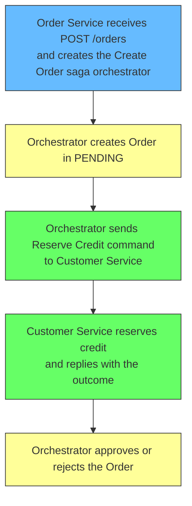


</div>


The difference from choreography is visible in the arrows. In choreography the services publish events to each other. In orchestration the orchestrator sends commands and receives replies. The participants never talk to each other directly.

A minimal orchestrator in code:

```java
public class CreateOrderSaga implements Saga {

    public void start(Order order) {
        order.setState(OrderState.PENDING);
        orderRepository.save(order);
        send(new ReserveCreditCommand(order.getId(), order.getCustomerId(), order.getTotal()));
    }

    public void handle(Reply reply) {
        if (reply instanceof CreditReserved) {
            order.setState(OrderState.APPROVED);
            orderRepository.save(order);
            sagaCompleted();
        } else if (reply instanceof CreditLimitExceeded) {
            order.setState(OrderState.REJECTED);
            orderRepository.save(order);
            sagaFailed();
        }
    }
}
```

The participants simply implement command handlers:

```java
public class CustomerService {
    public Reply reserveCredit(ReserveCreditCommand command) {
        Customer customer = customerRepository.find(command.getCustomerId());
        if (customer.canReserveCredit(command.getOrderId())) {
            customer.reserveCredit(command.getOrderId());
            customerRepository.save(customer);
            return new CreditReserved(command.getOrderId());
        }
        return new CreditLimitExceeded(command.getOrderId());
    }
}
```

Azure's table for orchestration:

| Benefits | Drawbacks |
| --- | --- |
| Better suited for complex workflows or when you add new services | Other design complexity requires implementing coordination logic |
| Avoids cyclic dependencies because the orchestrator manages the flow | Introduces a point of failure because the orchestrator manages the whole workflow |
| Clear separation of responsibilities simplifies service logic | |

## Choreography vs orchestration: how to choose

Both approaches implement the same saga. The difference is where the logic of "what happens next" lives.

- **Choreography** distributes that logic across every participant. Each service knows what event to react to and what event to publish. This is great for simple, linear flows with few services. It breaks down when the flow gets complicated, because no single place shows the whole workflow, and adding a step means editing multiple services.
- **Orchestration** concentrates that logic in one orchestrator. The whole saga is visible in one place, which makes it easy to understand, change, and test. The cost is a new component, which is itself a potential single point of failure, and the risk that the orchestrator becomes a god object that knows everything.

<div style={{display: 'flex', justifyContent: 'center'}}>

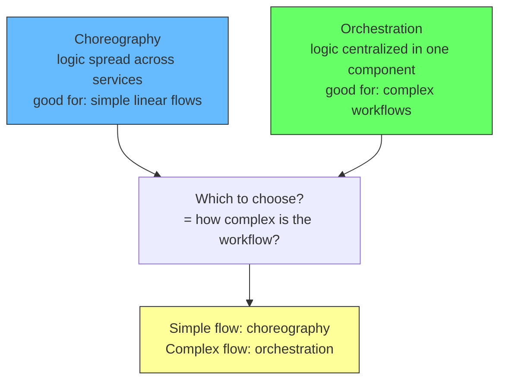


</div>


In practice, most teams start with choreography for a two-service flow and move to orchestration as the number of participants and branches grows. Richardson's guidance in *Microservices Patterns* is that orchestration is generally easier to manage for anything beyond a handful of steps, because the flow is explicit and the orchestrator can be tested in isolation.

## The lost "I": why sagas have no isolation

ACID stands for atomicity, consistency, isolation, durability. A saga keeps consistency (each local transaction is consistent), durability (each local transaction is committed durably), and a form of atomicity at the business level (compensation returns the system to a consistent state). It drops isolation: the "I" in ACID.

Isolation means concurrent transactions do not interfere. In a saga, the intermediate state between local transactions is visible to other sagas and other business operations. Two sagas running at the same time can interfere with each other in ways a single ACID transaction could not.

Richardson flags this directly:

> "Lack of isolation (the 'I' in ACID) - the lack of isolation means that there's risk that the concurrent execution of multiple sagas and transactions can use data anomalies. consequently, a saga developer must typical use countermeasures."

Azure names the specific data anomalies that can appear:

- **Lost updates:** one saga overwrites a change made by another saga.
- **Dirty reads:** a saga reads data that another saga has modified but not finished changing.
- **Fuzzy, or nonrepeatable, reads:** different steps of the same saga read inconsistent data because another saga updated it between the two reads.

<div style={{display: 'flex', justifyContent: 'center'}}>

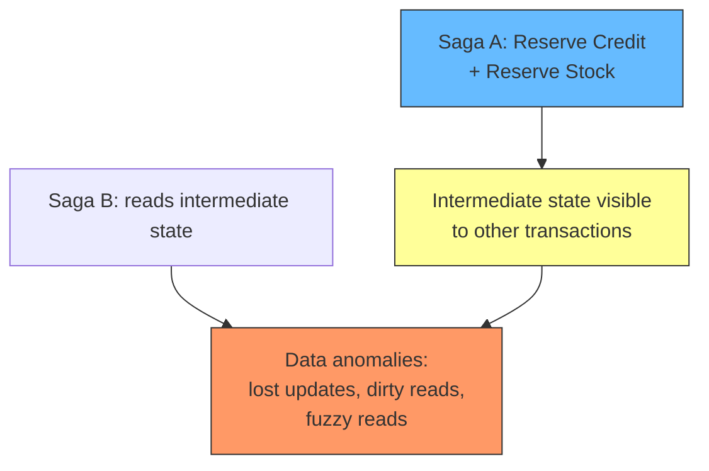


</div>


This is why saga designers must use countermeasures, which Richardson describes as "design techniques that implement isolation." Azure lists the common ones:

- **Semantic lock:** application-level locks; a compensable transaction sets a flag saying an update is in progress.
- **Commutative updates:** design updates so they produce the same result regardless of order, reducing conflicts between sagas.
- **Pessimistic view:** reorder the saga so data updates happen in retryable transactions, eliminating dirty reads.
- **Reread values:** re-read the data before updating; if it changed, stop and restart the saga.
- **Version files:** log every operation on a record and enforce ordering to prevent conflicts.
- **Risk-based concurrency:** pick the concurrency mechanism based on business risk; sagas for low-risk updates, distributed transactions for high-risk ones.

The countermeasures exist because the isolation problem cannot be fixed with a single mechanism. Each saga picks the countermeasures that match the business risk of its data.

## Reliable messaging: the hidden requirement

For a saga to work, publishing an event must be reliable. The local transaction that updates the database and the message that triggers the next step must happen together. If the database commits but the message is lost, the saga stops silently halfway. If the message is sent but the database rolls back, the next service acts on work that never happened.

<div style={{display: 'flex', justifyContent: 'center'}}>

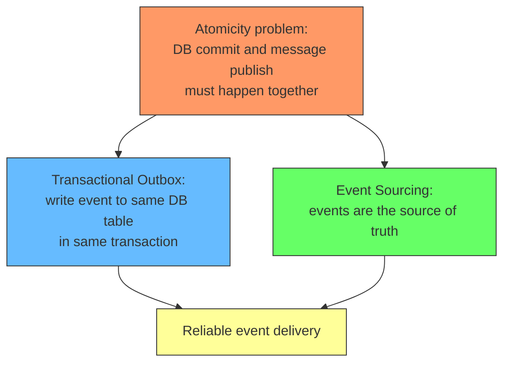


</div>


Richardson names the pattern options:

> "In order to be reliable, a service must atomically update its database and publish a message/event. It cannot use the traditional mechanism of a distributed transaction that spans the database and the message broker. Instead, it must use one of the patterns listed below."

The two standard solutions are the **transactional outbox** pattern (write the event to a table in the same database transaction, then a relay publishes it to the message broker) and **event sourcing** (the event log is the database). Without one of these, the saga is built on a broken foundation.

## Telling the client what happened

A saga is asynchronous. The client sends `POST /orders` and gets a response before the saga finishes. Richardson lists three ways to communicate the eventual outcome:

- Send the response once the saga completes (for example, after `OrderApproved` or `OrderRejected`).
- Respond with the `orderID` immediately, and let the client poll `GET /orders/{orderID}` to find out.
- Respond with the `orderID`, then push an event to the client (websocket or webhook) when the saga finishes.

<div style={{display: 'flex', justifyContent: 'center'}}>

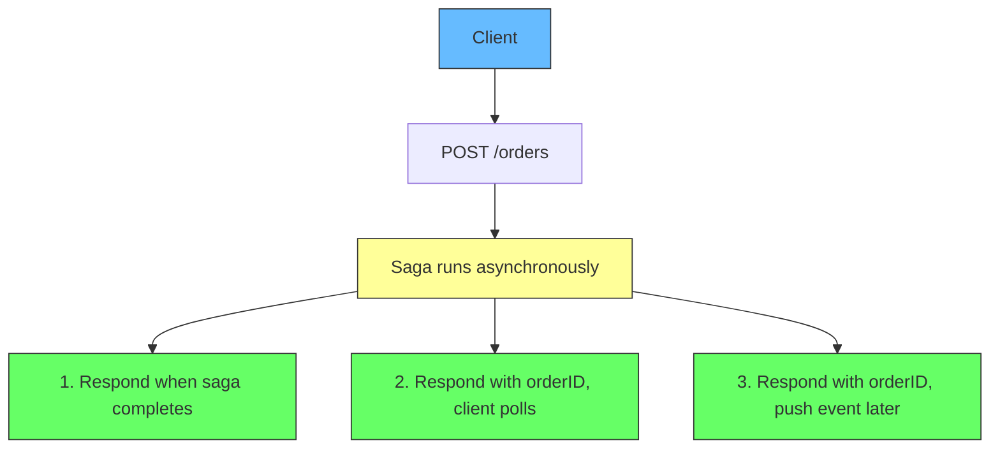


</div>


The choice depends on how long the saga takes and whether the client is a person or another system. Long-running sagas favor polling or push events, because the client cannot hold a synchronous connection open forever.

## When to use sagas, and when not to

Azure's guidance:

> "Use this pattern when: you need to ensure data consistency in a distributed system without tight coupling; you need to roll back or compensate if one of the operations in the sequence fails."

> "This pattern might not be suitable when: transactions are tightly coupled; compensating transactions occur in earlier participants; there are cyclic dependencies."

The pattern is not a free rollback. It works when each step is an independent business action that can be reversed by another business action. It fails when steps are tightly coupled to each other, or when there is no sensible compensation.

Considerations before adopting sagas, from Azure:

- **Shift in design thinking:** sagas require focusing on transaction coordination across services instead of relying on a database transaction.
- **Debugging complexity:** the more services participate, the harder a failing saga is to trace.
- **Irreversible local changes:** committed data cannot be rolled back, only compensated.
- **Idempotence:** the system must tolerate retries, so repeated operations must not change the outcome.
- **Monitoring:** sagas need tracking and monitoring to stay operationally visible.

<div style={{display: 'flex', justifyContent: 'center'}}>

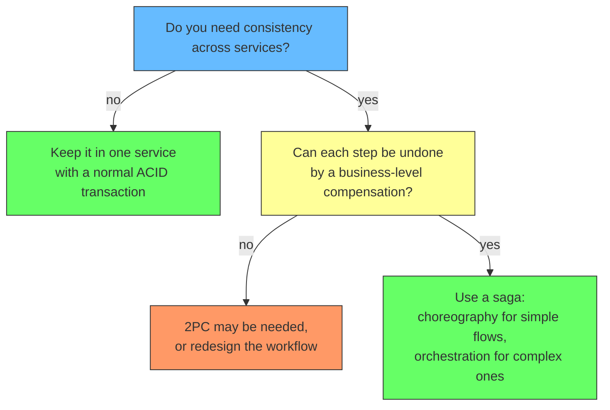


</div>


## Summary

A saga is the answer to a specific problem: a business transaction that spans multiple services, each with its own database, where 2PC is not an option. It is a sequence of local transactions. Each local transaction commits independently and triggers the next one through a message or event. If a step fails, compensating transactions reverse the business effect of the earlier steps. There is no automatic rollback and no isolation, so the developer must design compensations and apply countermeasures against data anomalies. Two coordination styles exist: choreography, where services react to each other's events, and orchestration, where a central orchestrator commands the participants. Use choreography for simple flows, orchestration for complex ones, and never forget that reliable messaging underneath the saga is what makes it trustworthy.

### References

- Richardson, C. (2021). *Microservices Patterns*. Manning. Chapter 4 covers sagas in depth, including the saga example applications (ftgo-application) and the Eventuate Tram Sagas framework.
- Richardson, C. *Pattern: Saga*. microservices.io. https://microservices.io/patterns/data/saga.html - The context, problem, forces, solution, choreography and orchestration examples, resulting context, drawbacks (no automatic rollback, no isolation), and the related Transactional Outbox and Event Sourcing patterns.
- Microsoft Azure Architecture Center (2025). *Saga Design Pattern*. https://learn.microsoft.com/en-us/azure/architecture/patterns/saga - Compensable, pivot, and retryable transactions; choreography vs orchestration benefit/drawback tables; data anomalies; countermeasures; and when to use the pattern.
- Garcia-Molina, H. & Salem, K. (1987). *SAGAS*. Proceedings of the 1987 ACM SIGMOD International Conference on Management of Data. https://www.cs.cornell.edu/andru/cs711/2002fa/reading/sagas.pdf - The original paper introducing sagas and compensating transactions for long-lived database transactions.
- Richardson, C. (2024). *A Tour of Two Sagas*. microservices.io. https://microservices.io/post/architecture/2024/03/20/tour-of-two-sagas.html - Worked tour of choreography and orchestration saga implementations.
- Richardson, C. *Transactional Outbox*. microservices.io. https://microservices.io/patterns/data/transactional-outbox.html - The pattern for reliably publishing events atomically with a database update.
