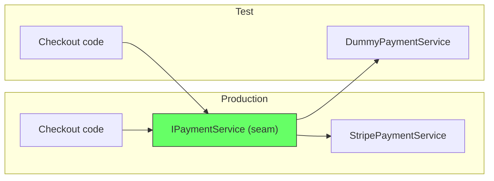
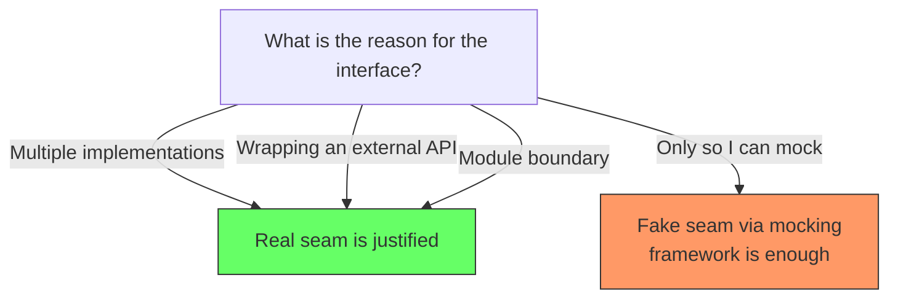
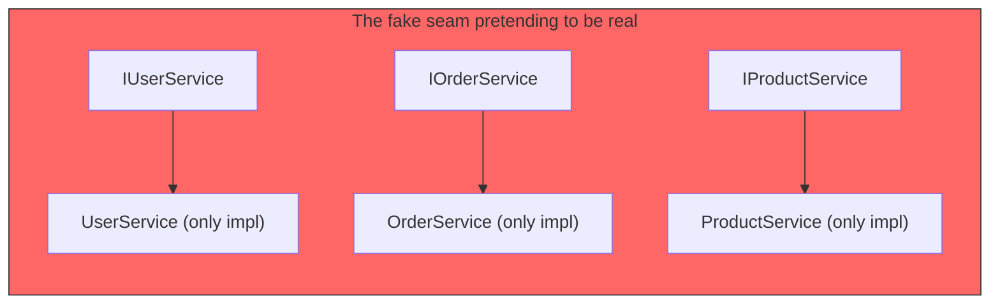

# Seams and Testability

"Create an interface so you can mock it in tests." This is common advice. It is based on a real concept — the seam — but it misapplies it.

## What a seam is

Michael Feathers defined a seam in *Working Effectively with Legacy Code* as:

> *"A place where you can alter behavior in your program without editing in that place."*

A seam exists at every module boundary. If module A calls module B through an interface, that interface is a seam. In a test, you swap module B for a test double at that seam — without editing module A.



## Real seams vs fake seams

A real seam is a type in your codebase — an interface, an abstract class, or a function type. The code is written to depend on the seam, not the implementation.

A fake seam is a mocking framework (Jest, Mockito, unittest.mock) that intercepts the call at runtime without changing the code. The code depends on the concrete class directly, but the framework hijacks the dependency.

```
// Real seam: IPaymentService exists in code
class CheckoutService {
  constructor(private payment: IPaymentService) {}
}

// Fake seam: no interface, but Jest intercepts anyway
jest.mock('./StripePaymentService')
const stripe = new StripePaymentService()
stripe.processPayment.mockResolvedValue(success)
```

Both approaches let you swap dependencies in tests. The difference is what the production code looks like.

## When each makes sense

A real seam is justified when the interface serves an architectural purpose — multiple implementations, wrapping a volatile external dependency, defining a module boundary.

A fake seam is justified when you just need to test the code and there is no architectural reason for an interface. The mocking framework does the work without cluttering the codebase.



## What a fixture is

A fixture is not a seam. A fixture is test data — the objects, database records, or files that set up the state for a test.

```
// Seam: where you swap the implementation
jest.mock('./StripePaymentService')         // seam via mock

// Fixture: the test data
const testOrder = {                          // fixture
  id: 'order-123',
  customerId: 'cust-456',
  items: [{ sku: 'PROD-1', qty: 2 }],
}
```

People confuse them because both are part of test setup. The seam controls *which implementation runs*. The fixture controls *what data it processes*. They are independent.

## A common misconception

The misconception is: "You need a seam to write tests. A seam requires an interface. Therefore, you need interfaces to test."

This is wrong because:
1. Mocking frameworks provide fake seams. You do not need a real interface.
2. Real seams exist at module boundaries, not between every class and its mock.
3. A 1:1 interface-implementation pair created only for testing is a fake seam pretending to be a real one.



Each of these is a 1:1 pair. The interface exists only to create a seam for mocking. The mocking framework could have done the same work without the interface.

## The test double

The thing you plug into the seam is a test double — a fake or dummy implementation. It replaces the real dependency.

```
// Seam (interface in code or mock framework) lets you plug in a test double
// The test double provides controlled behavior without side effects
```

| Concept | What it is | Example |
|---|---|---|
| **Seam** | The place where you swap | Interface in code, or mock framework intercept |
| **Test double** | What you swap in | Dummy, stub, spy, mock, fake |
| **Fixture** | The data state | Test objects, database seed, config |

A seam is the mechanism. A test double is what goes into it. A fixture is the environment it runs in.

## Summary

| | Real seam | Fake seam |
|---|---|---|
| **Mechanism** | Interface, abstract class, function type | Mocking framework (Jest, Mockito, etc.) |
| **Exists in production code** | Yes | No |
| **Justification** | Architectural need (2+ implementations, wrapping external dep, module boundary) | Testability only |
| **Codebase impact** | Adds a file, a type, indirection | No impact |
| **When to use** | The interface earns its keep | You just need to test the code |

A seam for its own sake is not a seam. It is indirection. The mocking framework already gives you the seam for free.
