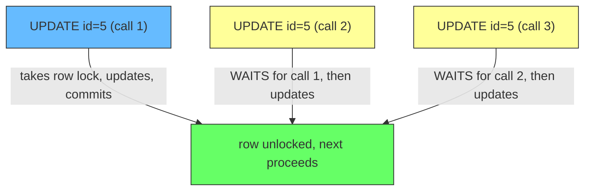
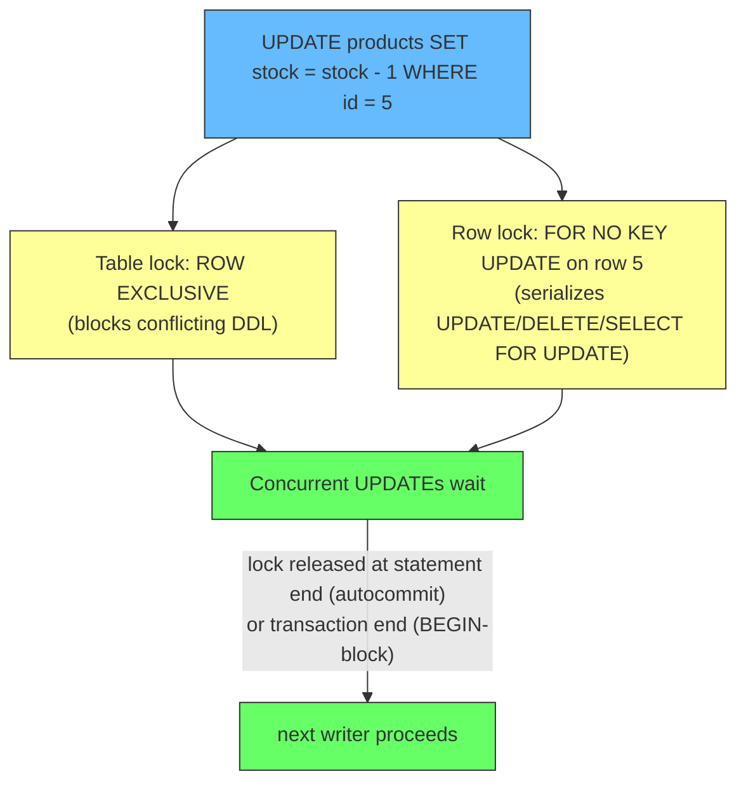
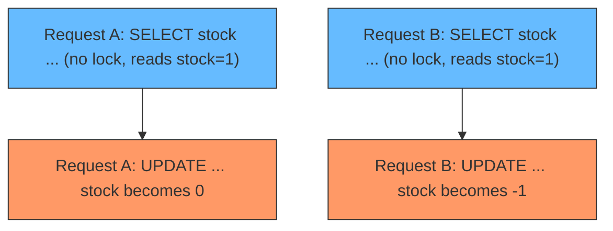

# Do Concurrent UPDATEs Serialize in Autocommit? Yes, and Here's the Catch

## TLDR

- **The problem:** developers think "if I `UPDATE` a row without a `BEGIN ... COMMIT`, multiple simultaneous calls can race and corrupt the row." They can't. The database serializes writers automatically, even in autocommit mode.
- **Concurrent `UPDATE`s on the same row are always serialized.** Call 2 waits for call 1, call 3 waits for call 2, no matter whether there is a `BEGIN`. The database never lets two writers touch the same row at once.
- **What's acquired:** a table-level `ROW EXCLUSIVE` lock plus a row-level exclusive lock on the updated row. A normal `UPDATE` that does not modify a key column locks at `FOR NO KEY UPDATE` strength, which blocks other `UPDATE`s, `DELETE`s, and `SELECT ... FOR UPDATE` on that row, but not plain `SELECT` readers (MVCC).
- **The only difference `BEGIN` makes is the size of the serialization window.** Autocommit releases the lock at the end of the statement (microseconds). `BEGIN ... COMMIT` holds it for the whole block, which is what a "hold" or "reservation" needs.
- **The real danger of autocommit is not two `UPDATE`s colliding - it's the read-then-write race.** A plain `SELECT` takes no row lock, so "read stock, decide, update stock" can double-sell even though every individual `UPDATE` serializes fine. The fix is `SELECT ... FOR UPDATE` inside a transaction block.

## The problem: "my UPDATE raced with another UPDATE"

A developer writes:

```sql
UPDATE products SET stock = stock - 1 WHERE id = 5;
```

Two requests arrive at once, each running this line in autocommit mode (no `BEGIN`). The fear: both check `stock`, both see 1, both write, stock ends at -1 instead of 0. A race, right?

No. The database prevents exactly that. Concurrent writers to the same row are serialized by the lock the `UPDATE` itself takes, in autocommit or not. The database never allows two transactions to modify the same row simultaneously.

<div style={{display: 'flex', justifyContent: 'center'}}>



</div>

This is not a PostgreSQL quirk. In every MVCC database, an `UPDATE` acquires a row-level exclusive lock on each row it modifies, and the lock is released when the statement's transaction ends ([PostgreSQL, Explicit Locking](https://www.postgresql.org/docs/current/explicit-locking.html)). "When the statement's transaction ends" is the key phrase, because in autocommit that is *immediately*.

## What lock is acquired exactly?

Two locks are taken by the `UPDATE`, both automatic:

- **Table-level: `ROW EXCLUSIVE`.** Acquired by `UPDATE`, `DELETE`, `INSERT`, and `MERGE` on the target table. It protects against conflicting DDL, not against other row writers ([PostgreSQL, Explicit Locking](https://www.postgresql.org/docs/current/explicit-locking.html)).
- **Row-level: exclusive on the updated row.** This is the one that does the serialization. A plain `UPDATE` that does not modify a key column takes the row lock at **`FOR NO KEY UPDATE`** strength. From the docs on that mode: it "will not block SELECT FOR KEY SHARE," but it blocks other transactions that attempt `UPDATE`, `DELETE`, `SELECT FOR UPDATE`, or `SELECT FOR NO KEY UPDATE` on the same row ([PostgreSQL, Explicit Locking - Row-Level Locks](https://www.postgresql.org/docs/current/explicit-locking.html)).

So concurrent `UPDATE`s on the same row block each other, and readers never block at all. If an `UPDATE` touches a key column referenced by a foreign key, the row lock escalates to the stronger `FOR UPDATE` mode.

<div style={{display: 'flex', justifyContent: 'center'}}>



</div>

## What `BEGIN` changes: the size of the window

Both modes serialize. The difference is how long the serialization lasts:

| | Serialized? | Lock held for | Window |
| --- | --- | --- | --- |
| Autocommit (no `BEGIN`) | Yes | one statement | microseconds, lock released at COMMIT |
| `BEGIN ... COMMIT` block | Yes | the whole block | as long as the transaction is open |

This is the entire purpose of `BEGIN` for locking: it does not turn serialization on (it is always on), it extends how long you hold the locks the statements inside take. A reservation needs that: mark the car and *keep it held* while the rest of the flow runs, so nobody rebooks it mid-flow. Full mechanics are in [Locks Only Live as Long as Your Transaction: What BEGIN Really Does](./lock-duration-and-begin.md).

## The real danger: the read-then-write race

Here is where autocommit actually bites. The race is not between two `UPDATE`s; it is between a *read* and a later *write*.

<div style={{display: 'flex', justifyContent: 'center'}}>



</div>

The `SELECT` took no row lock, so both requests read `stock = 1`, both decide it is available, both write. The `UPDATE`s serialize fine individually, but the *decision* was made on stale reads, so the serialization protects nothing. The database cannot serialize reads that you did not ask it to lock.

The fix is to lock at the read, inside a transaction:

```sql
BEGIN;
SELECT stock FROM products WHERE id = 5 FOR UPDATE;  -- row locked now
-- only one request can be past this point at a time
UPDATE products SET stock = stock - 1 WHERE id = 5;
COMMIT;
```

Now request B's `SELECT ... FOR UPDATE` waits until A commits, then reads the fresh `stock = 0`, and the double-sell is gone. The price is exactly what you paid for safety: request B serialized behind A.

## Summary

Concurrent `UPDATE`s on the same row serialize automatically, in autocommit mode or not, because each `UPDATE` takes a row-level exclusive lock (at `FOR NO KEY UPDATE` strength for a plain column update, escalating to `FOR UPDATE` for key columns) held until the statement's transaction ends. `BEGIN` does not enable serialization; it stretches the serialization window from one statement to the whole block, which is what a "hold" requires. The failure autocommit actually exposes is not two writes colliding but the read-then-write race, since a plain `SELECT` takes no lock; the fix is `SELECT ... FOR UPDATE` in a transaction block.

## References

- [PostgreSQL Documentation, Explicit Locking](https://www.postgresql.org/docs/current/explicit-locking.html) - the `ROW EXCLUSIVE` table lock acquired by `UPDATE`/`DELETE`/`INSERT`/`MERGE`, and that locks are normally held until the end of the transaction.
- [PostgreSQL Documentation, Explicit Locking - Row-Level Locks](https://www.postgresql.org/docs/current/explicit-locking.html) - the `FOR NO KEY UPDATE` row lock mode acquired by a plain `UPDATE`, what it blocks, and why row locks do not affect reading.
- [Locks Only Live as Long as Your Transaction: What BEGIN Really Does](./lock-duration-and-begin.md) - the transaction-lifetime model: locks are taken by statements and released when the transaction ends, and why autocommit releases locks instantly.
- [Transaction Locking: How Two Updates Block Each Other](./transaction-locking.md) - the same mechanics from the angle of two writers racing on one row, deadlocks, and aggregate sizing.