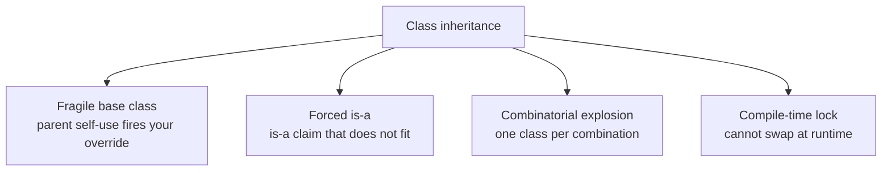
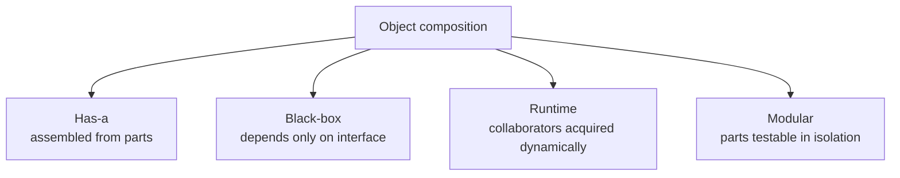

# The Shift from Class Hierarchy to Composition

**TLDR**

- Software design moved from inheritance to composition because inheritance produces **rigid, tightly coupled** hierarchies that break when requirements change.
- Four named problems with inheritance: the **fragile base class**, rigid **is-a** modeling, **combinatorial explosion** of subclasses, and **static (compile-time) inflexibility**.
- Four benefits of composition: flexible **has-a** modeling, **low coupling**, **runtime adaptability**, and **modularity/testability**.
- The canonical source is the Gang of Four: **"Favor object composition over class inheritance"** (*Design Patterns*, 1994, p. 20). They call inheritance *white-box reuse* and composition *black-box reuse*.
- Languages and frameworks confirmed the direction: React recommends composition over inheritance, and Go and Rust shipped with **no class inheritance at all**.

## The problems with inheritance

### 1. Fragile base class

Changing a parent class can silently break subclasses across the codebase. The mechanism is **self-use**: a parent method calls another of its own overridable methods, so an override fires somewhere the subclass author never expected. Alan Snyder named it the *fragile base class problem* (OOPSLA 1986); Josh Bloch's `InstrumentedHashSet extends HashSet` in *Effective Java* (Item 18) is the canonical example: adding three elements via `addAll` counts 6 instead of 3, because `HashSet.addAll` internally calls the overridden `add`.

### 2. Rigid "is-a" modeling

Inheritance forces a permanent taxonomic claim ("a `Dog` is an `Animal`") that real requirements do not honor. Most code reuse is "uses", not "is-a". The GoF explain the cost: because inheritance exposes a subclass to the parent's implementation, "inheritance breaks encapsulation". Go's FAQ makes the same point from the language-design side: OOP "involves too much discussion of the relationships between types, relationships that often could be derived automatically."

### 3. Combinatorial explosion

Every variant is a class, so every combination of variants is another class (`VisibleAndMovable`, `VisibleAndSolid`, ...), and each new axis doubles the set. The GoF motivate the Decorator pattern with exactly this: "an explosion of subclasses to support every combination is impractical."

### 4. Static inflexibility

Inheritance is fixed at compile time. The GoF state it directly: "you can't change the implementations inherited from parent classes at run-time, because inheritance is defined at compile-time." You cannot swap behavior per instance, load it from configuration, or fake it in a test.

## The benefits of composition

### 1. Flexible "has-a" modeling

Objects are built by assembling independent parts ("a `Car` has an `Engine` and has `Wheels`") instead of claiming to be a kind of thing. The relationship you actually want, "uses" or "has", is the one composition expresses directly.

### 2. Low coupling

Composition is **black-box reuse**: you depend only on a collaborator's interface, not its internals. Change or swap one part without touching the rest. The GoF call this encapsulation, and it is the payoff behind the whole principle.

### 3. Runtime adaptability

Composed behavior is bound at construction or later, not at compile time. The GoF: "Object composition is defined dynamically at run-time through objects acquiring references to other objects." This is what makes strategies, decorators, and dependency injection possible.

### 4. Modularity

Parts stay isolated, so each can be tested with a fake, and reused without dragging the parent's baggage along. This is a direct consequence of the interface seam that composition requires.

## The industry confirmed the direction

The GoF made it a rule in 1994 (*Design Patterns*, p. 20). React's documentation says "we recommend using composition instead of inheritance to reuse code between components." Go ships no type hierarchy at all (composition through interfaces and embedding), and Rust replaced inheritance with traits.

## The one rule

Reach for composition first: hold a collaborator behind an interface and delegate to it. Keep inheritance for a genuine, substitutable is-a behind a documented extension point, and prohibit it elsewhere.

## Sources

- Erich Gamma, Richard Helm, Ralph Johnson, and John Vlissides, *Design Patterns: Elements of Reusable Object-Oriented Software*, Addison-Wesley, 1994, p. 20 ("Favor object composition over class inheritance"; "inheritance breaks encapsulation"; static vs dynamic: "you can't change the implementations inherited from parent classes at run-time" vs "object composition is defined dynamically at run-time") and p. 175 (Decorator: "explosion of subclasses").
- Joshua Bloch, *Effective Java*, 3rd ed., Addison-Wesley, 2018, Item 18 ("Favor composition over inheritance"; `InstrumentedHashSet`).
- Alan Snyder, "Encapsulation and Inheritance in Object-Oriented Programming Languages", *OOPSLA '86* (fragile base class problem).
- The Go Programming Language, [FAQ](https://go.dev/doc/faq), "Why is there no type inheritance?" (no type hierarchy; relationships "often could be derived automatically").
- React documentation, [Composition vs Inheritance](https://legacy.reactjs.org/docs/composition-vs-inheritance.html) ("we recommend using composition instead of inheritance").
