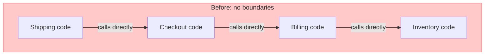
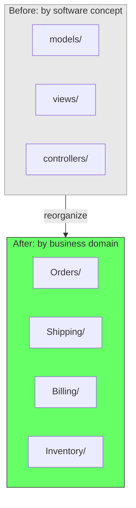
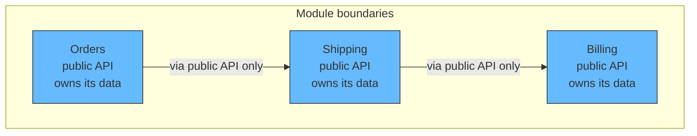
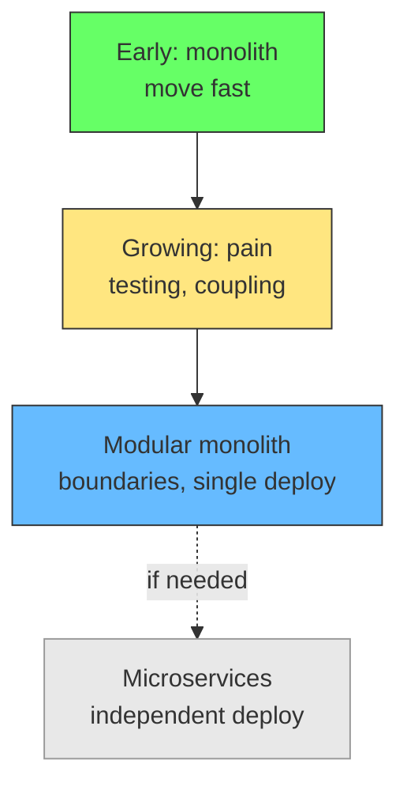

# How Shopify Moved to a Modular Monolith (And Why They Chose It Over Microservices)

## The problem: a monolith at scale

Shopify is one of the largest Ruby on Rails codebases in existence. Over a decade, more than a thousand developers worked on it. The code that handled shipping rates lived alongside the code that handled checkouts, and nothing stopped them from calling each other. Changing one piece of code caused unintended side effects on unrelated code. Building and testing new features took too long.

They had a choice: microservices or modular monolith. They chose modular monolith.

Kirsten Westeinde, senior engineer at Shopify: "We realized all the things we liked about our monolith were a result of the code living in and being deployed to one place. And all the issues we were experiencing were a direct result of a lack of boundaries between distinct functionality in our code."

## The migration: reorganize by domain

They listed every Ruby class (around 6000) in a massive spreadsheet and manually labeled which component it belonged to. The reorganization was from software concepts (models, views, controllers) to real-world concepts (orders, shipping, inventory, billing).

Each component was structured as its own mini Rails app, with the goal of namespacing them as Ruby modules. No code changed in this process -- only file moves. They did it in one big bang PR built by automated scripts.

## The key decisions

**1. Public API per module.** Each component defined a clean dedicated interface with domain boundaries expressed through a public API. Other modules could only access a component through its public API, not directly.

**2. Data ownership per module.** Each component took exclusive ownership of its associated data. No shared tables. No cross-component associations. The shipping module owned shipping data. The billing module owned billing data.

**3. Single deployment.** The code stayed in one codebase, deployed to one place. They kept the advantage of the monolith: one test pipeline, one deployment pipeline, no network calls between modules.

## Boundary enforcement: Wedge

Shopify built an internal tool called Wedge to track violations of domain boundaries. It hooks into Ruby tracepoints during CI to get a full call graph. It then sorts callers and callees by component, selecting only cross-component calls.

Wedge determines which cross-component interactions are acceptable and which are violations:
- Cross-component associations are always violating
- Calls are ok only to things that are explicitly public
- Inheritance violations are tracked separately

Wedge computes an overall score and lists violations per component. This gave them visibility into coupling and allowed them to track progress over time.

## The result: swap the tax engine

The payoff was concrete. Shopify had a legacy tax engine that was no longer adequate. Before the modular monolith, swapping it out would have been almost impossible -- the tax logic was intertwined with everything else.

After the migration, because dependencies were isolated and each module had a clean public API, they were able to swap out the old tax engine for a completely new system. The modules that depended on tax calculation only depended on the public API, not the implementation.

## Why not microservices

Shopify considered microservices and ruled them out. The reasons:

| Concern | Microservices | Modular Monolith |
|---|---|---|
| Deployment | Multiple pipelines | Single pipeline |
| Data access | Network calls, eventual consistency | Direct queries, strong consistency |
| Infrastructure | Multiple sets to manage | One set |
| Refactoring | Cross-service coordination | Single codebase |
| Latency | Network hops | In-process calls |

They got the benefits of microservices (modularity, decoupling, clear ownership) without the costs (distributed systems complexity, network latency, multiple deployments).

Martin Fowler: "Almost all the cases where I've heard of a system that was built as a microservice system from scratch, it has ended in serious trouble."

## The design stamina hypothesis

Shopify引用了Martin Fowler的设计耐力假说。在早期阶段，你可以快速移动而不需要太多设计。一旦设计开始阻碍功能开发，你就越过了设计回报线，是时候投资设计了。

Shopify没有在早期就做模块化。他们在需要的时候才做。这就是正确的时机。

## Related

- [Modular Monolith](modular-monolith.md) - the pattern explained
- [Monolith vs Microservices](monolith-vs-microservices.md) - when to choose which
- [When the Monolith Breaks](when-the-monolith-breaks.md) - signs you have outgrown your architecture
