# SQL - Important Questions

The SQL questions that come up in interviews and on the job, in problem -> solution form. One shared dataset powers every example.

```sql
-- Seed for every example below - also in supabase/sql/seed.sql
create table users (id int primary key, name text, country text);
create table orders (id int primary key, user_id int, amount numeric, status text);
insert into users values (1,'Alice','USA'), (2,'Bob','USA'), (3,'Sai','India');
insert into orders values
  (1,1,100,'paid'), (2,1,50,'paid'), (3,1,20,'pending'),
  (4,2,200,'paid'), (5,2,30,'cancelled'),
  (6,3,300,'paid'), (7,3,10,'paid');
-- 7 orders, 5 paid - same as Supabase seed
```

import { SQLPlaygroundProvider } from '@site/src/components/SQLPlaygroundContext';
import MovableSQLPlayground from '@site/src/components/MovableSQLPlayground';
import CopyToPlaygroundButton from '@site/src/components/CopyToPlaygroundButton';

<SQLPlaygroundProvider>

<MovableSQLPlayground />

<div>

<div style={{display: 'flex', justifyContent: 'center'}}>

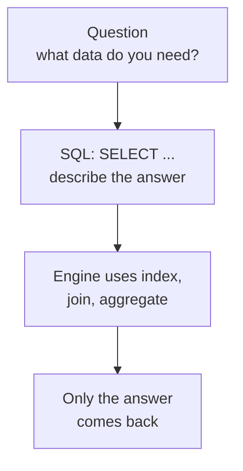
```mermaid
graph TD
  Q["Question<br/>what data do you need?"] --> SQL["SQL: SELECT ...<br/>describe the answer"]
  SQL --> ENGINE["Engine uses index,<br/>join, aggregate"]
  ENGINE --> ANS["Only the answer<br/>comes back"]
```

</div>

## 1. SELECT and WHERE

### Problem

Get only some columns and only some rows. Without `WHERE` you scan everything.

```sql
-- All columns and rows - wasteful on big data
SELECT * FROM orders;
```

### Solution

`SELECT` projects columns, `WHERE` filters rows before any other work. Put the filter on an indexed column when the table is big.

```sql
SELECT id, user_id, amount
FROM orders
WHERE status = 'paid';
-- 5 rows: Alice 100,50 Bob 200 Sai 300,10
```

<CopyToPlaygroundButton code={`SELECT id, user_id, amount FROM orders WHERE status = 'paid'`} />

<div style={{display: 'flex', justifyContent: 'center'}}>

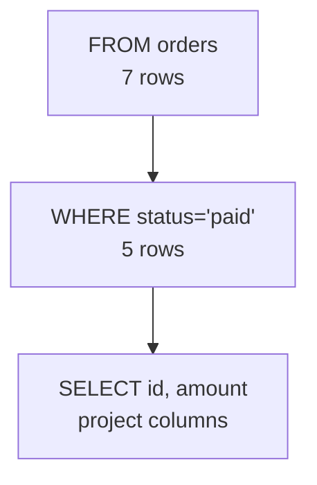
```mermaid
flowchart TD
  FROM["FROM orders<br/>7 rows"] --> WHERE["WHERE status='paid'<br/>5 rows"]
  WHERE --> SELECT["SELECT id, amount<br/>project columns"]
```

</div>

### Pitfall

`WHERE` runs before `SELECT` - you cannot use a `SELECT` alias in `WHERE`. Use `HAVING` after `GROUP BY` for that.

```sql
-- Wrong
SELECT user_id, SUM(amount) AS total FROM orders WHERE total > 100;
-- Right
SELECT user_id, SUM(amount) AS total FROM orders GROUP BY user_id HAVING SUM(amount) > 100;
```

---

## 2. JOIN - INNER, LEFT, RIGHT, FULL

### Problem

`orders` has `user_id`, `users` has `name`. Without a join you make two queries and stitch in code.

### Solution

`JOIN ON` combines rows by a key. The type decides what to do with non-matches.

```sql
-- INNER: only matches
SELECT u.name, o.amount FROM orders o JOIN users u ON u.id = o.user_id WHERE o.status='paid';
-- 5 rows

-- LEFT: all users, even without paid orders
SELECT u.name, o.amount FROM users u LEFT JOIN orders o ON o.user_id = u.id AND o.status='paid';
-- 3 users + matches, Sai has 2 rows, Bob 1, Alice 2

-- SELF JOIN: pairs inside the same table
SELECT a.name, b.name FROM users a JOIN users b ON a.country = b.country AND a.id < b.id;
-- Alice-Bob (both USA)

-- CROSS JOIN: every combination, no ON
SELECT * FROM users CROSS JOIN (SELECT DISTINCT status FROM orders) s;
```

<CopyToPlaygroundButton code={`SELECT u.name, o.amount FROM orders o JOIN users u ON u.id = o.user_id WHERE o.status = 'paid'`} />

<div style={{display: 'flex', justifyContent: 'center'}}>

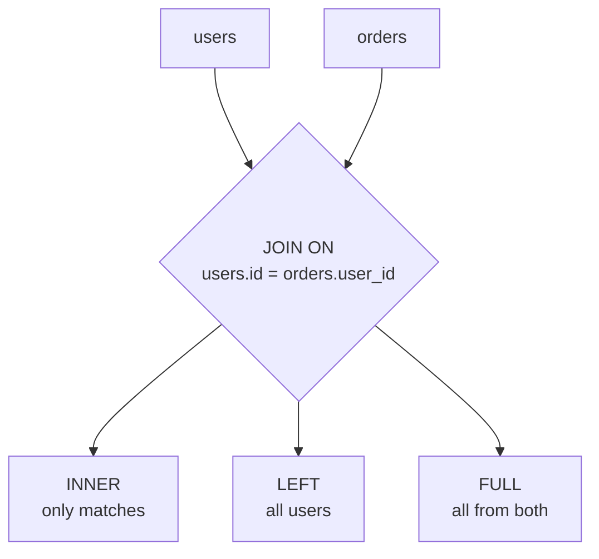
```mermaid
graph TD
  U["users"] --> J{"JOIN ON<br/>users.id = orders.user_id"}
  O["orders"] --> J
  J --> INNER["INNER<br/>only matches"]
  J --> LEFT["LEFT<br/>all users"]
  J --> FULL["FULL<br/>all from both"]
```

</div>

### Pitfall

Forgetting the `ON` turns a `JOIN` into a `CROSS JOIN`: `3 users x 7 orders = 21 rows`. Always write the `ON`.

---

## 3. GROUP BY and HAVING

### Problem

You need totals per user, not per row.

### Solution

`GROUP BY` collapses rows per key, aggregates compute the total. `WHERE` filters rows before grouping, `HAVING` filters groups after.

```sql
SELECT user_id, COUNT(*) AS cnt, SUM(amount) AS total
FROM orders
WHERE status = 'paid'
GROUP BY user_id
HAVING SUM(amount) > 100
ORDER BY total DESC;
-- Bob 200 (1), Sai 310 (2) - Alice 150 filtered by HAVING if >200, else include
```

<CopyToPlaygroundButton code={`SELECT user_id, COUNT(*) AS cnt, SUM(amount) AS total FROM orders WHERE status = 'paid' GROUP BY user_id HAVING SUM(amount) > 100 ORDER BY total DESC`} />

Execution order: `FROM -> WHERE -> GROUP BY -> HAVING -> SELECT -> ORDER BY -> LIMIT`.

<div style={{display: 'flex', justifyContent: 'center'}}>

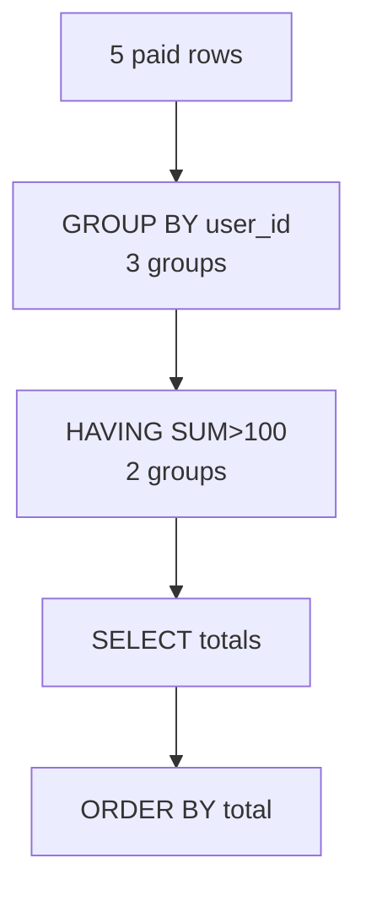
```mermaid
flowchart TD
  ROWS["5 paid rows"] --> GROUP["GROUP BY user_id<br/>3 groups"]
  GROUP --> HAVING["HAVING SUM>100<br/>2 groups"]
  HAVING --> SELECT2["SELECT totals"]
  SELECT2 --> ORDER["ORDER BY total"]
```

</div>

### Pitfall

Every non-aggregated column in `SELECT` must be in `GROUP BY`. `SELECT user_id, status, SUM(amount)` without grouping `status` is an error in Postgres.

---

## 4. DISTINCT, ORDER BY, LIMIT

### Problem

Deduplicate, rank, and sample without moving all data to the app.

### Solution

```sql
SELECT DISTINCT country FROM users; -- USA, India
SELECT DISTINCT ON (country) * FROM users ORDER BY country, id; -- one per country, Postgres specific

SELECT * FROM orders ORDER BY amount DESC LIMIT 2; -- top 2 amounts
SELECT * FROM orders ORDER BY amount DESC LIMIT 2 OFFSET 2; -- next 2 (pagination, slow on big data)
```

<CopyToPlaygroundButton code={`SELECT DISTINCT country FROM users`} />

`DISTINCT ON` keeps one row per key. `LIMIT` with `ORDER BY` lets Postgres use a top-N sort.

### Pitfall

`OFFSET` on big data scans and discards `OFFSET` rows. For deep pagination use keyset: `WHERE id > last_id ORDER BY id LIMIT 20`.

---

## 5. Subquery, IN, EXISTS, CTE

### Problem

A query needs the result of another query: does a user have any paid order, is the amount in a list.

### Solution

```sql
-- IN: value in a list
SELECT * FROM users WHERE id IN (SELECT user_id FROM orders WHERE status='paid');

-- EXISTS: does any row exist - often faster, stops at first match
SELECT * FROM users u WHERE EXISTS (SELECT 1 FROM orders o WHERE o.user_id = u.id AND o.status='paid');

-- CTE: name an intermediate result instead of nesting
WITH paid AS (SELECT * FROM orders WHERE status='paid')
SELECT user_id, AVG(amount) FROM paid GROUP BY user_id;

-- Scalar subquery in SELECT
SELECT name, (SELECT COUNT(*) FROM orders o WHERE o.user_id = u.id) AS cnt FROM users u;
```

<CopyToPlaygroundButton code={`SELECT * FROM users WHERE id IN (SELECT user_id FROM orders WHERE status='paid')`} />

<div style={{display: 'flex', justifyContent: 'center'}}>

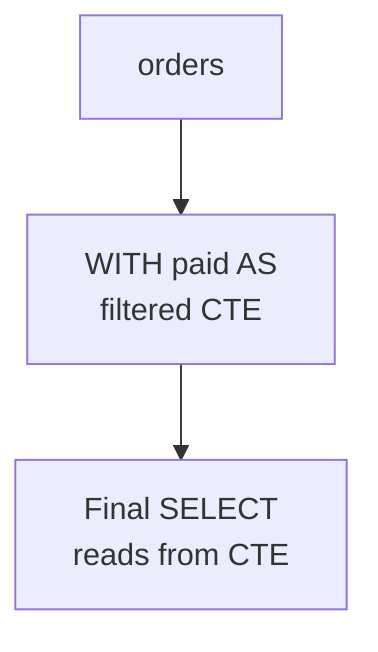
```mermaid
graph TD
  RAW["orders"] --> CTE["WITH paid AS<br/>filtered CTE"]
  CTE --> FINAL["Final SELECT<br/>reads from CTE"]
```

</div>

### Pitfall

`IN (SELECT ...)` with `NULL` in the list makes the whole predicate unknown. `EXISTS` avoids that trap.

---

## 6. UNION vs UNION ALL

### Problem

Combine results from two queries.

### Solution

```sql
SELECT user_id FROM orders WHERE status='paid'
UNION      -- dedupes
SELECT user_id FROM orders WHERE amount > 100;

SELECT user_id FROM orders WHERE status='paid'
UNION ALL  -- keeps duplicates, faster
SELECT user_id FROM orders WHERE amount > 100;
```

<CopyToPlaygroundButton code={`SELECT user_id FROM orders WHERE status = 'paid' UNION SELECT user_id FROM orders WHERE amount > 100`} />

Use `UNION ALL` unless you need deduping - the dedup is a sort that costs on big data.

---

## 7. Window functions - compute without collapsing

### Problem

You want each order plus the user's total. `GROUP BY` would collapse rows, but you need to keep them.

### Solution

`OVER (PARTITION BY ...)` keeps rows and adds a computed column per window.

```sql
SELECT id, user_id, amount,
  SUM(amount) OVER (PARTITION BY user_id) AS user_total,
  ROW_NUMBER() OVER (PARTITION BY user_id ORDER BY amount DESC) AS rnk,
  LAG(amount) OVER (PARTITION BY user_id ORDER BY id) AS prev_amount
FROM orders WHERE status='paid';
```

<CopyToPlaygroundButton code={`SELECT id, user_id, amount, SUM(amount) OVER (PARTITION BY user_id) AS user_total, ROW_NUMBER() OVER (PARTITION BY user_id ORDER BY amount DESC) AS rnk FROM orders WHERE status = 'paid'`} />

*   `PARTITION BY` is the window's `GROUP BY`, but rows stay.
*   `ORDER BY` inside the window decides the rank.
*   `LAG`/`LEAD` peek at the previous/next row.

<div style={{display: 'flex', justifyContent: 'center'}}>

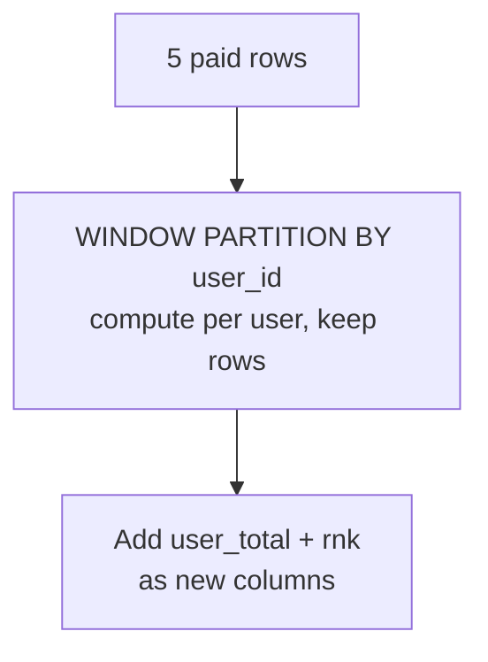
```mermaid
graph TD
  ROWS2["5 paid rows"] --> WIN["WINDOW PARTITION BY user_id<br/>compute per user, keep rows"]
  WIN --> COLS["Add user_total + rnk<br/>as new columns"]
```

</div>

### Pitfall

`ROW_NUMBER` without `ORDER BY` is non-deterministic. Always specify the order inside the window.

---

## 8. NULL, COALESCE, and three-valued logic

### Problem

`NULL` means unknown, not zero or empty string. Comparisons with `NULL` are unknown.

### Solution

```sql
SELECT * FROM orders WHERE amount IS NULL; -- not = NULL
SELECT COALESCE(amount, 0) FROM orders; -- replace NULL with 0
SELECT COUNT(*) FROM orders; -- counts rows, includes NULLs
SELECT COUNT(amount) FROM orders; -- counts non-NULL amounts only
```

<CopyToPlaygroundButton code={`SELECT * FROM orders WHERE amount IS NULL`} />

`WHERE NULL = NULL` is unknown, `WHERE NULL IS NULL` is true. `COALESCE` is the safe default.

### Pitfall

`WHERE status != 'paid'` does not return `NULL` rows. `NULL != 'paid'` is unknown, so those rows are filtered out. In SQL, `<>` is the standard not-equal operator (`!=` also works in Postgres):

```sql
SELECT * FROM orders WHERE status <> 'paid'; -- same as != 'paid', standard SQL
SELECT * FROM orders WHERE status != 'paid'; -- Postgres allows both
```

<CopyToPlaygroundButton code={`SELECT * FROM orders WHERE status <> 'paid'`} />

---

## 9. Constraints, indexes, and EXPLAIN

### Problem

Queries are correct but slow on big data.

### Solution

```sql
-- Constraint: correctness at the DB
ALTER TABLE orders ADD CONSTRAINT chk_amount CHECK (amount > 0);

-- Index: speed for WHERE/JOIN
CREATE INDEX ON orders(status);
CREATE INDEX ON orders(user_id);

-- EXPLAIN: see the plan
EXPLAIN ANALYZE SELECT * FROM orders WHERE status='paid';
-- Seq Scan vs Index Scan - index wins when 5 of 100000 rows match
```

<CopyToPlaygroundButton code={`EXPLAIN ANALYZE SELECT * FROM orders WHERE status = 'paid'`} />

An index is a sorted copy of the column. It helps `WHERE`/`JOIN`/`ORDER BY` but slows `INSERT` and costs space. Never add an index without checking `EXPLAIN`.

<div style={{display: 'flex', justifyContent: 'center'}}>

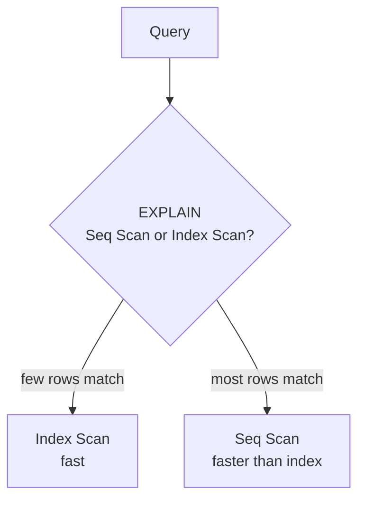
```mermaid
flowchart TD
  Q["Query"] --> PLAN{"EXPLAIN<br/>Seq Scan or Index Scan?"}
  PLAN -->|"few rows match"| IDX["Index Scan<br/>fast"]
  PLAN -->|"most rows match"| SEQ["Seq Scan<br/>faster than index"]
```

</div>

---

## 10. Transactions, isolation, and locks

### Problem

Two users change the same row. Without transactions you get partial writes and lost updates.

### Solution

```sql
BEGIN;
UPDATE orders SET amount = 150 WHERE id = 1;
-- other transaction here sees old value until COMMIT, or is blocked
COMMIT;

-- Try a lock explicitly
SELECT * FROM orders WHERE id = 1 FOR UPDATE; -- blocks others

-- Isolation
BEGIN ISOLATION LEVEL REPEATABLE READ;
SELECT * FROM orders WHERE user_id = 1; -- snapshot at BEGIN
```

Postgres uses MVCC: readers never block writers.

<div style={{display: 'flex', justifyContent: 'center'}}>

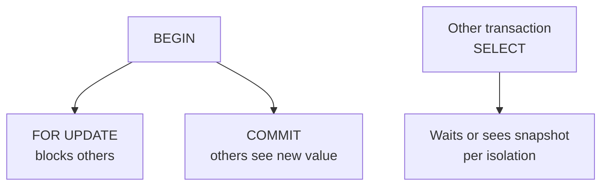
```mermaid
graph TD
  T1["BEGIN"] --> LCK["FOR UPDATE<br/>blocks others"]
  T1 --> COMMIT["COMMIT<br/>others see new value"]
  T2["Other transaction<br/>SELECT"] --> WAIT["Waits or sees snapshot<br/>per isolation"]
```

</div>

### Pitfall

`BEGIN` without `COMMIT` holds a lock and blocks others. Always `COMMIT` or `ROLLBACK`.

## Runnable playground - Supabase

Every snippet above has a live playground. It sends the SQL to your Supabase Postgres via an Edge Function (`supabase/functions/run-sql`), which validates `SELECT`/`WITH`/`EXPLAIN` only and caps at 1000 rows.

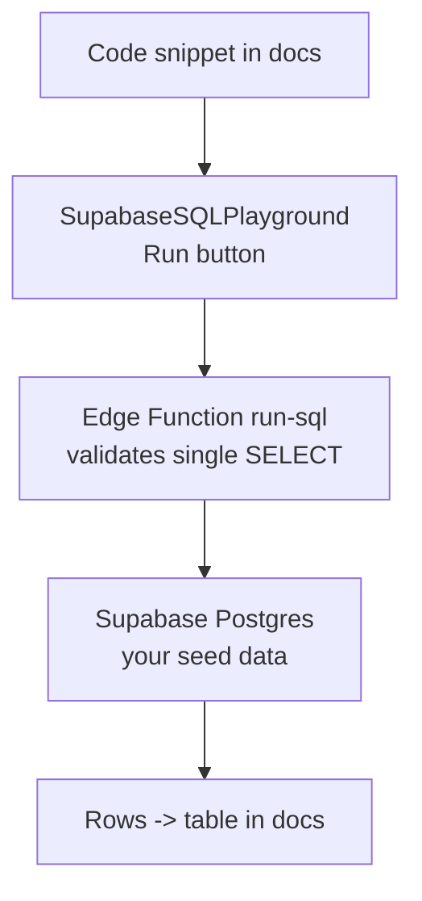
```mermaid
graph TD
  SNIPPET["Code snippet in docs"] --> FRONT["SupabaseSQLPlayground<br/>Run button"]
  FRONT --> API["Edge Function run-sql<br/>validates single SELECT"]
  API --> SUPA["Supabase Postgres<br/>your seed data"]
  SUPA --> ROWS["Rows -> table in docs"]
```

> Setup: create Supabase project, paste `supabase/sql/seed.sql` in SQL Editor, deploy functions with `supabase functions deploy run-sql`, set `DATABASE_URL` in Edge Function secrets, set `SUPABASE_URL`/`SUPABASE_ANON_KEY` in Docusaurus `.env`.

---

## 11. Indexing - why queries are slow and how to fix them

### The problem

`SELECT * FROM orders WHERE status = 'paid'` on 10 million rows. Without an index Postgres reads every row (sequential scan). 10 million rows checked one by one. The query takes seconds.

```sql
-- On 10M rows, this is slow without an index
EXPLAIN ANALYZE SELECT * FROM orders WHERE status = 'paid';
-- Seq Scan on orders: rows=10000000, time=1200ms
```

### What an index is

An index is a **sorted copy of a column** stored in a B-tree structure. Think of it like a book index: instead of reading every page (sequential scan), you look up the page number directly (index scan).

Without index: check every row (10M comparisons).
With index: walk the B-tree (~20 comparisons for 10M rows).

<div style={{display: 'flex', justifyContent: 'center'}}>

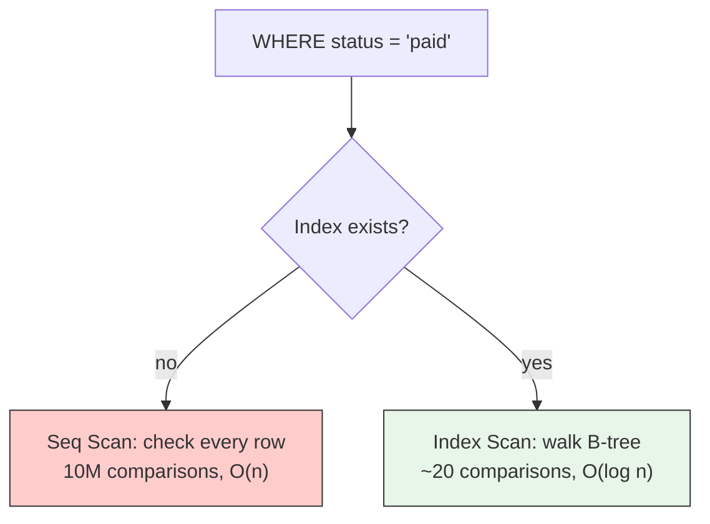
```mermaid
graph TD
  Q["WHERE status = 'paid'"] --> NO{"Index exists?"}
  NO -->|"no"| SEQ["Seq Scan: check every row<br/>10M comparisons, O(n)"]
  NO -->|"yes"| IDX["Index Scan: walk B-tree<br/>~20 comparisons, O(log n)"]
  style IDX fill:#e8f5e9,stroke:#333
  style SEQ fill:#ffcccc,stroke:#333
```

</div>

### When to use which index

| Use case | Index type | Example |
|---|---|---|
| `WHERE col = value` | B-tree (default) | `CREATE INDEX ON orders(status)` |
| `WHERE col > 100 AND col < 500` | B-tree | `CREATE INDEX ON orders(amount)` |
| `JOIN ON a.id = b.user_id` | B-tree on FK | `CREATE INDEX ON orders(user_id)` |
| `ORDER BY col` | B-tree | `CREATE INDEX ON orders(amount)` |
| `WHERE text_col LIKE '%hello%'` | GIN (full-text) | `CREATE INDEX ON products(name) USING gin(to_tsvector('english', name))` |
| `WHERE location <@ box(...)` | GiST (geometry) | PostGIS spatial index |
| `COUNT(*) WHERE col = X` | Partial index | `CREATE INDEX ON orders(status) WHERE status = 'paid'` |

### The cost of an index

Indexes are not free. Every index:

*   **Slows `INSERT`/`UPDATE`** - the index must be updated too (write amplification).
*   **Costs disk space** - a B-tree on `status` adds ~10-20% of the column's data.
*   **Needs maintenance** - Postgres `VACUUM` must clean dead tuples from indexes.

Rule of thumb: if a query is run 100x more often than the table is updated, the index pays for itself. If the table is write-heavy and the query is rare, skip the index.

<div style={{display: 'flex', justifyContent: 'center'}}>

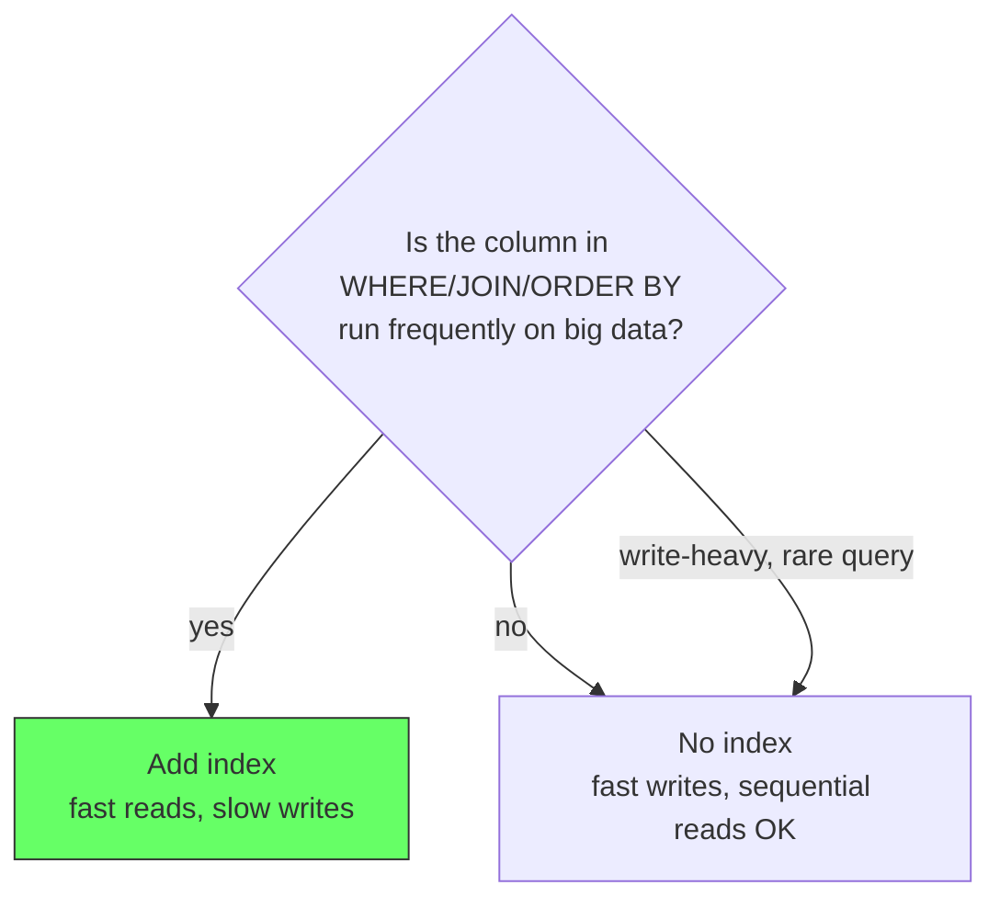
```mermaid
flowchart TD
  Q{"Is the column in WHERE/JOIN/ORDER BY<br/>run frequently on big data?"}
  Q -->|"yes"| IDX["Add index<br/>fast reads, slow writes"]
  Q -->|"no"| NO["No index<br/>fast writes, sequential reads OK"]
  Q -->|"write-heavy, rare query"| NO
  style IDX fill:#6f6,stroke:#333
```

</div>

### How to decide: EXPLAIN ANALYZE

Never guess. Run `EXPLAIN ANALYZE` to see the plan:

```sql
EXPLAIN ANALYZE
SELECT u.name, o.amount
FROM orders o JOIN users u ON u.id = o.user_id
WHERE o.status = 'paid';
```

Postgres returns:

```
Hash Join  (cost=100.00..250.00 rows=5)
  -> Seq Scan on orders o  (cost=0.00..200.00 rows=5)
       Filter: (status = 'paid')
  -> Hash  (cost=0.03..0.03 rows=3)
       -> Seq Scan on users u
```

If you see `Seq Scan` on a big table and the query runs often, add an index. If you see `Index Scan`, the index is working.

### B-tree in practice - the 80% index

B-tree is the default and covers 80% of use cases:

```sql
-- Single column: most common
CREATE INDEX ON orders(status);

-- Composite: for multi-column WHERE
CREATE INDEX ON orders(user_id, status);

-- Unique: enforce uniqueness + fast lookup
CREATE UNIQUE INDEX ON users(email);

-- Partial: index only what you query often
CREATE INDEX ON orders(amount) WHERE status = 'paid';

-- Covering: include extra columns to avoid table lookup
CREATE INDEX ON orders(status) INCLUDE (user_id, amount);
```

**Composite index order matters:** `ON (user_id, status)` helps `WHERE user_id = 1` and `WHERE user_id = 1 AND status = 'paid'`, but NOT `WHERE status = 'paid'` alone (leftmost prefix rule).

### Partial indexes - index only what you query

A partial index indexes only the rows that match a `WHERE` clause:

```sql
-- Full index: indexes ALL rows
CREATE INDEX ON orders(status);

-- Partial index: indexes ONLY paid orders
CREATE INDEX ON orders(amount) WHERE status = 'paid';
```

Why partial is better:

*   **Smaller** - if 5% of orders are paid, index is 20x smaller.
*   **Faster to build and maintain** - less disk, less write overhead.
*   **The query must use the same WHERE:**

```sql
-- This uses the partial index (WHERE matches)
SELECT * FROM orders WHERE status = 'paid' AND amount > 100;

-- This does NOT use it (WHERE doesn't match)
SELECT * FROM orders WHERE status = 'pending' AND amount > 100;
```

When to use partial indexes:

*   Most queries filter on one value: `WHERE status = 'paid'`, `WHERE active = true`, `WHERE deleted_at IS NULL`.
*   Unique constraint on a subset: `CREATE UNIQUE INDEX ON users(email) WHERE deleted_at IS NULL` - allows duplicate emails for deleted users.

| | Full index | Partial index |
|---|---|---|
| Size | All rows | Only matching rows |
| Write cost | Every INSERT/UPDATE | Less, only when affected rows match |
| Query must | Any query on that column | Must include the WHERE clause that matches |

### Indexes you should NOT add

```sql
-- Don't index every column blindly
CREATE INDEX ON orders(id);        -- primary key already has index
CREATE INDEX ON orders(created_at);-- if nobody queries by created_at
CREATE INDEX ON users(name);       -- small table, seq scan is faster than index
```

When in doubt: `EXPLAIN ANALYZE` first. If the query is fast without an index (< 50ms on < 1M rows), skip it.

### Postgres query plan cheat sheet

| Plan node | Meaning | Action |
|---|---|---|
| `Seq Scan` | Reads every row | Add index if query is frequent and table is big |
| `Index Scan` | Uses an index | Good, index is working |
| `Index Only Scan` | Answer found entirely in index (covering) | Best case, no table lookup |
| `Bitmap Index Scan` | Multiple index matches combined | Good for complex WHERE |
| `Hash Join` | Join via hash table | Normal for equi-joins |
| `Sort` | Explicit sort step | Add index on `ORDER BY` column if slow |
| `Nested Loop` | Row-by-row join | Can be slow on big tables, check join index |

---

## 12. WHEN clause - conditional logic in SQL

### The problem

You need different logic depending on a value: classify orders by amount range, calculate different discounts per tier.

### Solution

`CASE WHEN` is SQL's if/else. It works in `SELECT`, `WHERE`, `ORDER BY`, `GROUP BY`.

```sql
-- Classify each order
SELECT id, amount,
  CASE
    WHEN amount >= 200 THEN 'high'
    WHEN amount >= 50  THEN 'medium'
    ELSE 'low'
  END AS tier
FROM orders;

-- Conditional aggregation
SELECT user_id,
  SUM(CASE WHEN status = 'paid' THEN amount ELSE 0 END) AS paid_total,
  SUM(CASE WHEN status = 'cancelled' THEN amount ELSE 0 END) AS lost_total
FROM orders
GROUP BY user_id;

-- Filter with CASE in ORDER BY
SELECT * FROM orders
ORDER BY CASE WHEN status = 'paid' THEN 0 ELSE 1 END, amount DESC;
```

<CopyToPlaygroundButton code={`SELECT id, amount, CASE WHEN amount >= 200 THEN 'high' WHEN amount >= 50 THEN 'medium' ELSE 'low' END AS tier FROM orders`} />

<div style={{display: 'flex', justifyContent: 'center'}}>

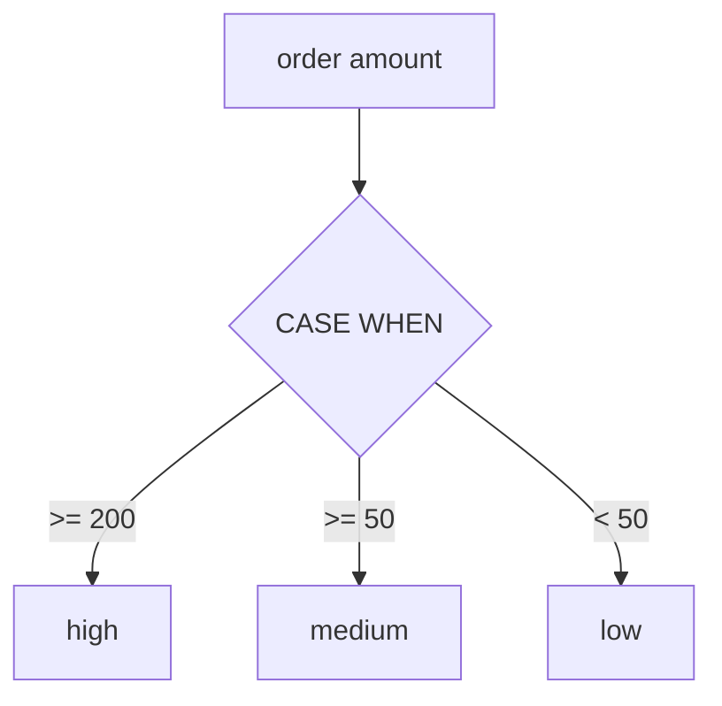
```mermaid
graph TD
  ROW["order amount"] --> C{"CASE WHEN"}
  C -->|">= 200"| HIGH["high"]
  C -->|">= 50"| MED["medium"]
  C -->|"< 50"| LOW["low"]
```

</div>

### When to use CASE vs application code

Use `CASE` when:

*   The logic is simple (classify, aggregate conditionally).
*   You need the result in the same query (avoid extra round-trips).

Use application code when:

*   The logic is complex (loops, external API calls).
*   The classification changes often without a deploy.

---

## 13. Aggregates - COUNT, SUM, AVG, MIN, MAX

### The problem

You need a single number from many rows: how many orders, total revenue, average amount.

### Solution

```sql
SELECT
  COUNT(*) AS total_orders,
  COUNT(DISTINCT user_id) AS unique_users,
  SUM(amount) AS total_revenue,
  AVG(amount) AS avg_amount,
  MIN(amount) AS smallest,
  MAX(amount) AS largest
FROM orders
WHERE status = 'paid';
```

<CopyToPlaygroundButton code={`SELECT COUNT(*) AS total_orders, COUNT(DISTINCT user_id) AS unique_users, SUM(amount) AS total_revenue, AVG(amount) AS avg_amount FROM orders WHERE status = 'paid'`} />

`COUNT(*)` counts all rows. `COUNT(column)` counts non-NULL values. `AVG` ignores NULLs.

<div style={{display: 'flex', justifyContent: 'center'}}>

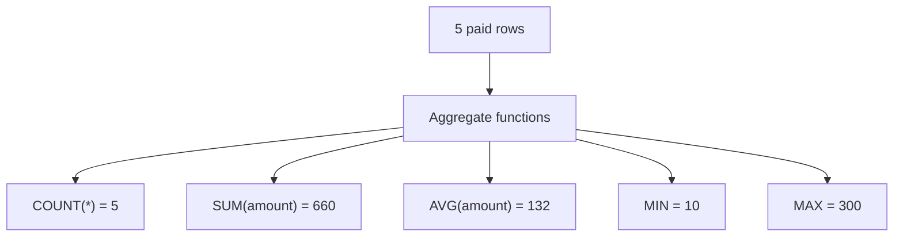
```mermaid
graph TD
  ROWS["5 paid rows"] --> AGG["Aggregate functions"]
  AGG --> C["COUNT(*) = 5"]
  AGG --> S["SUM(amount) = 660"]
  AGG --> A["AVG(amount) = 132"]
  AGG --> MN["MIN = 10"]
  AGG --> MX["MAX = 300"]
```

</div>

### Pitfall

`AVG(amount)` ignores NULLs. If you want NULLs treated as 0:

```sql
-- NULL amounts count as 0 in average
SELECT AVG(COALESCE(amount, 0)) FROM orders;

-- COUNT(*) vs COUNT(col) differ when col has NULLs
SELECT COUNT(*), COUNT(amount) FROM orders;
-- COUNT(*) = 7, COUNT(amount) = 7 (no NULLs in our seed)
-- If there were NULLs, COUNT(*) includes them, COUNT(col) does not
```

---

## 14. GROUPING SETS, ROLLUP, CUBE - multi-level aggregation

### The problem

You want totals per user AND a grand total in the same query. Without this you write two queries and `UNION` them.

### Solution

`GROUPING SETS` lets you group by multiple levels in one pass:

```sql
-- Totals per user + grand total
SELECT user_id, SUM(amount) AS total
FROM orders WHERE status = 'paid'
GROUP BY GROUPING SETS ((user_id), ())
ORDER BY GROUPING(user_id), total DESC;

-- ROLLUP: per user, per status, and grand total
SELECT user_id, status, SUM(amount)
FROM orders
GROUP BY ROLLUP (user_id, status);

-- CUBE: every combination of user_id and status
SELECT user_id, status, SUM(amount)
FROM orders
GROUP BY CUBE (user_id, status);
```

<CopyToPlaygroundButton code={`SELECT user_id, SUM(amount) AS total FROM orders WHERE status = 'paid' GROUP BY GROUPING SETS ((user_id), ()) ORDER BY GROUPING(user_id), total DESC`} />

`GROUPING(col)` returns 1 for the grand total row, 0 for regular groups. Use it to identify which row is the total.

### When to use

*   `GROUPING SETS`: when you need specific combinations of columns.
*   `ROLLUP`: when you want hierarchical totals (user -> status -> grand).
*   `CUBE`: when you want every possible combination.

---

## 15. VALUES, LATERAL, and generate_series - ad-hoc data

### The problem

You need to generate test data, pivot rows to columns, or join a function that returns a variable number of rows.

### Solution

```sql
-- VALUES: inline data without a table
SELECT * FROM (VALUES (1,'Alice'), (2,'Bob')) AS t(id, name);

-- generate_series: create a sequence of numbers
SELECT * FROM generate_series(1, 5); -- 1,2,3,4,5

-- LATERAL: join a function per row
SELECT u.name, o.id
FROM users u
JOIN LATERAL (
  SELECT id FROM orders WHERE user_id = u.id ORDER BY amount DESC LIMIT 2
) o ON true;
-- Top 2 orders per user, without window functions
```

<CopyToPlaygroundButton code={`SELECT u.name, o.id FROM users u JOIN LATERAL (SELECT id FROM orders WHERE user_id = u.id ORDER BY amount DESC LIMIT 2) o ON true`} />

`LATERAL` is like a correlated subquery that can reference the outer table. It runs once per outer row.

---

## 16. Benchmarking - how to measure query performance

### The problem

A query feels slow but you don't know if it's the query or the data. You need to measure, not guess.

### How it works

`EXPLAIN ANALYZE` **runs** the query (not just explains it) and returns the actual plan with timings:

```sql
EXPLAIN ANALYZE SELECT * FROM orders WHERE status = 'paid';
```

<CopyToPlaygroundButton code={`EXPLAIN ANALYZE SELECT * FROM orders WHERE status = 'paid'`} />

Output:

```
Seq Scan on orders  (cost=0.00..7.00 rows=5)
                     (actual time=0.01..0.02 rows=5 loops=1)
Planning Time: 0.05 ms
Execution Time: 0.15 ms
```

| Line | What it means |
|---|---|
| `Seq Scan` | Postgres chose to read every row |
| `rows=5` | Found 5 rows |
| `actual time=0.01..0.02` | Took 0.02ms |
| `Planning Time` | How long Postgres spent deciding the plan |
| `Execution Time` | How long the query actually ran |

### The actual benchmark workflow

Measure before, make change, measure after, compare:

```sql
-- BEFORE: no index
EXPLAIN ANALYZE SELECT * FROM orders WHERE status = 'paid';
-- Execution Time: 0.15ms (Seq Scan)

-- Make the change
CREATE INDEX ON orders(status);

-- AFTER: with index
EXPLAIN ANALYZE SELECT * FROM orders WHERE status = 'paid';
-- Execution Time: 0.08ms (Index Scan)
```

That's benchmarking. Measure, change, measure, compare.

<div style={{display: 'flex', justifyContent: 'center'}}>

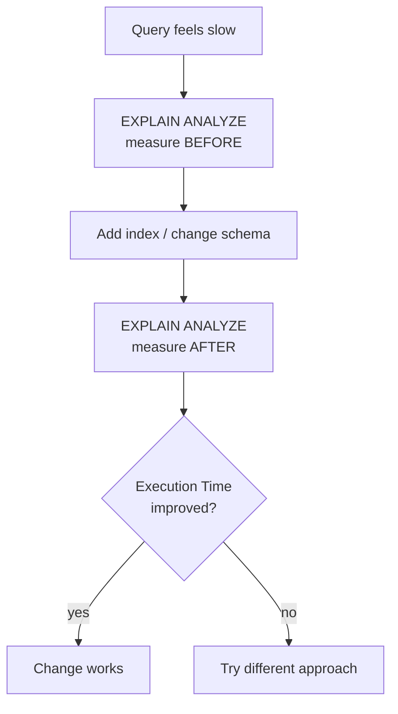
```mermaid
flowchart TD
  SLOW["Query feels slow"] --> BEFORE["EXPLAIN ANALYZE<br/>measure BEFORE"]
  BEFORE --> CHANGE["Add index / change schema"]
  CHANGE --> AFTER["EXPLAIN ANALYZE<br/>measure AFTER"]
  AFTER --> COMPARE{"Execution Time<br/>improved?"}
  COMPARE -->|"yes"| DONE["Change works"]
  COMPARE -->|"no"| TRY["Try different approach"]
```

</div>

### For load testing: pgbench

`EXPLAIN ANALYZE` runs one query once. `pgbench` runs many queries with many users:

```bash
# 10 concurrent users, 100 transactions each
pgbench -h db.your-project.supabase.co -U postgres -c 10 -t 100 postgres
# Output: tps = 150 (transactions per second)
```

### For finding slow queries: pg_stat_statements

You don't always know which query to benchmark. `pg_stat_statements` tracks every query automatically:

```sql
-- Top 5 slowest queries by total time
SELECT query, calls, mean_exec_time
FROM pg_stat_statements
ORDER BY mean_exec_time DESC
LIMIT 5;

-- Top 5 most called queries
SELECT query, calls, mean_exec_time
FROM pg_stat_statements
ORDER BY calls DESC
LIMIT 5;
```

<CopyToPlaygroundButton code={`SELECT query, calls, mean_exec_time FROM pg_stat_statements ORDER BY mean_exec_time DESC LIMIT 5`} />

Shows you the slowest queries with their average time, so you know what to fix first.

### Summary

| Tool | What it does | When to use |
|---|---|---|
| `EXPLAIN ANALYZE` | Run one query, see plan and time | Before/after index or schema change |
| `pgbench` | Simulate many users, measure throughput | Load testing before deploy |
| `pg_stat_statements` | Track all queries, find the slow ones | Finding what to optimize |

---

## 17. Monitoring - what's happening right now

### The problem

A query is slow but you don't know why. Is another transaction blocking it? Is the table full of dead tuples?

### The one query you'll run most

```sql
-- "Why is my DB slow?" - first thing to check
SELECT now() - query_start AS duration, pid, state, query
FROM pg_stat_activity
WHERE state = 'active' AND query NOT LIKE '%pg_stat_activity%'
ORDER BY duration DESC;
```

<CopyToPlaygroundButton code={`SELECT now() - query_start AS duration, pid, state, query FROM pg_stat_activity WHERE state = 'active' AND query NOT LIKE '%pg_stat_activity%' ORDER BY duration DESC`} />

This shows every active query and how long it has been running. If one query has been running for minutes, that's your problem.

<div style={{display: 'flex', justifyContent: 'center'}}>

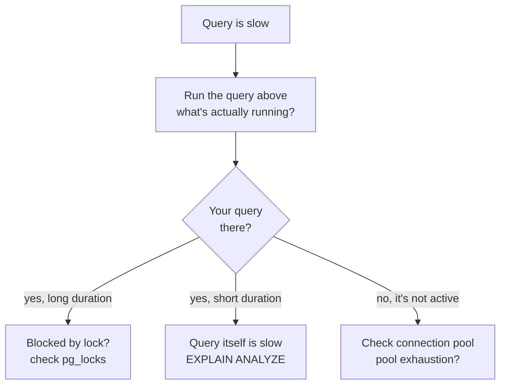
```mermaid
flowchart TD
  SLOW3["Query is slow"] --> FIRST["Run the query above<br/>what's actually running?"]
  FIRST --> FIND{"Your query<br/>there?"}
  FIND -->|"yes, long duration"| BLOCKED["Blocked by lock?<br/>check pg_locks"]
  FIND -->|"yes, short duration"| PLAN["Query itself is slow<br/>EXPLAIN ANALYZE"]
  FIND -->|"no, it's not active"| OTHER["Check connection pool<br/>pool exhaustion?"]
```

</div>

### Three more monitoring queries

```sql
-- Dead tuples: rows updated/deleted but not vacuumed
SELECT relname, n_live_tup, n_dead_tup
FROM pg_stat_user_tables
ORDER BY n_dead_tup DESC LIMIT 5;

-- Unused indexes: wasting write overhead
SELECT indexrelname AS index, idx_scan AS scans
FROM pg_stat_user_indexes
WHERE idx_scan = 0;

-- Connection count: are you running out of connections?
SELECT state, COUNT(*) FROM pg_stat_activity GROUP BY state;
```

### When to monitor

*   **Now** - when a query is slow, run the first query above.
*   **Weekly** - check dead tuples and unused indexes.
*   **After deploy** - run `EXPLAIN ANALYZE` on critical queries.

---

## 18. JSONB - store and query JSON in Postgres

### The problem

Your API returns JSON from a third party. You need to store it, query specific fields, and filter by nested values without parsing it in application code.

### Solution

JSONB (binary JSON) stores JSON in Postgres and lets you query it with operators:

```sql
-- Store JSON
INSERT INTO orders VALUES (100, 1, 250, 'paid', '{"source": "web", "browser": "chrome"}');

-- ->> extracts text, -> extracts JSONB
SELECT data->>'source' AS source FROM orders WHERE id = 100; -- 'web'

-- Filter on JSON fields
SELECT * FROM orders WHERE data->>'source' = 'web';
SELECT * FROM orders WHERE data @> '{"browser": "chrome"}';
SELECT * FROM orders WHERE data->'nested'->>'key' = 'value';

-- Index a JSON field
CREATE INDEX ON orders USING gin (data); -- GIN index for @> containment
CREATE INDEX ON orders ((data->>'source')); -- B-tree for equality
```

<CopyToPlaygroundButton code={`SELECT data->>'source' AS source FROM orders WHERE id = 100`} />

| Operator | Returns | Use case |
|---|---|---|
| `->` | JSONB | `"data->'key'"` |
| `->>` | TEXT | `"data->>'key'"` |
| `@>` | BOOLEAN | Containment: `"data @> '{\"k\":\"v\"}'"` |
| `jsonb_path_query` | Rows | XPath-like queries |

<div style={{display: 'flex', justifyContent: 'center'}}>

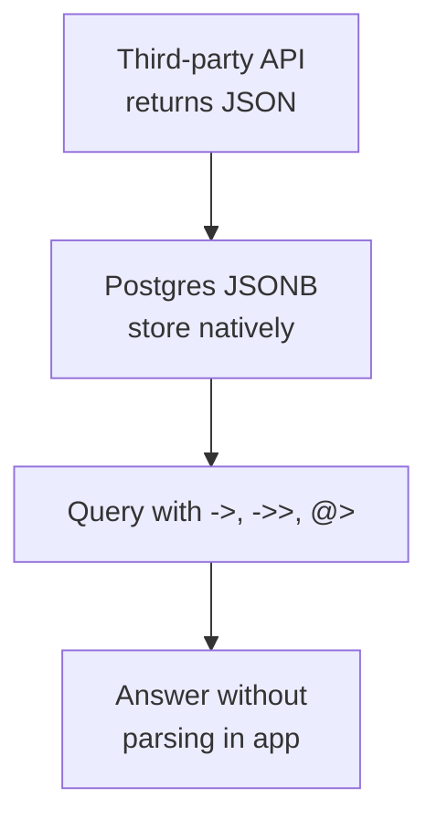
```mermaid
graph TD
  API["Third-party API<br/>returns JSON"] --> STORE["Postgres JSONB<br/>store natively"]
  STORE --> QUERY["Query with ->, ->>, @>"]
  QUERY --> ANSWER["Answer without<br/>parsing in app"]
```

</div>

### When to use JSONB vs columns

*   **Use columns** when data is structured and queried often: `name`, `amount`, `status`.
*   **Use JSONB** when data is semi-structured or varies per row: API responses, user preferences, metadata.

---

## 19. Date/Time - working with timestamps and intervals

### The problem

You need "orders from last 30 days", "group by month", "time difference between two dates". Date functions are in every real query.

### Solution

```sql
-- Current time
SELECT NOW(); -- '2024-01-15 14:30:00.123+00'
SELECT CURRENT_DATE; -- '2024-01-15'

-- Date math
SELECT NOW() - INTERVAL '30 days'; -- 30 days ago
SELECT NOW() + INTERVAL '2 hours';
SELECT NOW() - created_at AS age; -- interval

-- Date truncation
SELECT DATE_TRUNC('month', created_at) AS month, SUM(amount)
FROM orders GROUP BY month ORDER BY month;

-- Date parts
SELECT EXTRACT(DOW FROM created_at) AS day_of_week, -- 0=Sun
       EXTRACT(MONTH FROM created_at) AS month,
       EXTRACT(YEAR FROM created_at) AS year;

-- Filter by date range
SELECT * FROM orders
WHERE created_at >= NOW() - INTERVAL '7 days'
AND created_at < NOW();

-- Age calculation
SELECT name, AGE(NOW(), created_at) AS account_age FROM users;
```

<div style={{display: 'flex', justifyContent: 'center'}}>

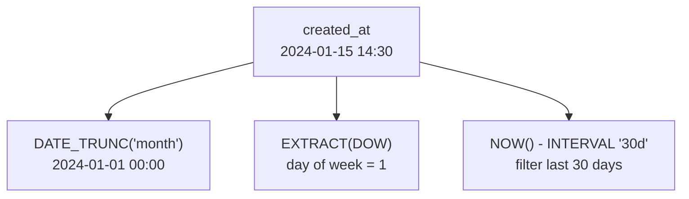
```mermaid
graph TD
  RAW["created_at<br/>2024-01-15 14:30"] --> TRUNC["DATE_TRUNC('month')<br/>2024-01-01 00:00"]
  RAW --> EXTRACT["EXTRACT(DOW)<br/>day of week = 1"]
  RAW --> INT["NOW() - INTERVAL '30d'<br/>filter last 30 days"]
```

</div>

### When to use which

| Need | Function |
|---|---|
| "Last 30 days" | `WHERE created_at >= NOW() - INTERVAL '30 days'` |
| "Group by month" | `GROUP BY DATE_TRUNC('month', created_at)` |
| "How old" | `AGE(NOW(), created_at)` |
| "Day of week" | `EXTRACT(DOW FROM created_at)` |
| "First of month" | `DATE_TRUNC('month', created_at)` |

---

## 20. Subquery vs JOIN performance

### The problem

Two queries return the same result but one is faster. You don't know which to choose.

```sql
-- Subquery
SELECT * FROM users WHERE id IN (SELECT user_id FROM orders WHERE status='paid');

-- JOIN
SELECT DISTINCT u.* FROM users u JOIN orders o ON o.user_id = u.id WHERE o.status='paid';

-- EXISTS
SELECT * FROM users u WHERE EXISTS (SELECT 1 FROM orders o WHERE o.user_id = u.id AND o.status='paid');
```

All three return the same 3 users. But they have different performance characteristics.

### How they differ

| Approach | When it wins | When it loses |
|---|---|---|
| `IN (SELECT ...)` | Small subquery result, Postgres optimizes to semi-join | NULL in subquery makes it unknown |
| `EXISTS` | Large subquery result, stops at first match per row | Overhead per row (index lookup) |
| `JOIN` | When you need columns from both tables | Duplicates if not `DISTINCT`, more memory |
| `LATERAL` | Top-N per group, variable result size | More complex syntax |

### The rule

*   **Need columns from both tables?** Use `JOIN`.
*   **Just checking existence?** Use `EXISTS` (fastest on large data, stops early).
*   **Small subquery?** `IN` is fine and readable.
*   **Top-N per group?** Use `LATERAL`.

<div style={{display: 'flex', justifyContent: 'center'}}>

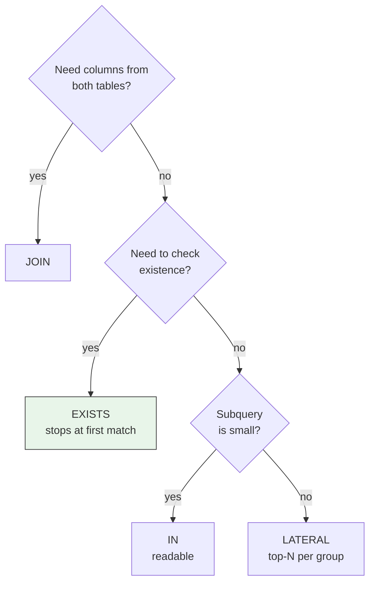
```mermaid
flowchart TD
  Q{"Need columns from<br/>both tables?"}
  Q -->|"yes"| JOIN["JOIN"]
  Q -->|"no"| Q2{"Need to check<br/>existence?"}
  Q2 -->|"yes"| EXISTS["EXISTS<br/>stops at first match"]
  Q2 -->|"no"| Q3{"Subquery<br/>is small?"}
  Q3 -->|"yes"| IN["IN<br/>readable"]
  Q3 -->|"no"| LATERAL["LATERAL<br/>top-N per group"]
  style EXISTS fill:#e8f5e9,stroke:#333
```

</div>

---

## 21. Data modeling basics - normalize and denormalize

### The problem

You're designing a schema. How many tables? When to split? When to merge?

### Normalization (3NF)

**1NF:** Every column is atomic (no arrays, no lists).
**2NF:** No partial dependencies (all non-key columns depend on the whole key).
**3NF:** No transitive dependencies (non-key columns depend only on the key).

```sql
-- Bad: violates 3NF - user_name depends on user_id, not order_id
CREATE TABLE orders_bad (id, user_id, user_name, amount);

-- Good: normalized - separate tables
CREATE TABLE users (id, name);
CREATE TABLE orders (id, user_id, amount); -- user_id references users
```

### When to denormalize

Denormalize when:

*   **Read performance matters more** - a dashboard query joining 5 tables is slow, pre-compute the joined result.
*   **Analytics/reporting** - star schema, pre-aggregated tables.
*   **Caching API responses** - store the response as JSONB to avoid recomputation.

```sql
-- Denormalized: store user_name in orders for fast reads
CREATE TABLE orders_cache AS
SELECT o.*, u.name AS user_name FROM orders o JOIN users u ON u.id = o.user_id;
```

<div style={{display: 'flex', justifyContent: 'center'}}>

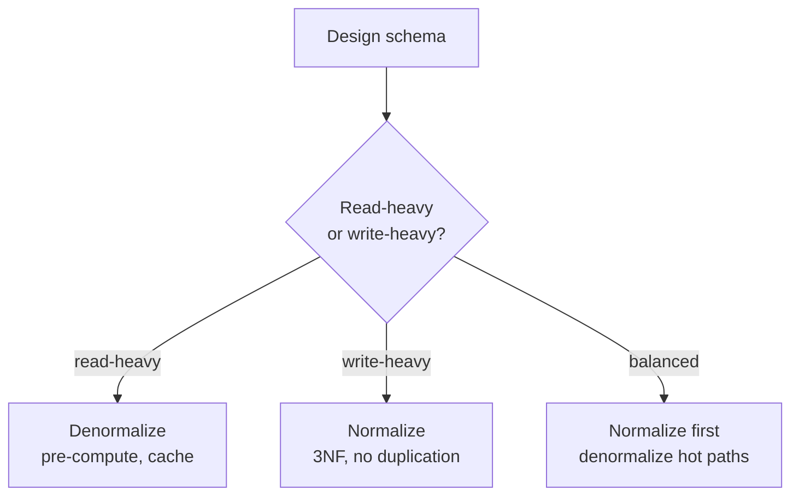
```mermaid
flowchart TD
  START["Design schema"] --> Q{"Read-heavy<br/>or write-heavy?"}
  Q -->|"read-heavy"| DENO["Denormalize<br/>pre-compute, cache"]
  Q -->|"write-heavy"| NORM["Normalize<br/>3NF, no duplication"]
  Q -->|"balanced"| BOTH["Normalize first<br/>denormalize hot paths"]
```

</div>

---

## 22. Views - named queries

### The problem

A complex query is used by 5 reports. You don't want to copy-paste it everywhere.

### Solution

`CREATE VIEW` names a query. Use it like a table.

```sql
-- Create a view
CREATE VIEW paid_orders AS
SELECT o.id, o.amount, o.status, u.name AS user_name, o.created_at
FROM orders o JOIN users u ON u.id = o.user_id
WHERE o.status = 'paid';

-- Query the view like a table
SELECT user_name, SUM(amount) AS total FROM paid_orders GROUP BY user_name;

-- Materialized view: cached result, refresh periodically
CREATE MATERIALIZED VIEW monthly_revenue AS
SELECT DATE_TRUNC('month', created_at) AS month, SUM(amount) AS total
FROM orders WHERE status = 'paid' GROUP BY month;

REFRESH MATERIALIZED VIEW monthly_revenue;
```

**View** = runs the query every time (always fresh).
**Materialized view** = stores the result (fast reads, stale until refreshed).

---

## 23. Recursive CTEs - tree traversal

### The problem

You have hierarchical data: org charts, categories, comments with replies. You need to traverse the tree.

### Solution

`WITH RECURSIVE` lets a CTE reference itself:

```sql
-- Find all reports under Eve (VP Engineering, id=2)
WITH RECURSIVE reports AS (
  SELECT id, name, role, manager_id, 1 AS depth
  FROM employees WHERE manager_id = 2
  UNION ALL
  SELECT e.id, e.name, e.role, e.manager_id, r.depth + 1
  FROM employees e JOIN reports r ON e.manager_id = r.id
)
SELECT * FROM reports;
-- Frank (Eng Manager), Grace (Senior Dev), Heidi (Junior Dev), Ivan (DevOps)
```

<div style={{display: 'flex', justifyContent: 'center'}}>

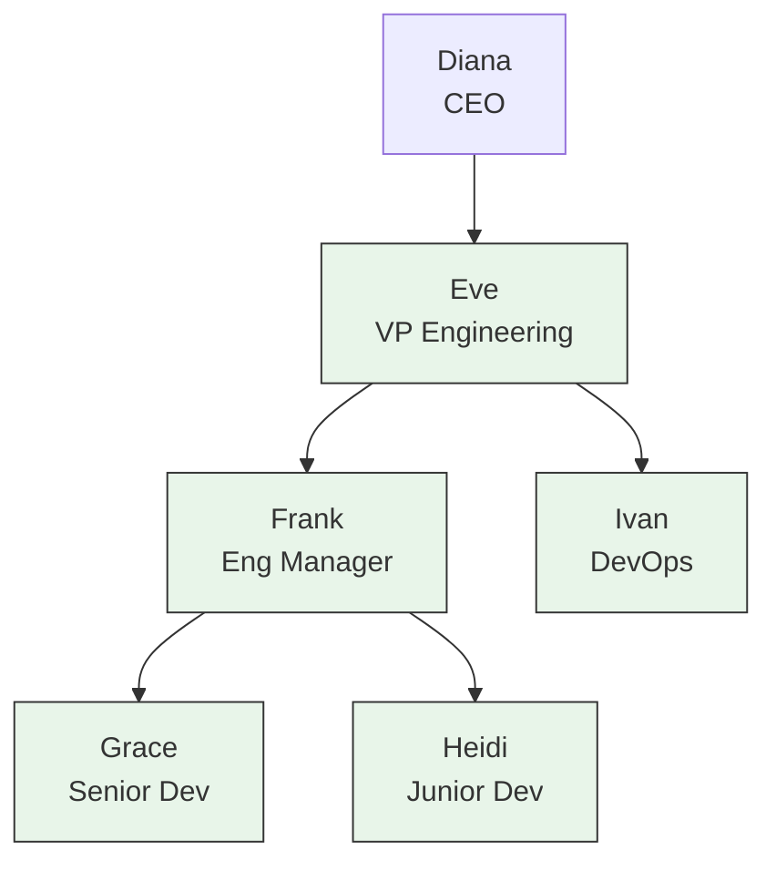
```mermaid
graph TD
  CEO["Diana<br/>CEO"] --> EVE["Eve<br/>VP Engineering"]
  EVE --> FRANK["Frank<br/>Eng Manager"]
  EVE --> IVAN["Ivan<br/>DevOps"]
  FRANK --> GRACE["Grace<br/>Senior Dev"]
  FRANK --> HEIDI["Heidi<br/>Junior Dev"]
  style EVE fill:#e8f5e9,stroke:#333
  style FRANK fill:#e8f5e9,stroke:#333
  style IVAN fill:#e8f5e9,stroke:#333
  style GRACE fill:#e8f5e9,stroke:#333
  style HEIDI fill:#e8f5e9,stroke:#333
```

</div>

**When to use:** org charts, category trees, threaded comments, BOM (bill of materials), graph traversal within SQL.

---

## 24. Full Text Search - searching text without external tools

### The problem

You need to search a text column for keywords. `LIKE '%keyword%'` is slow on big data and doesn't rank results.

### Solution

Postgres has built-in full-text search with `to_tsvector` (index) and `to_tsquery` (search):

```sql
-- Search for 'engineer' in user bios
SELECT name, bio FROM users
WHERE to_tsvector('english', bio) @@ to_tsquery('english', 'engineer');

-- Rank results by relevance
SELECT name, bio, ts_rank(to_tsvector('english', bio), to_tsquery('english', 'engineer developer')) AS rank
FROM users
WHERE to_tsvector('english', bio) @@ to_tsquery('english', 'engineer developer')
ORDER BY rank DESC;

-- Create a GIN index for fast full-text search
CREATE INDEX ON users USING gin (to_tsvector('english', bio));
```

When to use vs `LIKE`:

*   `LIKE '%keyword%'` - simple pattern match, slow on big data, no ranking, no stemming.
*   `@@ to_tsquery` - tokenized search, fast with GIN index, ranks by relevance, supports stemming ("running" matches "run").

---

## 25. UPSERT - insert or update in one query

### The problem

You want to insert a row if it doesn't exist, or update it if it does. Without this you need two queries and a race condition.

### Solution

```sql
-- Insert if new, update if exists
INSERT INTO users (id, name, country)
VALUES (1, 'Alice', 'USA')
ON CONFLICT (id) DO UPDATE SET name = EXCLUDED.name, country = EXCLUDED.country;

-- Insert only if new (do nothing on conflict)
INSERT INTO users (id, name, country)
VALUES (99, 'New User', 'UK')
ON CONFLICT (id) DO NOTHING;

-- Upsert with generated value
INSERT INTO orders (id, user_id, amount, status)
VALUES (1, 1, 999, 'pending')
ON CONFLICT (id) DO UPDATE SET amount = EXCLUDED.amount;
```

`EXCLUDED` refers to the row that was proposed for insertion. `ON CONFLICT` requires a unique constraint or unique index.

<div style={{display: 'flex', justifyContent: 'center'}}>

```mermaid
flowchart TD
  INSERT["INSERT INTO"] --> CHECK{"Row with<br/>key exists?"}
  CHECK -->|"no"| NEW["Insert new row"]
  CHECK -->|"yes"| UPDATE["Update existing row<br/>ON CONFLICT DO UPDATE"]
```

</div>

**When to use:** syncing external data, importing CSVs, API write endpoints where the same data may arrive twice.

---

## 26. Postgres memory - shared_buffers and work_mem

### The problem

A query is slow but the plan looks fine. You added indexes but performance barely improved. The issue might be memory - Postgres is reading from disk instead of memory, or running out of memory for sorts and hashes.

### How Postgres uses memory

Postgres has two main memory areas that directly affect query performance:

<div style={{display: 'flex', justifyContent: 'center'}}>

```mermaid
graph TD
  Q["Query arrives"] --> SHARED["shared_buffers<br/>shared across ALL connections<br/>caches table and index pages"]
  Q --> WORK["work_mem<br/>per-connection memory<br/>sorts, hashes, joins"]
  SHARED --> DISK["Disk (tables, indexes)"]
  WORK --> TEMP["Temp files on disk<br/>when work_mem too small"]
```

</div>

### shared_buffers - the shared cache

This is Postgres's main cache. It stores table pages and index pages that have been read from disk. Every connection shares it.

```
# Default: 128MB - too small for most production systems
# Rule of thumb: 25% of system RAM
# On 8GB server: shared_buffers = 2GB
# On 32GB server: shared_buffers = 8GB
```

```sql
-- Check current setting
SHOW shared_buffers; -- '128MB' (default)

-- Check hit rate - how often data is found in cache vs disk
SELECT
  sum(blks_hit) AS hits,
  sum(blks_read) AS reads,
  round(sum(blks_hit) * 100.0 / nullif(sum(blks_hit) + sum(blks_read), 0), 1) AS hit_pct
FROM pg_stat_database;
-- hit_pct > 99% = good, < 95% = increase shared_buffers
```

If `hit_pct` is low, Postgres is reading from disk constantly. Disk is 1000x slower than memory.

### work_mem - per-connection memory for operations

Every sort, hash join, and hash aggregate needs memory. `work_mem` is how much memory each operation gets per connection.

```
# Default: 4MB - often too small
# Rule of thumb: (system RAM - shared_buffers) / max_connections
# On 8GB server, 50 connections: work_mem = (8GB - 2GB) / 50 = ~120MB
# On shared hosting (Supabase): you can't change it, use less memory-hungry queries
```

```sql
-- Check current setting
SHOW work_mem; -- '4MB' (default)

-- When work_mem is too small, Postgres spills to disk
EXPLAIN ANALYZE SELECT * FROM orders ORDER BY amount;
-- If you see "Sort Method: external merge Disk: 1024kB" -> work_mem too small
-- If you see "Sort Method: quicksort Memory: 24kB" -> working in memory, good
```

When `work_mem` is too small, Postgres writes temporary data to disk. Disk is 1000x slower than memory. A sort that takes 1ms in memory takes 1s on disk.

<div style={{display: 'flex', justifyContent: 'center'}}>

```mermaid
flowchart TD
  SORT["ORDER BY / GROUP BY / JOIN"] --> MEM{"work_mem<br/>big enough?"}
  MEM -->|"yes"| FAST["In-memory sort<br/>fast"]
  MEM -->|"no"| SPILL["Spill to disk<br/>external merge<br/>1000x slower"]
  SPILL --> SLOW["Query feels slow<br/>plan looks fine"]
```

</div>

### How to tell if you're memory-constrained

```sql
-- Check if sorts are spilling to disk
EXPLAIN (ANALYZE, BUFFERS) SELECT * FROM orders ORDER BY amount;
-- Look for: "Sort Method: external merge Disk" -> work_mem too small

-- Check temp files usage
SELECT temp_files, temp_bytes
FROM pg_stat_database
WHERE datname = current_database();
-- temp_files > 0 means queries are spilling to disk

-- Check shared_buffers hit rate
SELECT round(sum(blks_hit) * 100.0 / nullif(sum(blks_hit) + sum(blks_read), 0), 1) AS hit_pct
FROM pg_stat_database;
-- < 95% means shared_buffers too small
```

### What you can change

| Setting | Where to change | When |
|---|---|---|
| `shared_buffers` | `postgresql.conf` or Supabase dashboard (Settings > Database) | Hit rate < 95% |
| `work_mem` | `postgresql.conf` per session, or `SET work_mem = '64MB'` | Sorts spilling to disk |
| `effective_cache_size` | `postgresql.conf` | Tells planner how much memory is available for disk caching |

```sql
-- Per-session work_mem increase (doesn't need restart)
SET work_mem = '64MB';

-- Check if it helped
EXPLAIN (ANALYZE, BUFFERS) SELECT * FROM orders ORDER BY amount;
-- Should see "Sort Method: quicksort Memory" instead of "Disk"
```

### On Supabase you can't change these

Supabase manages Postgres configuration. You can't edit `postgresql.conf` directly. But you can:

*   **Check the values** - know what they are.
*   **Write queries that are memory-friendly** - avoid `SELECT *` on big tables, use `LIMIT`, use covering indexes to avoid temp files.
*   **Upgrade your plan** - bigger Supabase plans get more `shared_buffers` and `work_mem`.

<div style={{display: 'flex', justifyContent: 'center'}}>

```mermaid
flowchart TD
  SLOW2["Query slow"] --> PLAN["EXPLAIN ANALYZE<br/>check plan"]
  PLAN --> DISK2{"Sort spilling<br/>to disk?"}
  DISK2 -->|"yes"| WMEM["Increase work_mem<br/>or rewrite query"]
  DISK2 -->|"no"| HIT{"shared_buffers<br/>hit rate < 95%?"}
  HIT -->|"yes"| SBUFF["Upgrade plan<br/>or add indexes"]
  HIT -->|"no"| OTHER["Check other causes<br/>locks, vacuum, etc."]
```

</div>

---

## 27. How to choose a database - the decision framework

### The problem

You're starting a new project and need to pick a database. There are 20+ options. You don't know which one fits.

### The standard approach

The answer is always: **what data do you have, what queries do you run, and how fast does it need to scale?**

There are 4 questions that narrow it down:

<div style={{display: 'flex', justifyContent: 'center'}}>

```mermaid
flowchart TD
  START["Start: need a database"] --> Q1{"Data is structured<br/>with relations?"}
  Q1 -->|"yes"| Q2{"Need ACID<br/>transactions?"}
  Q2 -->|"yes"| Q3{"Need horizontal<br/>write scaling?"}
  Q3 -->|"no"| PG["PostgreSQL<br/>most features, best ecosystem"]
  Q3 -->|"yes"| CRDB["CockroachDB<br/>distributed SQL"]
  Q2 -->|"no"| Q4["MongoDB<br/>flexible schema, no joins"]
  Q1 -->|"no"| Q5{"Need sub-ms<br/>latency?"}
  Q5 -->|"yes"| REDIS["Redis<br/>in-memory, caching"]
  Q5 -->|"no"| Q6{"Write-heavy?<br/>time-series, IoT?"}
  Q6 -->|"yes"| CASS["Cassandra<br/>write-optimized, multi-DC"]
  Q6 -->|"no"| Q7{"Need auto-scaling<br/>serverless?"}
  Q7 -->|"yes"| DDB["DynamoDB<br/>key-value, auto-scale"]
  Q7 -->|"no"| PG2["PostgreSQL<br/>start here, scale later"]
  style PG fill:#3366cc,color:#fff
  style PG2 fill:#3366cc,color:#fff
```

</div>

### The decision in plain English

1. **Start with Postgres** unless you have a specific reason not to. It handles 90% of use cases: relational data, JSONB for semi-structured data, full-text search, and rich SQL features.

2. **Switch to MongoDB** when your data is document-shaped and varies per record (API responses, CMS content, user preferences). Skip when you need joins or ACID transactions.

3. **Add Redis** as a cache layer, not a primary database. Use it for session storage, rate limiting, leaderboards, and anything needing sub-ms reads.

4. **Consider Cassandra** only for write-heavy, time-series, or multi-region workloads (IoT, telemetry). It trades joins and transactions for write throughput and availability.

5. **Consider DynamoDB** when you're on AWS, need auto-scaling, and your access patterns are simple (key-value lookups). It trades query flexibility for operational simplicity.

6. **Consider CockroachDB** when you need PostgreSQL features but must scale writes horizontally across regions. It's Postgres-compatible with distributed SQL.

### PlanetScale's approach

PlanetScale offers both Postgres and Vitess (MySQL-compatible). Their recommendation:

> Choose based on your existing database experience:
> * **Postgres** if you're currently using PostgreSQL or prefer its feature set
> * **Vitess** if you're currently using MySQL or have a large-scale cluster that requires horizontal sharding

This is practical advice: the best database is the one your team already knows, unless you hit its limits.

### Scaling roadmap

Most projects follow this path:

<div style={{display: 'flex', justifyContent: 'center'}}>

```mermaid
flowchart TD
  S1["Start:<br/>single Postgres"] --> S2["Scale reads:<br/>add replicas"]
  S2 --> S3["Scale writes:<br/>vertical sharding<br/>split tables by service"]
  S3 --> S4["Scale further:<br/>horizontal sharding<br/>Vitess/CockroachDB"]
  S1 -.->|"90% of apps<br/>stop here"| DONE["It works"]
  style DONE fill:#e8f5e9,stroke:#333
```

</div>

Don't shard until you've exhausted simpler options: indexes, query optimization, read replicas, and vertical sharding (splitting tables by service).

### Links

*   [Database Comparison](../computer-science/database-comparison.md) - detailed comparison of PostgreSQL, MongoDB, Cassandra, DynamoDB, CockroachDB, Redis
*   [PlanetScale Postgres vs Vitess](https://planetscale.com/docs/postgres-vs-vitess) - when to choose each

---

## 28. Selectivity - when Postgres uses an index

### The problem

You added an index on `status`, but Postgres still does a sequential scan. Why did it ignore your index?

### What selectivity is

Selectivity is the fraction of rows that match a predicate.

```
selectivity = rows that match / total rows
```

*   **High selectivity** = few rows match (selective) = `WHERE id = 1` on 10M rows -> 1/10M = 0.00001% -> very selective -> **index wins**
*   **Low selectivity** = many rows match (not selective) = `WHERE status = 'paid'` on 7 rows where 5 are paid -> 5/7 = 71% -> not selective -> **sequential scan wins**

Postgres estimates selectivity from statistics (`pg_stats`) and chooses the cheapest plan. An index is only faster when it lets Postgres skip most rows. If the predicate matches 70% of the table, reading the index + looking up 70% of rows is slower than just reading the whole table once.

<div style={{display: 'flex', justifyContent: 'center'}}>

```mermaid
flowchart TD
  Q["WHERE status='paid'<br/>5 of 7 rows = 71%"] --> SEL{"Selectivity<br/>high or low?"}
  SEL -->|"high - few rows<br/>WHERE id=1, 1 of 7"| IDX["Index Scan<br/>skip most rows"]
  SEL -->|"low - many rows<br/>WHERE status='paid', 5 of 7"| SEQ["Seq Scan<br/>read all, filter in memory"]
  style IDX fill:#e8f5e9,stroke:#333
  style SEQ fill:#ffcccc,stroke:#333
```

</div>

### In our seed data

```sql
-- High selectivity: 1 of 7 rows -> index would win on big data
SELECT * FROM orders WHERE id = 1;
-- selectivity = 1/7 = 14% -> selective

-- Low selectivity: 5 of 7 rows -> seq scan wins, even with index
SELECT * FROM orders WHERE status = 'paid';
-- selectivity = 5/7 = 71% -> not selective

-- On 10M rows, the difference is real:
-- WHERE id = 1         -> 1 row -> index scan (1 comparison via B-tree)
-- WHERE status='paid'  -> 7M rows -> seq scan (7M comparisons, index would be slower)
```

<CopyToPlaygroundButton code={`SELECT * FROM orders WHERE id = 1`} />

### How Postgres knows selectivity

Postgres keeps statistics in `pg_stats`. You can see them:

```sql
-- How selective does Postgres think status = 'paid' is?
SELECT most_common_vals, most_common_freqs
FROM pg_stats WHERE tablename = 'orders' AND attname = 'status';
-- most_common_vals = {paid, pending, cancelled}
-- most_common_freqs = {0.71, 0.14, 0.14} -> 71% for paid

-- Row count estimate
SELECT reltuples::bigint AS estimated_rows FROM pg_class WHERE relname = 'orders';
```

If statistics are outdated, the estimate is wrong and Postgres picks the wrong plan. Fix with:

```sql
ANALYZE orders; -- refresh statistics
```

### When to add an index based on selectivity

| Selectivity | Example | Index? |
|---|---|---|
| **High** (< 10% match) | `WHERE id = 1`, `WHERE email = 'a@b.com'` | Yes, index wins |
| **Medium** (10-30%) | `WHERE status = 'pending'` (14%) | Maybe, check EXPLAIN |
| **Low** (> 50% match) | `WHERE status = 'paid'` (71%) | No, seq scan is faster |

Rule: **Index high-selectivity predicates, don't index low-selectivity ones.** On our 7-row seed, `status='paid'` is not selective. On a real 10M row table where 1% are paid, it becomes selective and the index wins.

<div style={{display: 'flex', justifyContent: 'center'}}>

```mermaid
flowchart TD
  PRED["WHERE col = value"] --> EST["Selectivity =<br/>matching rows / total rows"]
  EST --> HIGH{"High selectivity<br/>< 10% match?"}
  HIGH -->|"yes"| ADD["Add index<br/>Index Scan"]
  HIGH -->|"no"| LOW{"Low selectivity<br/>> 50% match?"}
  LOW -->|"yes"| SKIP["No index<br/>Seq Scan faster"]
  LOW -->|"no"| EXPLAIN["Check EXPLAIN ANALYZE"]
  style ADD fill:#6f6,stroke:#333
```

</div>

### Pitfall

Adding an index on a low-selectivity column wastes space and slows every `INSERT` for no benefit. `CREATE INDEX ON orders(status)` on our 71% paid data is useless until the table grows to millions where `paid` becomes rare.

---

## 29. Practice problems - the interview classics

These problems show up in almost every SQL interview round. Each one is runnable against the seed.

### 29.1 Second highest value

#### The problem

Return the second largest order amount.

#### The solution

Take the max of everything below the max, or sort and skip one. In both, the `DISTINCT` matters - without it, ties break the offset trick.

```sql
SELECT MAX(amount) AS second_highest
FROM orders
WHERE amount < (SELECT MAX(amount) FROM orders);
-- 200 (300 is #1, 200 is #2)

SELECT DISTINCT amount FROM orders ORDER BY amount DESC LIMIT 1 OFFSET 1;
-- 200 (DISTINCT protects against duplicate amounts)
```

<CopyToPlaygroundButton code={`SELECT MAX(amount) AS second_highest FROM orders WHERE amount < (SELECT MAX(amount) FROM orders)`} />

**Follow-up the interviewers ask:** "third highest?" Keep the pattern - use `OFFSET` or a window rank and filter `rnk = 3`.

### 29.2 Top-N per group

#### The problem

Top order per user (or top 2, top 3). `GROUP BY` would collapse the rows, so rank inside each group with a window and filter the rank.

```sql
-- Top order per user
SELECT id, user_id, amount
FROM (
  SELECT id, user_id, amount,
    ROW_NUMBER() OVER (PARTITION BY user_id ORDER BY amount DESC) AS rnk
  FROM orders
) t
WHERE rnk = 1;
-- user 1 -> 100, user 2 -> 200, user 3 -> 300

-- Top 2 per user
SELECT id, user_id, amount
FROM (
  SELECT id, user_id, amount,
    ROW_NUMBER() OVER (PARTITION BY user_id ORDER BY amount DESC) AS rnk
  FROM orders
) t
WHERE rnk <= 2;
```

<CopyToPlaygroundButton code={`SELECT id, user_id, amount FROM (SELECT id, user_id, amount, ROW_NUMBER() OVER (PARTITION BY user_id ORDER BY amount DESC) AS rnk FROM orders) t WHERE rnk <= 2`} />

The subquery + filter is the "top-N per group" template. Change `rownum <= 2` to `= 2` for "second per group".

### 29.3 Running total / cumulative sum

#### The problem

Show each order plus the running total. A window with `ORDER BY` makes the sum accumulate row by row instead of collapsing.

```sql
SELECT id, amount,
  SUM(amount) OVER (ORDER BY id) AS running_total
FROM orders
ORDER BY id;
-- 100, 150, 170, 370, 400, 700, 710
```

<CopyToPlaygroundButton code={`SELECT id, amount, SUM(amount) OVER (ORDER BY id) AS running_total FROM orders ORDER BY id`} />

The `ORDER BY` inside the window is what makes it cumulative. Drop it and every row gets the same grand total.

### 29.4 Who earns more than their manager

#### The problem

Self-join `employees` on `manager_id` and compare salaries. The seed has no salary column, so define one inline with `VALUES` (also works in the playground).

```sql
WITH emp AS (
  SELECT * FROM (VALUES
    (1,'Diana','CEO',NULL,200000),
    (2,'Eve','VP Engineering',1,150000),
    (3,'Frank','Eng Manager',2,120000),
    (4,'Grace','Senior Dev',3,100000),
    (5,'Heidi','Junior Dev',3,60000),
    (6,'Ivan','DevOps',2,90000)
  ) AS v(id, name, role, manager_id, salary)
)
SELECT a.name AS employee, a.salary AS emp_salary,
       b.name AS manager, b.salary AS mgr_salary
FROM emp a JOIN emp b ON a.manager_id = b.id
WHERE a.salary > b.salary;
```

<CopyToPlaygroundButton code={`WITH emp AS (SELECT * FROM (VALUES (1,'Diana','CEO',NULL,200000),(2,'Eve','VP Engineering',1,150000),(3,'Frank','Eng Manager',2,120000),(4,'Grace','Senior Dev',3,100000),(5,'Heidi','Junior Dev',3,60000),(6,'Ivan','DevOps',2,90000)) AS v(id,name,role,manager_id,salary)) SELECT a.name AS employee, a.salary AS emp_salary, b.name AS manager, b.salary AS mgr_salary FROM emp a JOIN emp b ON a.manager_id = b.id WHERE a.salary > b.salary`} />

A **self-join** is joining a table to itself with two different aliases. It's the tool for hierarchies, pairs, and comparing rows within one table.

### 29.5 Gaps - find missing ids

#### The problem

Find which ids in a range are missing. Generate the full range with `generate_series`, then anti-join to find the holes.

```sql
WITH seq AS (SELECT generate_series(1, 10) AS id)
SELECT seq.id AS missing
FROM seq
LEFT JOIN orders o ON o.id = seq.id
WHERE o.id IS NULL;
-- 8, 9, 10
```

<CopyToPlaygroundButton code={`WITH seq AS (SELECT generate_series(1, 10) AS id) SELECT seq.id AS missing FROM seq LEFT JOIN orders o ON o.id = seq.id WHERE o.id IS NULL`} />

`LEFT JOIN ... WHERE right.id IS NULL` is the standard "rows in A not in B" idiom. The related **islands** problem (group contiguous runs) adds a bucket column of `id - ROW_NUMBER() OVER (ORDER BY id)` and groups on it.

---

## 30. Window function variants - RANK, DENSE_RANK, NTILE

### The problem

`ROW_NUMBER` always gives a unique number, even for ties. For top-N you usually want ties to share a rank, and `RANK` vs `DENSE_RANK` differ in whether they skip numbers.

### The solution

```sql
SELECT id, status,
  ROW_NUMBER() OVER (ORDER BY status) AS rownum,
  RANK()        OVER (ORDER BY status) AS rnk,
  DENSE_RANK()  OVER (ORDER BY status) AS dense
FROM orders
ORDER BY status;
-- cancelled: rownum=1 rnk=1 dense=1
-- paid (5 rows): rownum=2..6, ALL rnk=2, ALL dense=2
-- pending: rownum=7 rnk=7 (JUMPS), dense=3
```

<CopyToPlaygroundButton code={`SELECT id, status, ROW_NUMBER() OVER (ORDER BY status) AS rownum, RANK() OVER (ORDER BY status) AS rnk, DENSE_RANK() OVER (ORDER BY status) AS dense FROM orders ORDER BY status`} />

### The difference

| Function | Same value as #1 | Next rank | Use for |
|---|---|---|---|
| `ROW_NUMBER` | unique, no ties | continues | exact total order |
| `RANK` | shares rank | **skips** numbers | race rank with gaps |
| `DENSE_RANK` | shares rank | no skip | "ties share, no gaps" |

In the example, the 5 paid orders all get `rnk = 2`. `RANK` then jumps to `7` for the next distinct status; `DENSE_RANK` just goes to `3`.

**Top-N per group almost always wants `DENSE_RANK` (no skip) or `ROW_NUMBER` (unique), never `RANK`** - `RANK` silently drops groups when ties exist.

### NTILE - split into buckets

```sql
SELECT id, amount,
  NTILE(2) OVER (ORDER BY amount DESC) AS bucket
FROM orders;
```

<CopyToPlaygroundButton code={`SELECT id, amount, NTILE(2) OVER (ORDER BY amount DESC) AS bucket FROM orders`} />

`NTILE(n)` divides the rows into `n` equal buckets. Use it for percentiles, quartiles, or splitting work evenly.

### LAG / LEAD - peek at neighbors

```sql
SELECT id, user_id, amount,
  LAG(amount)  OVER (PARTITION BY user_id ORDER BY id) AS prev_amount,
  LEAD(amount) OVER (PARTITION BY user_id ORDER BY id) AS next_amount
FROM orders;
```

<CopyToPlaygroundButton code={`SELECT id, user_id, amount, LAG(amount) OVER (PARTITION BY user_id ORDER BY id) AS prev_amount, LEAD(amount) OVER (PARTITION BY user_id ORDER BY id) AS next_amount FROM orders`} />

`LAG`/`LEAD` compare a row to the previous/next one - the backbone of "how much did it change" queries.

### Moving average

```sql
SELECT id, amount,
  AVG(amount) OVER (ORDER BY id ROWS BETWEEN 1 PRECEDING AND CURRENT ROW) AS moving_avg
FROM orders;
```

<CopyToPlaygroundButton code={`SELECT id, amount, AVG(amount) OVER (ORDER BY id ROWS BETWEEN 1 PRECEDING AND CURRENT ROW) AS moving_avg FROM orders`} />

The `ROWS BETWEEN ... AND ...` defines the window frame. `RANGE BETWEEN` (the default) includes ties; `ROWS` uses physical rows.

---

## 31. String functions and data types - the practical toolkit

### The problem

Real data is messy: names have spaces, emails have case, text needs cleaning before a report or a `WHERE`. These functions are in every real query.

### The solution

```sql
SELECT
  name,
  UPPER(name)                      AS upper_name,
  TRIM('  Hello  ')                AS trimmed,
  SUBSTRING(name FROM 1 FOR 3)     AS first3,
  LENGTH(name)                     AS len,
  REPLACE(name, 'Alice', 'Alicia') AS alias,
  COALESCE(bio, 'no bio')          AS safe_bio
FROM users;
```

<CopyToPlaygroundButton code={`SELECT name, UPPER(name) AS upper_name, TRIM('  Hello  ') AS trimmed, SUBSTRING(name FROM 1 FOR 3) AS first3, LENGTH(name) AS len, REPLACE(name, 'Alice', 'Alicia') AS alias, COALESCE(bio, 'no bio') AS safe_bio FROM users`} />

```sql
-- Concatenate and split
SELECT name || ' from ' || country AS descr FROM users;
SELECT SPLIT_PART('engineer;fullstack', ';', 2) AS part; -- 'fullstack'
```

<CopyToPlaygroundButton code={`SELECT name || ' from ' || country AS descr FROM users`} />

### Type conversions (casts)

`::` casts a value. The DB decides the target type; text and numbers convert explicitly.

```sql
SELECT amount,
  amount::text   AS text_version,
  amount::int    AS int_version,
  '123'::numeric + 1 AS math_from_text
FROM orders;
```

<CopyToPlaygroundButton code={`SELECT amount, amount::text AS text_version, amount::int AS int_version, '123'::numeric + 1 AS math_from_text FROM orders`} />

### When to clean in SQL vs the app

*   **SQL** - simple shape changes, normalizing data, `COALESCE` for defaults, filtering.
*   **App** - regex/unicode edge cases, or logic you'll change often without a redeploy.

### Pitfall

`LENGTH` counts characters, not bytes (use `octet_length` for bytes). `TRIM` only strips spaces by default; strip other chars with `TRIM('x' FROM str)`. And `NULL || 'x'` is `NULL` - concat doesn't ignore `NULL`, only `COALESCE` does.

---

## 32. ACID and isolation levels - deeper

### The problem

Section 10 introduced transactions. This adds the four anomalies isolation solves and the levels that fix them.

### The four read anomalies

| Anomaly | What happens | Fixed by |
|---|---|---|
| Dirty read | Reads a value another txn wrote but hasn't committed | Read Committed |
| Non-repeatable read | Same row read twice gives different values | Repeatable Read |
| Phantom read | Same query returns newly inserted rows | Repeatable Read / Serializable |
| Lost update | Two txns read, both write, second wins | `FOR UPDATE` or Serializable |

### The four isolation levels

| Level | Dirty read | Non-repeatable | Phantom | Behavior |
|---|---|---|---|---|
| Read Uncommitted | yes | yes | yes | Postgres cannot actually do this |
| Read Committed (default) | no | yes | yes | sees only committed data |
| Repeatable Read | no | no | no | snapshot at first read |
| Serializable | no | no | no | serializes conflicting txns |

Postgres is *stricter* than the standard: it can't do dirty reads, and its Repeatable Read (snapshot-based) also prevents phantoms.

```sql
BEGIN ISOLATION LEVEL REPEATABLE READ;
SELECT * FROM orders WHERE user_id = 1; -- same snapshot even if others commit
COMMIT;
```

### Lost update fix

Read-then-write is a race. Either do the update atomically, or lock the row first:

```sql
BEGIN;
SELECT amount FROM orders WHERE id = 1 FOR UPDATE; -- lock this row
UPDATE orders SET amount = amount + 50 WHERE id = 1;
COMMIT;
```

<div style={{display: 'flex', justifyContent: 'center'}}>

```mermaid
graph TD
  RC["Read Committed<br/>no dirty reads"] --> RR["Repeatable Read<br/>no non-repeatable / phantom"]
  RR --> SER["Serializable<br/>no conflicts, may abort"]
```

</div>

### Pitfall

The default (Read Committed) is usually right. Reach for Serializable only when you must, because it can abort txns on conflict - retry in the app.

---

## 33. ORM reality - the N+1 problem and SQL injection

### The problem

You use an ORM (Prisma, TypeORM, Sequelize, Hibernate). The `users` query is fine, then you touch `user.orders` in a loop - and the ORM fires one query per user. That is the **N+1 problem**.

### What N+1 looks like

```js
// N+1: 1 query for users, then 1 query per user for their orders
const users = await prisma.user.findMany();
for (const u of users) {
  const orders = await prisma.order.findMany({ where: { userId: u.id } }); // runs once per user
}
// N users -> 1 + N queries. With 1,000 users that is 1,001 round-trips.
```

```js
// Fixed: eager-load in one query
const users = await prisma.user.findMany({ include: { orders: true } });
// 1 query (a JOIN). Same data, ~1000x fewer round-trips.
```

The loop runs this, repeated per user:

```sql
SELECT * FROM orders WHERE user_id = 1;
SELECT * FROM orders WHERE user_id = 2;  -- repeated N times
```

vs the fix, one query:

```sql
SELECT u.*, o.id AS order_id, o.amount
FROM users u LEFT JOIN orders o ON o.user_id = u.id;
```

### The rule

*   **Never** read a relation inside a loop - that's the N+1 trap.
*   **Batch or eager-load** (`include` / `relations` / `with`) when you read a list.
*   Check the query log - the same `SELECT * FROM orders WHERE user_id = ?` repeated is the tell.

### SQL injection

Never build SQL by string concatenation with user input. Always parameterize.

```sql
-- ❌ DANGER: user input pasted into the SQL string
-- SELECT * FROM users WHERE name = 'Bob' OR '1'='1'   (crafted name -> table dump)

-- ✅ SAFE: the DB treats the parameter as data, not code
-- prisma.$queryRaw`SELECT * FROM users WHERE name = ${input}`
```

ORMs parameterize by default - the injection bug only comes back if you write `WHERE name = '${input}'`.

---

## 34. Schema design interviews - relationships and normalization

### The problem

"Design a schema for X" is a standard interview. Lay out the tables, nail the relationship cardinalities, then justify normalization or denormalization.

### The three relationship types

| Relationship | Example | Where the key lives |
|---|---|---|
| 1:1 | `user <-> profile` | FK on either side, unique |
| 1:N | `user -> orders` | FK on the many side (`order.user_id`) |
| M:N | `users <-> posts` (likes) | a junction table (2 FKs) |

### The M:N junction table

Never store a list of ids in one column. Create a join table with one row per pair:

```sql
-- M:N: a user likes many posts, a post has many likes
create table posts (id int primary key, user_id int, title text);
create table likes (
  user_id int references users(id),
  post_id int references posts(id),
  primary key (user_id, post_id)
);
```

### The worked example: users, posts, likes

```mermaid
erDiagram
  USERS ||--o{ ORDERS : "places"
  USERS ||--o{ POSTS : "writes"
  USERS ||--o{ LIKES : "gives"
  POSTS ||--o{ LIKES : "receives"
```

### How to approach a schema question

1. **List the nouns.** users, orders, posts, likes - each becomes a table.
2. **Define the relationships.** 1:N or M:N; put the FK on the many side, use a junction for M:N.
3. **Add constraints.** primary keys, unique email, `NOT NULL`, `CHECK`, FK.
4. **Describe the one hot path.** The most common query is where you'd denormalize or add an index.

### Pitfall

A "wide table" - one table with many nullable columns that are empty for most rows - is a smell. Split it. That is what normalization exists to prevent.

---

## 35. Cross-database portability - MySQL and SQL Server

### The problem

US/CA/EU interviews and jobs also run MySQL, SQL Server, or SQLite. Several Postgres idioms in this doc do not port.

### The differences that matter

| Task | Postgres | MySQL | SQL Server |
|---|---|---|---|
| Limit rows | `LIMIT n` | `LIMIT n` | `SELECT TOP n` |
| Paginate | `OFFSET n` | `LIMIT n OFFSET n` | `OFFSET n ROWS FETCH` |
| One row per group | `DISTINCT ON (col)` | window / `GROUP BY` | window / `ROW_NUMBER` |
| Text concat | `a \|\| b` | `CONCAT(a, b)` | `a + b` |
| Auto increment | identity | `AUTO_INCREMENT` | `IDENTITY` |
| Group BY strictness | requires all cols | `ONLY_FULL_GROUP_BY` | loose, wrong results |

### The portability rules

*   Avoid `DISTINCT ON` and inline `VALUES` CTE tricks if you may switch engines.
*   Standard `OVER (PARTITION BY ...)` window functions work on all three - use them.
*   For top-N, keep `ORDER BY` + `LIMIT` (Postgres/MySQL), switch to `TOP` for SQL Server.
*   Don't rely on `true`/`false` vs `1`/`0` or boolean semantics crossing engines.

### The one pattern that always works

```sql
-- Top-N per group - portable across Postgres, MySQL, and SQL Server
SELECT * FROM (
  SELECT id, user_id, amount,
    ROW_NUMBER() OVER (PARTITION BY user_id ORDER BY amount DESC) AS rnk
  FROM orders
) t
WHERE rnk <= 2;
```

<CopyToPlaygroundButton code={`SELECT * FROM (SELECT id, user_id, amount, ROW_NUMBER() OVER (PARTITION BY user_id ORDER BY amount DESC) AS rnk FROM orders) t WHERE rnk <= 2`} />

Window functions with `OVER (PARTITION BY ... ORDER BY ...)` are standard SQL, so they are the safest answers when the interviewer's stack is unknown.

---

## 36. INSERT, UPDATE, DELETE, RETURNING - writing data

### The problem

Every query so far reads data. On the job you write every day, and the mistakes are the classics: an `UPDATE` or `DELETE` with a missing `WHERE` rewrites the whole table.

### The solution

```sql
-- INSERT one row
INSERT INTO orders (id, user_id, amount, status) VALUES (100, 1, 250, 'pending');

-- INSERT many rows
INSERT INTO orders (id, user_id, amount, status) VALUES
  (101, 1, 60, 'paid'),
  (102, 2, 45, 'paid');

-- INSERT from a query (copy cancelled orders as new pending ones)
INSERT INTO orders (id, user_id, amount, status)
SELECT id + 200, user_id, amount, 'pending' FROM orders WHERE status = 'cancelled';

-- UPDATE with a filter. Always WHERE.
UPDATE orders SET status = 'cancelled' WHERE id = 3;

-- DELETE with a filter. Always WHERE.
DELETE FROM orders WHERE status = 'cancelled';

-- RETURNING: get the changed rows back in the same round-trip
INSERT INTO orders (id, user_id, amount, status) VALUES (103, 3, 99, 'paid')
RETURNING id, status;

UPDATE orders SET amount = amount + 10 WHERE user_id = 1
RETURNING id, amount;
```

`RETURNING` saves a second `SELECT` after the write. ORMs and PostgREST/Supabase APIs use it internally to send the inserted row back to the client.

### Pitfall

`UPDATE orders SET status = 'x'` with no `WHERE` updates every row. In production, wrap writes in a transaction, `SELECT` the affected row count first, then `COMMIT`. Never run a destructive write against production without testing the `WHERE` with a `SELECT` first.

---

## 37. The classic transaction - transferring money

### The problem

Move $50 from Alice to Bob. That is two `UPDATE`s: debit one balance, credit the other. If the process dies after the debit commits but before the credit, the money vanishes. This is the canonical transaction interview question.

### The solution

Wrap both writes in one transaction. Lock the rows in a consistent order to avoid deadlocks (see section 39).

```sql
BEGIN;
-- Lock both rows up front, in a consistent order (by id)
SELECT id FROM accounts WHERE id IN (1, 2) ORDER BY id FOR UPDATE;

UPDATE accounts SET balance = balance - 50 WHERE id = 1;
UPDATE accounts SET balance = balance + 50 WHERE id = 2;
COMMIT; -- both applied, or neither
```

This is ACID in action: **Atomicity** (both updates or none), **Consistency** (total money unchanged), **Isolation** (others see old or new, never half), **Durability** (survives a crash after `COMMIT`).

<div style={{display: 'flex', justifyContent: 'center'}}>

```mermaid
flowchart TD
  B["BEGIN"] --> L["FOR UPDATE<br/>lock both rows"]
  L --> D["Debit Alice -50"]
  D --> C["Credit Bob +50"]
  C --> OK{"Any step failed?"}
  OK -->|"no"| COM["COMMIT<br/>both visible"]
  OK -->|"yes"| RB["ROLLBACK<br/>nothing applied"]
```

</div>

### Pitfall

Do not read the balance in the app, check it, then update. Two concurrent requests both pass the check and both debit. Do it atomically in one statement:

```sql
-- Atomic: only debits if the funds exist. No row returned = insufficient funds.
UPDATE accounts SET balance = balance - 50
WHERE id = 1 AND balance >= 50
RETURNING balance;
```

If zero rows come back, the balance was too low and nothing was written.

---

## 38. UPDATE and DELETE based on another table

### The problem

"Cancel all orders from users in India" or "flag orders above the user's average". The filter needs data from another table, but `UPDATE` and `DELETE` have no `JOIN` clause.

### The solution

Postgres uses `FROM` for `UPDATE` and `USING` for `DELETE`:

```sql
-- UPDATE with a join
UPDATE orders o
SET status = 'flagged'
FROM users u
WHERE o.user_id = u.id
  AND u.country = 'India';

-- DELETE with a join
DELETE FROM orders o
USING users u
WHERE o.user_id = u.id
  AND u.country = 'India';

-- Portable alternative: a subquery (works in MySQL too)
UPDATE orders SET status = 'flagged'
WHERE user_id IN (SELECT id FROM users WHERE country = 'India');

DELETE FROM orders
WHERE user_id IN (SELECT id FROM users WHERE country = 'India');
```

### Pitfall

Do not list the target table again in `FROM` (`UPDATE orders o ... FROM orders`), that creates a cross join against itself. The target is named once, the other tables go in `FROM`/`USING`.

---

## 39. Deadlocks - two transactions waiting on each other

### The problem

T1 locks order 1 then wants order 2. T2 locks order 2 then wants order 1. Each waits for the other forever. Postgres detects the cycle, kills one transaction with `deadlock detected`, and the app must retry.

<div style={{display: 'flex', justifyContent: 'center'}}>

```mermaid
flowchart TD
  T1["T1: lock order 1"] --> W1["T1 wants order 2<br/>blocked, held by T2"]
  T2["T2: lock order 2"] --> W2["T2 wants order 1<br/>blocked, held by T1"]
  W1 --> DEAD["Deadlock detected<br/>Postgres kills one txn"]
  W2 --> DEAD
```

</div>

### The solution

Three rules that prevent almost all deadlocks:

1. **Lock in a consistent order.** Every transaction touches rows in the same order, for example by ascending id.
2. **Keep transactions short.** Less time holding locks, fewer overlaps.
3. **Take one lock instead of many.** A single `IN` clause locks all rows atomically.

```sql
-- Deadlock-prone (different order in different code paths):
-- T1: UPDATE orders SET ... WHERE id = 1; UPDATE orders SET ... WHERE id = 2;
-- T2: UPDATE orders SET ... WHERE id = 2; UPDATE orders SET ... WHERE id = 1;

-- Fixed: both paths lock in id order, atomically
SELECT * FROM orders WHERE id IN (1, 2) ORDER BY id FOR UPDATE;
UPDATE orders SET amount = 0 WHERE id IN (1, 2);
```

Deadlocks show up in the Postgres log. To see who is blocking whom right now, join `pg_locks` against `pg_stat_activity`.

---

## 40. Keyset pagination - the right way to page

### The problem

`OFFSET 100000` scans and discards 100000 rows to return 20. Every deeper page costs more. Users scrolling an infinite feed hit this hard.

### The solution

Remember the last value you returned and filter past it. The database seeks directly instead of counting and skipping.

```sql
-- Page 1
SELECT id, amount FROM orders ORDER BY id LIMIT 3;
-- returns ids 1, 2, 3

-- Page 2: no OFFSET, just WHERE past the last id you saw
SELECT id, amount FROM orders WHERE id > 3 ORDER BY id LIMIT 3;
-- returns ids 4, 5, 6
```

<CopyToPlaygroundButton code={`SELECT id, amount FROM orders WHERE id > 3 ORDER BY id LIMIT 3`} />

<div style={{display: 'flex', justifyContent: 'center'}}>

```mermaid
flowchart TD
  P["Page request"] --> Q{"Which pagination?"}
  Q -->|"OFFSET 100000"| OFF["Scan + discard<br/>100000 rows<br/>slow, O(offset)"]
  Q -->|"WHERE id > last"| KEY["Index seek<br/>straight to row<br/>fast, O(1)"]
```

</div>

### Pitfall

Keyset needs a stable, unique sort column. If you sort by `amount` (which has ties), add the id as a tiebreaker and use tuple comparison:

```sql
SELECT id, amount FROM orders
WHERE (amount, id) > (100, 1)
ORDER BY amount, id
LIMIT 3;
```

---

## 41. Islands - grouping consecutive runs

### The problem

Find streaks: consecutive login days, runs of sequential ids. A plain `GROUP BY` can not do it because the groups depend on adjacency, not on a shared value.

### The solution

The classic trick: for consecutive values, `value - ROW_NUMBER()` is constant within a run and changes when the run breaks.

```sql
WITH logins AS (
  SELECT * FROM (VALUES (1),(2),(3),(5),(6),(9)) AS v(day)
),
marked AS (
  SELECT day, day - ROW_NUMBER() OVER (ORDER BY day) AS grp
  FROM logins
)
SELECT MIN(day) AS streak_start, MAX(day) AS streak_end, COUNT(*) AS length
FROM marked
GROUP BY grp
ORDER BY streak_start;
-- 1-3 (3 days), 5-6 (2 days), 9-9 (1 day)
```

<CopyToPlaygroundButton code={`WITH logins AS (SELECT * FROM (VALUES (1),(2),(3),(5),(6),(9)) AS v(day)), marked AS (SELECT day, day - ROW_NUMBER() OVER (ORDER BY day) AS grp FROM logins) SELECT MIN(day) AS streak_start, MAX(day) AS streak_end, COUNT(*) AS length FROM marked GROUP BY grp ORDER BY streak_start`} />

Days 1,2,3 have row numbers 1,2,3, so `day - rn` is 0 for all three. Day 5 has row number 4, so `5 - 4 = 1`. The constant changes exactly where the streak breaks, which gives you the group key. This "gaps and islands" pattern is a senior-level interview favorite.

---

## 42. Connection pooling - why Postgres needs it

### The problem

Every Postgres connection is a full OS process costing 5-10MB of RAM and real setup time. A serverless app or a traffic burst opening hundreds of connections exhausts the database: `FATAL: sorry, too many clients`. On the job this is one of the most common production outages.

### The solution

A pooler keeps a small set of real connections and multiplexes many client connections onto them.

<div style={{display: 'flex', justifyContent: 'center'}}>

```mermaid
flowchart TD
  APP1["App instance 1<br/>50 clients"] --> POOL["Pooler (PgBouncer)<br/>transaction mode"]
  APP2["App instance 2<br/>50 clients"] --> POOL
  POOL --> C1["real connection 1"]
  POOL --> C2["real connection 2"]
  POOL --> C3["... ~10-20 total"]
  C1 --> PG["Postgres<br/>default max 100"]
  C2 --> PG
  C3 --> PG
```

</div>

*   **PgBouncer** in transaction mode is the standard pooler. A client holds a real connection only for the duration of one transaction.
*   **Supabase** runs one for you: port `6543` is the pooler, port `5432` is a direct connection. Serverless functions must use the pooler.
*   **App-level pools** also exist: Prisma `connection_limit`, TypeORM `poolSize`, JDBC pool. Keep the total across all app instances under the database limit.

Pool size is not 100. A common starting point is `(CPU cores * 2) + disks`. Bigger pools often make things slower, not faster.

```sql
-- See the problem: how many connections exist right now
SELECT state, COUNT(*) AS connections
FROM pg_stat_activity
GROUP BY state;
```

<CopyToPlaygroundButton code={`SELECT state, COUNT(*) AS connections FROM pg_stat_activity GROUP BY state`} />

### Pitfall

In transaction mode, session-level features do not survive between statements: `SET`, session prepared statements, and advisory locks can silently not work. Use the direct port for migrations.

---

## 43. Permissions - GRANT and Row Level Security

### The problem

Your API connects to Postgres as one role. If user A must never see user B's orders, enforcing that only in application code means one missed `WHERE` leaks data. Defense in depth means the database itself refuses.

### The solution

Roles and privileges control what a connection can do. Row Level Security (RLS) controls which rows a query can see. Supabase is built on RLS.

```sql
-- Roles and table privileges
CREATE ROLE reporting;
GRANT SELECT ON orders TO reporting;
REVOKE DELETE ON orders FROM reporting;

-- Enable RLS: after this, NO rows are visible unless a policy allows them
ALTER TABLE orders ENABLE ROW LEVEL SECURITY;

-- Policy: a connection only sees its own orders
CREATE POLICY own_orders ON orders
  FOR SELECT
  USING (user_id = current_setting('app.user_id')::int);

-- Supabase version: match against the JWT user id
CREATE POLICY own_orders ON orders
  FOR SELECT
  USING (user_id = auth.uid());
```

<div style={{display: 'flex', justifyContent: 'center'}}>

```mermaid
flowchart TD
  REQ["Request as user A"] --> Q["SELECT * FROM orders"]
  Q --> RLS{"RLS policy<br/>user_id = auth.uid()"}
  RLS -->|"row matches"| SHOW["Row returned"]
  RLS -->|"row is user B's"| HIDE["Row invisible<br/>not an error, just absent"]
```

</div>

### Pitfall

RLS is off by default, so enabling it is step one. And the Supabase `service_role` key **bypasses** RLS entirely. Keep the service key on the server only; if it ships to the browser, every policy is meaningless.

---

## 44. Index-killing query patterns - why your index is ignored

### The problem

The index exists. `EXPLAIN ANALYZE` shows a Seq Scan anyway. The query shape makes the index useless, and this comes up both in interviews ("why is this slow?") and on the job.

### Pattern 1: function on the column

A B-tree index stores the raw column values, sorted. Wrapping the column in a function means Postgres must compute the function for every row, so it cannot walk the tree.

```sql
-- Bad: index on name is useless
SELECT * FROM users WHERE LOWER(name) = 'alice';

-- Good: raw column comparison uses the index
SELECT * FROM users WHERE name = 'Alice';

-- Fix if you must: index the expression itself
CREATE INDEX ON users (LOWER(name));
```

Other common culprits:

```sql
-- Bad: index on created_at not usable
SELECT * FROM orders WHERE DATE(created_at) = '2024-01-15';
SELECT * FROM orders WHERE DATE_TRUNC('month', created_at) = DATE_TRUNC('month', NOW());

-- Good: range on the raw column
SELECT * FROM orders
WHERE created_at >= '2024-01-15' AND created_at < '2024-01-16';
```

The range rewrite is the standard fix: push the math onto the constant side, keep the column bare.

### Pattern 2: leading wildcard LIKE

An index can seek `name LIKE 'A%'` (find where 'A' starts in the tree). It cannot seek `name LIKE '%ice'` - there is no way to know where the string ends up, so every row must be checked.

```sql
-- Indexable: prefix match
SELECT * FROM users WHERE name LIKE 'A%';

-- Not indexable: leading wildcard, always a scan
SELECT * FROM users WHERE name LIKE '%ice';

-- Fix if you need substring search: trigram index
CREATE EXTENSION IF NOT EXISTS pg_trgm;
CREATE INDEX ON users USING gin (name gin_trgm_ops);
-- Now '%ice%' can use the trigram index
```

<CopyToPlaygroundButton code={`SELECT * FROM users WHERE name LIKE 'A%'`} />

### Pattern 3: implicit type casts

Comparing values of different types forces a cast on the column side, which defeats the index exactly like pattern 1.

```sql
-- If email were varchar and you pass a different type, or join
-- text against uuid without casting, Postgres may cast the column
-- and skip the index.

-- Bad habit: numbers compared as strings (or vice versa in the schema)
SELECT * FROM orders WHERE user_id = '1';  -- usually OK: the constant is cast

-- Dangerous direction: column cast to match the constant
SELECT * FROM orders WHERE amount::text LIKE '1%'; -- amount index dead
```

Rule: the column should stay bare. Cast the constant, never the column.

<div style={{display: 'flex', justifyContent: 'center'}}>

```mermaid
flowchart TD
  Q["WHERE with index"] --> C{"Is the column<br/>bare?"}
  C -->|"yes: col = value"| IDX["Index Scan<br/>walk the B-tree"]
  C -->|"LOWER(col) = value"| FIX1["Seq Scan<br/>fix: index LOWER(col)<br/>or compare raw"]
  C -->|"col LIKE '%x'"| FIX2["Seq Scan<br/>fix: prefix match<br/>or trigram index"]
  C -->|"col::text = value"| FIX3["Seq Scan<br/>fix: cast the constant,<br/>not the column"]
  style IDX fill:#e8f5e9,stroke:#333
```

</div>

### The checklist

When an index is ignored, ask in order:

1. **Is the column wrapped in a function?** Rewrite so the column is bare, or add an expression index.
2. **Is there a leading wildcard?** Use prefix matching, or `pg_trgm` for real substring search.
3. **Is the column being cast?** Cast the constant, or fix the schema types to match.

Then confirm with `EXPLAIN ANALYZE` (section 16) - if you still see Seq Scan, the index genuinely is not being used.

### Pitfall

The expression index must match the query exactly. `CREATE INDEX ON users (LOWER(name))` only helps `WHERE LOWER(name) = ...`. A query with plain `WHERE name = ...` still uses the regular index, and `WHERE UPPER(name) = ...` uses nothing at all.

</div>

</SQLPlaygroundProvider>

