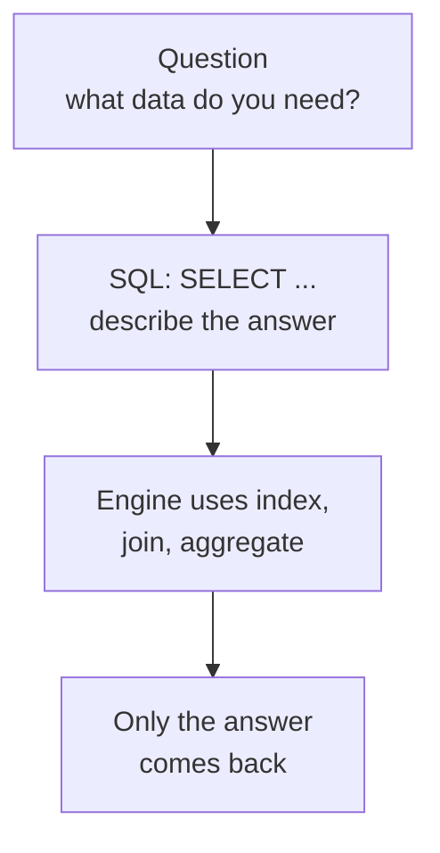
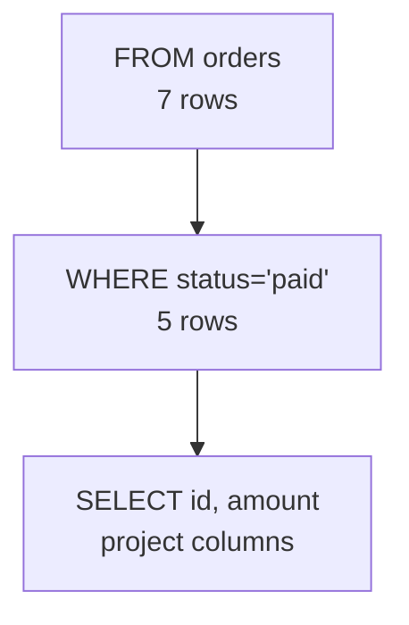
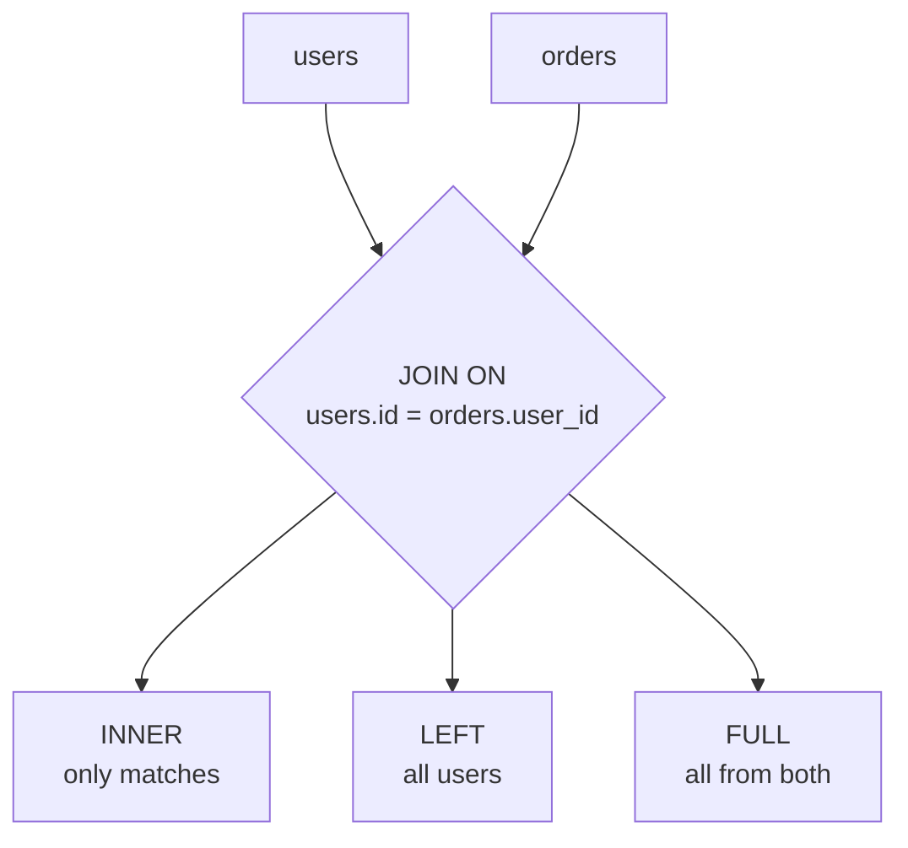
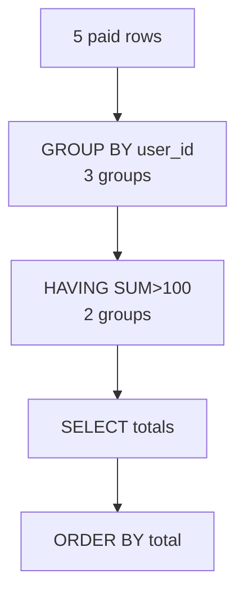
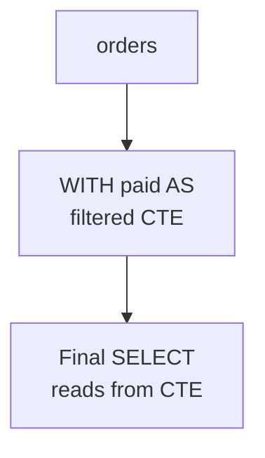
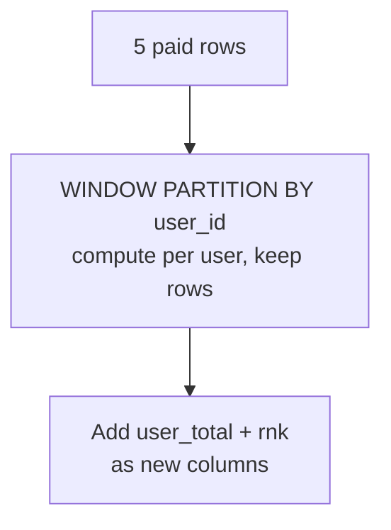
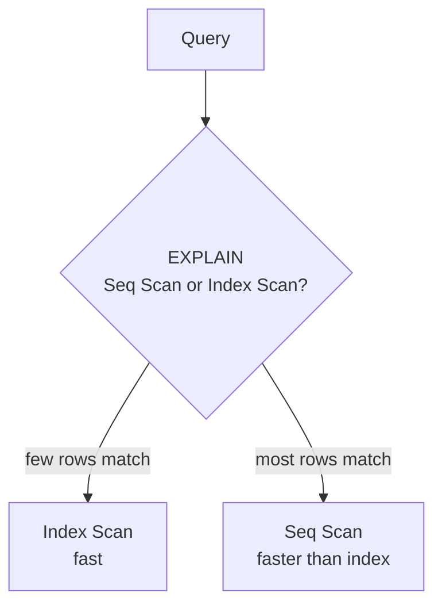
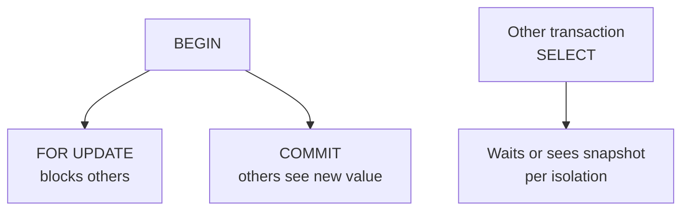

# SQL - Important Questions

The SQL questions that come up in interviews and on the job, in problem -> solution form. One shared dataset powers every example.

```sql
-- Seed for every example below
create table users (id int primary key, name text, country text);
create table orders (id int primary key, user_id int, amount numeric, status text);
insert into users values (1,'Alice','USA'), (2,'Bob','USA'), (3,'Sai','India');
insert into orders values
  (1,1,100,'paid'), (2,1,50,'paid'), (3,1,20,'pending'),
  (4,2,200,'paid'), (5,2,30,'cancelled'),
  (6,3,300,'paid'), (7,3,10,'paid');
-- 7 orders, 5 paid
```

<div style={{display: 'flex', justifyContent: 'center'}}>



</div>

## 1. SELECT and WHERE

### Problem

Get only some columns and only some rows. Without `WHERE` you scan everything.

```sql
-- All columns and rows - wasteful on big data
SELECT * FROM orders;
```

### Solution

`SELECT` projects columns, `WHERE` filters rows before any other work. Put the filter on an indexed column when the table is big.

```sql
SELECT id, user_id, amount
FROM orders
WHERE status = 'paid';
-- 5 rows: Alice 100,50 Bob 200 Sai 300,10
```

<div style={{display: 'flex', justifyContent: 'center'}}>



</div>

### Pitfall

`WHERE` runs before `SELECT` - you cannot use a `SELECT` alias in `WHERE`. Use `HAVING` after `GROUP BY` for that.

```sql
-- Wrong
SELECT user_id, SUM(amount) AS total FROM orders WHERE total > 100;
-- Right
SELECT user_id, SUM(amount) AS total FROM orders GROUP BY user_id HAVING SUM(amount) > 100;
```

---

## 2. JOIN - INNER, LEFT, RIGHT, FULL

### Problem

`orders` has `user_id`, `users` has `name`. Without a join you make two queries and stitch in code.

### Solution

`JOIN ON` combines rows by a key. The type decides what to do with non-matches.

```sql
-- INNER: only matches
SELECT u.name, o.amount FROM orders o JOIN users u ON u.id = o.user_id WHERE o.status='paid';
-- 5 rows

-- LEFT: all users, even without paid orders
SELECT u.name, o.amount FROM users u LEFT JOIN orders o ON o.user_id = u.id AND o.status='paid';
-- 3 users + matches, Sai has 2 rows, Bob 1, Alice 2

-- SELF JOIN: pairs inside the same table
SELECT a.name, b.name FROM users a JOIN users b ON a.country = b.country AND a.id < b.id;
-- Alice-Bob (both USA)

-- CROSS JOIN: every combination, no ON
SELECT * FROM users CROSS JOIN (SELECT DISTINCT status FROM orders) s;
```

<div style={{display: 'flex', justifyContent: 'center'}}>



</div>

### Pitfall

Forgetting the `ON` turns a `JOIN` into a `CROSS JOIN`: `3 users x 7 orders = 21 rows`. Always write the `ON`.

---

## 3. GROUP BY and HAVING

### Problem

You need totals per user, not per row.

### Solution

`GROUP BY` collapses rows per key, aggregates compute the total. `WHERE` filters rows before grouping, `HAVING` filters groups after.

```sql
SELECT user_id, COUNT(*) AS cnt, SUM(amount) AS total
FROM orders
WHERE status = 'paid'
GROUP BY user_id
HAVING SUM(amount) > 100
ORDER BY total DESC;
-- Bob 200 (1), Sai 310 (2) - Alice 150 filtered by HAVING if >200, else include
```

Execution order: `FROM -> WHERE -> GROUP BY -> HAVING -> SELECT -> ORDER BY -> LIMIT`.

<div style={{display: 'flex', justifyContent: 'center'}}>



</div>

### Pitfall

Every non-aggregated column in `SELECT` must be in `GROUP BY`. `SELECT user_id, status, SUM(amount)` without grouping `status` is an error in Postgres.

---

## 4. DISTINCT, ORDER BY, LIMIT

### Problem

Deduplicate, rank, and sample without moving all data to the app.

### Solution

```sql
SELECT DISTINCT country FROM users; -- USA, India
SELECT DISTINCT ON (country) * FROM users ORDER BY country, id; -- one per country, Postgres specific

SELECT * FROM orders ORDER BY amount DESC LIMIT 2; -- top 2 amounts
SELECT * FROM orders ORDER BY amount DESC LIMIT 2 OFFSET 2; -- next 2 (pagination, slow on big data)
```

`DISTINCT ON` keeps one row per key. `LIMIT` with `ORDER BY` lets Postgres use a top-N sort.

### Pitfall

`OFFSET` on big data scans and discards `OFFSET` rows. For deep pagination use keyset: `WHERE id > last_id ORDER BY id LIMIT 20`.

---

## 5. Subquery, IN, EXISTS, CTE

### Problem

A query needs the result of another query: does a user have any paid order, is the amount in a list.

### Solution

```sql
-- IN: value in a list
SELECT * FROM users WHERE id IN (SELECT user_id FROM orders WHERE status='paid');

-- EXISTS: does any row exist - often faster, stops at first match
SELECT * FROM users u WHERE EXISTS (SELECT 1 FROM orders o WHERE o.user_id = u.id AND o.status='paid');

-- CTE: name an intermediate result instead of nesting
WITH paid AS (SELECT * FROM orders WHERE status='paid')
SELECT user_id, AVG(amount) FROM paid GROUP BY user_id;

-- Scalar subquery in SELECT
SELECT name, (SELECT COUNT(*) FROM orders o WHERE o.user_id = u.id) AS cnt FROM users u;
```

<div style={{display: 'flex', justifyContent: 'center'}}>



</div>

### Pitfall

`IN (SELECT ...)` with `NULL` in the list makes the whole predicate unknown. `EXISTS` avoids that trap.

---

## 6. UNION vs UNION ALL

### Problem

Combine results from two queries.

### Solution

```sql
SELECT user_id FROM orders WHERE status='paid'
UNION      -- dedupes
SELECT user_id FROM orders WHERE amount > 100;

SELECT user_id FROM orders WHERE status='paid'
UNION ALL  -- keeps duplicates, faster
SELECT user_id FROM orders WHERE amount > 100;
```

Use `UNION ALL` unless you need deduping - the dedup is a sort that costs on big data.

---

## 7. Window functions - compute without collapsing

### Problem

You want each order plus the user's total. `GROUP BY` would collapse rows, but you need to keep them.

### Solution

`OVER (PARTITION BY ...)` keeps rows and adds a computed column per window.

```sql
SELECT id, user_id, amount,
  SUM(amount) OVER (PARTITION BY user_id) AS user_total,
  ROW_NUMBER() OVER (PARTITION BY user_id ORDER BY amount DESC) AS rnk,
  LAG(amount) OVER (PARTITION BY user_id ORDER BY id) AS prev_amount
FROM orders WHERE status='paid';
```

*   `PARTITION BY` is the window's `GROUP BY`, but rows stay.
*   `ORDER BY` inside the window decides the rank.
*   `LAG`/`LEAD` peek at the previous/next row.

<div style={{display: 'flex', justifyContent: 'center'}}>



</div>

### Pitfall

`ROW_NUMBER` without `ORDER BY` is non-deterministic. Always specify the order inside the window.

---

## 8. NULL, COALESCE, and three-valued logic

### Problem

`NULL` means unknown, not zero or empty string. Comparisons with `NULL` are unknown.

### Solution

```sql
SELECT * FROM orders WHERE amount IS NULL; -- not = NULL
SELECT COALESCE(amount, 0) FROM orders; -- replace NULL with 0
SELECT COUNT(*) FROM orders; -- counts rows, includes NULLs
SELECT COUNT(amount) FROM orders; -- counts non-NULL amounts only
```

`WHERE NULL = NULL` is unknown, `WHERE NULL IS NULL` is true. `COALESCE` is the safe default.

### Pitfall

`WHERE status != 'paid'` does not return `NULL` rows. `NULL != 'paid'` is unknown, so those rows are filtered out.

---

## 9. Constraints, indexes, and EXPLAIN

### Problem

Queries are correct but slow on big data.

### Solution

```sql
-- Constraint: correctness at the DB
ALTER TABLE orders ADD CONSTRAINT chk_amount CHECK (amount > 0);

-- Index: speed for WHERE/JOIN
CREATE INDEX ON orders(status);
CREATE INDEX ON orders(user_id);

-- EXPLAIN: see the plan
EXPLAIN ANALYZE SELECT * FROM orders WHERE status='paid';
-- Seq Scan vs Index Scan - index wins when 5 of 100000 rows match
```

An index is a sorted copy of the column. It helps `WHERE`/`JOIN`/`ORDER BY` but slows `INSERT` and costs space. Never add an index without checking `EXPLAIN`.

<div style={{display: 'flex', justifyContent: 'center'}}>



</div>

---

## 10. Transactions, isolation, and locks

### Problem

Two users change the same row. Without transactions you get partial writes and lost updates.

### Solution

```sql
BEGIN;
UPDATE orders SET amount = 150 WHERE id = 1;
-- other transaction here sees old value until COMMIT, or is blocked
COMMIT;

-- Try a lock explicitly
SELECT * FROM orders WHERE id = 1 FOR UPDATE; -- blocks others

-- Isolation
BEGIN ISOLATION LEVEL REPEATABLE READ;
SELECT * FROM orders WHERE user_id = 1; -- snapshot at BEGIN
```

Postgres uses MVCC: readers never block writers. See `postgresql-mvcc.md` and `postgresql-locks.md` for deep dives.

<div style={{display: 'flex', justifyContent: 'center'}}>



</div>

### Pitfall

`BEGIN` without `COMMIT` holds a lock and blocks others. Always `COMMIT` or `ROLLBACK`.

## References

- PostgreSQL Documentation. *Queries - SELECT*. https://www.postgresql.org/docs/current/sql-select.html. Clause order and pipeline.
- PostgreSQL Documentation. *Window Functions*. https://www.postgresql.org/docs/current/tutorial-window.html.
- Knowledge base. *PostgreSQL MVCC* ./postgresql-mvcc.md, *PostgreSQL Locks* ./postgresql-locks.md, *DDL vs DML* ./ddl-vs-dml.md.
- Knowledge base. *Database Comparison* ./database-comparison.md.

