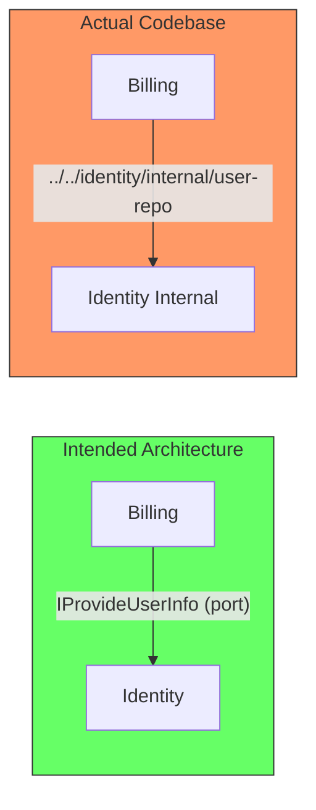
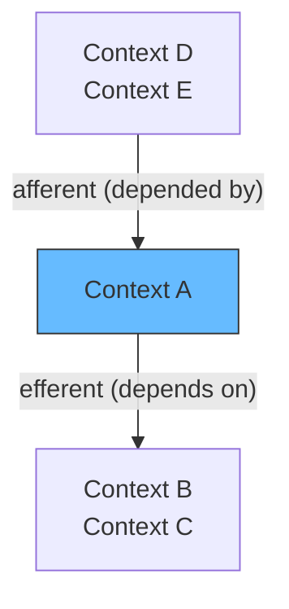

# Static Code Analysis for Coupling and Cohesion in TypeScript

## The problem: invisible boundaries

You have bounded contexts. You have decided that `Billing` should never import from `Identity.Internal`. But nothing stops a developer from writing that import. No compiler error, no build failure. Just a silent violation that turns into a coupling problem six months later when you try to extract Billing into its own service and discover it is tied to Identity's internals.



Static code analysis makes these violations visible. The tool parses your imports, builds a dependency graph, and checks it against rules you define. If Billing imports from Identity internal, the build fails.

## What to measure

The goal is a report that tracks how coupling changes over time. Three numbers:

1. **Cross-context internal imports** — direct references from one context to another context's internal code
2. **Circular dependencies** — context A imports from B, B imports from A
3. **Afferent / efferent coupling per context** — how many contexts depend on this one, and how many does this one depend on



These numbers trend over time. A rising efferent coupling count means a context is becoming a general utility — a sign the boundary is wrong. A rising cross-context internal import count means enforcement is failing.

## Where the report lives

The report should be generated in CI on every push. Not as a blocking gate initially — as a diff comment on the PR.

```
Before: Billing → Identity (2 internal imports)
After:  Billing → Identity (2 internal imports)
Status: unchanged ✓

Before: Jobs → Identity (0 internal imports)
After:  Jobs → Identity (1 internal import)
Status: WARNING — new violation detected
```

When a PR introduces a new cross-context import, the team sees it before merge. They decide: "this is justified" or "refactor it." The decision is conscious, not accidental.

Over time, set targets. "Billing should have zero direct imports to Identity internal by Q3." The report shows progress toward that target.

## How to generate it in TypeScript

Use **Dependency Cruiser**. Install it, point it at `src/`, define rules that match your context boundaries.

```bash
npm install --save-dev dependency-cruiser
```

Configure rules that match your folder structure:

```javascript
// .dependency-cruiser.js
module.exports = {
  forbidden: [
    {
      name: 'no-cross-context-internals',
      severity: 'error',
      from: { path: '^src/billing' },
      to: { path: '^src/identity/internal' },
    },
    {
      name: 'no-circular',
      severity: 'error',
      from: {},
      to: { circular: true },
    },
  ],
  options: {
    includeOnly: '^src',
    tsConfig: { fileName: 'tsconfig.json' },
  },
};
```

Run it in CI:

```json
{
  "scripts": {
    "depcruise": "depcruise src --output-type err-long"
  }
}
```

The output format is plain text. You can also generate JSON (`--output-type json`) and parse it to create the PR comment report.

## When to add the rules

Add them when you create the first bounded context. One rule that says "no importing from another context's internal" costs nothing on day one. Cleaning up violations after three months of unchecked imports is a project.

Start with `warn` severity on an existing codebase. Fix violations one context at a time. Switch to `error` once clean.

## Summary

Static code analysis replaces the compiler enforcement TypeScript lacks. The tool shows you coupling violations and tracks them over time. The report lives in CI so every PR triggers a conscious decision: "does this new dependency cross a boundary we intended to keep?"

One tool (Dependency Cruiser), one script, one CI step. The rest is discipline.

### References

- Dependency Cruiser. (n.d.). *Dependency Cruiser*. github.com/sverweij/dependency-cruiser. https://github.com/sverweij/dependency-cruiser — Module boundary enforcement for JavaScript and TypeScript
- Nx. (n.d.). *Enforce Module Boundaries*. nx.dev. https://nx.dev/features/enforce-module-boundaries — Monorepo boundary enforcement through tags (alternative approach)
