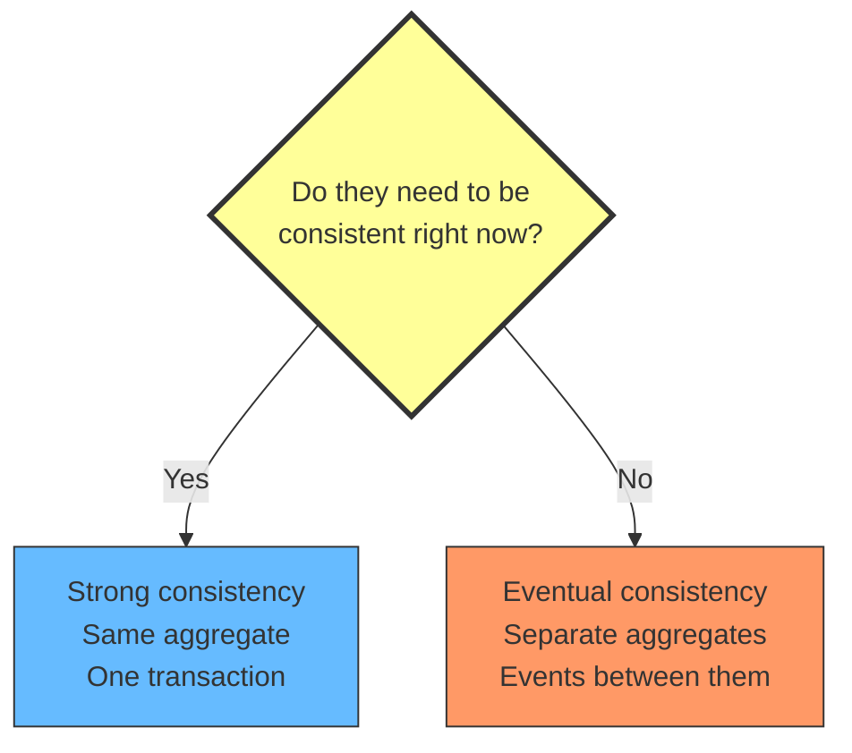
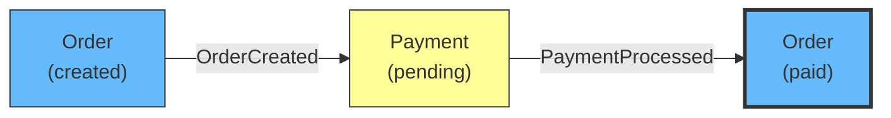
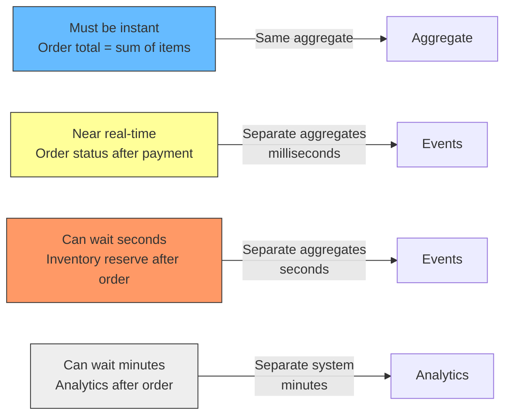

# Strong vs Eventual Consistency: What Belongs in an Aggregate

## The problem: you do not know what to put together

Every DDD team hits this question: should Payment be inside the Order aggregate, or separate? Should LineItem be its own aggregate, or part of Order? The answer depends on one thing: **do they need to be consistent right now, or is eventually consistent good enough?**

Teams get this wrong in two ways:

- **Too tight:** everything goes inside one aggregate. Order, Payment, Shipment, Invoice, Customerpreferences. Now every operation locks everything. The system is slow and nobody knows why.

- **Too loose:** everything is separate. Order and LineItem are different aggregates. Now you need a policy to keep the order total in sync with the line items. The system is complex and the totals are always slightly off.

Both come from the same mistake: not asking the right question first.

<div style={{display: 'flex', justifyContent: 'center'}}>



</div>

## The rule

**Strong consistency:** the two things must be in the same state *at the same time*. If you read one, you must see the other updated. There is no window where they are out of sync. This means: same aggregate, same transaction.

**Eventual consistency:** the two things will be consistent *eventually*, but not necessarily right now. There is a window where one is updated and the other is not. This means: separate aggregates, events between them.

The test is always: **"if I read this after saving, and the other thing is not updated yet, is that a problem?"**

- If yes (the user sees wrong data, the system makes a wrong decision) → same aggregate.
- If no (the user does not notice, the system catches up in milliseconds) → separate aggregates.

## Practical example: e-commerce order

### What belongs together

Order and LineItem belong together. The invariant "Order total must equal sum of LineItem prices" must hold *right now*. If a user adds an item and the total is not updated immediately, the checkout page shows the wrong price. That is a bug.

```typescript
class Order {
  id: string;
  private lineItems: LineItem[] = [];
  private total: number = 0;

  addItem(productId: string, price: number, quantity: number) {
    const item = new LineItem(productId, price, quantity);
    this.lineItems.push(item);
    this.recalculateTotal(); // same transaction, same aggregate
  }

  private recalculateTotal() {
    this.total = this.lineItems.reduce(
      (sum, i) => sum + i.price * i.quantity, 0
    );
  }
}
```

LineItem is inside Order. One transaction. One commit. After the save, the total is correct. No policy needed. No eventual consistency.

### What should be separate

Payment belongs separate. The order can be created before payment is processed. Payment can succeed or fail independently. The order does not need to know the payment status to exist.

```typescript
class Order {
  id: string;
  status: OrderStatus;
}

class Payment {
  id: string;
  orderId: string;
  amount: number;
  status: PaymentStatus;
}
```

Order is created first. Payment is processed later. They communicate through events: `OrderCreated` triggers `ProcessPayment`. `PaymentProcessed` updates the order status. There is a window where the order exists but payment is pending. That is expected behavior, not a consistency gap.

<div style={{display: 'flex', justifyContent: 'center'}}>



</div>

### What looks like it should be together but is not

Customer and Order look related. But they have independent lifecycles. A customer exists before placing an order. An order references a customer by ID. The customer can update their email without affecting existing orders.

```typescript
class Customer {
  id: string;
  name: string;
  email: string;

  updateEmail(newEmail: string) {
    this.email = newEmail;
    // Does not affect existing orders
  }
}

class Order {
  id: string;
  customerId: string; // reference by ID, not by containment
  total: number;
}
```

If Customer and Order were in the same aggregate, updating a customer email would lock every order that customer has ever placed. That is clearly wrong.

## The consistency spectrum

Consistency is not binary. There is a spectrum from "must be instant" to "can wait minutes."

<div style={{display: 'flex', justifyContent: 'center'}}>



</div>

The leftmost items go inside the aggregate. Everything else is separate. The further right you go, the more tolerance you have for delay.

## Signals that you got it wrong

### Too tight: the aggregate is too big

- Two entities in the same aggregate are modified by different commands at different times.
- Loading the aggregate loads data that is never read.
- Concurrent operations on different entities serialize on the same lock.
- You have entities with independent lifecycles (e.g., Payment can exist without Order).

### Too loose: the aggregates are too small

- Two entities share an invariant that must hold in the same transaction.
- You have a policy keeping them consistent, but the consistency must be immediate.
- The "separate" aggregate is always loaded together with the other one.
- Users see stale data between the two aggregates.

## The relationship to bounded contexts

Consistency is a tactical decision within a bounded context. The bounded context tells you where language changes. The aggregate tells you what must be consistent together.

You can have multiple aggregates in one bounded context, each with its own consistency boundary. The bounded context is the strategic boundary. The aggregate is the tactical boundary.

## Summary

- Strong consistency = same aggregate, same transaction.
- Eventual consistency = separate aggregates, events between them.
- The test: "if I read this after saving, and the other thing is not updated yet, is that a problem?"
- If yes → same aggregate. If no → separate aggregates.
- Not everything that looks related needs to be in the same aggregate. Independent lifecycles mean independent aggregates.

## See also

- [Aggregate Sizing: How Big Should an Aggregate Be?](/docs/software-engineering/aggregate-sizing) explains how to decide what goes inside an aggregate and the cost of getting it wrong.
- [How Two Updates in Transactions Block Each Other](/docs/software-engineering/transaction-locking) explains the locking mechanics behind aggregate contention.
- [Transactions Live Outside the Aggregate](/docs/software-engineering/transactions-outside-aggregate) explains why the aggregate does not manage its own transactions.
