# Testing a Modular Monolith

## The foundation: interfaces let you swap implementations

A modular monolith is organized around interfaces. Module A does not call module B directly. It calls an interface that module B implements.

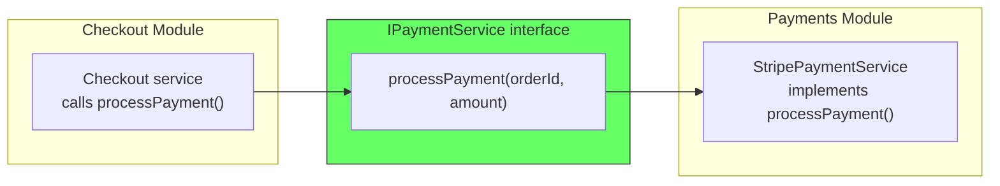

In production, the interface is wired to `StripePaymentService` — it charges credit cards, talks to Stripe's API, and writes to the payment database.

In a test, the same interface is wired to `DummyPaymentService` — a class that implements the same interface but returns a hardcoded success without touching any network or database.

```
// Production wiring
payment = StripePaymentService(stripeApiKey)   // real implementation
checkout = CheckoutModule(payment)

// Test wiring
payment = DummyPaymentService()                // test implementation
checkout = CheckoutModule(payment)
```

No mocking framework. No reflection. No monkey-patching. The interface already exists because the architecture demands it. The test just provides a different implementation of the same contract.

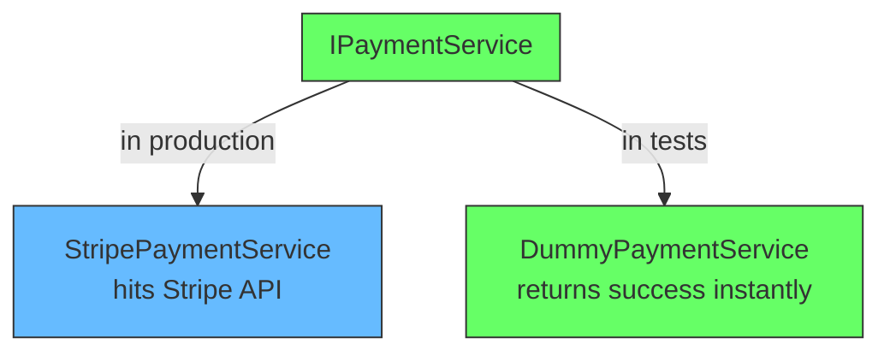

This is the entire foundation. Everything else follows from it.

## The layered monolith problem: no seams

In a layered monolith, there is no interface layer between modules. The checkout code imports `StripePaymentService` directly. There is no seam to insert a test double without a mocking framework.

```
// Layered monolith -- every test needs everything
test("checkout flow") {
  seedDatabase(ALL_TABLES)       // need data for every module
  startFullApplication()         // controllers, services, repos all wired
  hitEndpoint("/checkout")
  assertDatabase(CHECKOUT_TABLES, PAYMENT_TABLES, INVENTORY_TABLES)
  cleanupEverything()
}
```

The result is a test suite that is slow, fragile, and hard to maintain. Tests become integration tests by default because there is no way to make them unit tests.

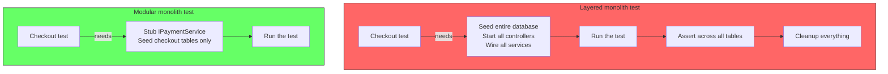

A 30-minute test suite in a layered monolith is common. The same system as a modular monolith tests in under 5 minutes because the boundaries allow parallel, isolated test runs.


## Test levels in a modular monolith

The tests form three levels. Each level answers a different question.

### 1. Module tests (unit) — does this module work correctly?

A module test tests one module in isolation. Every other module is replaced by a test double through its interface. The "unit" here is the module, not a class.

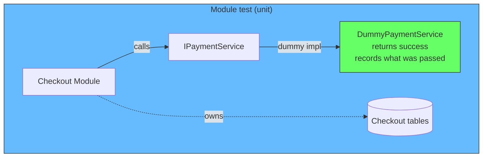

```
// Module test -- test the checkout module's logic
// Payment is not being tested -- we swap it with a dummy
test("checkout submits order successfully") {
  dummyPayment = DummyPaymentService()    // implements IPaymentService
  checkout = CheckoutModule(dummyPayment)

  checkout.submitOrder(customerId, items)

  // Assert that checkout module did its job
  assert(checkout.orderRepository.count() === 1)
  assert(checkout.orderRepository.lastOrder().status === "confirmed")
  // Also assert that checkout called the payment interface correctly
  assert(dummyPayment.lastOrderId === customerId)
  assert(dummyPayment.lastAmount === expected)
}
```

What this tests:
- The checkout module's business logic
- That checkout calls the payment interface with the right arguments
- That checkout handles the payment response correctly

What this does not test:
- The payment module's implementation (that is a different module test)
- Whether the checkout module and payment module agree on the interface contract (that is integration)

This test:
- Does not start a server or hit a network
- Seeds only checkout tables
- Runs in milliseconds
- Can run in parallel with every other module test

### 2. Integration tests — do the modules agree on the contract?

An integration test wires multiple real modules together. The interfaces are real — checkout calls the real payment module, payment calls the real notification module. What is still stubbed is the external infrastructure (Stripe, email service, message broker).

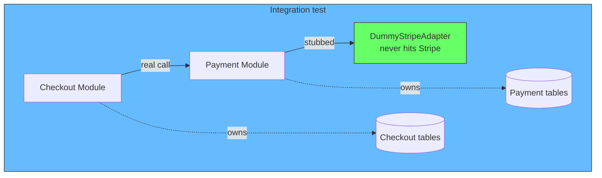

```
// Integration test -- real checkout + real payment together
// Stripe is still stubbed -- we do not want to hit a real payment gateway
test("checkout creates payment transaction") {
  stripe = DummyStripeAdapter()            // never hits Stripe's API
  payment = PaymentModule(stripe)
  checkout = CheckoutModule(payment)

  checkout.submitOrder(customerId, items)

  // Assert that the real payment module did its job
  assert(payment.transactionRepository.count() === 1)
  assert(payment.transactionRepository.last().amount === expected)

  // Assert that checkout module's state is consistent with payment
  assert(checkout.lastOrder().paymentTransactionId !== null)
}
```

What this tests that the module test does not:
- Whether the checkout module and payment module agree on the interface contract. In a module test, checkout calls `DummyPaymentService`. In this test, checkout calls the real `StripePaymentService.processPayment()` — which calls `DummyStripeAdapter`. If the interface contract is wrong (wrong argument type, wrong method name), the integration test catches it.
- Whether the two modules interact correctly end-to-end. A module test says "checkout calls the interface with these args." An integration test says "checkout calls the interface with these args AND payment receives them correctly."

In summary:

| | Module test (unit) | Integration test |
|---|---|---|
| **Checkout module** | Real | Real |
| **Payment module** | Dummy (implementing IPaymentService) | Real |
| **Stripe adapter** | Not needed | Dummy |
| **What it proves** | Checkout logic is correct | Checkout and payment work together correctly |
| **What it does not prove** | That payment module exists | That Stripe works (that is a different test) |

### 3. Deployment smoke tests (slowest but simplest)

A smoke test starts the full application as a single process and hits its endpoints. It confirms that the wiring works, the database migrations applied, and the basic flows succeed.

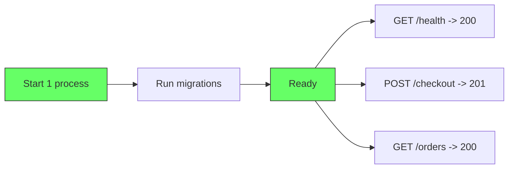

```
// Smoke test -- start the monolith, hit endpoints
test("deployment smoke test") {
  app = startModularMonolith()     // one command

  health = GET("/health")
  assert(health.status === 200)

  order = POST("/checkout", { items: [...] })
  assert(order.status === 201)

  orders = GET("/orders")
  assert(orders.body.length > 0)

  app.stop()
}
```

No containers. No service orchestration. No network dependencies. The application starts, serves requests, and stops. This test takes seconds, not minutes.

## How the test suite scales

As the system grows, these three levels give a clear distribution of tests:

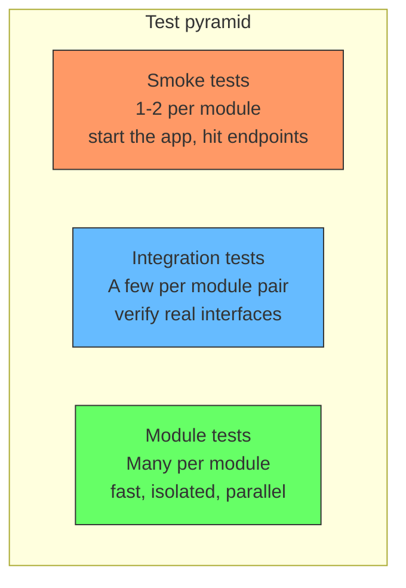

| Test level | Count | Speed | Runs on every commit |
|---|---|---|---|
| Module tests | Hundreds | Milliseconds each, parallel | Yes |
| Integration tests | Dozens | Seconds each | Yes |
| Smoke tests | A handful | Seconds total | Yes (or nightly) |


## What makes it possible: interfaces and data ownership

Two properties of the modular monolith make this testing structure work.

### Interfaces make stubbing natural

Because modules already communicate through interfaces (not by importing each other's internals), providing a test double is not a workaround. It is the same mechanism used in production.

```
// Production wiring
payment = PaymentModule(StripeAdapter())
checkout = CheckoutModule(payment)

// Test wiring
payment = PaymentModule(DummyStripeAdapter())
checkout = CheckoutModule(payment)
```

No reflection. No monkey patching. No special test configuration. The interface exists for architectural reasons and testing benefits for free.

### Data ownership makes test data predictable

Because each module owns its tables, a module test only seeds the tables for that module. There is no risk of a shared test fixture leaking across test boundaries.

```
// Checkout module test -- seeds only checkout tables
checkout.orderRepository.insert(testOrder())
checkout.orderRepository.insert(testOrder())

// Payment module test -- seeds only payment tables
payment.transactionRepository.insert(testTransaction())

// Never collide, never need global fixtures
```

Contrast this with a layered monolith where a single test database contains every table. Tests must carefully clean up after themselves, and test order can affect results. In a modular monolith, each module's test data is scoped to its tables.

## Migration: adding tests when refactoring toward modular

If you are moving from a layered monolith to a modular monolith, the testing structure follows the module structure. You do not need to rewrite all tests at once.

```
// Step 1: Add interfaces between modules
Old: checkout.service.ts  ->  imports payment.repository.ts directly
New: checkout.service.ts  ->  calls IPaymentService interface

// Step 2: Write module tests for the new boundaries
test("checkout with stubbed payment") { ... }

// Step 3: Keep existing integration tests until they break naturally
// They still pass because the behavior is the same
```

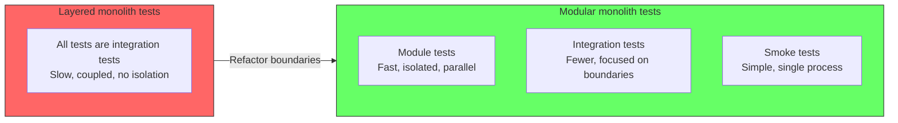

You do not need to convert every test overnight. As modules emerge, write new module tests for new code. Convert slow integration tests to module tests when you touch those files.

## Anti-patterns: what most teams get wrong

The boundaries that make testing easy also create new ways to write bad tests. Here are the common anti-patterns teams fall into when testing a modular monolith.

### Mocking at the class level instead of stubbing at the module boundary

The most common mistake. Teams bring their DDD testing habits and mock every class individually instead of providing a module-level test double through the interface.

```
// Bad: mock every class
paymentService = mock(PaymentService)
when(paymentService.processPayment(any())).thenReturn(success)
checkout = CheckoutModule(paymentService)

// Good: module-level stub through the interface
paymentService = DummyPaymentService()  // implements IPaymentService
checkout = CheckoutModule(paymentService)
```

Class-level mocking couples the test to the internal structure of the module. Rename a method? Update 20 tests. Change the interface? Update 2 tests (the stub and the integration test).

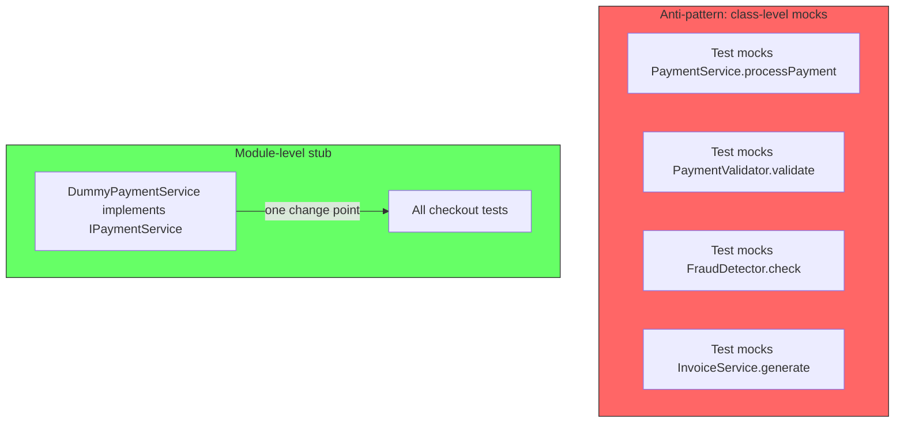

The module boundary is the right level of abstraction for test doubles. Below that, you are testing implementation details.

### Bypassing module boundaries in tests

A test for the checkout module directly queries the payment module's tables to verify behavior. This breaks data encapsulation and creates invisible coupling.

```
// Bad: bypass the boundary
checkout.submitOrder(customerId, items)
paymentRows = db.query("SELECT * FROM payment_transactions")  // direct table access
assert(paymentRows.length === 1)

// Good: verify through the module's public interface
checkout.submitOrder(customerId, items)
assert(checkout.lastOrder().status === "confirmed")
```

If the payment module renames its tables, the checkout test breaks. The checkout test should not know that payment tables exist.

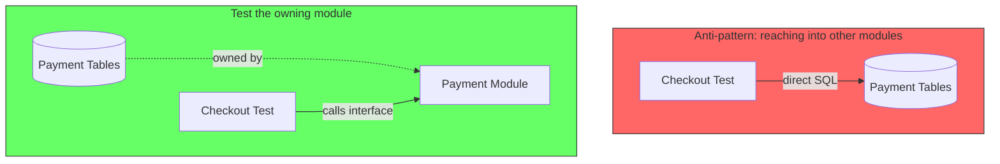

### Shared global test fixtures

A single setup file that seeds data for every module. This is the layered monolith pattern brought into a modular monolith.

```
// Bad: global fixture seeds everything
beforeAll() {
  seedAllTables()  // checkout, payment, notification, search tables
}

test("checkout") { ... }   // works but slow
test("payment") { ... }    // works but fragile -- data may conflict
```

Each module test should seed only its own tables. If a test needs data from another module, it should go through that module's interface to create it.

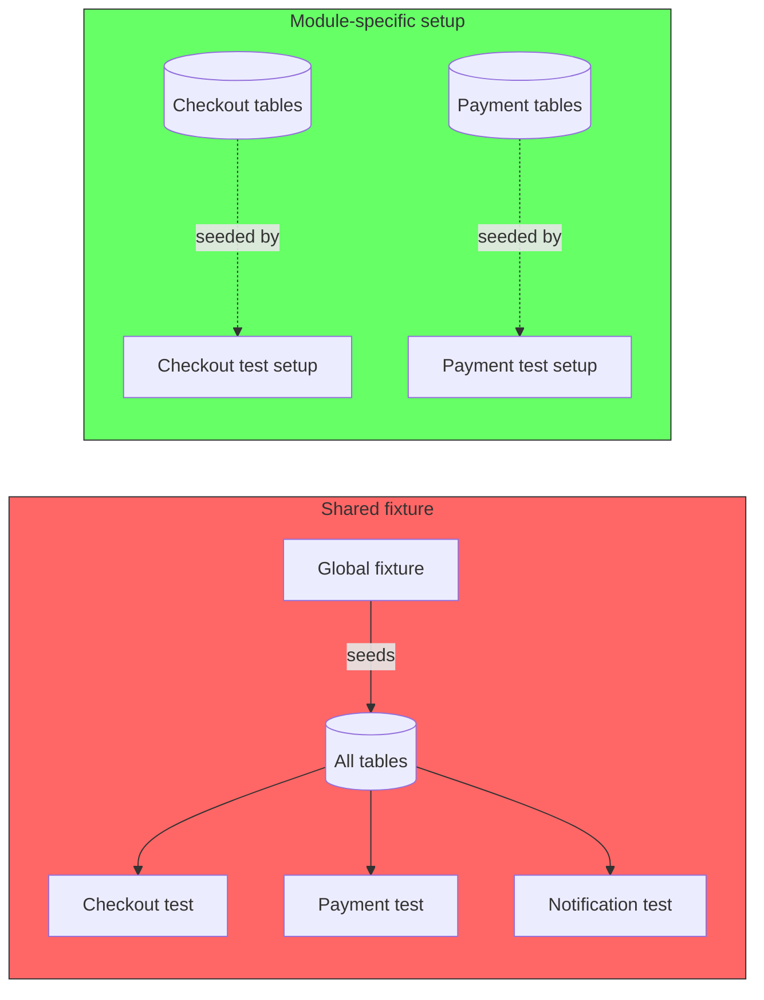

### Testing through HTTP when in-process works

Starting the full HTTP server for every test when you can call module methods directly.

```
// Bad: HTTP for every test
test("checkout") {
  startServer()
  response = http.post("http://localhost:3000/checkout", body)
  assert(response.status === 201)
  stopServer()
}

// Good: in-process call
test("checkout") {
  checkout = CheckoutModule(dummyPayment)
  result = checkout.submitOrder(customerId, items)
  assert(result.status === "confirmed")
}
```

The HTTP test takes 10x longer and tests nothing the in-process version does not. Reserve HTTP tests for the smoke test layer.

### Over-specifying test doubles

Using strict mocks that verify exact call counts, argument patterns, and call order. This makes tests brittle -- every refactoring breaks the mocks even when the behavior is correct.

```
// Bad: over-specified mock
verify(paymentService).processPayment(exactMatch(orderId), eq(amount))
verify(paymentService, times(1)).processPayment(any(), any())
verifyNoMoreInteractions(paymentService)

// Good: verify behavior, not calls
checkout.submitOrder(customerId, items)
assert(checkout.lastOrder().status === "confirmed")
assert(dummyPayment.lastCharged === expected)
```

A dummy or fake implementation naturally records what happened. You assert on the result, not on the interaction. The test is resilient to refactoring.

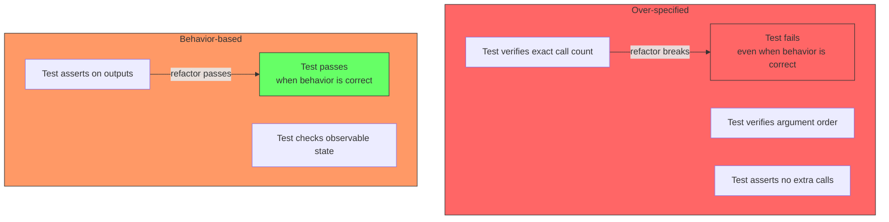

### Circular module dependencies in tests

If module A tests wire module B, and module B tests wire module A, the test setup becomes circular. This is a symptom of a missing interface.

```
// Bad: circular wiring
test("checkout") {
  payment = PaymentModule(checkout)  // payment needs checkout?
  checkout = CheckoutModule(payment)
}

// Good: clear dependency direction
test("checkout") {
  payment = DummyPaymentService()    // stub, not real
  checkout = CheckoutModule(payment)
}
```

Circular dependencies in tests always reflect circular dependencies in the architecture. Fix the architecture first.

### Container overuse

Starting Docker containers, TestContainers, or service orchestration for tests that should run in-process. This adds minutes to every test run without benefit.

```
// Bad: container for every test
test("checkout flow") {
  startContainer("postgres")
  startContainer("redis")
  startContainer("kafka")
  runMigrations()
  // ... test
  stopContainers()
}

// Good: in-process test with real database (or in-memory)
test("checkout flow") {
  db = inMemoryDatabase()           // or real postgres in test mode
  checkout = CheckoutModule(dummyPayment, db)
  checkout.submitOrder(customerId, items)
  assert(checkout.lastOrder().status === "confirmed")
}
```

Reserve containers for the smoke test layer or for testing third-party integrations. Do not use them for module or integration tests.

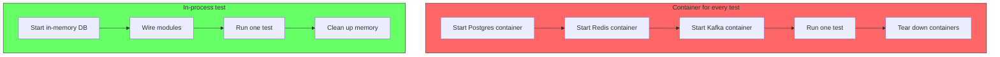

## Summary

| | Layered monolith | Modular monolith |
|---|---|---|---|
| **Test isolation** | None -- everything coupled | Module-level via interfaces |
| **Test speed** | Slow (30 min+) | Fast (under 5 min) |
| **Test flakiness** | Low (no network) | Low (no network) |
| **Test setup** | Seed shared database | Seed module-specific tables |
| **Smoke test** | Start one process | Start one process |
| **Refactoring confidence** | Low -- tests are brittle | High -- boundaries are tested |

A modular monolith gives you the best of both testing worlds: the isolation and speed of module tests with the simplicity of single-process smoke tests. The same interfaces that make the architecture clean make the testing fast.
