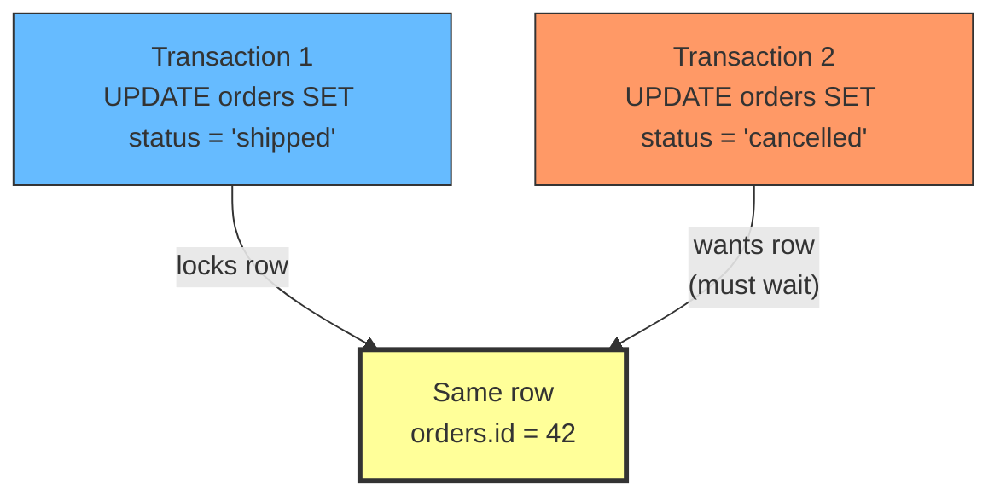
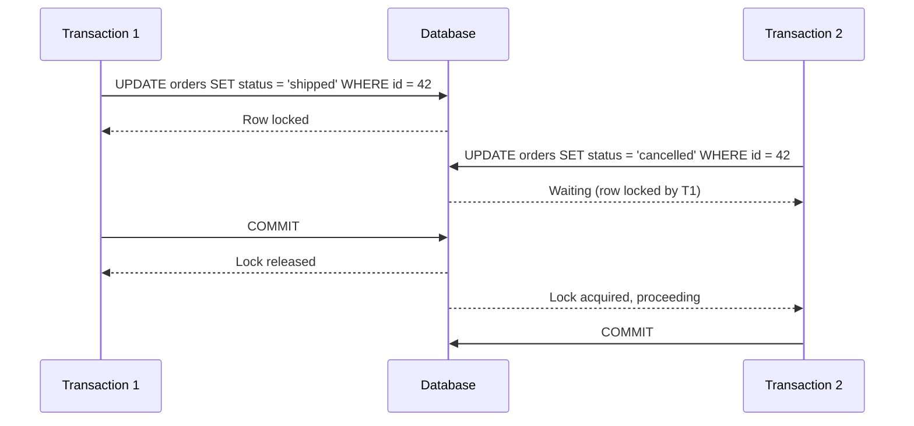
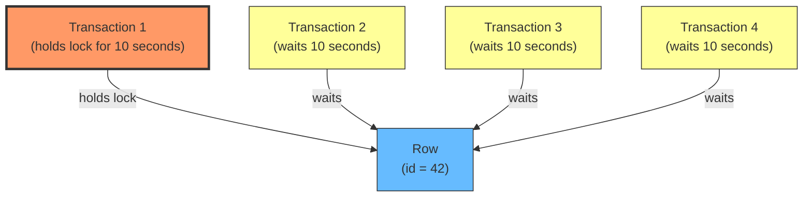
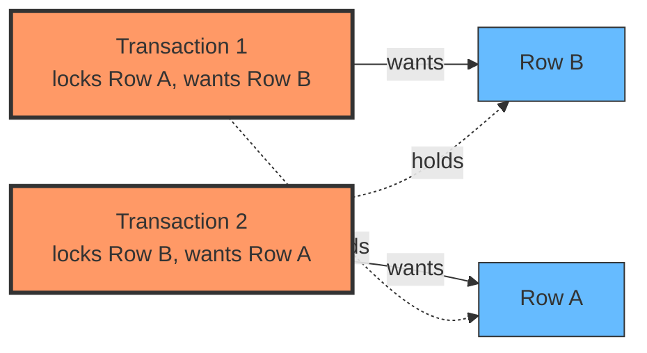
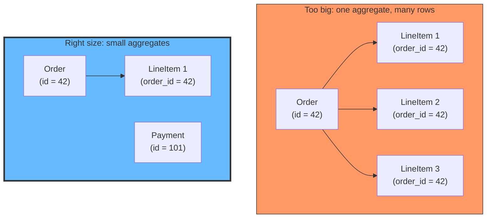

# How Two Updates in Transactions Block Each Other

## The problem: two users, one row, one blocked

Two users click "update" at the same time. Both transactions start. Both read the same row. Both try to write. One succeeds. The other waits. If the first transaction takes too long, the second times out. The user sees a spinner, then an error.

This is not a bug. This is how database isolation works. But most developers do not understand the mechanics, and the symptoms look like a race condition.

<div style={{display: 'flex', justifyContent: 'center'}}>



</div>

## How row-level locking works

When a transaction updates a row, the database acquires a **exclusive lock** on that row. No other transaction can read or write that row until the lock is released. The lock is released when the transaction commits or rolls back.

The timeline looks like this:

1. Transaction 1 starts.
2. Transaction 1 reads the row (or updates it directly).
3. Database acquires an exclusive lock on the row.
4. Transaction 2 starts.
5. Transaction 2 tries to update the same row.
6. Database sees the lock. Transaction 2 waits.
7. Transaction 1 commits. Lock is released.
8. Transaction 2 acquires the lock and proceeds.

<div style={{display: 'flex', justifyContent: 'center'}}>



</div>

## What happens when the lock is held too long

If Transaction 1 takes a long time (complex logic, slow network call, multiple aggregates), Transaction 2 waits. The wait is not instant. The database has a **lock timeout** (default varies: 50 seconds in PostgreSQL, infinite in MySQL with InnoDB). If the wait exceeds the timeout, Transaction 2 fails with a lock timeout error.

The longer the lock is held, the more transactions queue up behind it. This is called **lock contention**. In high-throughput systems, a single long-running transaction can block hundreds of others.

<div style={{display: 'flex', justifyContent: 'center'}}>



</div>

## Deadlock: when two transactions block each other

Deadlock is the worst case. Transaction 1 locks Row A and wants Row B. Transaction 2 locks Row B and wants Row A. Neither can proceed. Both wait forever.

The database detects this (usually by running a cycle-detection algorithm on the lock graph) and kills one transaction with a deadlock error. The other transaction proceeds.

<div style={{display: 'flex', justifyContent: 'center'}}>



</div>

Deadlock happens when two transactions acquire locks in different orders. The fix is always the same: acquire locks in the same order, or reduce the number of locks by making aggregates smaller.

## How this connects to aggregate size

This is where aggregate sizing matters. If your aggregate is too big, you are locking more rows than necessary. Two operations on different parts of the same aggregate serialize on the same lock. The bigger the aggregate, the more operations contend for the same lock.

If your aggregate is the right size (smallest unit that keeps invariants consistent), you lock only the rows you need. Operations on different aggregates do not contend. Deadlock is less likely because you are acquiring fewer locks.

<div style={{display: 'flex', justifyContent: 'center'}}>



</div>

In the big aggregate, updating LineItem 2 locks the entire order. In the small aggregate, updating LineItem 1 locks only the order and that line item. Payment is a separate aggregate and does not contend.

## Practical example: the ordering system

Two users are modifying the same order. User 1 adds a line item. User 2 updates the shipping address.

### With a too-big aggregate

```typescript
// Both operations lock the same aggregate
class Order {
  id: string;
  lineItems: LineItem[];
  shippingAddress: Address;
  payment: Payment;
}
```

Both commands go through the same Order aggregate. They serialize on the same row lock. If the add-item operation takes 200ms, the update-address operation waits 200ms, even though they are modifying completely different data.

### With correctly-sized aggregates

```typescript
// Separate aggregates, separate locks
class Order {
  id: string;
  lineItems: LineItem[];
}

class OrderDetails {
  id: string;
  shippingAddress: Address;
}
```

The two operations lock different rows. They run in parallel. No contention. No waiting.

## Pessimistic vs optimistic locking

The row-level lock described above is **pessimistic locking**: the database locks the row before the transaction reads or writes. The alternative is **optimistic locking**: no lock is acquired during the transaction. Instead, when the transaction commits, the database checks if the row was modified by another transaction. If yes, the commit fails and the transaction retries.

Optimistic locking works well when conflicts are rare. It avoids lock contention entirely. But when conflicts are frequent (high throughput, hot rows), the retry cost adds up.

Pessimistic locking works well when conflicts are frequent. It serializes conflicting operations, avoiding retries. But it introduces lock contention and potential deadlock.

The choice depends on your workload. For most web applications with moderate conflict rates, optimistic locking is the better default. For high-throughput systems with hot rows, pessimistic locking (with small aggregates to minimize contention) is often necessary.

## Summary

- When a transaction updates a row, the database locks it. Other transactions wait.
- The longer the lock is held, the more transactions queue up behind it.
- Deadlock happens when two transactions acquire locks in different orders. The database kills one.
- Smaller aggregates mean fewer locks, less contention, and less deadlock.
- Pessimistic locking (database locks) vs optimistic locking (check on commit) depends on conflict frequency.

## See also

- [Aggregate Sizing: How Big Should an Aggregate Be?](/docs/software-engineering/aggregate-sizing) explains how aggregate boundaries determine the number of rows locked per transaction, and why smaller aggregates reduce contention.
