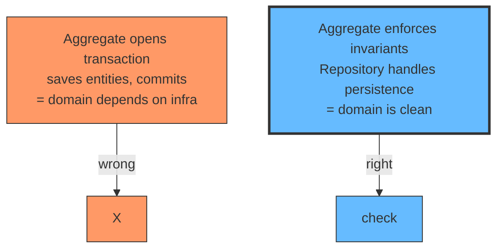
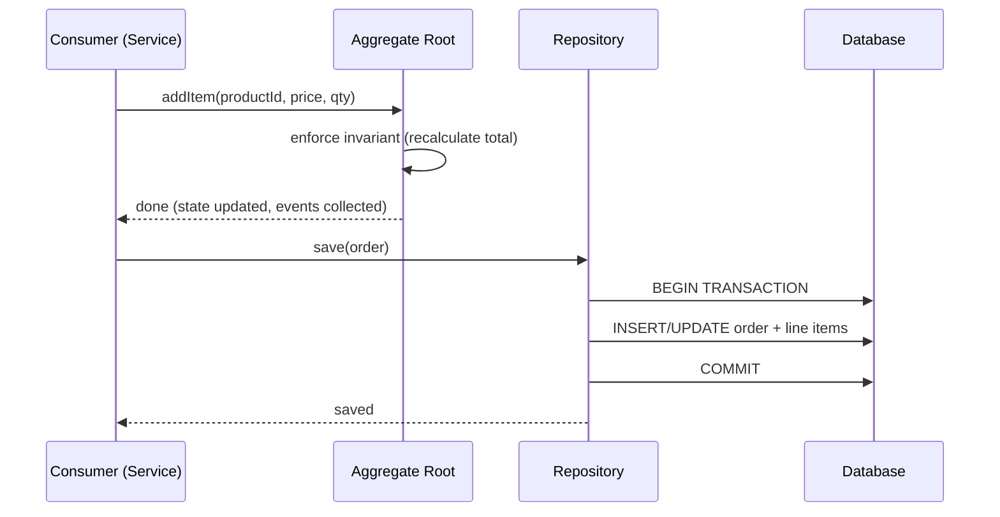

# Transactions Live Outside the Aggregate

## The problem: the aggregate is doing too much

The aggregate enforces invariants. It knows the rules. But somewhere along the way, someone put transaction logic inside the aggregate. The aggregate now opens a transaction, saves related entities, and commits. The domain model is tangled with persistence.

This looks convenient. It is a trap. The aggregate now depends on the database. You cannot test it without a database. You cannot swap the database without changing the domain model. The "clean" domain model is no longer clean.

<div style={{display: 'flex', justifyContent: 'center'}}>



</div>

## The rule

The aggregate does two things:

1. **Enforces invariants.** It checks if the command is allowed. If yes, it updates its state and produces events.
2. **Returns events.** It tells the world what happened.

The aggregate does NOT do these things:

1. **Open or close transactions.** That is the repository's job.
2. **Save related entities.** That is the unit of work's job.
3. **Know about databases.** That is infrastructure's job.

The separation is deliberate. The aggregate is a domain concept. Transactions are an infrastructure concept. Mixing them makes the domain untestable and the infrastructure inseparable from the business logic.

## The flow

Here is how it works in practice:

<div style={{display: 'flex', justifyContent: 'center'}}>



</div>

The aggregate returns after enforcing the invariant. The repository handles the transaction. The consumer connects them.

## What the aggregate looks like

The aggregate has no transaction code. It has no repository reference. It has no database dependency. It is a pure domain object.

```typescript
class Order {
  id: string;
  private lineItems: LineItem[] = [];
  private total: number = 0;
  private domainEvents: DomainEvent[] = [];

  addItem(productId: string, price: number, quantity: number) {
    const item = new LineItem(productId, price, quantity);
    this.lineItems.push(item);
    this.recalculateTotal(); // invariant enforced here
    this.domainEvents.push(new ItemAdded(this.id, productId, quantity));
  }

  removeItem(lineItemId: string) {
    this.lineItems = this.lineItems.filter(i => i.id !== lineItemId);
    this.recalculateTotal();
    this.domainEvents.push(new ItemRemoved(this.id, lineItemId));
  }

  private recalculateTotal() {
    this.total = this.lineItems.reduce(
      (sum, i) => sum + i.price * i.quantity, 0
    );
  }

  pullDomainEvents(): DomainEvent[] {
    const events = [...this.domainEvents];
    this.domainEvents = [];
    return events;
  }
}
```

No database import. No transaction. No repository. Just business logic.

## What the repository looks like

The repository owns the transaction. It loads the aggregate, lets the consumer work with it, and saves everything in one transaction.

```typescript
class OrderRepository {
  private db: Database;

  async save(order: Order): Promise<void> {
    const transaction = await this.db.beginTransaction();
    try {
      await transaction.save(order); // persists all entities in the aggregate
      const events = order.pullDomainEvents();
      for (const event of events) {
        await this.eventBus.publish(event);
      }
      await transaction.commit();
    } catch (error) {
      await transaction.rollback();
      throw error;
    }
  }

  async getById(id: string): Promise<Order> {
    return this.db.load(Order, id); // loads order + all entities inside
  }
}
```

The transaction begins when save is called. It ends when commit or rollback is called. The aggregate does not know this is happening.

## What the service (consumer) looks like

The service orchestrates. It loads the aggregate, calls methods on it, and saves. The transaction is an implementation detail of the repository, not the aggregate.

```typescript
class OrderService {
  constructor(
    private orderRepository: OrderRepository,
    private eventBus: EventBus
  ) {}

  async addItemToOrder(
    orderId: string,
    productId: string,
    price: number,
    quantity: number
  ): Promise<void> {
    const order = await this.orderRepository.getById(orderId);
    order.addItem(productId, price, quantity); // aggregate enforces invariant
    await this.orderRepository.save(order); // repository handles transaction
  }
}
```

The service does not open a transaction. It does not commit. It calls save, and the repository handles the rest.

## Why this matters

### Testability

If the aggregate managed its own transaction, you would need a database to test it. With the separation, you can unit test the aggregate in isolation.

```typescript
test("adding an item recalculates the total", () => {
  const order = new Order("123");
  order.addItem("product-1", 10.00, 2);
  expect(order.total).toBe(20.00); // no database needed
});

test("cannot add item with zero quantity", () => {
  const order = new Order("123");
  expect(() => order.addItem("product-1", 10.00, 0)).toThrow();
});
```

No database. No mock. No transaction. Just the aggregate and its rules.

### Swappability

If you want to switch from PostgreSQL to MongoDB, you change the repository. The aggregate stays the same. The domain model is not coupled to the persistence mechanism.

### Separation of concerns

The aggregate knows the business rules. The repository knows persistence. The service orchestrates. Each has one job. Changes to persistence do not affect the domain. Changes to the domain do not affect persistence.

## The common mistake

The most common violation is putting `save` calls inside the aggregate.

```typescript
// WRONG: aggregate manages persistence
class Order {
  id: string;
  lineItems: LineItem[];
  private repository: OrderRepository; // dependency on infra

  addItem(productId: string, price: number, quantity: number) {
    const item = new LineItem(productId, price, quantity);
    this.lineItems.push(item);
    this.recalculateTotal();
    this.repository.save(this); // aggregate saves itself
  }
}
```

The aggregate now depends on the repository. You cannot test it without a mock repository. You cannot swap the database without changing the aggregate. The domain model is coupled to infrastructure.

The fix: remove the repository dependency. The aggregate enforces invariants. The caller saves.

```typescript
// RIGHT: aggregate enforces invariants only
class Order {
  id: string;
  private lineItems: LineItem[] = [];
  private total: number = 0;

  addItem(productId: string, price: number, quantity: number) {
    const item = new LineItem(productId, price, quantity);
    this.lineItems.push(item);
    this.recalculateTotal();
  }

  private recalculateTotal() {
    this.total = this.lineItems.reduce(
      (sum, i) => sum + i.price * i.quantity, 0
    );
  }
}
```

## Summary

- The aggregate enforces invariants. It does not manage transactions.
- The repository handles persistence. It wraps the save in a transaction.
- The service orchestrates: load, call methods, save.
- This separation keeps the domain testable, swappable, and clean.
- If the aggregate has a `save` call or a repository reference, it is doing too much.

## See also

- [Aggregate Sizing: How Big Should an Aggregate Be?](/docs/software-engineering/aggregate-sizing) explains how to decide what goes inside an aggregate.
- [Strong vs Eventual Consistency](/docs/software-engineering/strong-vs-eventual-consistency) explains when things belong in the same aggregate vs separate aggregates.
- [How Two Updates in Transactions Block Each Other](/docs/software-engineering/transaction-locking) explains the locking mechanics behind aggregate contention.
