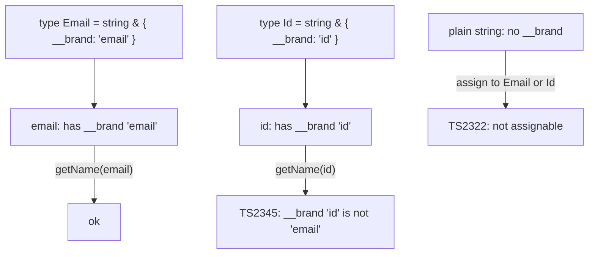

# What `__brand` Is: Making Two Strings Different Types

## TLDR

- `type Id = string & { __brand: "id" }` is a **branded type**. The `{ __brand: "id" }` part is a phantom tag intersected onto `string`.
- A plain `string` does **not** have a `__brand` property, so it is **not assignable** to `Id`. That is what stops raw strings from being treated as a validated id.
- Two brands with different tags (`"id"` vs `"email"`) are different types, so `Id` and `Email` cannot be passed for one another, even though both are strings underneath.
- The tag exists only at compile time. It has no runtime value and is erased; the `as Id` cast is the only thing that creates the value, so it is a promise you make, not a check.
- Because `__brand` here is a plain string literal, it can be forged with a cast. A `unique symbol` brand is the stronger version.
- Runtime validation is still required; Zod's `.brand()` validates and brands in one step.

## The example

```ts
type Id = string & { __brand: "id" };
type Email = string & { __brand: "email" };

function getName(name: Email) {
  return name;
}

const id = "123" as Id;
const email = "labeeb@gmail.com" as Email;

getName(email); // ok
getName(id); // error

export {};
```

Everything compiles until the last call. `getName(email)` is fine, and `getName(id)` fails:

```console
error TS2345: Argument of type 'Id' is not assignable to parameter of type 'Email'.
  Type 'Id' is not assignable to type '{ __brand: "email"; }'.
    Types of property '__brand' are incompatible.
      Type '"id"' is not assignable to type '"email"'.
```

This is the whole point of the brand. `id` and `email` are both strings at runtime, but the compiler refuses to swap them. A plain string that never went through the brand is rejected too:

```ts
const id: Id = "123";
```

```console
error TS2322: Type 'string' is not assignable to type 'Id'.
  Type 'string' is not assignable to type '{ __brand: "id"; }'.
```

<div style={{display: 'flex', justifyContent: 'center'}}>



</div>

## What `{ __brand }` actually is

Break the type apart:

```ts
string & { __brand: "id" }
```

- `string` is the real value type.
- `&` is an **intersection**: the value must satisfy **both** sides.
- `{ __brand: "id" }` is an object type with a single property `__brand` whose type is the string literal `"id"`.

So `Id` means "a value that is a string **and** has a `__brand` property equal to `"id"`". A normal string has no such property, which is why `"123"` is not assignable to `Id` and you need the cast. The property is called a **brand**, a **tag**, or a **phantom field** because it is not meant to hold real data. Its only job is to make the type distinct from every other string.

`__brand` is not a keyword and not a special TypeScript feature. It is just a property name chosen by convention (the double underscore signals "do not touch"). You could call it `kind`, `tag`, or anything else. What matters is that it is a property that plain strings do not have and that differs between brands.

The tag is what makes the type **nominal**. Without it, `Id` and `Email` would both just be `string`, and `getName(id)` would compile, which is exactly the duck-typing problem from [Structural typing and branded types](./structural-typing-and-branded-types). The intersection adds a distinguishing member that the structural type system can check.

## It does not exist at runtime

`__brand` is a compile-time marker. It is erased along with the rest of the type annotations, so nothing named `__brand` is ever created in the JavaScript output. That has two consequences:

1. **The brand cannot check anything at runtime.** It only restricts what the compiler allows. A value reaches a branded type through the `as Id` cast, and `as` is an assertion, not a validation. If `"not-an-email"` is cast to `Email`, the compiler believes you.
2. **The brand can be forged.** Because `__brand` here is a plain string literal, nothing stops `("anything" as Email)` or `("x" as unknown as Email)`. The brand is a speed bump, not a lock.

The stronger version replaces the string literal with a `unique symbol` so the tag cannot be constructed outside the module that declares it:

```ts
declare const brand: unique symbol;

type Brand<T, B extends string> = T & { readonly [brand]: B };

type Email = Brand<string, "Email">;
```

Now no other file can write a value that satisfies the tag, so the only way to get an `Email` is through the code that owns the symbol. That is the difference between a brand you can forge and an opaque type you cannot.

## How to create a branded value safely

Since the cast is a promise and the tag is erased, create branded values through a function or a schema that actually validates, so the compile-time guarantee matches a runtime check:

```ts
import { z } from "zod";

const EmailSchema = z.string().email().brand<"Email">();
type Email = z.infer<typeof EmailSchema>;

const email = EmailSchema.parse("labeeb@gmail.com"); // validated and branded
```

`parse` throws if the value is not a valid email and returns an `Email` if it is. The brand and the check come from one declaration, so a value can only become an `Email` by passing validation. This is the same single-source-of-truth idea behind the other Zod articles in this section.

## Recommendation

Use `{ __brand }` when you want the compiler to keep two otherwise-identical values apart, especially for identifiers and units that share a primitive representation. Remember that the tag is erased and the `as` cast is unchecked, so treat the cast as the "smart constructor" boundary: put it behind a validating function or a schema like `z.string().email().brand<"Email">()`. Prefer a `unique symbol` brand when you need the separation to be un-forgeable rather than merely conventional.

## Sources

- TypeScript Handbook, [Type Compatibility](https://www.typescriptlang.org/docs/handbook/type-compatibility.html) (structural compatibility checks each member; an extra required member such as a brand changes what is assignable).
- TypeScript Handbook, [Everyday Types: Type Assertions](https://www.typescriptlang.org/docs/handbook/2/everyday-types.html) (assertions are erased by the compiler and involve no runtime checking).
- Zod Documentation, [Defining schemas: branded types](https://zod.dev/api?id=branded-types) (`.brand()` produces a branded output type from a validating schema).
- colinhacks/zod, [Issue #678: Flavoured and branded types](https://github.com/colinhacks/zod/issues/678) (a branded value is only obtainable through the schema, so the primitive cannot be claimed without validation).
