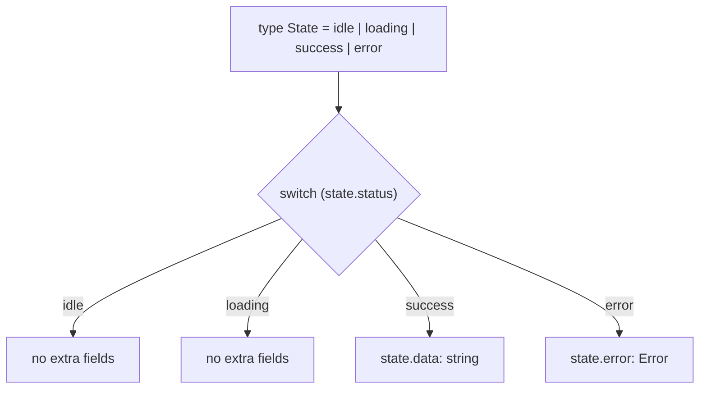
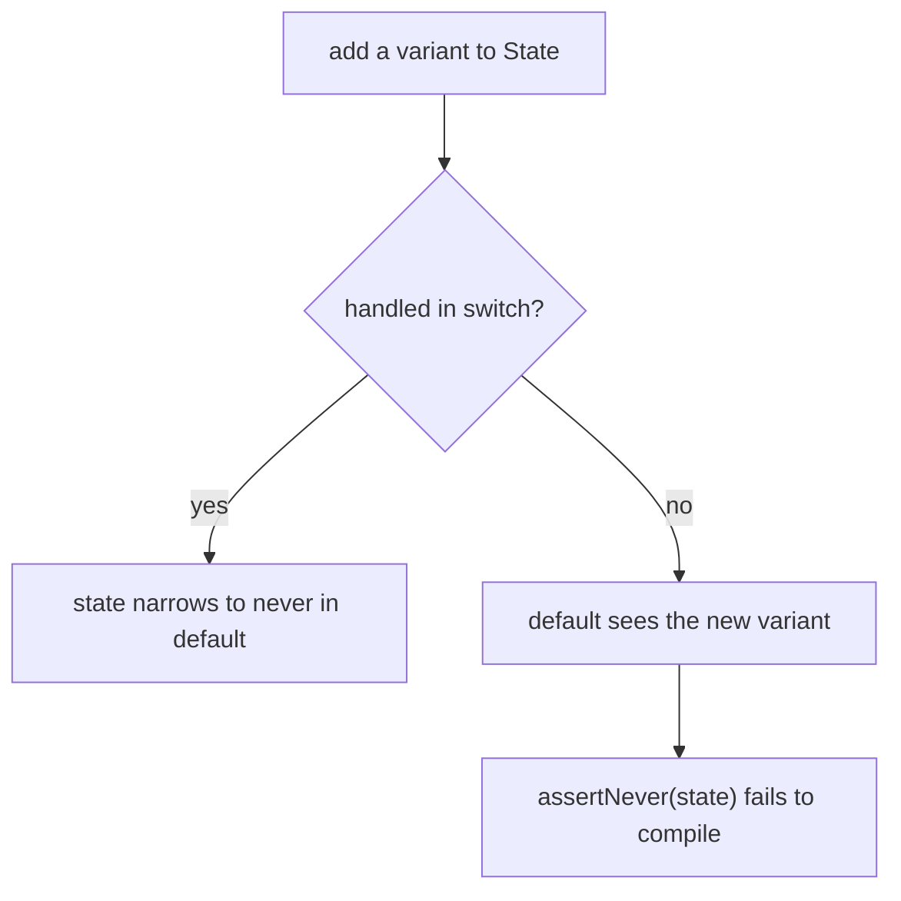

# Discriminated Unions

## TLDR

- A **discriminated union** (also called a tagged union or sum type) is a union of object types that all share one property holding a distinct literal value, the **discriminant**.
- The discriminant is what lets TypeScript narrow the union: check `state.status` and the compiler knows which variant you have, so variant-only fields like `data` or `error` become available.
- It makes **invalid states unrepresentable**. A boolean flag plus optional fields (`loading: boolean; data?: T; error?: E`) allows impossible combinations; a union of variants does not.
- Add a `default` case that assigns the value to `never` to get an **exhaustiveness check**: the build fails if you add a variant and forget to handle it.
- It is the TypeScript form of an algebraic data type, and the pattern behind Redux actions, `useReducer`, and Zod's `safeParse` result.
- The discriminant must be a literal type (string, number, boolean literal, enum member, or `null`/`undefined`) and must be present on every member.

## The problem: flags allow invalid states

Suppose you fetch data and model the UI state like this:

```ts
interface State {
  loading: boolean;
  data?: string;
  error?: Error;
}
```

Nothing stops `{ loading: true, data: "hi", error: someError }`, a state that cannot exist: you are loading and you already have data and an error. Every consumer has to guess which fields are meaningful, and TypeScript cannot help, because `data` is `string | undefined` no matter what `loading` is. This is the "invalid states are representable" problem.

## The solution: a union of variants

Model each situation as its own object and union them. Give every variant the same property with a different literal value:

```ts
type State =
  | { status: "idle" }
  | { status: "loading" }
  | { status: "success"; data: string }
  | { status: "error"; error: Error };
```

`status` is the discriminant. `data` exists only on the success variant and `error` only on the error variant, so the impossible combinations are gone by construction.

## Narrowing by the discriminant

Once you check the discriminant, TypeScript narrows the union in that branch:

```ts
function render(state: State): string {
  switch (state.status) {
    case "idle":
      return "Nothing to show";
    case "loading":
      return "Loading...";
    case "success":
      return state.data; // data is available here
    case "error":
      return state.error.message;
  }
}
```

Inside `case "success"`, `state` is `{ status: "success"; data: string }`, not the whole union. This is the same control-flow narrowing used by type guards, driven by the literal tag.

<div style={{display: 'flex', justifyContent: 'center'}}>



</div>

## Exhaustiveness with never

The compiler still does not know you handled every case, so add a `default` that only compiles when the value is impossible. `never` is the type with no values, so the assignment is only valid when every variant was handled:

```ts
function assertNever(value: never): never {
  throw new Error(`Unhandled variant: ${JSON.stringify(value)}`);
}

function render(state: State): string {
  switch (state.status) {
    case "idle":
      return "Nothing to show";
    case "loading":
      return "Loading...";
    case "success":
      return state.data;
    case "error":
      return state.error.message;
    default:
      return assertNever(state);
  }
}
```

If someone adds `{ status: "refreshing" }` to `State` and forgets a case, `state` in `default` is no longer `never`, and the call fails to compile. The compiler turns "you forgot a case" into a build error instead of a runtime surprise.

<div style={{display: 'flex', justifyContent: 'center'}}>



</div>

## What counts as a discriminant

For TypeScript to treat a union as discriminated, the shared property must be a **unit type**: a literal with a single value. These all work:

- string literals: `"loading"`, `"success"`
- number literals: `1`, `2`
- boolean literals: `true`, `false`
- enum members: `Status.Loading`
- `null` and `undefined`

The property must exist on every member, and its literal must be unique per member. A shared `type: string` (not a literal) will not discriminate, because every member's `string` overlaps.

```ts
type Action =
  | { type: "add"; amount: number }
  | { type: "reset" }
  | { type: "setName"; name: string };
```

## Where you already use them

- **Reducer actions.** Redux and React's `useReducer` dispatch a union of actions and reduce by switching on `action.type`.
- **Schema results.** Zod's `safeParse` returns `{ success: true; data: T } | { success: false; error: ZodError }`, a discriminated union on `success`. See [Zod safeParse](./zod-safeparse).
- **Result / Either types.** Libraries that avoid exceptions return `{ ok: true; value } | { ok: false; error }`, the TypeScript analogue of Rust's `Result`.
- **State machines.** Each state and its allowed data is a variant, so transitions can only read fields that exist.

## Pitfalls

- Do not reuse a discriminant value across variants; uniqueness is what makes narrowing work.
- Keep the discriminant a literal. Widening it to `string` (for example by typing a parameter as `{ type: string; ... }`) turns the union back into unrelated object types.
- `switch` narrowing needs the check to be on the discriminant itself. Destructuring fields before the check can lose the link between them.
- Exhaustiveness only holds if you add the `never` default. Without it, an unhandled variant silently falls through to `undefined`.

## Sources

- TypeScript Handbook, [Narrowing: Discriminated unions](https://www.typescriptlang.org/docs/handbook/2/narrowing.html#discriminated-unions) (the discriminant property, narrowing by literal, and the `never` exhaustiveness check).
- TypeScript Handbook, [Everyday Types: Unions](https://www.typescriptlang.org/docs/handbook/2/everyday-types.html) (unions combine types and require narrowing before using member-specific members).
- TypeScript 2.0 release notes, [Tagged union types](https://www.typescriptlang.org/docs/handbook/release-notes/typescript-2-0.html#tagged-union-types) (the feature that introduced discriminant-based narrowing).
- Redux, [Usage with TypeScript](https://redux.js.org/usage/usage-with-typescript) and the [Redux Style Guide](https://redux.js.org/style-guide/) (action unions discriminated by `type`).
- Zod, [`safeParse`](https://zod.dev/api?id=safe) (returns a discriminated union on `success`).
- Wikipedia, [Tagged union](https://en.wikipedia.org/wiki/Tagged_union) and [Algebraic data type](https://en.wikipedia.org/wiki/Algebraic_data_type) (the general concept, also called a sum type).
