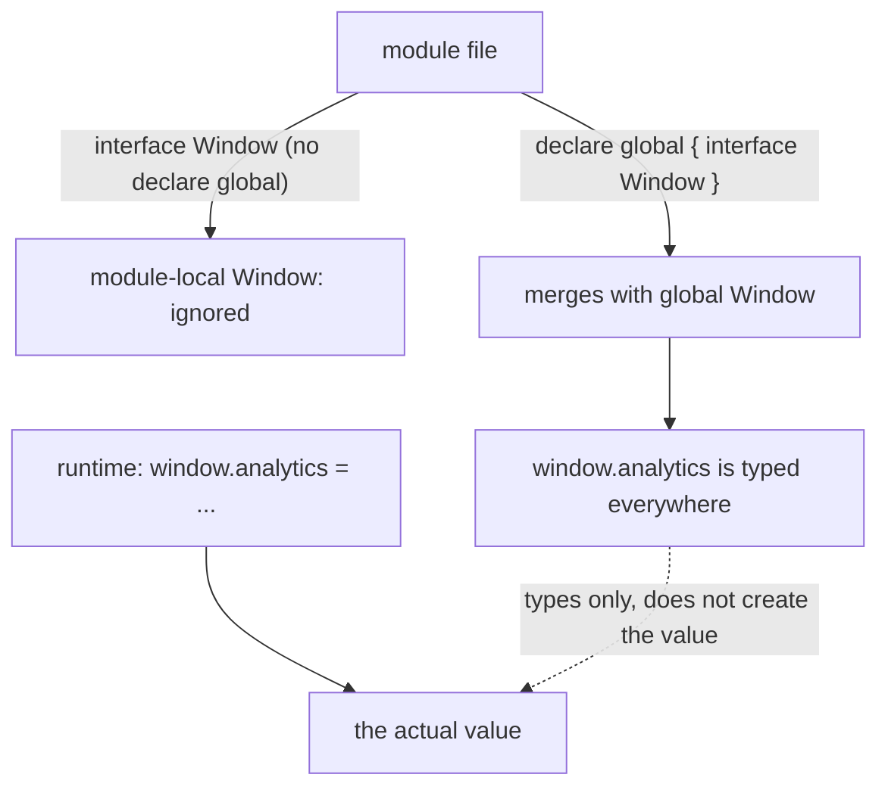

# Adding a Property to `window` with `declare global`

## TLDR

- `window.analytics` is a type error because TypeScript's `Window` interface, from `lib.dom.d.ts`, does not declare `analytics`, even though some script set it at runtime.
- The fix is to **augment the global `Window` interface**: `declare global { interface Window { analytics: ... } }`.
- You cannot do it with a plain top-level `interface Window` in a module, because that interface is private to the file and does not merge with the global one. `declare global` is how a module reaches the global scope.
- `declare global` only works in a module, so the file needs `export {}` (or any import/export).
- It is **types only**. Declaring `analytics` does not create it; you still assign `window.analytics = ...` at runtime.

## The problem

A third-party SDK or an inline `<script>` attaches something to `window`. Your code uses it:

```ts
window.analytics.track("signup");
```

TypeScript refuses:

```console
error TS2339: Property 'analytics' does not exist on type 'Window & typeof globalThis'.
```

The property is really there at runtime. The compiler simply has no idea it exists, because the `Window` interface it knows comes from `lib.dom.d.ts`, and that interface lists the standard browser API only. Anything a library or a script tag adds is invisible to it until you say so.

## Why a top-level `interface Window` does not work

The obvious attempt is to declare the interface yourself:

```ts
interface Window {
  analytics: Analytics;
}
```

In a **script** file, that would merge with the global `Window`. But in a **module** (any file with a top-level `import` or `export`, which is almost every real file), that `interface Window` is a **module-local** declaration. It does not touch the global `Window`, so `window.analytics` is still an error. You have declared a private interface that happens to share a name, not extended the browser's.

This is the whole reason `declare global` exists: it lets code inside a module deliberately reach out and merge into the global scope.

<div style={{display: 'flex', justifyContent: 'center'}}>



</div>

## The fix

Put the augmentation in a module and wrap it in `declare global`:

```ts
// types/window.d.ts
export {}; // makes this file a module, which declare global requires

declare global {
  interface Window {
    analytics: {
      track(event: string, data?: Record<string, unknown>): void;
    };
  }
}
```

Now `window.analytics.track(...)` type-checks everywhere in the project. The `export {}` is required: without it the file is a script, and `declare global` is invalid there. The declaration merges with the DOM's `Window` through interface merging, so you are adding a member, not replacing the type.

## It is types only

The declaration emits no JavaScript. `declare global` does not create `window.analytics`; it only tells the compiler the property is allowed. You still produce the value at runtime, whether that is the library doing it or your own code:

```ts
window.analytics = {
  track(event, data) {
    // send it somewhere
  },
};
```

If you declare the property but nothing ever assigns it, the code compiles and then fails at run time with `Cannot read properties of undefined`. The declaration is a promise the compiler trusts, not a check.

## Where to put it

Keep global augmentations in one dedicated declaration file, such as `types/window.d.ts` or `global.d.ts`, and make sure `tsconfig` includes it. A `.d.ts` that contains `declare global` still needs `export {}` to be treated as a module. You can also colocate the block in a regular `.ts` module if it belongs next to the code that uses it.

## Sources

- TypeScript Handbook, [Declaration Merging: Global augmentation](https://www.typescriptlang.org/docs/handbook/declaration-merging.html) (adding declarations to the global scope from inside a module with `declare global`; augmentations merge like declarations in the same file).
- TypeScript Handbook, [Global: Modifying Module template](https://www.typescriptlang.org/docs/handbook/declaration-files/templates/global-modifying-module-d-ts.html) (using `declare global` to add to the global namespace from a module, including extending interfaces such as `String`).
- TypeScript Handbook, [Declaration Merging](https://www.typescriptlang.org/docs/handbook/declaration-merging.html) (same-named interfaces merge into a single definition, which is how your `Window` combines with the DOM's).
- MDN Web Docs, [`Window`](https://developer.mozilla.org/en-US/docs/Web/API/Window) (the browser global object whose properties are accessible as globals).
