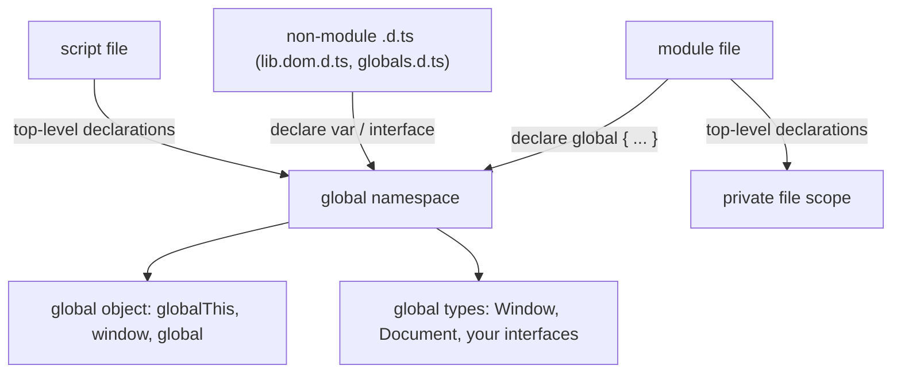
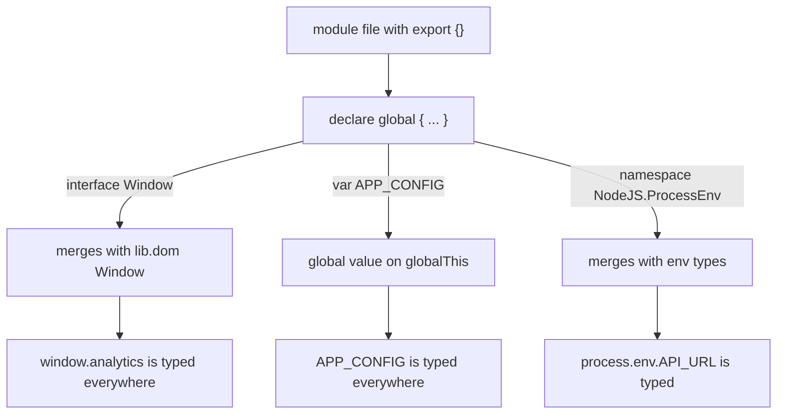

# The Global Namespace and How to Extend It

## TLDR

- The **global namespace** is the outermost scope, shared by every non-module script and backed by the **global object**: `globalThis` everywhere, `window` in the browser, `global` in Node.
- In TypeScript, a top-level declaration in a **script** (or a non-module `.d.ts`) is global. In a **module** it is private to the file. `export {}` opts a file out of the global namespace.
- You extend it two ways: from a **script or `.d.ts`**, declare at the top level (`declare var`, `interface`); from a **module**, wrap declarations in `declare global { ... }`.
- `declare global` only works in a module, so a `.d.ts` that uses it needs `export {}` (or any import/export).
- Extensions work through **declaration merging**: interfaces and namespaces merge; type aliases and classes do not.
- All of it is **types only**. `declare global` emits no JavaScript, so you must still create the runtime value yourself.
- Prefer modules. Reach for the global namespace deliberately (env config, `window` extensions, ambient libs) and keep those declarations in one place.

## What the global namespace is

Every JavaScript runtime has a single **global object**. `globalThis` is the standard way to reach it; `window` works in browsers and `global` in Node, but only `globalThis` works in every environment. The global namespace is simply the set of names attached to that object, plus the top-level bindings scripts create.

The exact rules come from JavaScript:

- A top-level `var` or `function` in a script becomes a **property of the global object**, so `var foo = 1` gives you `globalThis.foo === 1`.
- A top-level `let`, `const`, or `class` creates a **global binding** but does **not** become a property of the global object. It is still global in scope, just not reachable as `globalThis.foo`.

TypeScript layers types on top of this. Its own standard library, `lib.dom.d.ts`, is exactly a set of global declarations: `document`, `window`, `fetch`, `console`, and the rest are declared in the global namespace, which is why you use them without importing anything.

<div style={{display: 'flex', justifyContent: 'center'}}>



</div>

## How TypeScript decides what is global

The rule is the same one behind [TS2393 duplicate function implementation](./scripts-vs-modules-ts2393): a file is a **module** if it has a top-level `import` or `export`, and a **script** otherwise. Scripts contribute to the global namespace; modules do not. A `.d.ts` file follows the same rule, with one twist: `moduleDetection: "force"` does not apply to `.d.ts` files, which are always auto-detected, so a `.d.ts` without an `export` is global.

That single line decides everything, which is why adding or removing `export {}` can silently change whether your declarations are global or private.

## Extending it from a script or `.d.ts`

The simplest extension is a plain declaration at the top level of a non-module file. Create a `globals.d.ts` with no imports or exports:

```ts
// globals.d.ts (no import/export, so this file is global)
interface AppConfig {
  apiUrl: string;
}

declare var APP_CONFIG: AppConfig;
declare function track(event: string): void;
```

As long as the file is part of your program, `AppConfig`, `APP_CONFIG`, and `track` are visible everywhere with no import. `declare` tells the compiler "this exists at runtime; do not look for an implementation", so there is no emitted JavaScript and no error about a missing value.

You can also **augment an existing global** by merging with its interface. Here we add a property to the browser's `Window`:

```ts
// window.d.ts (still a script)
interface Window {
  analytics: {
    track(event: string, data?: Record<string, unknown>): void;
  };
}
```

`Window` already exists in `lib.dom.d.ts`, and interface merging combines your declaration with it, so `window.analytics` now type-checks.

## Extending it from a module: `declare global`

In a module, a top-level `interface` is private to the file. To reach the global namespace from there, use `declare global`:

```ts
// types/global.d.ts
export {}; // makes this a module, which declare global requires

declare global {
  interface Window {
    analytics: {
      track(event: string, data?: Record<string, unknown>): void;
    };
  }

  var APP_CONFIG: AppConfig;

  namespace NodeJS {
    interface ProcessEnv {
      API_URL: string;
    }
  }
}
```

The `export {}` is the load-bearing line. Without it the file is a script, and `declare global` is both unnecessary and invalid. The compiler rejects it with a message along the lines of `Augmentations for the global scope can only be directly nested in external modules or ambient module declarations`.

Inside the block:

- `interface Window` merges into the DOM's `Window`, so `window.analytics` is typed.
- `var APP_CONFIG` adds a global value that is expected on the global object.
- `namespace NodeJS { interface ProcessEnv }` is the common way to type extra environment variables, since `process.env` is typed as `NodeJS.ProcessEnv`.

<div style={{display: 'flex', justifyContent: 'center'}}>



</div>

## It is types only

Every declaration here is **ambient**: it describes a shape and emits nothing. `declare var APP_CONFIG` does not create `APP_CONFIG`. It only tells the compiler to allow the name. You still have to produce the value at runtime:

```ts
globalThis.APP_CONFIG = { apiUrl: "https://api.example.com" };

window.analytics = {
  track(event, data) {
    // ...
  },
};
```

This is the same erasure idea that runs through this whole section: types vanish at runtime, so a declaration is a promise the compiler trusts, never a thing that executes. If you forget the runtime assignment, the code compiles and then fails at run time with `undefined`.

## The merging rules you can rely on

Global augmentation is just declaration merging, so it can only extend what merges:

| Declaration | Can it be added to the global namespace / merged? |
|---|---|
| `interface` | Yes, merges with same-named interfaces |
| `namespace` | Yes, merges with same-named namespaces |
| `var` / `function` | Yes, declared (ambient, no implementation) |
| `type` alias | No, cannot be merged or reopened |
| `class` | No, a class cannot be merged directly |

So you can add members to `Window`, `Document`, `Array`, `String`, or `NodeJS.ProcessEnv`, but you cannot reopen a `type` alias. If you need to extend something that is a type alias, you are usually better off writing a wrapper or a new interface that extends it.

## `declare global` vs `declare module`

These two look similar and do different jobs:

- `declare global { ... }` extends the **global** scope.
- `declare module "pkg" { ... }` augments a **package's** types, such as adding `req.user` to Express's `Request`.

Both require the containing file to be a module, both rely on declaration merging, and both can only add to interfaces and namespaces rather than replace them. The keyword has to match the scope you are extending.

## Cautions

- **Globals are shared, so names collide.** Two declarations of the same global name produce a duplicate error (`TS2393` for functions, `TS2300` for identifiers), which is exactly the script problem from the previous article.
- **It is easy to make a file private by accident.** Adding `export {}` to a file that should stay global (a common bug in `vite-env.d.ts`) turns its `interface ImportMetaEnv` into a module-local type that no longer merges, and the compiler stays silent about it.
- **Keep it in one place.** Put global declarations in a dedicated `global.d.ts` or `types/` file that `tsconfig` includes, so they are easy to find and review.
- **Prefer imports when you can.** Use the global namespace for things that are genuinely global: environment config, browser or host APIs, and ambient library types. Everything else belongs in a module.

## Sources

- MDN Web Docs, [Global object](https://developer.mozilla.org/en-US/docs/Glossary/Global_object) (one global object per environment; top-level `var` and function declarations create properties of it, `let` and `const` do not).
- MDN Web Docs, [`globalThis`](https://developer.mozilla.org/en-US/docs/Web/JavaScript/Reference/Global_Objects/globalThis) (the standard cross-environment accessor for the global object).
- TypeScript Handbook, [Declaration Merging: Global augmentation](https://www.typescriptlang.org/docs/handbook/declaration-merging.html) (adding declarations to the global scope from inside a module with `declare global`; global and module augmentations share behavior and limits).
- TypeScript Handbook, [Declaration Reference: Global Variables](https://www.typescriptlang.org/docs/handbook/declaration-files/by-example.html) (`declare var`, `declare const`, and `declare let` for global variables).
- TypeScript Handbook, [Global: Modifying Module template](https://www.typescriptlang.org/docs/handbook/declaration-files/templates/global-modifying-module-d-ts.html) (using `declare global` to add to the global namespace from a module).
- Total TypeScript, [Modules, Scripts, and Declaration Files](https://www.totaltypescript.com/books/total-typescript-essentials/modules-scripts-and-declaration-files) (scripts add to global scope; `.d.ts` files are scripts or modules based on `export`; `declare global` and `declare module`).
- DEV Community, [declare global vs declare module: When to Use Which](https://dev.to/gabrielanhaia/declare-global-vs-declare-module-when-to-use-which-3fne) (the `export {}` requirement for `declare global`, and the failure mode of adding it to a file that should stay global).
