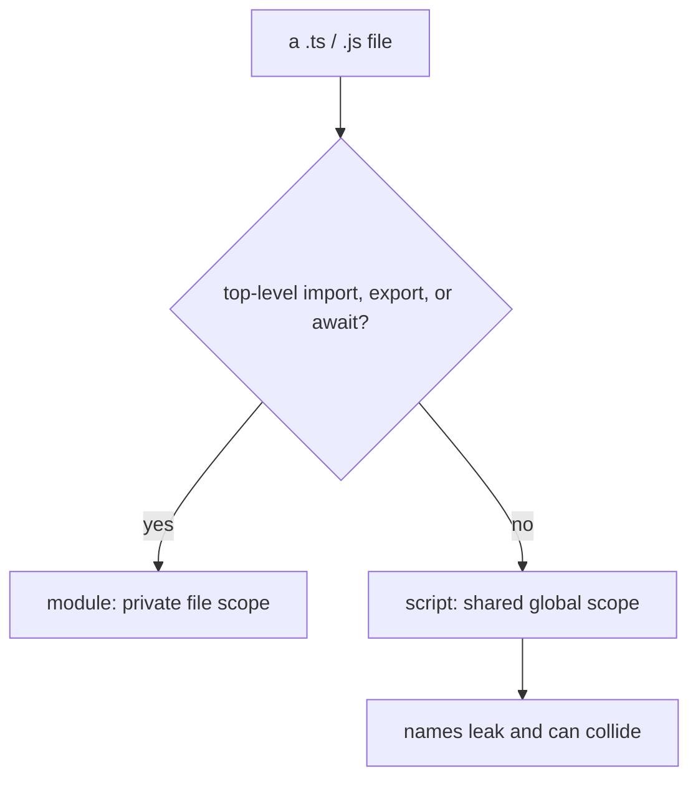

# Modules vs Scripts: What `export {}` Really Does

## TLDR

- A file with a top-level `import` or `export` (or `await`) is a **module**; otherwise it is a **script**.
- Scripts share the global scope, so their top-level names leak and can collide. Modules have their own file scope.
- `export {}` exports nothing but flips a file into a module, which is the smallest way to get that scope.
- Modules are also strict by default, deferred, and statically analyzable (which enables tree-shaking).
- We moved from scripts to modules because scripts shared one global namespace and depended on `<script>` order.

## Script vs module

A **script** has no top-level `import` or `export`. Its top-level declarations live in the shared global scope, so `var foo = 42` becomes `window.foo`. Every script on the page sees every other one, load order matters, and two files declaring the same name collide (see [TS2393](./scripts-vs-modules-ts2393)).

A **module** has a top-level `import` or `export`. It gets its own file scope, so the same `var foo = 42` stays private. It also enables strict mode automatically, loads deferred, and has a static structure tools can read before running anything.

<div style={{display: 'flex', justifyContent: 'center'}}>



</div>

## The rule

The file's own syntax decides, with no setting to pick. The Handbook states that "any file containing a top-level `import` or `export` is considered a module", and a file without one "is treated as a script whose contents are available in the global scope". A top-level `await` also counts, and `moduleDetection: "force"` can make every non-`.d.ts` file a module regardless.

## `export {}`

`export {}` is an empty export. It exports nothing, but it still counts as a top-level `export`, so it turns the file into a module. Use it when a file has nothing to export but must be a module, for example a file of only types or side effects, or one that needs `declare global`.

It is not erased. Compiling to ESM keeps `export {};` in the output, and compiling to CommonJS emits the `Object.defineProperty(exports, "__esModule", { value: true })` marker. That surviving syntax is the runtime signal that the file is a module.

## What happens when you import

A static `import` loads and evaluates the whole target module, plus everything it imports, before your module's body runs. You only *access* the bindings you name, but every module's code and side effects execute, and evaluation is depth-first: dependencies first.

- `import "./polyfill"` imports nothing and exists just to run a module's side effects.
- `import()` loads on demand, returning a promise, so the module is only fetched and evaluated when that line runs:

  ```ts
  button.addEventListener("click", async () => {
    const { openEditor } = await import("./editor");
    openEditor();
  });
  ```

  `./editor` and its dependencies are not loaded until the click. Unlike a static `import`, `import()` can appear anywhere, such as inside a function or behind a condition.
- `import type` is erased by TypeScript, so it loads nothing at runtime.

## Why modules replaced scripts

The script model had three problems: top-level names collided in the shared global scope, dependencies were implicit so `<script>` order mattered, and nothing was encapsulated. The ecosystem tried to fix this over time, from the IIFE pattern to CommonJS (Node, 2009) to AMD for browsers, until ECMAScript 2015 standardized ES modules with `import` and `export`. Modules solve all three problems at once: names are file-scoped, dependencies are declared, and the structure is static so bundlers can trim it. That is why the modern default is to treat every file as a module.

## Sources

- TypeScript Handbook, [Modules](https://www.typescriptlang.org/docs/handbook/2/modules.html) (the `import`/`export` rule, scripts in the global scope, and `export {}` turning a file into a module).
- MDN Web Docs, [JavaScript modules](https://developer.mozilla.org/en-US/docs/Web/JavaScript/Guide/Modules) (module features are scoped to the importing script, not the global scope; modules are strict and deferred by default).
- V8, [JavaScript modules](https://v8.dev/features/modules) (modules have a lexical top-level scope, so `var foo` does not create `window.foo`; CommonJS and AMD preceded them).
