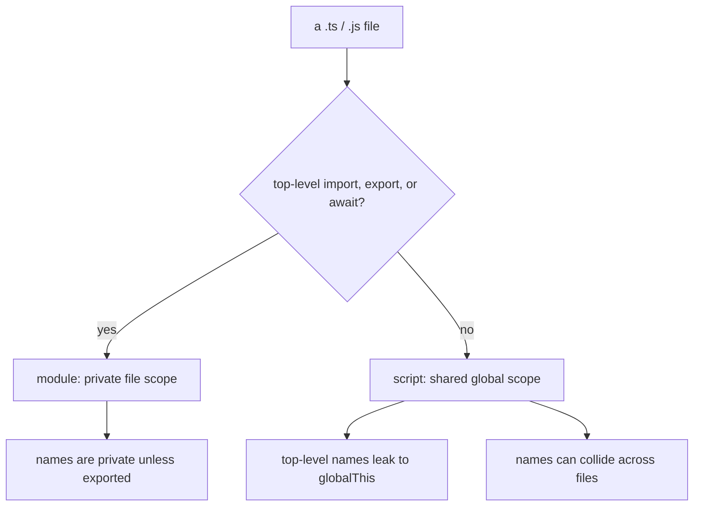

# Modules vs Scripts: What `export {}` Really Does

## TLDR

- A JavaScript or TypeScript file is a **module** if it has a top-level `import` or `export` (or a top-level `await`). If it has none of those, it is a **script**.
- A script runs in the **shared global scope**: its top-level names leak to `window` / `globalThis`. A module runs in its **own file scope**: nothing leaks unless exported.
- `export {}` exports nothing, but it is the smallest way to flip a file into a module, which gives it its own scope.
- Modules also turn on strict mode automatically, load deferred, and let tools statically read the dependency graph (which is what enables tree-shaking).
- We moved from scripts to modules because the script model shared one global namespace and depended on `<script>` load order. Modules give encapsulation and explicit dependencies.

## What a script is

Before modules, a JavaScript program was a set of `<script>` tags loaded into one page, all sharing a single global scope:

```html
<script src="users.js"></script>
<script src="app.js"></script>
```

Everything a script declared at the top level landed on the global object. In a browser, `var foo = 42` in a script gives you `window.foo`. The TypeScript Handbook describes the model directly: inside a script, "variables and types are declared to be in the shared global scope", and it assumes you will "use the `outFile` compiler option to join multiple input files into one output file, or use multiple `<script>` tags in your HTML to load these files (in the correct order!)".

That model has three built-in problems:

- **Name collisions.** Two scripts that declare the same top-level name overwrite or clash with each other. This is exactly the source of [TS2393 duplicate function implementation](./scripts-vs-modules-ts2393).
- **Load order matters.** If `app.js` uses something from `users.js`, `users.js` must load first. Nothing enforces it.
- **No encapsulation.** Every file can see and change every other file's top-level names, and there is no declared list of what a file depends on.

## What a module is

An ES module is a file with its own top-level scope and an explicit list of what it shares. The V8 team's description is the clearest contrast: in a module, "running `var foo = 42;` does not create a global variable named `foo`", whereas in a classic script it does.

Modules add a few things beyond scoping:

- **Explicit boundaries.** `export` marks what leaves the file, `import` marks what comes in. Nothing else is visible.
- **Strict mode by default.** Modules are automatically strict, with no `"use strict"` needed.
- **Deferred loading.** Module scripts are deferred automatically, so they do not block the HTML parser.
- **Static structure.** Because `import`/`export` are top-level and rigid, a tool can read the whole dependency graph before running anything, which is what makes tree-shaking possible.

MDN makes the scoping point bluntly: module features "are imported into the scope of a single script, they aren't available in the global scope", so you cannot even reach an imported binding from the browser console.

## The rule that decides which one a file is

There is no setting to pick. The file's own syntax decides:

> In TypeScript, just as in ECMAScript 2015, any file containing a top-level `import` or `export` is considered a module. Conversely, a file without any top-level import or export declarations is treated as a script whose contents are available in the global scope.

So the presence of a single top-level `import` or `export`, anywhere in the file, is the whole signal. A top-level `await` also counts (the JavaScript spec treats it as a module indicator), and TypeScript's `moduleDetection` option can force every non-`.d.ts` file to be a module regardless.

<div style={{display: 'flex', justifyContent: 'center'}}>



</div>

## What `export {}` is for

`export {}` is an export statement with an empty list. It exports nothing, but it still counts as a top-level `export`, so it flips the file from a script into a module. The Handbook recommends it for exactly this: adding `export {};` "will change the file to be a module exporting nothing", and it works regardless of your module target.

You reach for it when a file has nothing to export but still needs to be a module. Two common cases:

- A file of only types, or only side effects, that must not leak into the global scope.
- A file that needs `declare global` to work, since `declare global` is only valid inside a module.

It is not erased. If you compile to ESM, `export {}` stays in the JavaScript output as `export {};` (you can see it at the bottom of a compiled file), and if you compile to CommonJS it becomes the `Object.defineProperty(exports, "__esModule", { value: true })` marker. That surviving syntax is the runtime signal that the file is a module.

## Why we moved from scripts to modules

The history is a series of attempts to fix the global-scope problems. JavaScript shipped in 1995 with no module system, so developers used the global namespace and carefully ordered `<script>` tags. Next came the **IIFE / revealing module pattern**, wrapping code in a function to keep it out of the global scope, but it still relied on a single global object and manual ordering. Then **CommonJS** (used by Node.js from 2009) gave each file its own namespace with `require` and `module.exports`, but it loads synchronously and browsers never supported it natively. **AMD** solved the browser's async loading problem but needed a loader and had clumsy syntax. Each attempt kept the good ideas and fixed a weakness, and in 2015 ECMAScript standardized **ES Modules** with `import` and `export`. The TypeScript Handbook summarizes the convergence: JavaScript "has implemented support for a lot of these formats, but over time the community and the JavaScript specification has converged on a format called ES Modules".

The reason the move stuck is that modules solve all three script problems at once: names are scoped to the file (no collisions), dependencies are declared in the file (no hidden load order), and the structure is static (so bundlers can analyze and trim it). That is why the modern default is to treat every file as a module, and why `export {}` exists as the cheapest way to make a file one.

## Sources

- TypeScript Handbook, [Modules](https://www.typescriptlang.org/docs/handbook/2/modules.html) (a file with a top-level `import` or `export` is a module; otherwise a script in the global scope; scripts assume `outFile` or ordered `<script>` tags; `export {};` turns a file into a module exporting nothing; the ecosystem converged on ES Modules).
- MDN Web Docs, [JavaScript modules](https://developer.mozilla.org/en-US/docs/Web/JavaScript/Guide/Modules) (module features are scoped to the importing script and are not on the global scope; modules use strict mode and are deferred automatically).
- V8, [JavaScript modules](https://v8.dev/features/modules) (modules have a lexical top-level scope, so `var foo` does not create `window.foo`; strict mode by default; static `import`/`export`; userland systems like CommonJS and AMD preceded them).
- MDN Web Docs, [`export`](https://developer.mozilla.org/en-US/docs/Web/JavaScript/Reference/Statements/export) and [`import`](https://developer.mozilla.org/en-US/docs/Web/JavaScript/Reference/Statements/import) (the file must be interpreted as a module; modules are strict by default; static imports allow modules to be analyzed before evaluation).
- SitePoint, [Understanding ES6 Modules via Their History](https://www.sitepoint.com/understanding-es6-modules-via-their-history/) (the path from global patterns and IIFEs through CommonJS and AMD to ES6 modules, and the static versus dynamic distinction).
