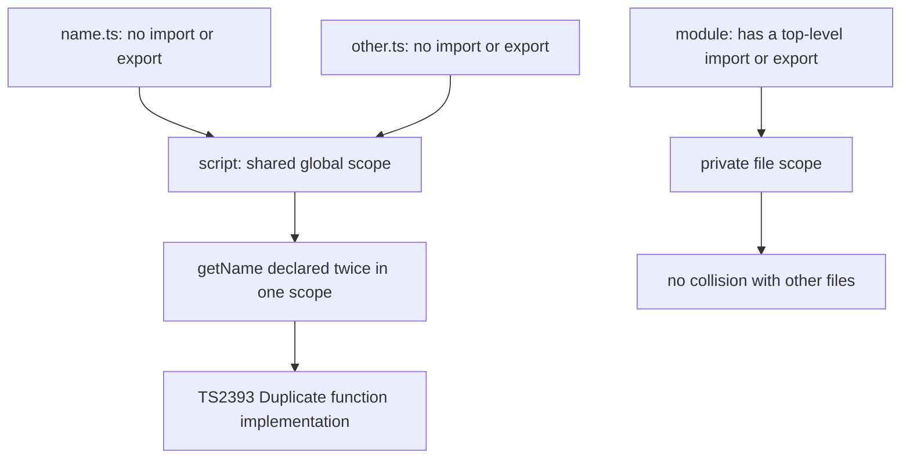

# TS2393 Duplicate Function Implementation: Scripts vs Modules

## TLDR

- A `.ts` file with **no top-level `import` or `export`** is treated as a **script**, not a module. Its top-level declarations go into the **shared global scope**.
- Any other script in the same program that declares the same top-level name collides, **no matter which folder it is in**, because they all share one global scope.
- The collision surfaces as `TS2393: Duplicate function implementation` for functions. Other declarations usually surface as `TS2300: Duplicate identifier`, and identical `interface`s merge silently.
- Fix: make the file a module. Either add `export` to a declaration, or add the no-op `export {};` anywhere at the top level.
- Once a file is a module, its top-level scope is private to the file, and the collision disappears.
- The clash can come from code you did not write, such as a non-module `.d.ts` or a global declaration, because those are scripts too.

## The problem

You have two files, each with a function called `getName`, and neither has any `import` or `export`:

```ts
// src/users/name.ts
function getName(name: string) {
  return name;
}
```

```ts
// src/orders/name.ts
function getName(name: string) {
  return name;
}
```

`tsc` refuses to compile:

```console
src/users/name.ts:1:10 - error TS2393: Duplicate function implementation.
```

The two files are in completely different folders and share no code. It still fails. Nothing is wrong with either function on its own. The problem is that TypeScript does not see them as two files at all; it sees one global scope with the same function declared twice.

## Why it happens

The TypeScript Handbook is explicit about the rule:

> In TypeScript, just as in ECMAScript 2015, any file containing a top-level `import` or `export` is considered a module. Conversely, a file without any top-level import or export declarations is treated as a script whose contents are available in the global scope.

The distinction is the whole story:

- **A module** is executed in its own scope. Its top-level declarations are private to the file unless exported.
- **A script** has no such scope. Its top-level declarations are dropped into the global scope and are visible to every other file.

So two scripts that both declare `getName` are two implementations of the same global function, and JavaScript does not allow a function to have two bodies. The compiler reports the second one as a duplicate implementation. The folder path is irrelevant, because a global name is global regardless of where it was written. Any non-module file included by your `tsconfig` participates, including a `.d.ts` that declares the same name at the top level.

<div style={{display: 'flex', justifyContent: 'center'}}>



</div>

## The fix

Make the file a module. There are two ways, and both work.

**Export a declaration** you actually want to use elsewhere. This is the better fix when the function is meant to be imported:

```ts
type Id = string & { __brand: "id" };
type Email = string & { __brand: "email" };

export function getName(name: Email) {
  return name;
}
```

**Add `export {};`** when the file has nothing to export, for example a file of only types or a side-effect script:

```ts
type Id = string & { __brand: "id" };
type Email = string & { __brand: "email" };

function getName(name: Email) {
  return name;
}

export {};
```

The Handbook describes this exact trick: adding `export {};` "will change the file to be a module exporting nothing", and it works regardless of your module target. From that point on, `getName` lives in the file's own scope, not the global one, so the duplicate is gone.

## A nuance about the error code

The same root cause shows up as different errors depending on what was declared:

- Two function implementations produce `TS2393: Duplicate function implementation`.
- Two `type` aliases, `const`s, or `let`s produce `TS2300: Duplicate identifier`.
- Two `interface`s with the same name do **not** error; interfaces merge by declaration merging, so they combine into one global interface.

So if you are chasing `TS2300` instead of `TS2393`, check for the same missing `export`.

## It can collide with code you did not write

Because a script shares the global scope with the entire program, the second declaration does not have to be in your file or even your folder. Common sources are:

- another non-module `.ts` anywhere under `tsconfig`'s `include`
- a non-module `.d.ts` that declares the name at top level
- an ambient or global declaration from a library

That is why the fix is to stop being a script, rather than to hunt for the other file. Making your file a module puts it out of reach of the global namespace entirely.

## Recommendation

Treat every file as a module by default. If a file has real exports, that happens automatically. If it does not, add `export {};` so it still gets its own scope. To remove the trap across a whole project, set the compiler option `moduleDetection` to `force`, which makes TypeScript treat every non-declaration file as a module whether or not it has an import or export. That way a forgotten `export` can never silently leak declarations into the global scope again.

## Sources

- TypeScript Handbook, [Modules](https://www.typescriptlang.org/docs/handbook/2/modules.html) (any file with a top-level `import` or `export` is a module; a file without them is a script whose contents are in the global scope; `export {};` turns a file into a module exporting nothing).
- TypeScript Handbook, [Modules: Non-modules](https://www.typescriptlang.org/docs/handbook/modules/reference.html) (the JavaScript spec treats files without `import`, `export`, or top-level `await` as scripts).
- TypeScript tsconfig, [`moduleDetection`](https://www.typescriptlang.org/tsconfig/moduleDetection.html) (`force` treats every non-declaration file as a module).
- Stack Overflow, [What does "a file without any top-level import or export is treated as a script" mean](https://stackoverflow.com/questions/69416097/what-does-a-file-without-any-top-level-import-or-export-declarations-is-treated) (two scripts with the same identifier collide in the global namespace; `export {}` makes the file a module and stops the leak).
- Error code reference, [TS2393: Duplicate function implementation](https://akousa.net/error-codes/ts-2393) (a function with the same name is implemented more than once in the same scope).
