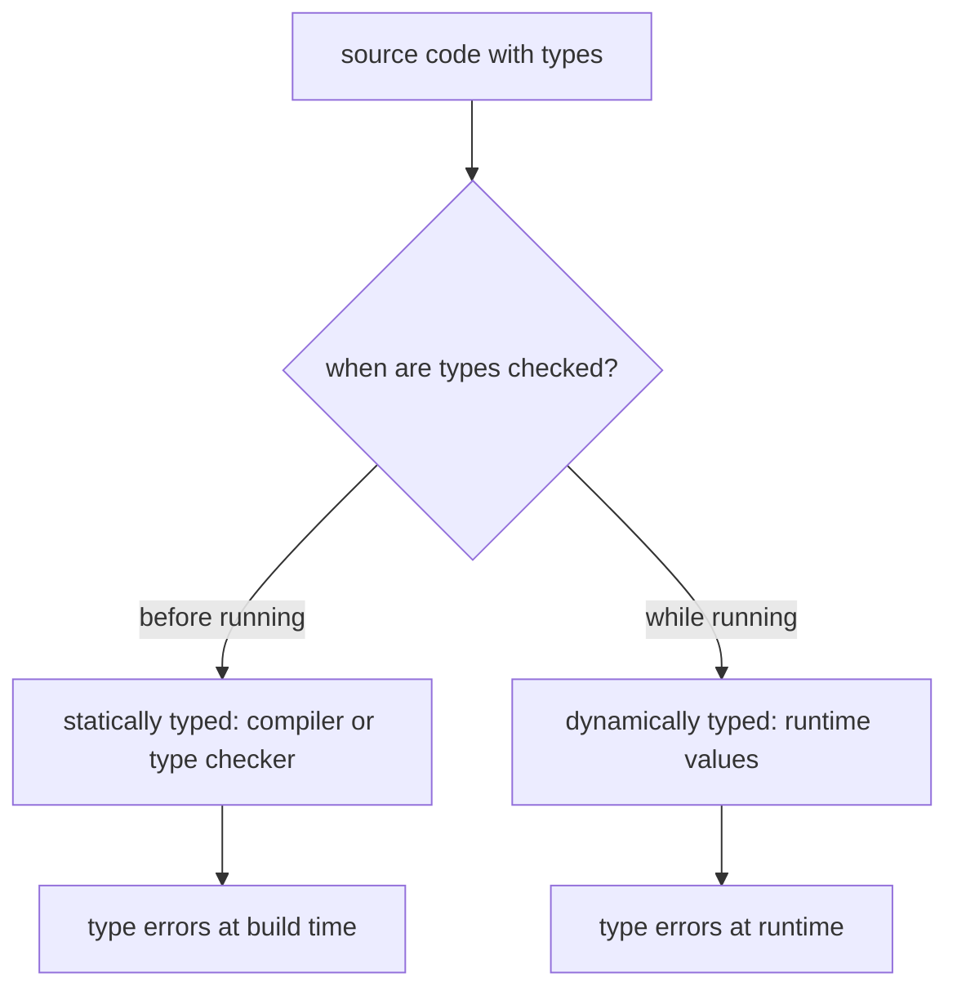

# What Is a Statically Typed Language?

## TLDR

- A **statically typed** language checks types **before** the program runs, using types written in or inferred from the source. A **dynamically typed** language checks types **while** the program runs, using the values themselves.
- "Static" is about **when** the check happens, not how strict it is. Static versus dynamic is separate from strong versus weak typing.
- Static checking catches a whole class of errors at build time, powers editor tooling (autocomplete, refactoring), and documents intent. The cost is annotations and a check/build step.
- TypeScript is statically typed: `tsc` checks the types ahead of time. But it compiles to JavaScript, which is dynamically typed, and the types are erased before anything runs.

## The problem: errors that only appear at runtime

In a dynamically typed language, a value carries no compile-time type, so mistakes surface only when the offending line executes:

```js
function greet(user) {
  return "Hello, " + user.name.toUpperCase();
}

greet({ name: "Ada" });  // fine
greet({ username: "Ada" }); // TypeError: Cannot read properties of undefined (reading 'toUpperCase')
```

The bug is real, but nothing warns you until that call runs, possibly in production. A statically typed language moves this check earlier, before the code ever executes.

## What "static" means

A statically typed language assigns a type to every expression and verifies that operations are used consistently, as a whole-program analysis done by a compiler or type checker **before execution**. The same mistake fails at build time:

```ts
function greet(user: { name: string }) {
  return "Hello, " + user.name.toUpperCase();
}

greet({ username: "Ada" }); // error: Property 'name' is missing
```

The error appears when you build, not when the function is called. That is the entire idea: catch type errors statically, before the program runs.

<div style={{display: 'flex', justifyContent: 'center'}}>



</div>

## Static vs dynamic is not strong vs weak

These are two different axes, and mixing them causes confusion:

- **Static vs dynamic** is about **when** types are checked (before or during execution).
- **Strong vs weak** is about **whether** the language silently converts between types (for example, `"1" + 1` becoming `"11"`).

They are independent:

| Language | Typing | Checking |
| --- | --- | --- |
| TypeScript | strong | static |
| Java, Go, Rust | strong | static |
| C | weak | static |
| Python | strong | dynamic |
| JavaScript | weak | dynamic |

So "dynamically typed" does not mean "no types" (Python has types) and "statically typed" does not mean "safe" (C is static but full of implicit conversions).

One caution: unlike static versus dynamic, the strong/weak distinction has **no precise, agreed definition**. Silent coercion such as `1 + "1"` yielding `"11"` is the common criterion, and by it JavaScript is weak, but the line is blurry because most languages allow some implicit conversions (for example `int` to `float`). Treat strong/weak as informal shorthand and rely on a language's specific conversion rules when it matters.

## What static typing buys

- **Early errors.** Type mismatches are caught by the checker, not by a user.
- **Tooling.** The editor knows the type of every value, so it can autocomplete, jump to definition, and rename safely.
- **Documentation.** Signatures state what a function accepts and returns, and the compiler keeps them honest.
- **Refactoring confidence.** Change a type and the checker lists every place that must follow.

## What it costs

- **Annotations or inference.** You either write types or rely on the checker to infer them.
- **A build or check step.** Something has to run the type checker, which dynamic languages skip.
- **Types can lie at the boundary.** A static type is only as good as the data that reaches it. `JSON.parse` and `res.json()` return `any`, so an annotation can be wrong without the checker noticing. See [Why your API response types are a lie](./why-api-response-types-lie).

## Where TypeScript fits

TypeScript adds a static layer on top of JavaScript. `tsc` checks the types at compile time, then the types are erased, and the dynamic JavaScript runs as usual. So TypeScript is statically typed at development time and dynamically typed at runtime, which is exactly why validation at the edges (schemas, type guards) still matters.

## Sources

- TypeScript Handbook, [TypeScript for JavaScript Programmers](https://www.typescriptlang.org/docs/handbook/typescript-in-5-minutes.html) (static type checking; TypeScript's type system runs before code executes and its types do not exist at runtime).
- TypeScript Documentation, [Why TypeScript](https://www.typescriptlang.org/why-create-typescript) (types as a compile-time aid on top of JavaScript).
- Wikipedia, [Type system](https://en.wikipedia.org/wiki/Type_system) (static versus dynamic checking, and the separate strong/weak axis).
- Wikipedia, [Strong and weak typing](https://en.wikipedia.org/wiki/Strong_and_weak_typing) (the distinction is not clearly defined; implicit conversions are a different dimension from static checking).
