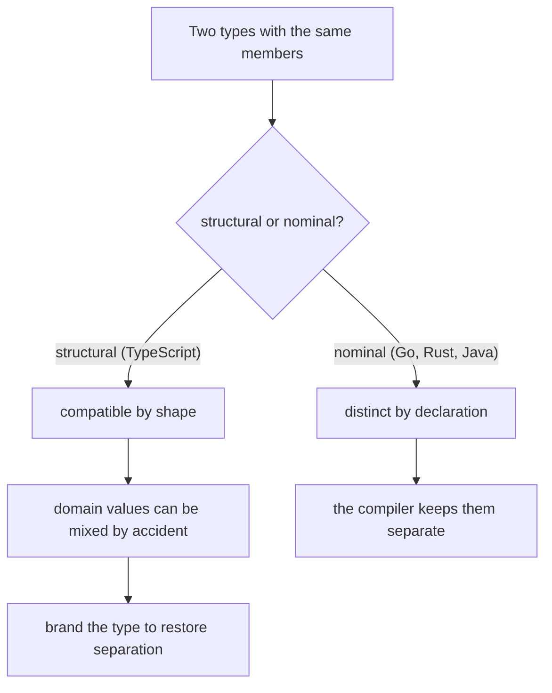
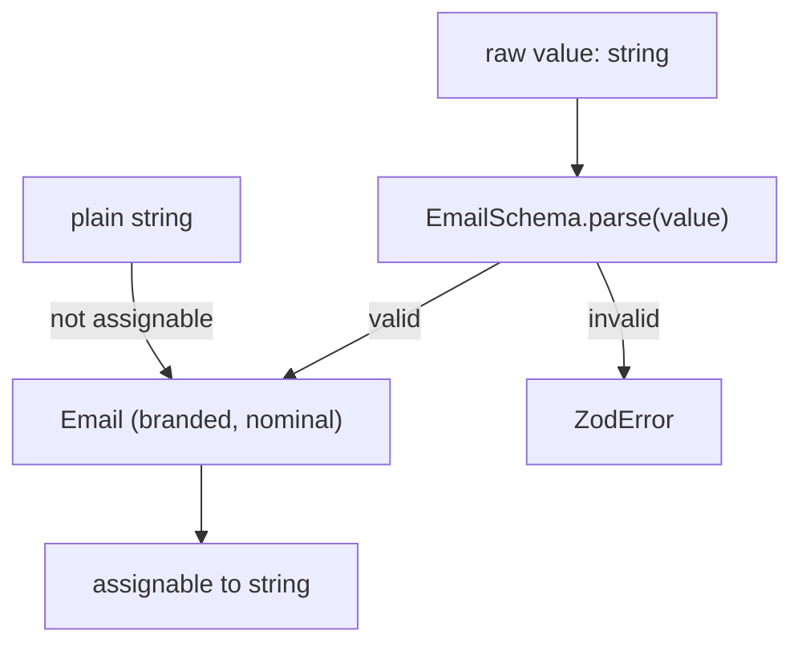

# Structural Typing: Duck Typing in TypeScript (and the Brand Fix)

## TLDR

- TypeScript's type compatibility is **structural**: types relate by their members, not by their names. This is what people mean by duck typing.
- **Nominal** languages (Java, C#, Go, Rust) tie a type to its declaration, so two identical shapes stay distinct and cannot be mixed. This is a common criticism of TypeScript from Go and Rust developers.
- Structural typing is not always the culprit in the classic complaint. `const id: string` and `const email: string` are the **same type** `string`, so passing one for the other is allowed because there is nothing to distinguish them, not because of shape matching.
- TypeScript does have nominal corners: `class` members marked `private` or `protected` are compared nominally, and `enum` members from different enums are incompatible.
- The general fix for the primitive case is a **branded (opaque) type**: intersect the primitive with a tag property so the compiler treats two strings as different types. `string & { readonly __brand: "Email" }` is the simplest form; a `unique symbol` tag avoids collisions.
- Brands are static only. They are erased at runtime, so pair them with a schema. Zod's `.brand()` both validates the value and produces the branded type, keeping a single source of truth.

## A common confusion about the `id` / `email` example

Start with this, because it is the example people usually reach for:

```ts
const id: string = "123";
const email: string = "ada@example.com";

function getName(email: string): string {
  return email.split("@")[0];
}

getName(id); // allowed: `id` is a string
```

Nothing structural is happening here. Both variables are annotated as `string`, so they are the exact same type, and any `string` is accepted wherever a `string` is expected. A language can only stop this if it lets the two values have **different types**, which is exactly what Go's defined types and Rust's newtypes do. The complaint is real, but its root is the absence of cheap named types, not duck typing.

Structural typing shows up when values have a **shape**, and two different shapes with the same members become interchangeable.

## What structural typing is

```ts
// A nominal type system means that each type is unique,
// and even if types have the same data you cannot assign
// across types.

// TypeScript's type system is structural, which means
// if the type is shaped like a duck, it's a duck. If a
// goose has all the same attributes as a duck, then it also
// is a duck.
```

The TypeScript Handbook states that type compatibility is "based on structural subtyping", which relates "types based solely on their members. This is in contrast with nominal typing." It also calls this "duck typing", from the saying that if it walks like a duck and quacks like a duck, it is a duck.

```ts
interface Point {
  x: number;
  y: number;
}

interface Vector {
  x: number;
  y: number;
}

const p: Point = { x: 1, y: 2 };
const v: Vector = p; // no error: same shape
```

`Point` and `Vector` are separate declarations with the same members, and TypeScript considers them compatible. The rule is that a value is compatible with a target if it has **at least** the target's members, so extra properties are fine and a subtype can be used where the wider type is expected:

```ts
function draw(point: Point) {
  // ...
}

const withColor = { x: 1, y: 2, color: "red" };
draw(withColor); // ok: it has x and y
```

Classes are compared the same way, by their instance members, unless they carry private or protected members.

<div style={{display: 'flex', justifyContent: 'center'}}>



</div>

## Why TypeScript chose structural typing

The reason is JavaScript. The Handbook explains it was "designed based on how JavaScript code is typically written", because JavaScript "widely uses anonymous objects like function expressions and object literals". Those objects have no declared name to key a nominal check on, so requiring a name would reject idiomatic JavaScript. Structural typing is the pragmatic fit for a language that layers types onto JavaScript.

## The criticism from Go and Rust

Go and Rust developers are used to nominal typing, so structural compatibility looks like a hole. In Go, a defined type is a distinct type from its underlying type and does not convert implicitly:

```go
type UserID string
type Email string

func sendMessage(id UserID, to Email) { ... }

var u UserID = "u1"
var e Email = "user@example.com"

sendMessage(u, e)   // ok
sendMessage(e, u)   // compile error: Email is not UserID
```

Both are strings underneath, but Go refuses to mix them. Rust does the same with the newtype pattern, `struct Email(String)`, which is a distinct nominal type. The argument for this is that a type name carries meaning and intent, and the compiler should enforce it. A `userId` and an `accountId` that are both strings, or a `{ lat, lng }` and a `{ x, y }` that share a shape, should not be silently interchangeable.

TypeScript's structural system cannot encode that intent on its own, which is why the compile time type is only as strong as the distinctions you build into it.

## Where TypeScript is already nominal

Two built-in cases behave nominally:

**Classes with `private` or `protected` members.** The Handbook notes that if the target type has a private member, "the source type must also contain a private member that originated from the same class". This makes such classes compatible only within their own inheritance hierarchy, not with any same-shaped class from elsewhere. It is the one ordinary way to get nominal typing without extra tooling.

```ts
class UserId {
  private readonly brand!: void;
}
class OrderId {
  private readonly brand!: void;
}

let a: UserId = new UserId();
let b: OrderId = new OrderId();
// a = b; // error: private member originates from a different class
```

**Enums.** Values from different enum types are incompatible even when the underlying numbers are the same, because each enum is its own type.

These help inside classes, but they do not solve the common case of a plain `string` that means "email" versus one that means "user id".

## The brand fix

For primitives and other shapes, you can make a type nominal by **branding** it: intersect the base type with a tag property that marks which type it belongs to.

```ts
type UserId = string & { readonly __brand: "UserId" };
type Email = string & { readonly __brand: "Email" };

function getName(email: Email): string {
  return email.split("@")[0];
}

const id = "123" as UserId;
const email = "ada@example.com" as Email;

getName(email); // ok
getName(id); // error: UserId is not assignable to Email
```

The `__brand` property never exists at runtime. It is only a marker the compiler reads, so a plain `string` (which lacks it) is not assignable to `Email`. A branded type is still assignable to its base (`Email` is a `string`), so it flows into every string API. That one-way relationship is what makes it useful: only code that goes through the branded type's constructor can claim a value is a valid `Email`.

If you want to avoid repeating the tag, factor it into a helper:

```ts
type Brand<T, B extends string> = T & { readonly __brand: B };

type UserId = Brand<string, "UserId">;
type Email = Brand<string, "Email">;
```

The `__brand` tag is a convention, so a real object could in principle carry a property with that name. If you want a marker that can never collide with a real property, use a `unique symbol` instead: `declare const brand: unique symbol`, then `type Brand<T, B extends string> = T & { readonly [brand]: B }`.

The catch is that brands are pure types. They exist only at compile time, are erased in the emitted JavaScript, and are usually created with an `as` cast. A cast on its own is the same lie we saw with type assertions, so the cast belongs behind a function or schema that actually checked the value.

## Branding with Zod

Because brands are erased, the safe way to create one is to **validate and brand in the same step**. Zod's `.brand()` does exactly that:

```ts
import { z } from "zod";

const EmailSchema = z.string().email().brand<"Email">();
type Email = z.infer<typeof EmailSchema>;

const UserIdSchema = z.string().uuid().brand<"UserId">();
type UserId = z.infer<typeof UserIdSchema>;

// `parse` validates at runtime and returns the branded type
const email = EmailSchema.parse("ada@example.com");
const id = UserIdSchema.parse("8b0b0c1e-3f9a-4d8e-9c2a-1f2b3c4d5e6f");
```

This is the payoff. You get a nominal type in the compiler and a real runtime check in the same line, from one declaration. Two strings that mean different things can no longer be swapped, and the compiler has no way to be wrong about a value that never passed through `parse`.

<div style={{display: 'flex', justifyContent: 'center'}}>



</div>

## When to brand

Branding is not free. It adds a constructor or `parse` at the boundary, sometimes an unbranding cast when you need the raw primitive, and it can confuse people reading the type for the first time. Use it where mixing values would be a real bug:

- Identifiers that are all strings or numbers (`UserId`, `OrderId`, `AccountId`)
- Units that share a representation (`Meters` vs `Feet`, `Cents` vs `Dollars`)
- Validated domain primitives (`Email`, `Url`, an ISO date string)

Skip it for values that are only ever used one way, or where the meaning is already obvious from context. The goal is to spend the ceremony where it prevents a concrete mistake.

## Recommendation

Understand structural typing as a design choice that fits JavaScript, not as a defect. Rely on it for shapes: two objects with the same members usually are interchangeable, and that flexibility is what makes TypeScript pleasant with plain data. When two same-shaped or same-primitive values mean different things, restore nominal separation with a branded type, and create the brand through validation (Zod's `.brand()`) so the compile time guarantee matches a runtime check. Inspect the class with `private`/`protected` members as the built-in nominal tool when you want it without a library.

## Sources

- TypeScript Handbook, [Type Compatibility](https://www.typescriptlang.org/docs/handbook/type-compatibility.html) (compatibility is based on structural subtyping; types relate by their members; private and protected members make classes nominal; enums from different types are incompatible).
- TypeScript Handbook, [TypeScript for JavaScript Programmers: Structural Type System](https://www.typescriptlang.org/docs/handbook/typescript-in-5-minutes.html) (types compared by shape, sometimes called "duck typing"; shape matching requires only a subset of fields).
- TypeScript Handbook, [Interfaces](https://www.typescriptlang.org/docs/handbook/interfaces.html) (duck typing and the shape-based check; excess property checking for object literals).
- Go reference on custom types, [How to define custom types with type in Go](https://www.gofaq.org/en/how-to-define-custom-types-with-type-in-go/) (defined types have their own identity and require explicit conversion, unlike aliases).
- Stack Overflow, [Why does Go prohibit assignment to the same underlying type](https://stackoverflow.com/questions/28634648/why-does-golang-prohibit-assignment-to-the-same-underlying-type-when-one-is-a-native) (named types as distinct types, and the motivation of carrying meaning and enabling validation).
- Zod Documentation, [Defining schemas: branded types](https://zod.dev/api?id=branded-types) (`.brand()` produces a branded output type from a validating schema).
- colinhacks/zod, [Issue #678: Flavoured and branded types](https://github.com/colinhacks/zod/issues/678) (branded types require going through the schema, so the primitive cannot be claimed without validation).
