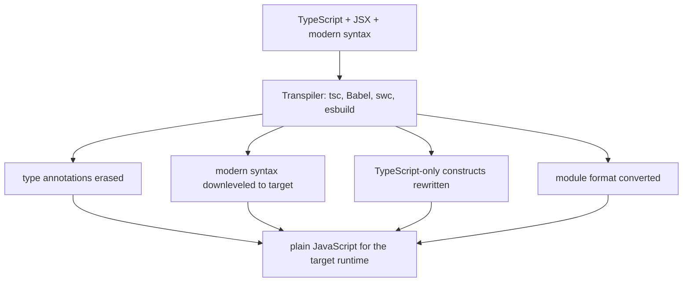
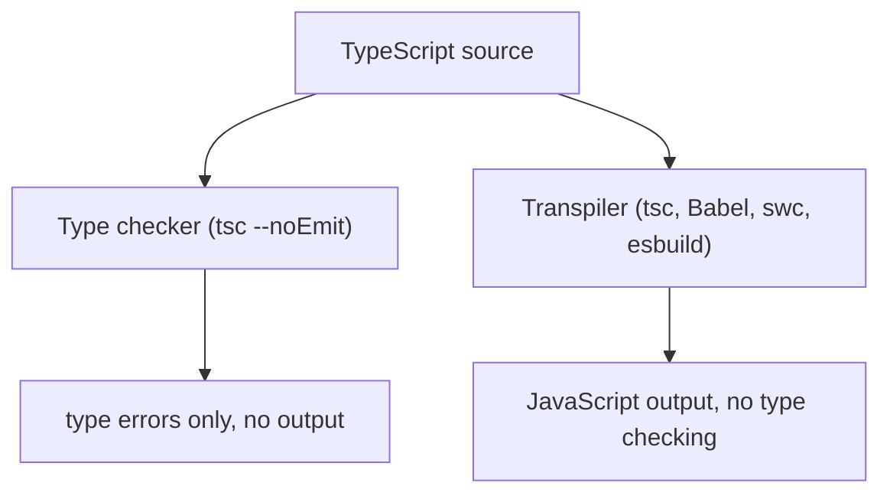

# What Is Transpiling?

## TLDR

- **Transpiling** is source-to-source compilation: it converts code from one language or version into another at a similar level of abstraction. The word blends "transform" and "compile".
- TypeScript to JavaScript is the common case, but JSX to JavaScript, CoffeeScript to JavaScript, and ES2022 to ES5 are all transpiling.
- It is not compiling to machine code or bytecode (high-level to low-level), and it is not type checking.
- A transpiler can do more than erase types: it downlevels modern syntax, rewrites TypeScript-only constructs (`enum`, `namespace`, decorators), and converts module formats.
- Tools: `tsc`, Babel, swc, and esbuild. Babel and esbuild transpile **without** type checking; `tsc` can do both.
- Node.js "type stripping" is a minimal transpile: it only erases type syntax and does not rewrite constructs that would emit new code.

## The problem: "compile" is used for too many jobs

TypeScript's tool is called the TypeScript **compiler** (`tsc`), which suggests it turns source into machine code. It does not. It reads `.ts` and writes `.js`, two high-level languages at the same level. When people say "compile TypeScript" they usually mean "transpile TypeScript", and mixing up the two hides an important fact: the output is still source code that something else has to run.

The other common mix-up is with **type checking**. Transpiling and type checking are separate jobs that `tsc` happens to perform together. A transpiler that only erases types produces working JavaScript even when the types are wrong.

## What transpiling is

A transpiler is a **source-to-source compiler**: its input and output are both source code, at roughly the same level of abstraction. It preserves the program's behavior while changing its language or syntax version.

```
TypeScript  ->  JavaScript
JSX         ->  JavaScript
ES2022      ->  ES5            (downleveling)
SCSS        ->  CSS
```

Compare that with a traditional compiler, which lowers a high-level language to a lower level: C to assembly, or Java to bytecode. Both are "compilers", but only the first is a transpiler.

<div style={{display: 'flex', justifyContent: 'center'}}>



</div>

## Transpiling is not type checking

`tsc` does two independent jobs, and you can run them separately:

- **Type checking** reads the types and reports errors. `tsc --noEmit` does only this and writes no files.
- **Transpiling** emits JavaScript. It does not have to verify that the types are correct.

```ts
// Babel and esbuild will happily emit this, type error and all
const n: number = "not a number";
```

Babel's TypeScript preset, swc, and esbuild all strip types and produce JavaScript without type checking, which is why they are fast. Only a type checker such as `tsc` (or your editor) will tell you the assignment above is wrong.

<div style={{display: 'flex', justifyContent: 'center'}}>



</div>

## What a TypeScript transpiler actually does

1. **Erases type syntax.** Annotations, interfaces, `type` aliases, generics, and `as` casts are removed. `function add(a: number): number` becomes `function add(a)`.

2. **Downlevels modern syntax** to the configured `target`. If `target` is `ES2015`, optional chaining and nullish coalescing are rewritten into older equivalents:

   ```ts
   // input
   const name = user?.profile?.name ?? "anonymous";

   // output at target ES2015
   const name = (_b = (_a = user === null || user === void 0 ? void 0 : user.profile) === null || _a === void 0 ? void 0 : _a.name) !== null && _b !== void 0 ? _b : "anonymous";
   ```

3. **Rewrites TypeScript-only constructs** that carry runtime behavior. `enum` and `namespace` generate JavaScript objects, so they cannot simply be deleted:

   ```ts
   enum Color { Red, Green }
   ```

   ```js
   var Color;
   (function (Color) {
     Color[Color["Red"] = 0] = "Red";
     Color[Color["Green"] = 1] = "Green";
   })(Color || (Color = {}));
   ```

4. **Converts module format** between ES modules and CommonJS according to `module` (`import`/`export` becomes `require`/`exports`), and can transform JSX into function calls.

## Type stripping versus transpiling

Modern Node.js can run `.ts` files by **type stripping**: it replaces type syntax with whitespace and runs the rest. That is the smallest possible transpile. It works only for **erasable** syntax, so `enum`, `namespace` with runtime members, and parameter properties are out of scope unless transformation is enabled. Node also does not type check and ignores `tsconfig.json` settings such as `paths`. See [TypeScript does not run in Node.js](./typescript-does-not-run-in-nodejs) for the runtime side of this.

## Tools

- **`tsc`** transpiles and type checks. It is the reference implementation and the slowest.
- **Babel** with `@babel/preset-typescript` transpiles (and downlevels) but does not type check.
- **swc** and **esbuild** transpile very fast, also without type checking. They are common inside bundlers.

A typical setup uses a fast transpiler for builds and `tsc --noEmit` (or your editor) for type checking.

## Sources

- Wikipedia, [Source-to-source compiler](https://en.wikipedia.org/wiki/Source-to-source_compiler) (transcompiler/transpiler definition; input and output are the same level of abstraction; the name blends transform and compile).
- TypeScript Documentation, [`tsconfig` reference](https://www.typescriptlang.org/tsconfig) (`target` controls syntax downleveling, `module` controls the emitted module format, `noEmit` type checks without output).
- TypeScript Handbook, [TypeScript for JavaScript Programmers](https://www.typescriptlang.org/docs/handbook/typescript-in-5-minutes.html) (TypeScript compiles to plain JavaScript).
- Babel, [@babel/preset-typescript](https://babeljs.io/docs/babel-preset-typescript) (strips type annotations; does not type check).
- esbuild, [TypeScript content type](https://esbuild.github.io/content-types/#typescript) (transpiles TypeScript without type checking).
- Node.js Docs, [Modules: TypeScript](https://nodejs.org/api/typescript.html) (type stripping erases only erasable syntax; non-erasable constructs need transformation).
