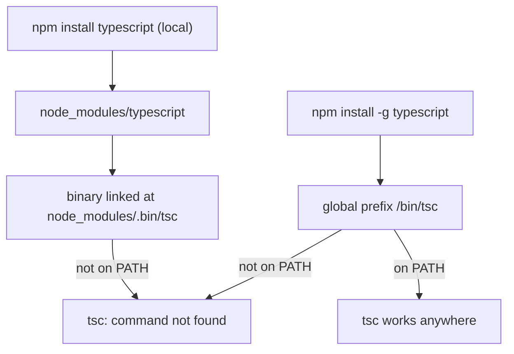

# `tsc: command not found` After Installing TypeScript

## TLDR

- `npm install typescript` installs the package **locally** into `./node_modules`, and its binary is linked to `./node_modules/.bin/tsc`. That folder is **not on your shell's `PATH`**, so typing `tsc` fails.
- Use `npx tsc`, `./node_modules/.bin/tsc`, or a `package.json` script instead.
- `npm install -g typescript` installs it **globally**, which puts `tsc` on `PATH`, but only if npm's global `bin` directory is actually on your `PATH`.
- If global install still fails, fix your `PATH` or clear zsh's command cache with `hash -r` (or `rehash`).

## The problem

You install TypeScript and it clearly works, yet the shell cannot find `tsc`:

```console
$ npm install typescript
added 2 packages in 691ms
$ tsc
zsh: command not found: tsc
```

Nothing is broken. The package installed correctly. The problem is **where** it installed and **what your shell searches**.

## Why it happens

`npm install` without `-g` is a **local** install. Local packages go into `./node_modules`, and their command line binaries are symlinked into `./node_modules/.bin`. npm makes that folder available to scripts it runs (so `npm test` finds your test runner), but your interactive shell does not include it in `PATH`.

A **global** install (`npm install -g`) links the binary into npm's global prefix `bin` directory instead. That works on the command line **only if** that directory is on your `PATH`.

<div style={{display: 'flex', justifyContent: 'center'}}>



</div>

## The solutions

| Option | Command | When to use |
|---|---|---|
| Run the local binary | `npx tsc` | One-off commands in a project (recommended) |
| Run via npm script | add `"build": "tsc"`, then `npm run build` | Repeating builds; npm adds `.bin` to `PATH` |
| Call it directly | `./node_modules/.bin/tsc` | Explicit, no `npx` |
| Install globally | `npm install -g typescript` | You want `tsc` anywhere on the machine |

### Verify a global install

If you chose the global route and it still fails:

```console
$ npm prefix -g          # where npm's global bin lives
$ echo $PATH             # is that path included?
$ hash -r                # clear zsh's command cache
```

`hash -r` (or `rehash`) matters because zsh caches each command's location in a hash table. After installing a new global binary, the cache can be stale until it is rebuilt. Reopening the terminal also works.

## Recommendation

For a project, do not install TypeScript globally. Keep it as a local dependency and drive it through `npx tsc` or an npm script. That keeps every project on its own TypeScript version, which is exactly what you want when different repos pin different versions.

## Sources

- npm Docs, [Folders](https://docs.npmjs.com/cli/v10/configuring-npm/folders) (local executables link into `./node_modules/.bin`; global executables link into `{prefix}/bin`, which must be on `PATH`).
- npm Docs, [npm exec / npx](https://docs.npmjs.com/cli/v10/commands/npx) (runs a command from local `node_modules/.bin` or the npm cache; locally installed bins are placed on `PATH`).
- Unix Stack Exchange, [How zsh uses its command hash table](https://unix.stackexchange.com/questions/805823/how-does-zsh-use-its-command-hash-table-when-searching-path-for-external-comman) (zsh resolves external commands through a hashed `PATH` list that can go stale).
