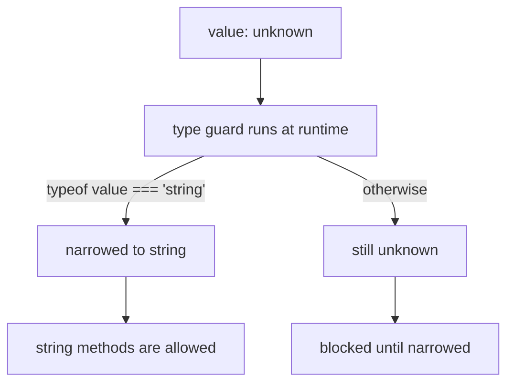
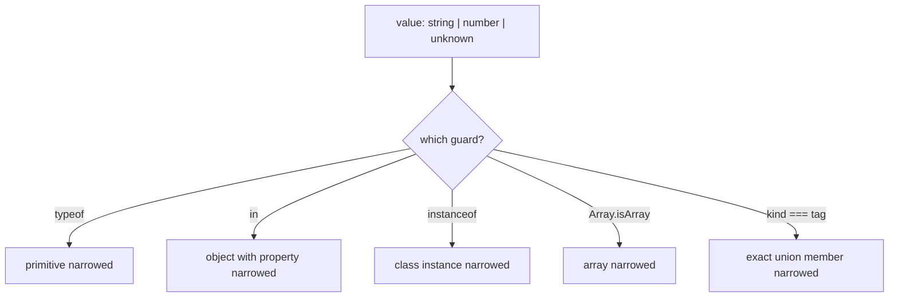

# Type Guards: Narrowing `unknown` into a Real Type

Types are erased at runtime, so the compiler cannot see the checks your code actually performs unless you connect the two. A type guard is that connection: a runtime check that the compiler understands well enough to narrow a type at compile time.

## TLDR

- A **type guard** is a runtime check that tells TypeScript a value can be treated as a narrower type in some scope. The check runs at runtime; the narrowing happens at compile time.
- **Narrowing** is the compiler refining a wide type (`string | number`, `unknown`) to a more specific one along a path through your code.
- TypeScript recognizes these built-in guards automatically: `typeof`, truthiness, `===` / `!==`, the `in` operator, `instanceof`, and `Array.isArray`. Discriminated unions narrow on their tag field.
- When built-ins are not enough, write a **user-defined type guard**: a function whose return type is a **type predicate**, `value is T`. Classes can use `this is T`.
- **Assertion functions** (`asserts value is T`) throw instead of returning a boolean and narrow the caller's scope after the call.
- A type predicate is a **promise to the compiler**, not something it verifies. A wrong guard is just another lie; for complex external data, derive the guard from a schema instead of hand-writing it.

## The problem

A function often has to accept more than one shape. Without narrowing you can only touch the members every shape shares, so the useful code does not compile:

```ts
function format(value: string | number): string {
  return value.toUpperCase(); // error: Property 'toUpperCase' does not exist on type 'number'
}
```

Add a real runtime check and the compiler learns which branch it is in:

```ts
function format(value: string | number): string {
  if (typeof value === "string") {
    return value.toUpperCase(); // value is string here
  }
  return value.toFixed(2); // value is number here
}
```

`typeof value === "string"` is a type guard. TypeScript follows the possible paths through your program and computes the most specific type a value can have at each position. That refinement is called **narrowing**, and TypeScript applies it to the checks it recognizes as type guards.

This matters most for `unknown`, the honest type for data you have not verified. TypeScript refuses to let you use an `unknown` value until you narrow it, which is exactly why guards are the bridge between untyped data and the rest of your typed code:

```ts
function printId(id: unknown) {
  // console.log(id.toUpperCase()); // error: 'id' is of type 'unknown'
  if (typeof id === "string") {
    console.log(id.toUpperCase()); // id is string here
  }
}
```

<div style={{display: 'flex', justifyContent: 'center'}}>



</div>

## A guard is the cause, narrowing is the effect

Guard and narrowing are two halves of one idea, and keeping them straight removes most of the confusion:

| Term | When it happens | What it does |
|---|---|---|
| Type guard | runtime | performs the actual check on a value |
| Narrowing | compile time | uses that check to refine the type in a scope |

You write the guard. TypeScript does the narrowing. Nothing about the value changes at runtime, only what the compiler is willing to believe about it after the check passes.

## Built-in type guards

TypeScript understands a fixed set of JavaScript constructs as guards. For these you write ordinary JavaScript and the compiler follows along.

### `typeof` for primitives

```ts
function pad(value: string | number) {
  if (typeof value === "number") return value.toFixed(2);
  return value.padStart(4, "0");
}
```

### Truthiness

```ts
function greet(name: string | null | undefined) {
  if (name) {
    return `Hello, ${name}`; // name is string here
  }
  return "Hello, stranger";
}
```

### Equality and literal unions

```ts
type Direction = "up" | "down" | "left" | "right";

function step(dir: Direction) {
  if (dir === "up" || dir === "down") {
    return "vertical"; // dir is "up" | "down" here
  }
  return "horizontal"; // dir is "left" | "right" here
}
```

### The `in` operator

```ts
type Fish = { swim: () => void };
type Bird = { fly: () => void };

function move(pet: Fish | Bird) {
  if ("swim" in pet) {
    return pet.swim(); // Fish
  }
  return pet.fly(); // Bird
}
```

### `instanceof`

```ts
try {
  // ...
} catch (err) {
  if (err instanceof Error) {
    console.error(err.message); // err is Error here
  }
}
```

### `Array.isArray`

```ts
function first(value: string | string[]) {
  if (Array.isArray(value)) {
    return value[0]; // value is string[]
  }
  return value; // value is string
}
```

### Discriminated unions

The most useful pattern in day to day code is a union where every member carries a literal tag. Checking the tag narrows to the exact member:

```ts
type Shape =
  | { kind: "circle"; radius: number }
  | { kind: "square"; side: number };

function area(shape: Shape): number {
  if (shape.kind === "circle") {
    return Math.PI * shape.radius ** 2; // shape is the circle member
  }
  return shape.side ** 2; // shape is the square member
}
```

<div style={{display: 'flex', justifyContent: 'center'}}>



</div>

## User-defined type guards

Built-in guards only cover primitives, classes, arrays, and tagged unions. When a shape is none of those, you write the check yourself and tell the compiler what it proved by returning a **type predicate**:

```ts
interface Fish {
  swim: () => void;
}
interface Bird {
  fly: () => void;
}

function isFish(pet: Fish | Bird): pet is Fish {
  return (pet as Fish).swim !== undefined;
}

declare function getSmallPet(): Fish | Bird;

const pet = getSmallPet();
if (isFish(pet)) {
  pet.swim(); // pet is Fish
} else {
  pet.fly(); // pet is Bird
}
```

`pet is Fish` is the type predicate. Its form is `parameterName is Type`, and `parameterName` must be the name of one of the function's parameters. Once you call `isFish(pet)`, TypeScript narrows the variable in both the true branch (to `Fish`) and the false branch (to whatever is left, here `Bird`).

Because the guard returns a boolean, it also works with array helpers that use type predicates:

```ts
const fishOnly: Fish[] = zoo.filter(isFish);
```

Classes use the same idea with `this is Type`, which narrows the instance type after the check.

This is the same mechanism powering libraries you already use. Internal helpers like `Array.isArray`, and helpers in schema libraries, are ultimately type predicates or assertion functions.

## The predicate is a promise, not a proof

Here is the catch that ties back to why types are erased. **The compiler does not check the body of a type guard against its predicate.** It trusts the signature. That trust is a promise you make, and if the check is wrong, you have simply replaced one lie with another that spreads silently:

```ts
function isNumber(value: unknown): value is number {
  return typeof value === "string"; // compiles, but the predicate is a lie
}
```

Every call to `isNumber` now teaches TypeScript that strings are numbers. The guard did not add safety; it moved the responsibility for correctness entirely onto you. A predicate also cannot assert a type unrelated to its input, so you cannot declare that an `unknown` is a specific interface unless the compiler can see the relationship is possible.

## Assertion functions

Sometimes a boolean plus an `if` is awkward, and you would rather fail loudly and continue with a narrowed value. TypeScript 3.7 added **assertion signatures** for this:

```ts
function assertIsString(value: unknown): asserts value is string {
  if (typeof value !== "string") {
    throw new Error(`Expected a string, got ${typeof value}`);
  }
}

function yell(input: unknown) {
  assertIsString(input);
  return input.toUpperCase(); // input is string after the call
}
```

There are two forms. `asserts condition` requires the whole expression passed in to be truthy for the rest of the scope (`assert(typeof x === "string")`). `asserts value is T` narrows a specific value. An assertion function returns `void` and must throw when the check fails. From the control flow point of view, calling `asserts x is T` is equivalent to an `if` statement that throws when a `x is T` check returns false, so the compiler narrows everything after it.

Node's built-in `assert` is the canonical example, and TypeScript models it the same way. The trade off is style: a type predicate keeps the narrowing visible at the call site with an `if`, while an assertion function hides it after a call and is better when an invalid value is a genuine error you want to throw on.

## Type guards at the boundary

The place guards earn their keep is data crossing into your program. In [Why your API response types are a lie](./why-api-response-types-lie) we looked at fetching a response and trusting an annotation. The safe version narrows `unknown` with a guard:

```ts
function isProduct(value: unknown): value is Product {
  if (typeof value !== "object" || value === null) return false;
  const v = value as Record<string, unknown>;
  return (
    typeof v.id === "number" &&
    typeof v.name === "string" &&
    typeof v.price === "number"
  );
}

const data: unknown = await res.json();
if (Array.isArray(data) && data.every(isProduct)) {
  // data is Product[]
}
```

This is correct, and for a small shape it is all you need. For a large payload it is also the "working too hard" path: you hand-write a predicate for every field, for every nested object, and keep them in sync with the type by hand. That is why schema libraries exist. Zod builds the runtime check and the static type from one schema, so it produces the equivalent of a type guard for you:

```ts
import { z } from "zod";

const ProductSchema = z.object({
  id: z.number(),
  name: z.string(),
  price: z.number(),
});

const data: unknown = await res.json();
const product = ProductSchema.parse(data); // validated at runtime, and typed
```

Use hand-written guards for small, stable shapes and discriminated unions. Reach for a schema when the data is large, nested, or owned by someone else.

## Pitfalls and limits

- **A wrong predicate is a lie.** The compiler trusts the signature, so a bad guard weakens the types everywhere it is used. Test your guards.
- **Narrowing resets inside callbacks.** TypeScript does not know when a closure runs, so a narrowing from an outer scope does not carry into a callback. Capture the narrowed value in a local first:
  ```ts
  function example(value: string | null) {
    if (value === null) return;
    // value is string here
    const known = value; // keep the narrowed value
    [1, 2, 3].forEach(() => {
      console.log(known.toUpperCase()); // safe
    });
  }
  ```
- **`this is T` is only for classes.** Standalone functions use a regular parameter predicate.
- **Do not guard `any`.** `any` disables checking, so a guard over `any` gains little. Receive unknown data as `unknown` and narrow from there.

## Recommendation

Model your domain with discriminated unions so that most narrowing is a simple tag check. Receive external data as `unknown` and narrow it at the boundary. Write a type predicate when the shape is small and stable, and use an assertion function when invalid input should be a thrown error. When the shape is large or nested, do not hand-write the predicate: define a schema once and let it generate both the runtime guard and the type.

## Sources

- TypeScript Handbook, [Narrowing](https://www.typescriptlang.org/docs/handbook/2/narrowing.html) (narrowing, built-in guards such as `typeof`, truthiness, equality, the `in` operator, `instanceof`, and user-defined type guards with type predicates).
- TypeScript Handbook, [Advanced Types: User-Defined Type Guards](https://www.typescriptlang.org/docs/handbook/advanced-types.html) (the definition of a type guard as an expression that performs a runtime check guaranteeing a type in some scope).
- TypeScript 3.7 Release Notes, [Assertion Functions](https://www.typescriptlang.org/docs/handbook/release-notes/typescript-3-7.html) (`asserts condition` and `asserts value is T`, and how they affect control flow).
- Microsoft Developer Blogs, [Announcing TypeScript 3.7](https://devblogs.microsoft.com/typescript/announcing-typescript-3-7/) (motivation for assertion signatures and never-returning functions).
- microsoft/TypeScript, [PR #32695: Assertions in control flow analysis](https://github.com/microsoft/TypeScript/pull/32695) (`asserts x` is equivalent to an `if` that throws when the check fails).
