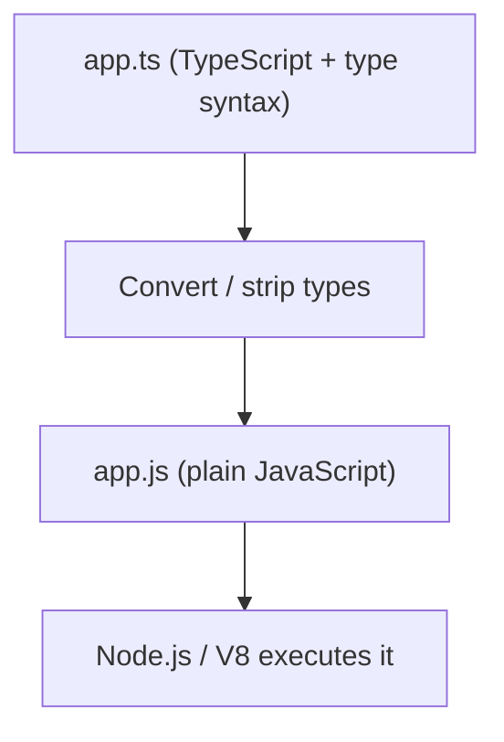

# TypeScript Does Not Run in Node.js

## TLDR

- Node.js runs JavaScript (through V8). It does not natively understand TypeScript.
- Every `.ts` file must be **converted to JavaScript** before it executes, either ahead of time with `tsc` or on the fly with type stripping or a bundler.
- Conversion (transpilation) only removes or rewrites type syntax. It does **not** type-check your code.
- Node.js v22.18.0 and v23.6.0 made "type stripping" enabled by default, so `node file.ts` works for erasable syntax. It still converts first, skips type checking, and ignores `tsconfig.json` features such as `paths`.

## The problem

You write `app.ts`, run `node app.ts`, and assume the type annotations are being enforced. They are not. Node.js is a JavaScript runtime. The type annotations, interfaces, generics, and `enum` you wrote are not part of the JavaScript language, so V8 has no idea what to do with them at runtime.

The JavaScript types you get from TypeScript are a **compile-time contract**, not a runtime guarantee. They exist only in the editor and in the type checker. The moment code runs, they are gone.

## The solution: convert TypeScript to JavaScript

Something must translate `.ts` into `.js` before Node runs it. That translation is the whole game.

<div style={{display: 'flex', justifyContent: 'center'}}>



</div>

Take this file:

```ts
// math.ts
function add(a: number, b: number): number {
  return a + b;
}
```

After conversion, the type annotations are stripped away:

```js
// math.js
function add(a, b) {
  return a + b;
}
```

Same logic, no types. That is what Node actually runs.

### Two ways to convert

1. **Ahead of time with `tsc`.** The TypeScript compiler emits `.js` files, and you run those.

   ```bash
   tsc math.ts      # produces math.js
   node math.js
   ```

2. **On the fly with type stripping.** Modern Node.js reads the `.ts` file, replaces the type syntax with whitespace, and runs the result. Since v22.18.0 (LTS) and v23.6.0, this needs no flag.

   ```bash
   node math.ts
   ```

Bundlers and tools such as `ts-node`, `tsx`, and `vite` do the same thing under the hood: convert first, then run.

## What "running TypeScript directly" really means

`node file.ts` is convenient, but it is not a second runtime. Node still converts the file to JavaScript before executing it. Two limits matter:

- **No type checking.** Node strips types, it does not verify them. `tsc --noEmit` or your editor is what catches type errors.
- **Only erasable syntax.** Node runs TypeScript that can be removed without generating new JavaScript. Type-dependent features such as `enum` and `namespace` need extra tooling, and Node ignores `tsconfig.json` options like `paths`.

So the rule holds everywhere: **Node.js runs JavaScript. TypeScript is converted to JavaScript first, whether at build time or at load time.**

## Sources

- Node.js Learn, [Running TypeScript code using transpilation](https://nodejs.org/learn/typescript/transpile) ("browsers and Node.js don't run TypeScript code directly").
- Node.js Learn, [Running TypeScript Natively](https://nodejs.org/learn/typescript/run-natively) (type stripping removes erasable syntax, then runs the remaining JavaScript).
- Node.js Docs, [Modules: TypeScript](https://nodejs.org/api/typescript.html) (Node replaces TypeScript syntax with whitespace, no type checking; ignores `tsconfig.json`).
- Node.js Blog, [Node.js 22.18.0 (LTS)](https://nodejs.org/en/blog/release/v22.18.0) and [Node.js 23.6.0](https://nodejs.org/en/blog/release/v23.6.0) (type stripping enabled by default).
- TypeScript, [tsc CLI Options](https://www.typescriptlang.org/docs/handbook/compiler-options) (the `tsc` compiler emits JavaScript).
