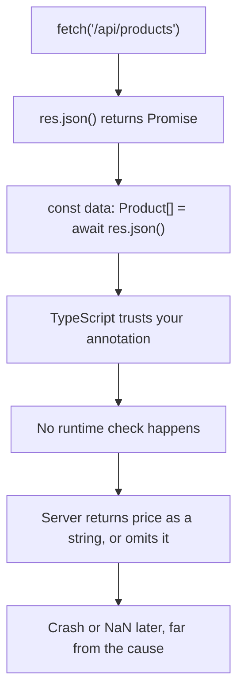
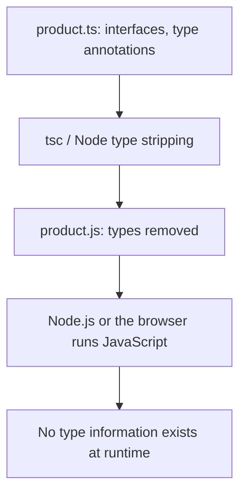
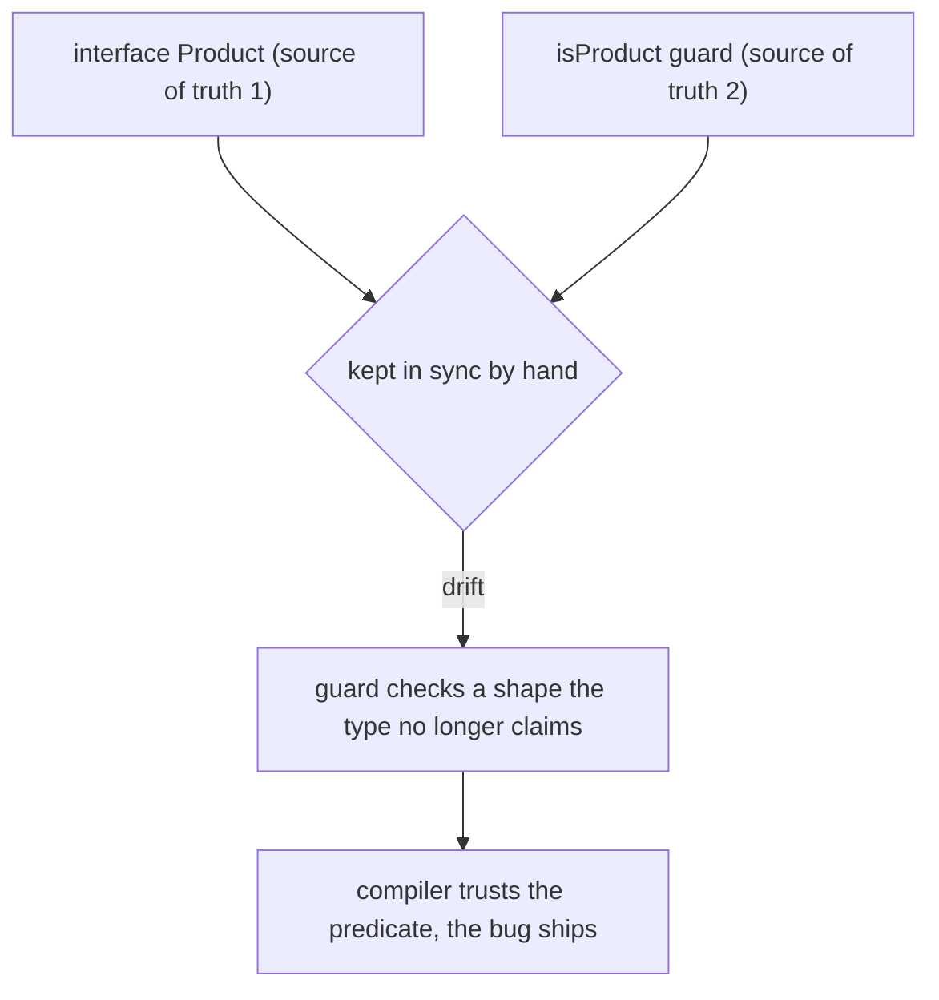
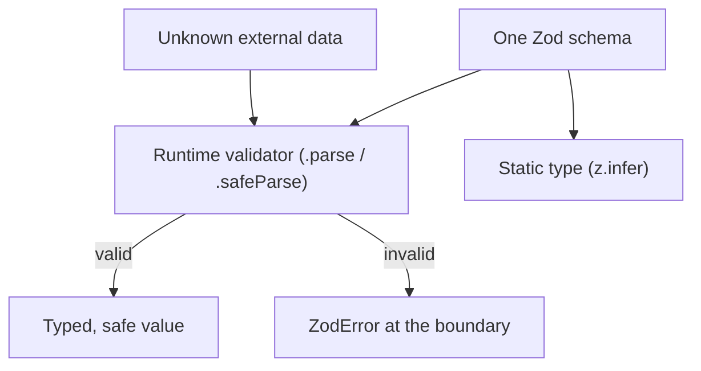

# Why Your API Response Types Are a Lie (and Why Zod Exists)

## TLDR

- TypeScript types are **erased at compile time**. At runtime they simply do not exist, so nothing checks the shape of your data.
- `response.json()` is typed as `Promise<any>`. Assigning it to `Product[]`, or casting it with `as Product[]`, is a **promise you make to the compiler**, not a check the compiler makes for you.
- The API is free to return anything: a missing field, `price` as a string, `null`, or an error page. Your code fails later, far from the line that lied.
- The fix is to treat external data as `unknown` and **validate it once at the boundary**. Zod writes the runtime validator and infers the static type from the same schema, so the two can never drift apart.
- The rule: never trust data that crosses a boundary (network, `localStorage`, JSON, URL params, env vars). Validate on the way in, then trust it inside your program.

## The problem

You fetch products and annotate the result. It compiles, autocompletion works, and everything looks type safe:

```ts
interface Product {
  id: number;
  title: string;
  price: number;
}

async function getProducts(): Promise<Product[]> {
  const res = await fetch("/api/products");
  const data: Product[] = await res.json();
  return data;
}

const products = await getProducts();
const total = products.reduce((sum, p) => sum + p.price, 0);
console.log(total.toFixed(2));
```

There is not a single red squiggle. Now imagine the backend ships a change and one product comes back with `"price": "9.99"`, or without a `price` field at all. TypeScript never noticed. At runtime `sum + "9.99"` concatenates instead of adding, and `sum + undefined` becomes `NaN`. The failure surfaces at `toFixed`, possibly screens away from the fetch, and the type system that was supposed to protect you said nothing.

That is the point: **the annotation `Product[]` is a claim, not a guarantee**. TypeScript believes you. It has no choice.

<div style={{display: 'flex', justifyContent: 'center'}}>



</div>

## Why the compiler stays silent

Two separate facts combine to create the trap.

**1. `response.json()` is typed as `Promise<any>`.** The DOM lib declarations define the method as `json(): Promise<any>`. `any` opts out of type checking entirely: any value is assignable to any other type, so `const data: Product[] = await res.json()` compiles without complaint. This is not an accident. The TypeScript team has repeatedly declined to make `json()` generic, because a generic signature would "decrease type safety" by leading people to believe the runtime value actually matches `T`. A type assertion such as `await res.json() as Product[]` is no better: the Handbook states plainly that assertions are removed by the compiler and perform no runtime checking, so a wrong assertion produces no error at runtime.

**2. Types do not survive compilation.** The TypeScript Handbook's "Erased Types" section shows that annotations, `interface`s, and type aliases are removed entirely when `tsc` emits JavaScript. The project FAQ puts it bluntly: at run time "there is no information present that says that some variable `x` was declared as being of type `SomeInterface`", and there is "no built-in mechanism for performing runtime type checks". An `interface` is not a thing that exists in the output file. It cannot check anything, because it is gone before your code ever runs.

<div style={{display: 'flex', justifyContent: 'center'}}>



</div>

This is why the situation is not a bug in TypeScript. The compiler can only reason about values whose entire origin it can see. Data from `res.json()` is created outside your program, by a server you do not control, and arrives as an untyped stream of bytes. TypeScript has no way to inspect it, so it does the only thing it can: it takes your word for it. As a TypeScript maintainer put it in the discussion about typing `json()`, "no one has any guarantee at runtime that the data coming off the wire is going to match what they expected when they declared their types."

## The fix, part 1: `unknown` and a type guard

The safest default is to receive external data as `unknown`, which forces you to narrow it before use:

```ts
function isProduct(value: unknown): value is Product {
  if (typeof value !== "object" || value === null) return false;
  const v = value as Record<string, unknown>;
  return (
    typeof v.id === "number" &&
    typeof v.title === "string" &&
    typeof v.price === "number"
  );
}

const data: unknown = await res.json();
if (!Array.isArray(data) || !data.every(isProduct)) {
  throw new Error("Unexpected API response");
}
// `data` is now Product[]
```

This is correct and has zero dependencies. It also does not scale, and worse, it quietly reintroduces the very problem it was meant to solve.

The interface and the guard are two separate artifacts, and nothing ties them together. The interface declares the shape; the guard is a hand-written re-implementation of that same shape. They are supposed to evolve together, but nothing forces them to. Rename `title` to `name` in the interface and forget the guard, and the guard still checks the old field. Add a required field to the interface and forget the guard, and the guard still accepts objects that are now missing it. Because the compiler does not verify a predicate's body against its signature, it never notices. The mismatch ships.

That is the real maintenance headache, and its root cause is that the type has become one source of truth and the validator another. Both describe the same data, so both have to change in lockstep, but they live apart and only a human remembers to keep them aligned. Every missed step is a fresh chance to lie to the compiler, exactly like the `as` cast we started with.

<div style={{display: 'flex', justifyContent: 'center'}}>



</div>

Zod removes the second source of truth. The schema is the single definition, and `z.infer` derives the TypeScript type from it, so there is nothing left to keep in sync by hand.

## The fix, part 2: why Zod exists

> There is a saying about all this: if you are validating types with the type checker in TypeScript, you are either lying or working too hard.

The first half is the annotation and `as` approach: you tell the compiler a shape that nothing at runtime ever verified, which is a lie. The second half is the hand-written guard from part 1: correct, but you are re-deriving field by field what the type already claims, which is working too hard. Both are symptoms of the same missing tool.

The problem is not "check the data". The problem is doing it **once, at the boundary, without maintaining the shape twice**. That is the gap Zod was built for.

Zod is a "TypeScript-first schema validation with static type inference" library. You declare a schema a single time, and from that one declaration you get two things:

1. a **runtime validator** that inspects real values, and
2. a **static type** inferred with `z.infer`, used by the compiler.

```ts
import { z } from "zod";

const ProductSchema = z.object({
  id: z.number(),
  title: z.string(),
  price: z.number(),
});

const ProductsSchema = z.array(ProductSchema);

type Product = z.infer<typeof ProductSchema>;

async function getProducts(): Promise<Product[]> {
  const res = await fetch("/api/products");
  const data: unknown = await res.json();
  return ProductsSchema.parse(data);
}
```

`.parse` throws a `ZodError` if the data does not match, and returns a strongly typed value if it does. If it throws, that is the failure happening **at the boundary**, with a precise message about which field was wrong, instead of a mysterious `NaN` deep in the reducer later. Use `.safeParse` when you would rather handle the failure as a value than a `try`/`catch`.

<div style={{display: 'flex', justifyContent: 'center'}}>



</div>

The deeper idea has a name. Zod was designed around the principle "**parse, don't validate**", a phrase coined by Alexis King. Validating checks that data is correct but throws the knowledge away, so every later consumer has to assume the data might still be wrong. Parsing turns unknown input into a value of a **more precise type** that encodes the fact it was checked. After `parse` succeeds, the returned value is a `Product`, and no code downstream has to defend against a malformed one.

The author's own motivation is worth quoting because it is this exact scenario. Building a healthcare API, he wanted "all data that passes from the client to the server and server to client to be validated at runtime", with static types on both sides, and he did not want "to keep my static types and runtime type validators in sync by hand as my data model changes". Zod is the tool that removes that duplication.

## Where boundaries are

The mistake is not limited to `fetch`. Every place data enters your program from outside is a place where a TypeScript type is a claim rather than a fact:

- HTTP responses (`fetch`, `axios`)
- `JSON.parse` of any string (including `localStorage` and files)
- URL and query-string parameters
- Environment variables (`process.env.X` is `string | undefined`)
- Web `postMessage` and third-party SDK callbacks

Inside your program, types are trustworthy, because you constructed those values and the compiler saw how. The danger is always the boundary. The practical rule is: **treat boundary data as `unknown`, parse it into a known type, then trust it everywhere else.**

## Recommendation

For anything nontrivial, install Zod (or a similar schema library) and define a schema at each boundary. Infer your types with `z.infer` instead of hand writing an `interface` that can drift. Prefer `unknown` to `any` when receiving data, and avoid `as` for external data entirely, since it only silences the compiler without making anything true. You are going to write the validation logic regardless, so write it once as a schema and get the type for free.

## Sources

- TypeScript Handbook, [The Basics: Erased Types](https://www.typescriptlang.org/docs/handbook/2/basic-types.html) (type annotations, interfaces, and type aliases are erased by the compiler).
- TypeScript FAQ, [What is type erasure?](https://github.com/microsoft/TypeScript/wiki/FAQ) (types are removed at compile time; no built-in mechanism for runtime type checks).
- TypeScript Handbook, [Everyday Types: Type Assertions](https://www.typescriptlang.org/docs/handbook/2/everyday-types.html) (assertions are removed at compile time and involve no runtime checking).
- MDN Web Docs, [`Response.json()`](https://developer.mozilla.org/en-US/docs/Web/API/Response/json) (returns the parsed JSON body; the value is not typed).
- microsoft/TypeScript, [Issue #33037: Improved type definitions for JSON API responses](https://github.com/microsoft/TypeScript/issues/33037) (the `json(): Promise<any>` signature, the `as T` workaround, and the maintainer's point that runtime data has no guarantee of matching declared types).
- microsoft/TypeScript-DOM-lib-generator, [PR #1711: Update Body json() method to allow generic types](https://github.com/microsoft/TypeScript-DOM-lib-generator/pull/1711) (why `json<T>()` was proposed and the type safety trade off).
- Colin McDonnell, [Designing the perfect TypeScript schema validation library](https://colinhacks.com/essays/zod) (the motivation for Zod: runtime validation plus static inference from a single schema).
- Zod Documentation, [zod.dev](https://zod.dev/) (TypeScript-first schema validation with static type inference; `parse` and `z.infer`).
- Alexis King, [Parse, don't validate](https://lexi-lambda.github.io/blog/2019/11/05/parse-don-t-validate/) (the principle Zod is built around).
