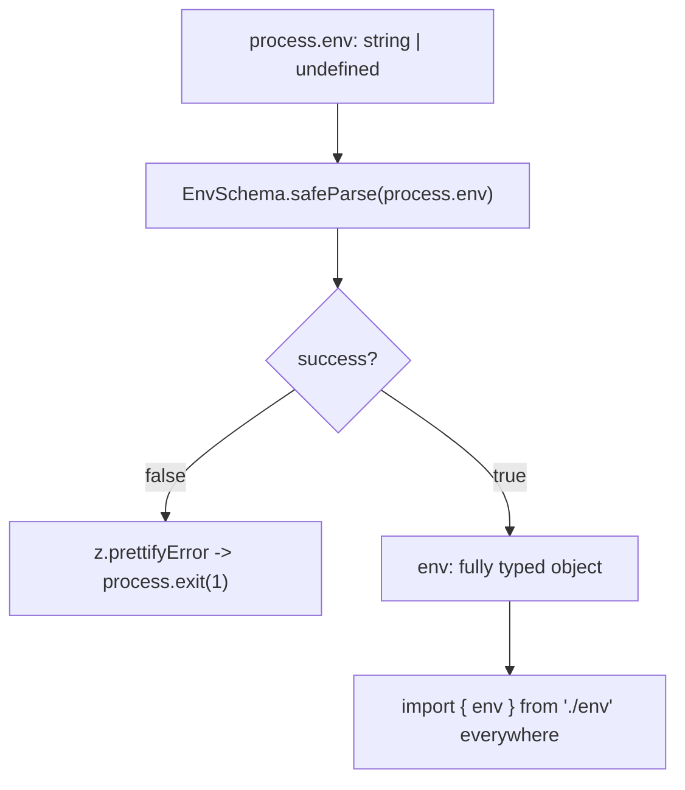

# Validating environment variables with Zod

## TLDR

- `process.env` is `Record<string, string | undefined>`: every value is a string or missing. `PORT` is `"3000"`, not `3000`, and an unset or misspelled variable is `undefined`, not a startup error.
- Validate once at startup with a single Zod schema, then export a typed `env` object and read from it instead of `process.env` anywhere else. One source of truth, types guaranteed.
- Coerce strings into the shapes you want: `z.coerce.number()` for numbers, `z.enum([...])` for a fixed set, `.default()` for optional variables, `z.url()` / `z.httpUrl()` for URLs.
- Do **not** use `z.coerce.boolean()` for env flags: it calls `Boolean()`, so the string `"false"` becomes `true`. Use `z.stringbool()` (Zod 4), which maps `"false"`, `"0"`, `"no"`, `"off"` to `false`.
- Fail fast: on failure print `z.prettifyError(error)` and exit before the app starts, so a bad deploy dies at boot with a readable message instead of at request time.
- Load `.env` before validating: Node's `--env-file`, or `process.loadEnvFile()` / `dotenv`. A variable already set in the real environment takes precedence over the same key in the file.
- Watch empty strings: `z.coerce.number()` runs `Number()`, so `""` becomes `0`, not an error.

## The problem

Configuration lives in the environment as strings. Code, meanwhile, wants numbers, booleans, URLs, and a fixed set of modes. Reading `process.env` directly at each point of use spreads that mismatch across the codebase and hides failures until the worst moment:

```ts
const port = Number(process.env.PORT); // unset -> Number(undefined) -> NaN
const debug = process.env.DEBUG; // "false" is a non-empty string
if (debug) console.log("debug on"); // runs even when DEBUG=false
app.listen(port); // listens on NaN
```

Three failure modes show up again and again:

- **Missing variable.** `DATABASE_URL` is unset. Nothing complains at boot; the first query crashes deep inside a request handler.
- **Wrong shape.** `process.env.PORT` is typed `string | undefined`. Forget to convert it and you pass `"3000"` where a number is expected.
- **String truthiness.** `if (process.env.FEATURE_X)` is true for `"false"`, so a flag you disabled is still on. This is plain JavaScript: every non-empty string is truthy.

There is no single place that states "these are the variables this app needs and these are their types." Each `process.env.X` is its own unchecked assumption, and the same variable is often read in several files with slightly different handling.

## The solution

Describe the environment once as a Zod schema, parse `process.env` a single time at startup, and export the result. Every other module imports `env` and never touches `process.env`.

```ts
// env.ts
import { z } from "zod";

const EnvSchema = z.object({
  NODE_ENV: z.enum(["development", "test", "production"]).default("development"),
  PORT: z.coerce.number().int().positive().default(3000),
  DATABASE_URL: z.url(),
  LOG_LEVEL: z.enum(["debug", "info", "warn", "error"]).default("info"),
  FEATURE_X: z.stringbool().default(false),
});

const parsed = EnvSchema.safeParse(process.env);

if (!parsed.success) {
  console.error("Invalid environment variables:");
  console.error(z.prettifyError(parsed.error));
  process.exit(1);
}

export const env = parsed.data;
```

Now the rest of the app reads a plain object:

```ts
// server.ts
import { env } from "./env";

app.listen(env.PORT, () => {
  console.log(`listening on ${env.PORT} in ${env.NODE_ENV}`);
});
```

`env.PORT` is a `number`, `env.NODE_ENV` is the union of the three literals, `env.DATABASE_URL` is a validated URL, and `env.FEATURE_X` is a real `boolean`. TypeScript infers all of that from the schema, and the values are guaranteed because parsing already happened. The schema is the single source of truth for both the types and the runtime checks.

<div style={{display: 'flex', justifyContent: 'center'}}>



</div>

## Why validate at startup

A misconfigured environment is a deployment error, not a request error, so it should surface at boot. Failing immediately has three benefits: the process crashes before it can serve traffic, the log names the exact variable and reason, and the deploy fails loudly where you can roll it back. Compare that to a missing `DATABASE_URL` that only throws on the first user request an hour later.

This is the same idea behind the Twelve-Factor App's advice to store config in the environment and validate it at the boundary: the environment is external input, so it gets the same treatment as any other untrusted data.

## Coercion and the traps

Because everything from the environment is a string, the schema has to convert. Zod's `z.coerce.*` helpers do that by running the matching JavaScript constructor:

| Need | Schema | Input -> output |
|---|---|---|
| Number | `z.coerce.number()` | `"3000"` -> `3000` |
| Integer | `z.coerce.number().int().positive()` | `"0"` -> error |
| Boolean | `z.stringbool()` | `"false"` -> `false` |
| One of a set | `z.enum([...])` | `"prod"` -> error (not in set) |
| URL | `z.url()` or `z.httpUrl()` | `"not-a-url"` -> error |
| Optional with fallback | `z.string().default("x")` | `undefined` -> `"x"` |

Two traps are worth calling out:

- `z.coerce.boolean()` calls `Boolean(input)`, so `"false"` is a non-empty string and becomes `true`. Zod 4 adds `z.stringbool()` precisely for environment flags, mapping `"true"`, `"1"`, `"yes"`, `"on"` to `true` and `"false"`, `"0"`, `"no"`, `"off"` to `false`.
- `z.coerce.number()` calls `Number(input)`, so an empty string `""` becomes `0` and passes a plain number check. If a blank value should be an error, reject it explicitly or use a preprocess step.

## Loading `.env`

The schema validates whatever is already in `process.env`, so the file has to be loaded first.

- **Node CLI (20.6+).** `node --env-file=.env server.js`. Use `--env-file-if-exists=.env` when the file may be absent, and pass several `--env-file` flags to layer files (later files override earlier ones).
- **Node API (20.12+ / 21.7+).** `process.loadEnvFile()` populates `process.env`; `util.parseEnv()` parses raw `.env` content into an object.
- **dotenv.** `import "dotenv/config";` at the very top of the entry file. Import order matters: static imports run top to bottom and `env.ts` validates as soon as it is imported, so dotenv must load before `env.ts`.

One precedence rule from the Node docs: if the same key is set in the real environment and in the file, the environment wins. That is what you want, since CI and production usually inject variables directly.

## Where it fits

Keep the schema in one module and import `env` everywhere else. Do not scatter `process.env` reads, and do not re-validate per request; the values cannot change mid-process, so validating once is enough.

A caution on secrets: Zod error messages can include the received value, so a value that fails validation may be echoed in the output. Avoid dumping raw environment errors where secrets could appear, and prefer failing with the variable name and reason.

This pattern is not limited to Node backends. Frontend build tools expose their own env object (for example Vite's `import.meta.env`), but the approach is the same: define the schema, parse once, export a typed object.

## Sources

- Zod Documentation, [Defining schemas: Coercion, URLs, Stringbools](https://zod.dev/api) (`z.coerce.string/number/boolean/bigint` run the matching constructor; top-level `z.url()` / `z.httpUrl()`; `z.stringbool()` for env-style booleans).
- Zod Documentation, [Basic usage: Handling errors](https://zod.dev/basics#handling-errors) (`safeParse` result object; `z.prettifyError`).
- Zod Documentation, [Release notes: Zod 4](https://zod.dev/v4) (`z.prettifyError`; `z.stringbool()` introduced because `z.coerce.boolean()` maps `"false"` to `true`).
- Node.js Documentation, [Environment Variables](https://nodejs.org/api/environment_variables.html) (`process.env`; `--env-file` / `--env-file-if-exists`; `process.loadEnvFile`; `util.parseEnv`).
- Node.js Documentation, [Command-line API: `--env-file`](https://nodejs.org/api/cli.html) (environment values take precedence over the file; multiple files override in order).
- dotenv, [README](https://github.com/motdotla/dotenv) (`import "dotenv/config"` loads a `.env` file into `process.env`).
- The Twelve-Factor App, [Config](https://12factor.net/config) (store configuration in the environment).
