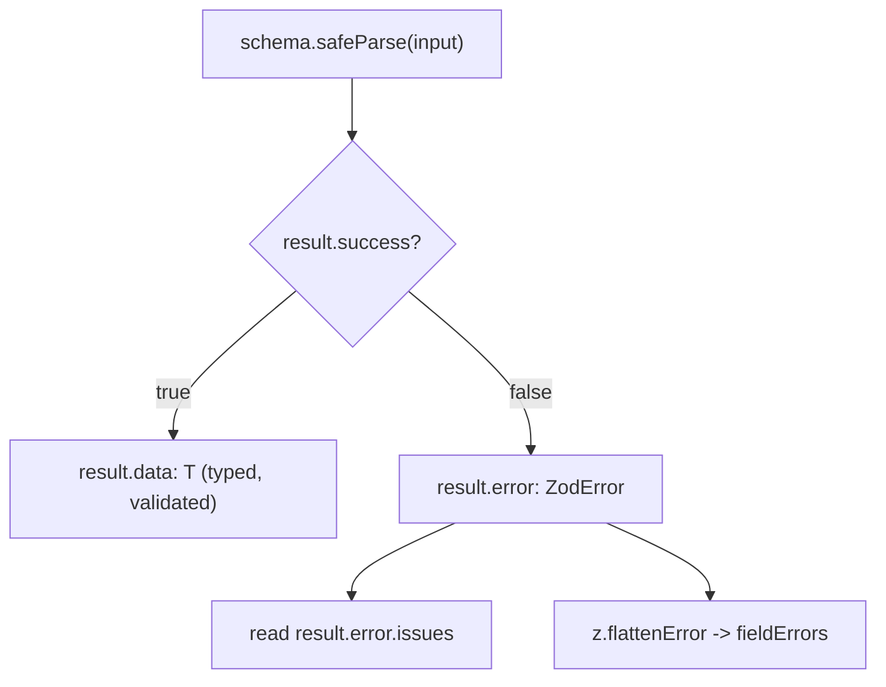

# Zod `safeParse`: Validation Without Exceptions

## TLDR

- Zod's `.parse()` throws a `ZodError` when the data does not match the schema.
- `.safeParse()` does the same validation but returns a **result object** instead: `{ success: true, data }` or `{ success: false, error }`. It never throws.
- The result is a **discriminated union**, so checking `result.success` narrows the type and you cannot read `result.data` without proving the parse succeeded.
- Use `.parse()` when bad data is an exceptional bug you want to crash on. Use `.safeParse()` when bad data is expected and you want to handle it, such as form input or a webhook you must answer.
- `result.error.issues` holds the details; `z.flattenError(result.error)` turns them into per-field messages for a form.
- If your schema uses async refinements or transforms, use `.safeParseAsync()`.

## The problem

`.parse()` is the direct way to validate, but it signals failure by throwing. At every call site you either wrap it in `try`/`catch` or let the exception bubble up:

```ts
import { z } from "zod";

const LoginSchema = z.object({
  email: z.string().email(),
  password: z.string().min(8),
});

try {
  const login = LoginSchema.parse(formData);
  // use login
} catch (err) {
  if (err instanceof z.ZodError) {
    // show messages
  }
}
```

That is fine when invalid data means something is genuinely broken. It is awkward when invalid input is a normal, expected outcome. A form submit with a typo is not exceptional; a third-party webhook you must always answer with a 200 is not exceptional either. Throwing turns ordinary control flow into exceptions, and `try`/`catch` blocks multiply.

## The solution

`.safeParse()` runs the exact same validation and returns a plain object instead of throwing:

```ts
const result = LoginSchema.safeParse(formData);

if (!result.success) {
  result.error; // a ZodError
} else {
  result.data; // { email: string; password: string }
}
```

The return type is a discriminated union:

```ts
type SafeParseResult<T> =
  | { success: true; data: T }
  | { success: false; error: z.ZodError };
```

Because `success` is a literal tag, TypeScript narrows the result the moment you check it. In the `else` branch `result.data` is fully typed as the schema's output; in the `if` branch `result.error` is a `ZodError`. You physically cannot read `.data` on a failure, which is the same narrowing mechanism that powers any [type guard](./type-guards).

<div style={{display: 'flex', justifyContent: 'center'}}>



</div>

## Choosing between `parse` and `safeParse`

| | `.parse()` | `.safeParse()` |
|---|---|---|
| On invalid input | throws `ZodError` | returns `{ success: false, error }` |
| Control flow | exception | ordinary branching |
| Best for | data that must be valid (a broken contract) | data that may be invalid (user input, webhooks) |
| Reading errors | `catch` the `ZodError` | `result.error` |

As a rule of thumb: reach for `parse` when failing loudly is correct, and `safeParse` when the failure is part of the feature.

## Reading the errors

Whether you caught a thrown error or got one back from `safeParse`, the details live in `error.issues`, an array with the `path`, `code`, and `message` of each problem. For flat schemas, `z.flattenError` is the quickest way to get messages keyed by field, which is what a form wants:

```ts
const result = LoginSchema.safeParse(formData);

if (!result.success) {
  const { fieldErrors, formErrors } = z.flattenError(result.error);
  // fieldErrors.email    -> ["Invalid input: expected string, received number"]
  // fieldErrors.password -> [...]
  // formErrors           -> top-level errors not tied to a field
}
```

For nested data, `z.treeifyError` builds a nested object that mirrors the schema so you can reach errors at any path.

## Async schemas

If the schema uses async refinements or transforms, the synchronous `.safeParse()` cannot be used. Zod provides `.safeParseAsync()`, which returns a promise of the same result object:

```ts
const result = await schema.safeParseAsync(input);
```

## Sources

- Zod Documentation, [Basic usage: Handling errors](https://zod.dev/basics#handling-errors) (`.parse` throws a `ZodError`; `.safeParse` returns a result object that is a discriminated union; `safeParseAsync` for async schemas).
- Zod Documentation, [Formatting errors](https://zod.dev/error-formatting) (`error.issues`, `z.flattenError`, `z.treeifyError`).
- colinhacks/zod source, [`parse.ts`](https://github.com/colinhacks/zod/blob/main/packages/zod/src/v4/classic/parse.ts) and [`types.ts`](https://github.com/colinhacks/zod/blob/d2ac69c08fe122b85955bd3c292b5e62c08ed598/src/types.ts) (`SafeParseSuccess` / `SafeParseError` / `SafeParseReturnType` definitions).
