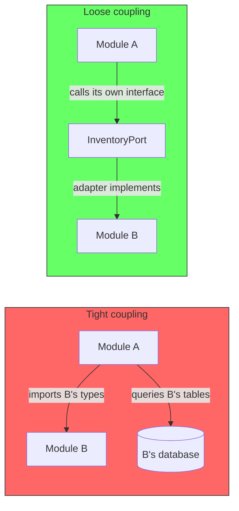
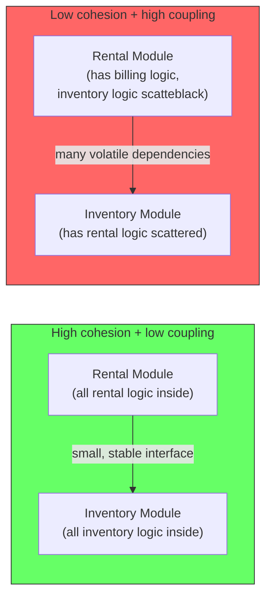
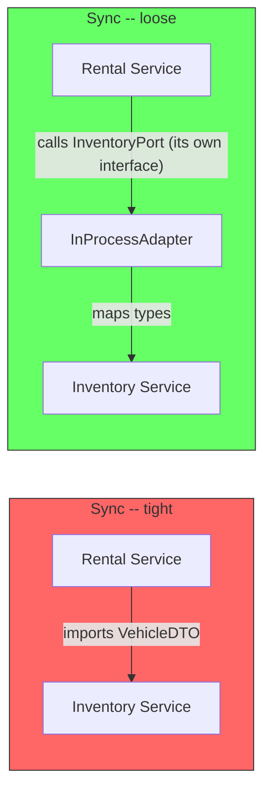
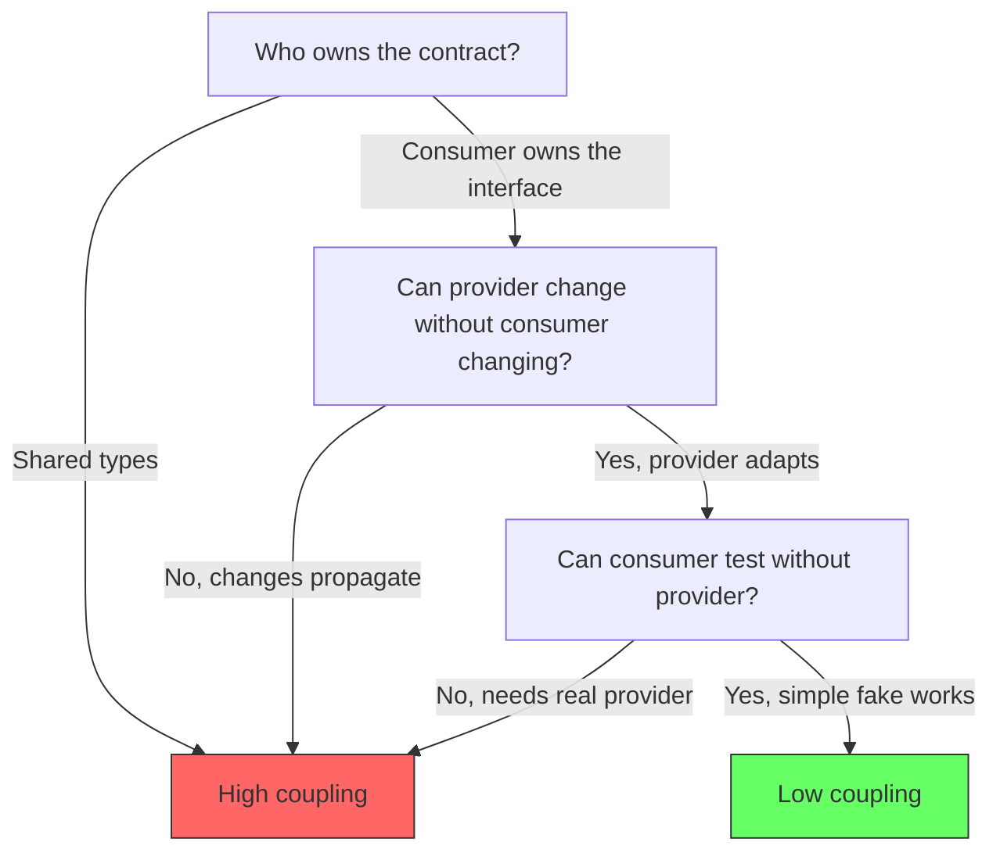

# What Makes Coupling Loose

## The misconception: sync is tight, async is loose

A common belief is that synchronous calls create tight coupling while asynchronous events create loose coupling. This is wrong.

Two services that exchange async events can be tightly coupled if they agree on shared event schemas. Two services that make synchronous calls can be loosely coupled if each owns its own contract.

Coupling is not about the transport. It is about knowledge.



TechTarget (2023) defines coupling directly in terms of knowledge: "Coupling refers to the degree of direct knowledge that one element has of another." Wikipedia (2024) agrees: "each of its components has, or makes use of, little or no knowledge of the definitions of other separate components."

## What coupling and cohesion are

Coupling and cohesion are the two fundamental dimensions of module quality. They were first formalized by Stevens, Myers, and Constantine in their 1974 paper *Structured Design*.

**Coupling** is the degree to which one module depends on another. High coupling means a change in one module forces changes in another. Low coupling means modules can change independently.

**Cohesion** is the degree to which the elements inside a module belong together. High cohesion means a module has a single, well-defined purpose. Low cohesion means a module does many unrelated things.

The two are related. High cohesion enables low coupling because a module that does one thing needs fewer things from outside. Low cohesion forces high coupling because unrelated logic gets tangled across module boundaries.



The goal is high cohesion inside each module and low coupling between them.

## Coupling is knowledge, not transport

When module A depends on module B, the degree of coupling is measured by how much A must know about B to function. The knowledge can take many forms:

| Form of knowledge | Example | Coupling level |
|---|---|---|
| A imports B's internal classes | `import { InventoryService } from 'inventory-module'` | Extreme |
| A queries B's database | `SELECT * FROM inventory.vehicles` | Extreme |
| A shares B's types | Both use `Vehicle` from a shared package | High |
| A calls B's API with its own types | A calls `InventoryPort` that A defined | Low |
| A sends an event and B consumes it | Both agree on event schema | Medium to high |

The critical distinction: **does the consumer own the contract, or does the provider?** When the provider owns the contract (shared types, shared schema, shared DTOs), the consumer is tightly coupled to the provider's internal decisions. When the consumer owns the contract (a port interface defined by the consumer), the provider must adapt to the consumer — and the consumer can change without ever touching the provider.

## Why sync calls are not inherently tight

Synchronous calls get a bad reputation because most teams implement them the wrong way. They share DTOs, import the remote module's service class, or use the same database. That is not the fault of synchronous communication. It is the fault of shared knowledge.

```typescript
// Tight coupling -- shares the provider's types
import { VehicleDTO } from 'inventory-module/dto'

class RentalService {
  async getVehicles(): Promise<VehicleDTO[]> {
    return inventoryClient.fetchVehicles()
  }
}
```

```typescript
// Loose coupling -- consumer owns its contract
interface InventoryPort {
  getAvailableVehicles(): Promise<RentalVehicle[]>
}

class RentalService {
  constructor(private inventory: InventoryPort) {}

  async getVehicles(): Promise<RentalVehicle[]> {
    return this.inventory.getAvailableVehicles()
  }
}
```

The second example is synchronous. It is also loosely coupled. The rental service defines `InventoryPort` and `RentalVehicle`. The inventory module provides an adapter that maps its internal types to the rental service's types. The rental service never imports anything from the inventory module.

This is the Ports and Adapters pattern described by Alistair Cockburn (2005) and the Dependency Inversion Principle from Robert C. Martin (2008, 2017). Martin wrote in Clean Code: "The lack of coupling means that the elements of our system are better isolated from each other and from change. This isolation makes it easier to understand each element of the system."



## Why async calls are not inherently loose

Events create an illusion of decoupling. The sender does not know who receives the event. But both sides must agree on the event schema, the field names, the data types, and the semantics. When the event schema changes, every consumer must change. That is coupling — semantic coupling.

```typescript
// Tight coupling through events -- both sides share the event schema
// Shared event schema (owned by nobody, known by everyone)
interface OrderCreatedEvent {
  orderId: string
  customerId: string
  items: Array<{productId: string, quantity: number, price: number}>
  total: number
  createdAt: string
}

// Publisher sends it
class OrderService {
  async createOrder(data: CreateOrderInput): Promise<void> {
    const order = await this.db.save(data)
    await this.eventBus.publish('order.created', {
      orderId: order.id,
      customerId: order.customerId,
      items: order.items.map(i => ({productId: i.productId, quantity: i.quantity, price: i.price})),
      total: order.total,
      createdAt: order.createdAt.toISOString(),
    })
  }
}

// Consumer depends on the same schema
class AnalyticsService {
  @Subscribe('order.created')
  async onOrderCreated(event: OrderCreatedEvent): Promise<void> {
    // If OrderCreatedEvent changes, this breaks
    await this.analytics.recordOrder(event.orderId, event.total)
  }
}
```

Martin Fowler (2001), in his IEEE Software article on Reducing Coupling, wrote: "The biggest problems come from uncontrolled coupling at the upper levels. I don't worry about the number of modules coupled together, but I look at the pattern of dependency relationship between the modules." An event schema that every module imports is exactly the kind of uncontrolled coupling he describes. The event format becomes a shared dependency that all consumers must know.

The solution is the same as with synchronous calls: the consumer defines what it needs. In the async case, the consumer subscribes to a raw event stream and transforms it within its own boundary, or the publisher sends a minimal event and consumers query for details through an interface.

Martin Kleppmann (2017), in Designing Data-Intensive Applications, discusses this distinction in the context of data systems. He emphasizes that the schema used for data exchange (whether sync or async) creates a dependency between the writer and reader. The key to loose coupling is not the communication mechanism but the ownership of the schema and the ability for each side to evolve independently.

## The real spectrum

Coupling is determined by three questions:

1. **Who owns the contract?** If the contract is shared (a common package, a shared schema registry, a common DTO), coupling is high. If the consumer owns its interface and the provider adapts, coupling is low.

2. **Can the provider change without the consumer changing?** If a field rename, type change, or structural refactor in the provider requires changes in the consumer, coupling is high. If the provider can refactor freely and the consumer never notices, coupling is low.

3. **Can the consumer be tested without the provider?** If the consumer needs the real provider (or a complex mock that reproduces the provider's behavior), coupling is high. If the consumer can be tested with a simple fake that implements a small interface, coupling is low.



## How cohesion relates

You asked about the relationship between coupling and cohesion. High cohesion (modules focused on a single capability) naturally reduces coupling because a cohesive module needs less from outside. When a module handles everything related to "rental" — availability check, pricing, booking, cancellation — it does not need to call other modules for rental logic. Its only cross-module dependencies are for genuinely separate concerns like billing or inventory.

This is the relationship described by Stevens, Myers, and Constantine (1974) in their original paper on Structured Design. They showed that high cohesion enables low coupling: modules that are internally focused have fewer reasons to depend on other modules.

## Summary

| | Tight coupling | Loose coupling |
|---|---|---|
| Contract ownership | Shared or provider-owned | Consumer-owned (port) |
| Provider changes | Consumer must change | Consumer never changes |
| Testing consumer | Needs real provider or complex mock | Needs simple fake |
| Transport | Irrelevant | Irrelevant |
| Example | Importing shared DTOs | Consumer-defined interface with adapter |

The minimum standard for loose coupling: consumer defines its own contract. Everything else — sync, async, events, REST, gRPC — is implementation detail. If the consumer imports nothing from the provider, the module is loosely coupled regardless of how they communicate.

### References

- Cockburn, A. (2005). *Hexagonal Architecture (Ports and Adapters)*. alistair.cockburn.us. https://alistair.cockburn.us/hexagonal-architecture/ — Ports and adapters as the mechanism for consumer-owned contracts
- Fowler, M. (2001). *Reducing Coupling*. IEEE Software, 18(4). — "The biggest problems come from uncontrolled coupling at the upper levels. I look at the pattern of dependency relationship between the modules."
- Kleppmann, M. (2017). *Designing Data-Intensive Applications*. O'Reilly Media. — Schema ownership and evolvability in data systems
- Martin, R. C. (2008). *Clean Code: A Handbook of Agile Software Craftsmanship*. Pearson Education. — "The lack of coupling means that the elements of our system are better isolated from each other and from change."
- Martin, R. C. (2017). *Clean Architecture: A Craftsman's Guide to Software Structure and Design*. Prentice Hall. — Dependency Inversion Principle
- Stevens, W. P., Myers, G. J., & Constantine, L. L. (1974). *Structured Design*. IBM Systems Journal, 13(2). — Original formulation of cohesion and coupling
- TechTarget. (2023). *What is Loose Coupling?*. techtarget.com. — "Coupling refers to the degree of direct knowledge that one element has of another."
- Wikipedia. (2024). *Loose coupling*. wikipedia.org. — "Components have little or no knowledge of the definitions of other separate components."
