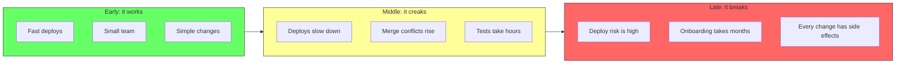
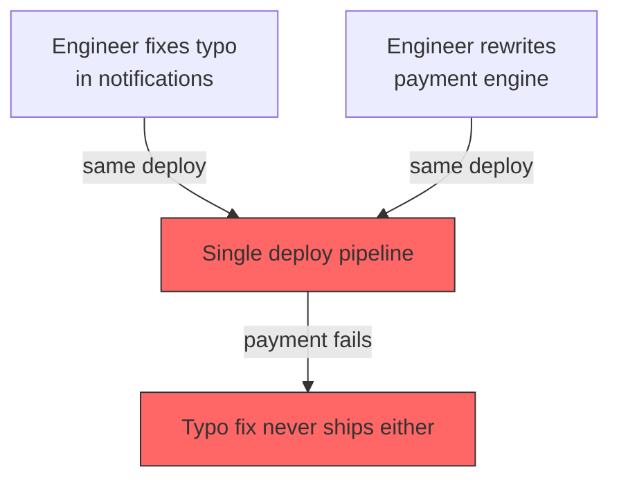
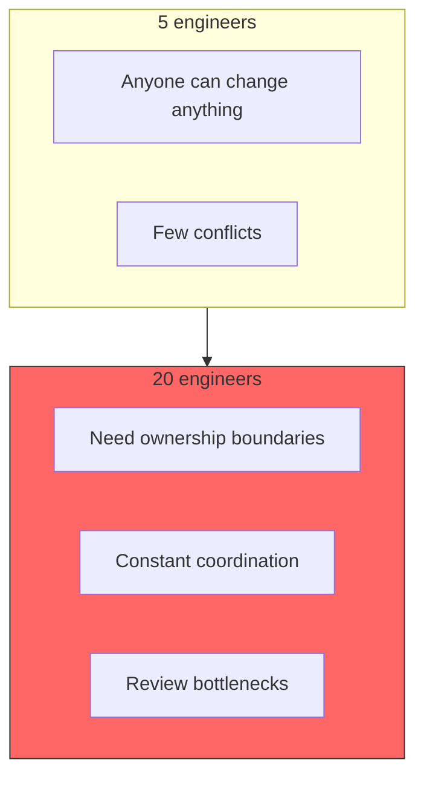
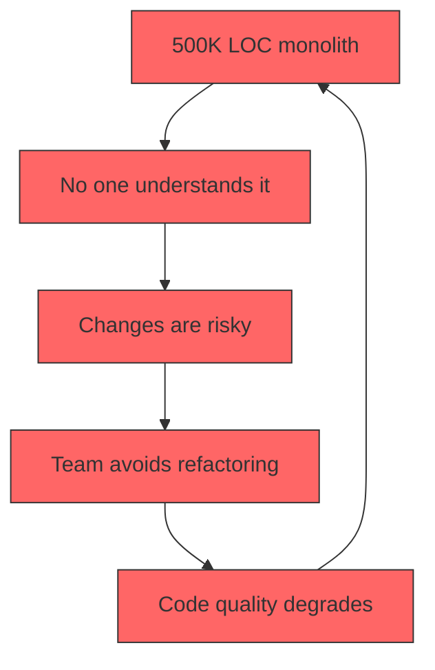
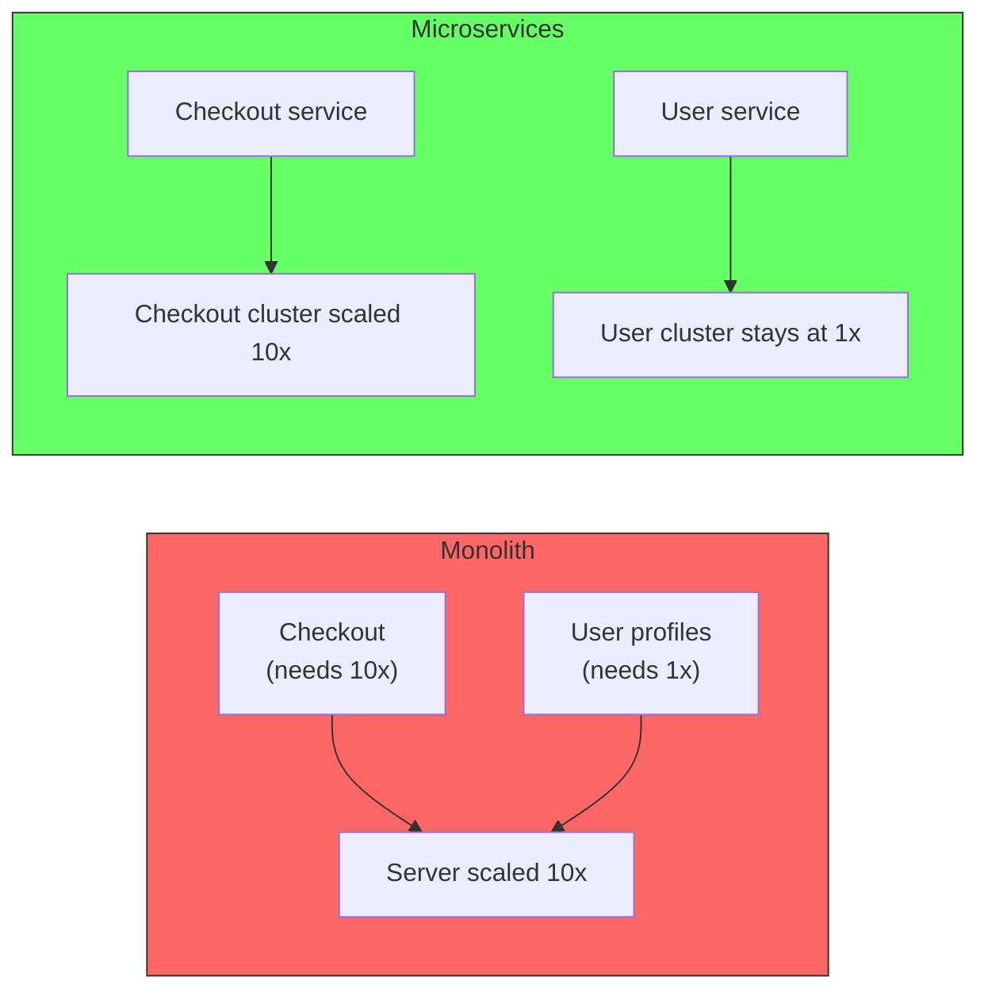
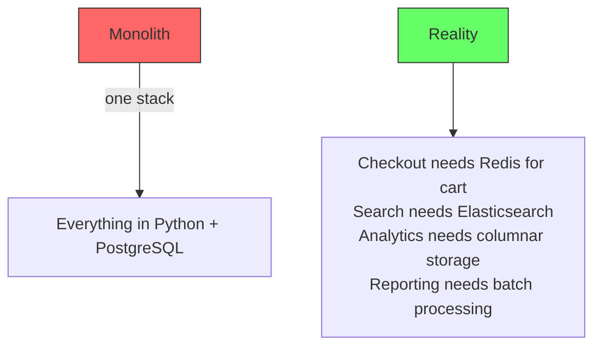
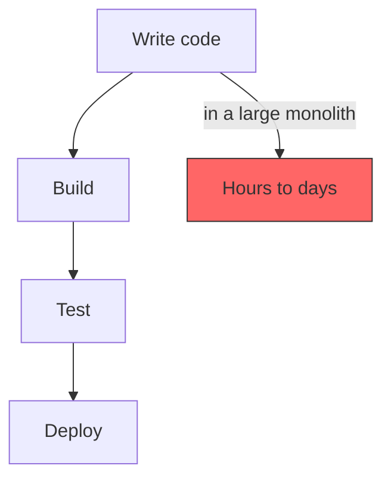
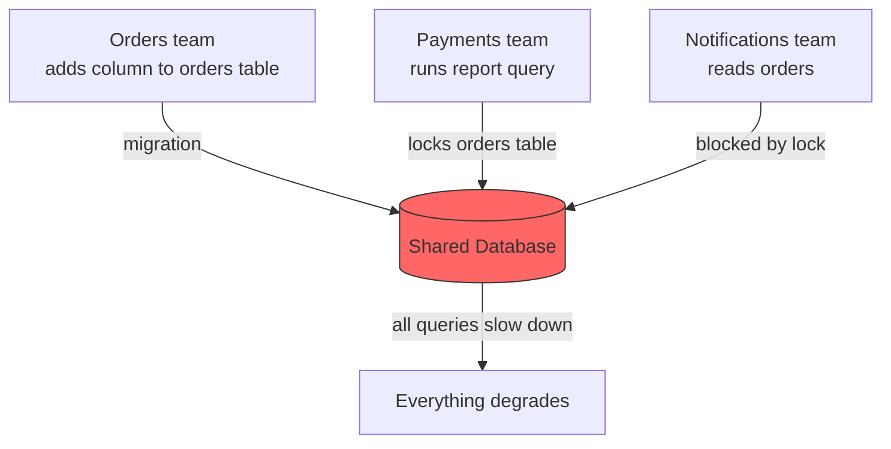
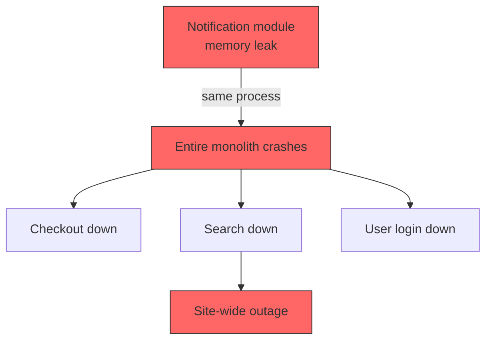
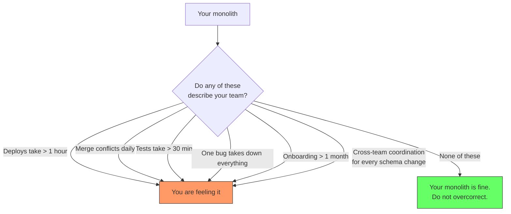

# When the Monolith Breaks

"It works." That is what teams say about their monolith for years. And it does work -- until it does not. The transition is not a single event. It is a slow accumulation of friction that eventually crosses a threshold where every change hurts.

Understanding what breaks, and when, is how you know it is time to restructure.



## Deployment coupling

The most immediate pain. Everything ships together because everything lives in one process. A one-line fix in the notification module requires the same deployment as a risky refactor in the payments module. There is no isolation -- every deploy is an all-or-nothing gamble.



The consequence is that teams deploy less often. Every deploy becomes high stakes, so they batch more changes together, which makes each deploy riskier. The cycle feeds itself.

## Team coordination overhead

In a monolith without clear boundaries, every team touches the same code. The result is not just merge conflicts -- it is a constant negotiation about who owns what, who reviews what, and who can change what.

```
Team A needs to add a field to the order model.
Team B owns the order model but is in the middle of a refactor.
Team A waits.
Team B's refactor touches 30 files.
Team A reviews a 30-file PR.
Team A's change conflicts with Team B's change.
Resolving takes two days.
```

This is not a people problem. It is a structural problem. The codebase has no seams, so every change bleeds into every other change. The cost grows superlinearly with team size.



## Cognitive load exceeds human capacity

A monolith of 500,000 lines of code is not a system anyone understands. It is a collection of files that vaguely relate to each other, held together by hope and a shared database.

The cost shows up in unpredictable ways:

- A new engineer takes three months to ship their first change
- Code reviews are shallow because no reviewer understands the full impact
- Bug fixes introduce new bugs because the fixer did not see the dependency
- Refactoring is avoided because "if it works, do not touch it"



## Scaling waste

A monolith cannot scale parts independently. If the checkout flow needs 10x the resources of the user profile flow, the entire monolith must scale 10x. Every part of the system pays for the most resource-intensive part.



The waste has real numbers behind it. Pendoah AI (2025) estimates mid-market companies overspend 30-50% on infrastructure because monoliths force scaling everything when only one component needs it. Their breakdown: a company spending $50K/month on a monolith reduced to $34.5K/month (31% savings) after migrating to independently scalable services -- compute alone dropped from $30K to $18K (40% savings). A fintech case study in the International Journal of Science and Research (2023) showed auto-scaling reduced costs by 30% and serverless computing saved 40% on infrastructure. DevITCloud (2024) documented an e-commerce platform that achieved 80% infrastructure cost reduction by moving from a monolith to independently scalable serverless services.

The industry-wide numbers are staggering. Flexera's 2025 State of the Cloud report found 32% of cloud budgets are pure waste -- $44.5 billion annually -- mostly from overprovisioned resources. CAST AI's 2025 benchmark found average Kubernetes CPU utilization at just 10% (90% of provisioned CPU unused). Harness projected $44.5 billion in infrastructure waste for 2025 alone. The root cause in every case: fear-driven overprovisioning because the architecture cannot scale selectively.

The counter-example proves the same point from the opposite direction. Amazon Prime Video published a case study in 2023 showing a 90% cost reduction by consolidating microservices back into a monolith. Their monitoring service did not need independent scaling -- the distributed architecture added overhead without benefit. When you do not have divergent scaling needs, the monolith is cheaper. When you do, the monolith forces you to pay for capacity you do not use.

The waste is not just about cost. It is about dimensioning. A monolith that serves API requests and processes background jobs and generates reports must be provisioned for the worst combination of all three workloads simultaneously.

## Technology lock-in

Every component in a monolith must use the same language, the same framework, the same database, the same message format. There is no room for "this part would be better as a stream processor" or "this would be simpler with a different database."



The lock-in is not theoretical. It means teams build workarounds instead of using the right tool. Caching layers, batch jobs in the same process as API servers, reports generated from transactional databases at 3 AM because there is no other option.

## Slow feedback loops

As the monolith grows, every feedback loop lengthens.

| Loop | Small monolith | Large monolith |
|---|---|---|
| Build | 30 seconds | 10 minutes |
| Unit tests | 2 minutes | 30 minutes |
| Integration tests | 5 minutes | 2 hours |
| Deploy | 10 minutes | 1 hour (with staging, smoke tests) |
| Time to ship a change | 1 hour | 1 day |



Long feedback loops are not just an inconvenience. They change behavior. Engineers batch changes to avoid the overhead of the loop. Smaller, safer changes become larger, riskier changes. The cycle of "deploy less, risk more" accelerates.

## Database coupling

The database is the hardest coupling to break. In a monolith, every module shares the same schema, the same tables, the same connection pool. A migration by one team can lock a table needed by another team. A slow query in one feature can degrade performance for every feature.



The database becomes a single point of coupling, a single point of failure, and a single bottleneck. Breaking it apart later requires splitting schemas, migrating data, and handling distributed transactions -- one of the hardest refactors in software.

## Reliability: blast radius is everything

A memory leak in the notification module crashes the entire monolith. A bad deploy by the search team takes down the checkout flow. There is no isolation -- every module's risk is every user's problem.



In a well-structured system, a failure in one module stays in that module. In a monolith without boundaries, every failure is a potential full outage.

## The threshold: when do these become critical?

Not every monolith hits all these problems. The threshold depends on:

- **Team size**: ~10 engineers is where coordination overhead starts to hurt. ~20+ is where it becomes the primary cost.
- **Codebase size**: ~200K LOC is where cognitive load becomes visible. ~500K+ is where no one understands the system.
- **Team distribution**: Same timezone, same floor? Coordination is easier. Remote, async, multiple time zones? Every problem is amplified.
- **Change frequency**: Daily deploys with small changes age well. Weekly deploys with large batches age poorly.
- **Domain complexity**: A CRUD app with 10 entities scales much further than a system with complex workflows, state machines, and integration points.



## What not to do

The natural reaction to these problems is: "Let us move to microservices." That is often the wrong move.

Microservices fix deployment coupling, scaling waste, and technology lock-in. They do **not** fix:
- Cognitive load -- you still need to understand the system, just spread across network calls
- Team coordination -- service boundaries create new coordination problems (contracts, API versioning)
- Slow feedback loops -- network calls add latency, distributed tracing adds complexity

The right first step is almost always a modular monolith. Draw the boundaries, organize the code by capability, define the interfaces. If those boundaries cannot be drawn cleanly inside a monolith, they will not be cleanly drawn across services either.

Only when the modular monolith is in place and the pain persists (team scaling, independent scaling needs) should you extract services.

## Summary

The monolith breaks at different points for different teams. The common thread is friction -- every action takes longer, every change is riskier, every deploy is an event.

These are the motivations to move away from a monolith. Each maps to a specific pain:

| Pain | Motivation | Likely solution |
|---|---|---|
| One deploy for everything, high risk | Independent deployability | Modular monolith or microservices |
| Teams stepping on each other's code | Team autonomy | Clear module ownership, then services |
| No one understands the system | Cognitive load reduction | Modular monolith with capability boundaries |
| Can't scale parts independently | Resource efficiency | Microservices |
| Stuck with one tech stack | Technology flexibility | Microservices for the component that needs it |
| Tests take hours, deploys take all day | Fast feedback | Build system, independent CI, smaller modules |
| Database is a bottleneck | Data independence | Schema-per-module, then database-per-service |
| One bug crashes everything | Blast radius isolation | Modular monolith (process isolation is a microservices concern) |

Each pain points to a different solution. Not all of them require microservices. The first move is always the same: clean up the boundaries. That is the modular monolith. Extract to services only when the boundary is clean and the pain persists.

The full decision framework is covered in [Monolith vs Microservices](/docs/software-engineering/monolith-vs-microservices).
