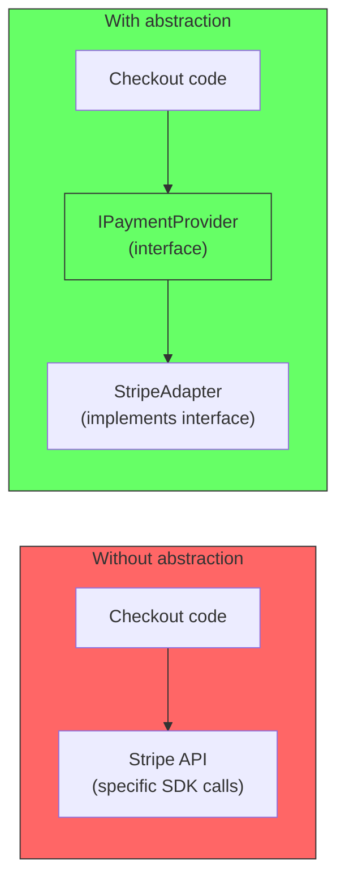
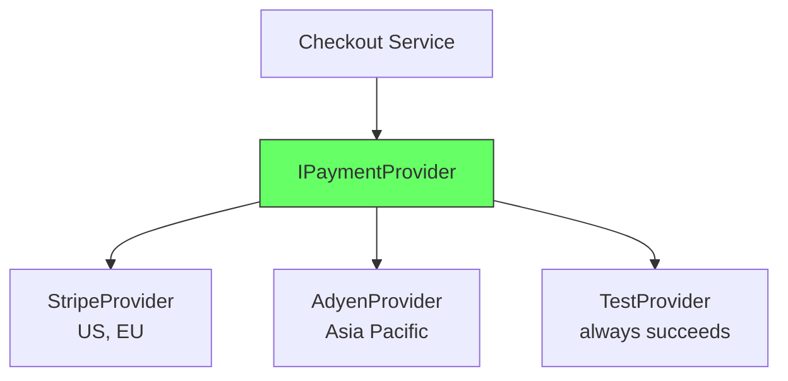
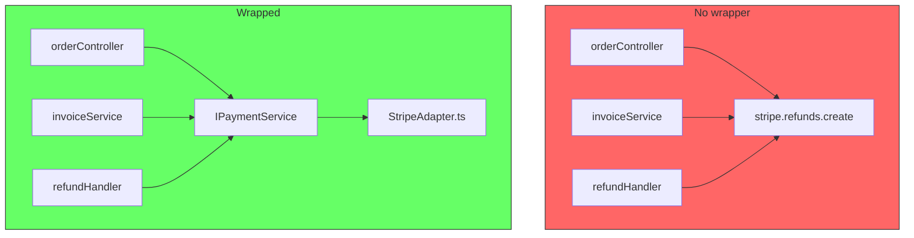
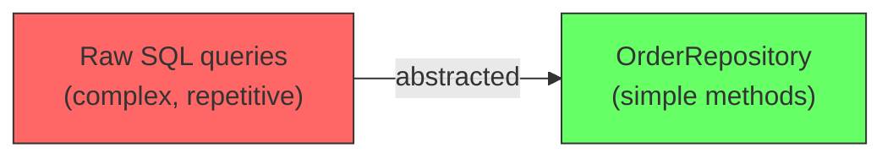
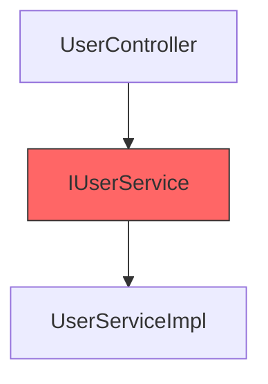
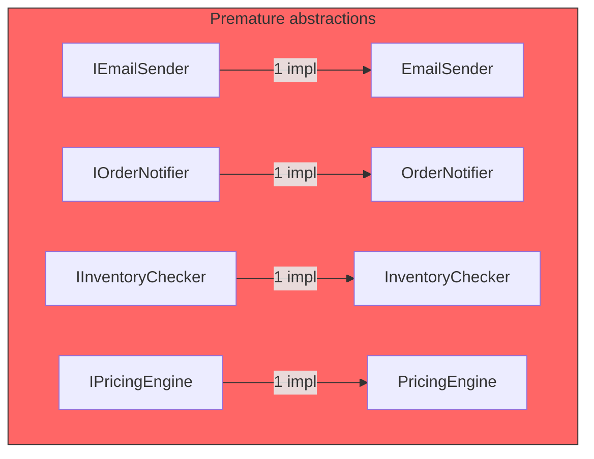
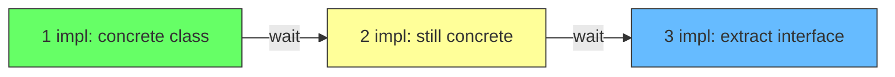

# When to Abstract

Abstraction is not a goal. It is a tool. Used well, it hides complexity and makes change easier. Used poorly, it adds indirection and makes the code harder to follow without providing any benefit.

The question is not "should we use abstractions?" The question is "does this abstraction provide value?"

## What abstraction is

An abstraction is a simplified interface that hides implementation details. The caller interacts with the interface, not the concrete code behind it.



The abstraction says: "I do not care how you process the payment. I only care that you process it." The interface is simpler than the implementation. That is the point.

## When abstraction provides value

### 1. Multiple implementations exist today

If your system needs to support two or more concrete implementations of the same concept, an abstraction is the natural boundary.

```
// Real example: different payment providers for different regions
paymentProvider = config.useStripe
  ? StripePaymentProvider(stripeKey)
  : AdyenPaymentProvider(adyenKey)

// The abstraction hides which provider is used
checkout.processPayment(order, paymentProvider)
```



### 2. An external dependency needs protection

Third-party libraries, APIs, and SDKs change. Wrapping them behind an abstraction means the change is contained in one adapter file instead of spreading across the entire codebase.

```
// Bad: Stripe SDK calls everywhere
orderController.ts:   stripe.charges.create({...})
invoiceService.ts:    stripe.charges.create({...})
refundHandler.ts:     stripe.refunds.create({...})

// Good: Stripe behind an interface
orderController.ts:   paymentService.charge({...})
invoiceService.ts:    paymentService.charge({...})
refundHandler.ts:     paymentService.refund({...})
// All Stripe logic in one file: StripePaymentAdapter.ts
```



When Stripe changes its SDK, you change one file. When you switch to Adyen, you write one new adapter. The rest of the code does not change.

### 3. The abstraction is simpler than what it hides

A good abstraction hides complexity. A database repository that exposes `findById(id)` and `save(entity)` is simpler than raw SQL queries scattered across the codebase. The abstraction is worth it because the interface is easier to use than the concrete implementation.

```
// Without abstraction
const result = await db.query(
  "SELECT * FROM orders WHERE id = $1 AND status = $2",
  [orderId, "active"]
)

// With abstraction
const order = await orderRepo.findById(orderId)
```



## When abstraction is useless

### 1. Only one implementation and no prospect of another

An interface with a single implementation and no plan for a second is pure indirection. It adds a file to navigate through, a type to maintain, and zero value.

```
// Useless abstraction
interface IUserService {
  getUser(id: string): User
}

class UserServiceImpl implements IUserService {
  async getUser(id: string): Promise<User> {
    return db.find(User, id)
  }
}

// Exactly one implementation. The interface adds nothing.
```



Every time you rename a method in `IUserService`, you rename it in `UserServiceImpl`. Every time you add a method, you add it in both places. The interface is a pass-through that does nothing but increase maintenance.

Wait for a second implementation to appear before introducing the interface. Or start with the concrete class and extract the interface when it becomes necessary.

### 2. The abstraction leaks details

If the abstraction exposes the same complexity as the implementation, it is not an abstraction. It is a facade that adds nothing.

```
// Leaky abstraction
interface IFileStorage {
  uploadToS3(bucket: string, key: string, data: Buffer): Promise<string>
}

// The interface knows about S3. Every caller must know about S3.
// Switching to Azure Blob means changing every caller.
```

Compare with:

```
// Clean abstraction
interface IFileStorage {
  upload(fileName: string, data: Buffer): Promise<Url>
}
```

The caller passes a logical filename. The implementation maps it to the storage backend. The interface is simpler than any specific backend.

### 3. Abstracting before you know what varies

The most expensive mistake. Teams create interfaces for everything because "we might need it later." Later never comes. The codebase is littered with interfaces that have exactly one implementation and never grow a second.

```
// Premature: created on day one, still single implementation after 3 years
interface IEmailSender { ... }       // one implementation
interface IOrderNotifier { ... }     // one implementation
interface IInventoryChecker { ... }  // one implementation
interface IPricingEngine { ... }     // one implementation
```

Each interface doubles the maintenance surface area. Each adds a file to open, a type to update, a layer to navigate. None provides value.



## Practical guidelines

### The rule of three

Do not introduce an abstraction until you have three concrete examples that share the same interface. By the third one, you understand what varies. Before that, you are guessing.

```
// First implementation: no interface
class StripePaymentProvider { ... }

// Second implementation: still no interface
class StripePaymentProvider { ... }
class AdyenPaymentProvider { ... }

// Third implementation: extract the interface
// Now you know what the common contract looks like
interface IPaymentProvider { ... }
class StripePaymentProvider implements IPaymentProvider { ... }
class AdyenPaymentProvider implements IPaymentProvider { ... }
class PayPalPaymentProvider implements IPaymentProvider { ... }
```



### YAGNI

You Ain't Gonna Need It. If you cannot name a concrete scenario that requires a second implementation within the next quarter, do not build the abstraction. Write concrete code. Extract the interface when the need appears.

### The abstraction should be simpler than the implementation

If the interface is as complex as the concrete code, the abstraction is not earning its keep.

| Good abstraction | Bad abstraction |
|---|---|
| `upload(fileName, data): Url` | `uploadToS3(bucket, key, data, region, acl, encryption)` |
| `sendEmail(to, subject, body): void` | `sendEmailViaSendGrid(from, to, subject, body, attachments, tags, categories)` |
| `processPayment(orderId, amount): Receipt` | `processPaymentWithStripe(stripeKey, orderId, amount, currency, description, metadata)` |

## When it is OK to abstract early

There is one exception: wrapping an external dependency that has caused pain before. If your team has been burned by a Stripe SDK change, a database migration, or a cloud provider API deprecation, it is rational to wrap that dependency on day one. The cost is justified by past experience.

But that is a decision based on specific historical pain, not on general principles. "Stripe might change their API someday" is valid if Stripe has changed their API and cost you time. "We might need a different payment provider someday" is not valid if you have no plan to switch.

## Summary

| Abstract when | Do not abstract when |
|---|---|
| Multiple implementations exist | Only one implementation exists |
| Wrapping a volatile external dependency | The dependency is stable and unlikely to change |
| The interface is simpler than the concrete code | The interface is a pass-through with no simplification |
| Past experience justifies the guard | "We might need it someday" is the only reason |

Abstraction is not free. Every interface costs indirection, maintenance, and cognitive load. Only pay that cost when the abstraction provides measurable value.
