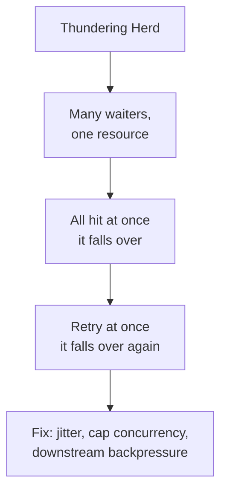

# Thundering Herd - Overview

Many independent actors, one shared resource, and what happens when they all react at the same time. The thundering herd is a distributed systems failure mode, not a caching detail, which is why it has a home of its own.

This is a study area: each article here is a real incident or a pattern, worked through to the point where the fix is clear.

*   [Thundering Herd Case Study](./thundering-herd.md) - the retry storm that took down Braintree, a PayPal company, told from the incident onward: what the herd is, why retries do not save you, why it is not backpressure, and the fixes.

