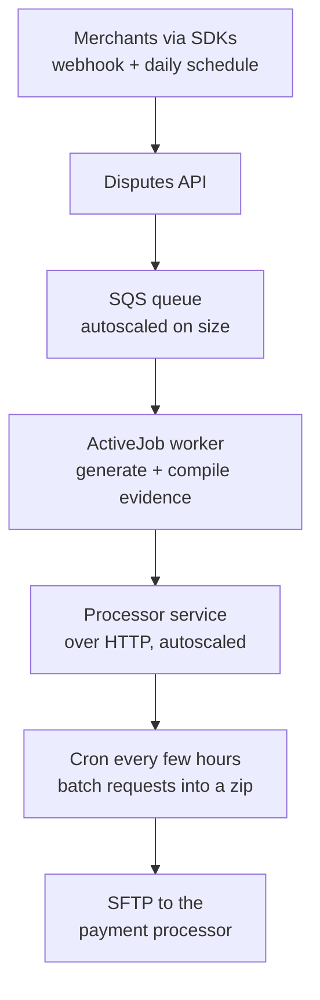
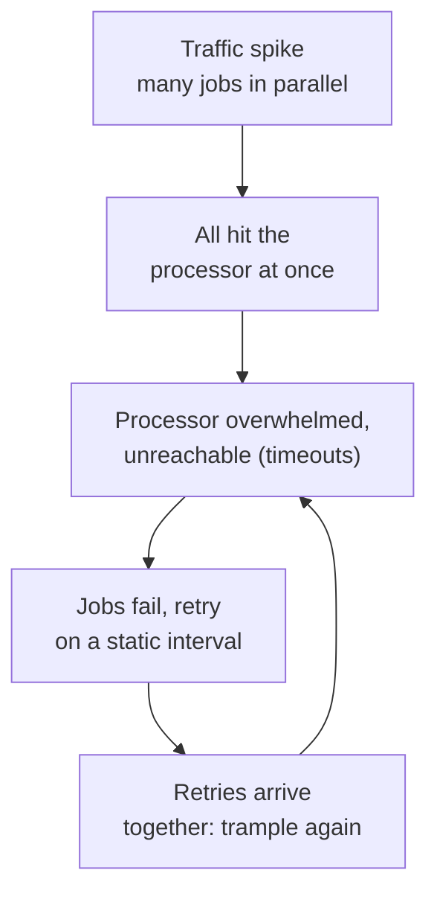
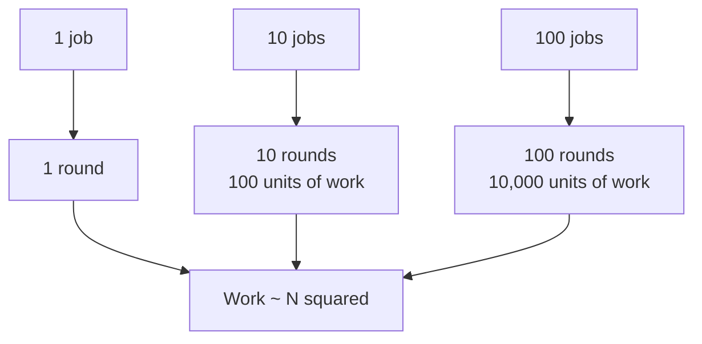
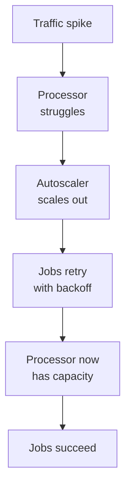
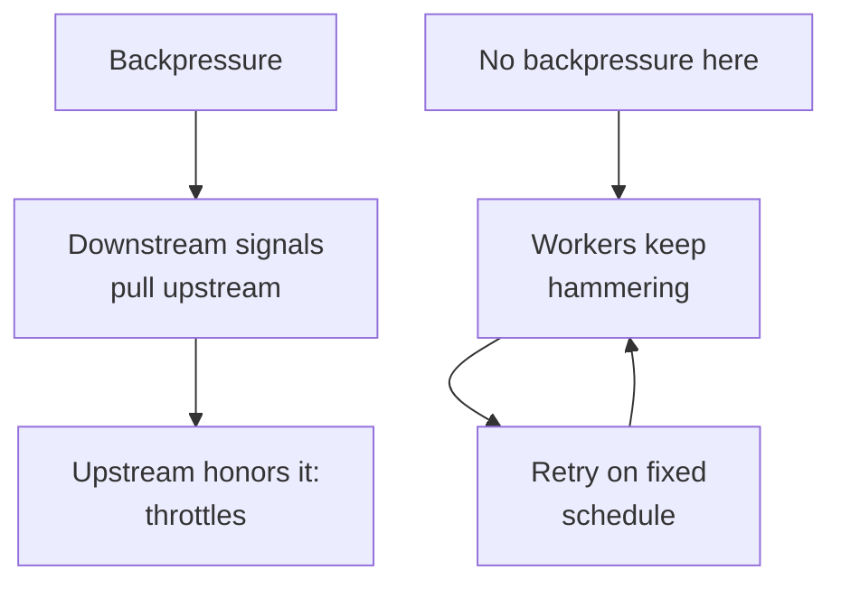
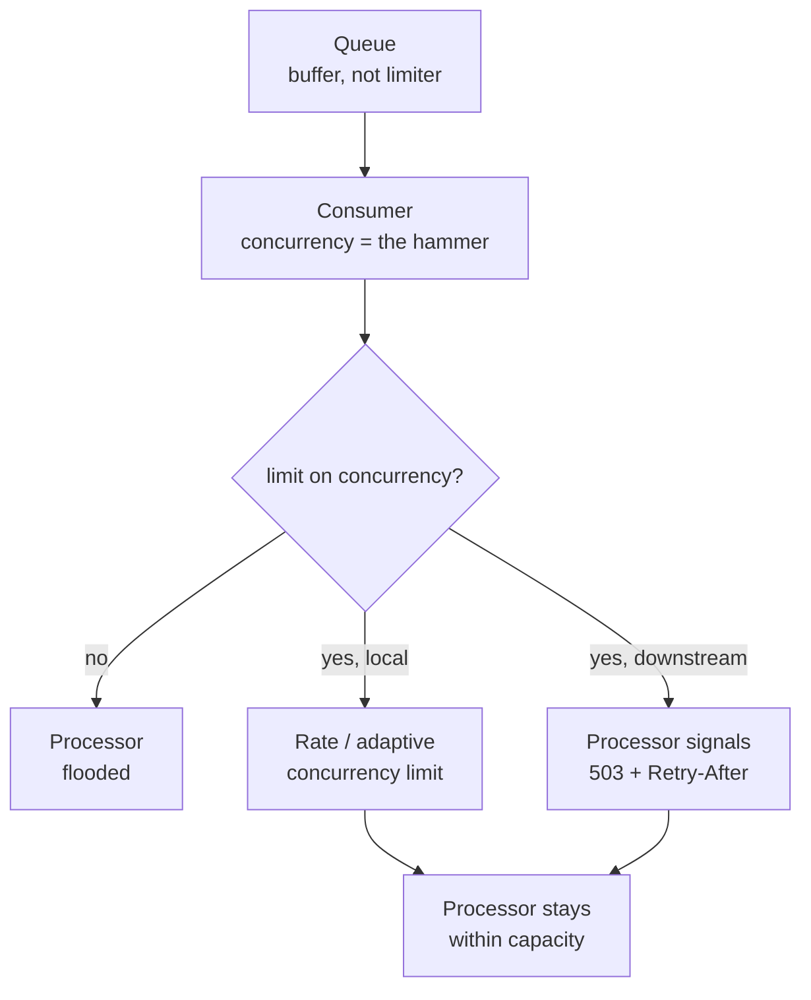
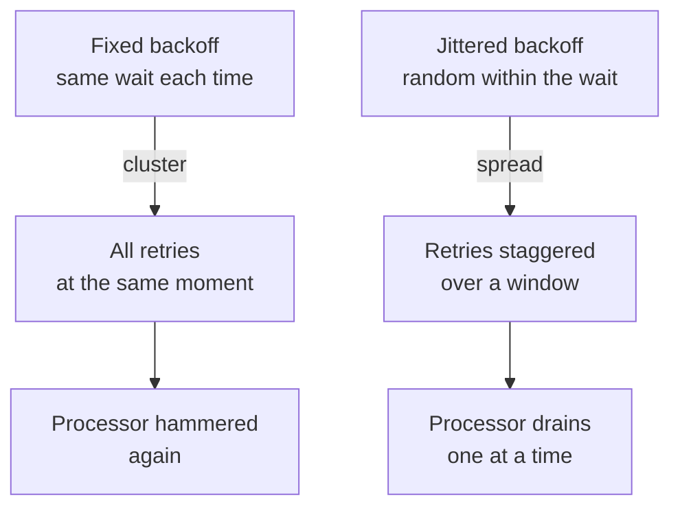
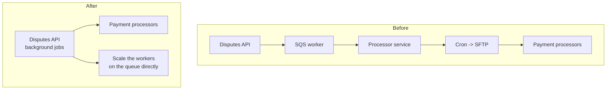
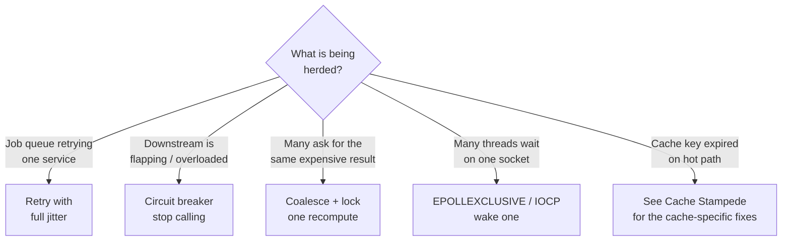

# Thundering Herd - the retry storm that took down a payment processor

The best way to understand a thundering herd is through a real one. At Braintree, a PayPal company, overnight a background job system started failing at certain times of day, jobs piled into a dead letter queue, and nobody could say why. The retries they had configured were not saving them. The cause was a thundering herd. This article explains the whole concept from that incident, because the incident shows exactly why the retry logic failed and how it was fixed.

**TLDR**

*   **What it is.** A lot of workers (jobs, requests, threads) hit the same service at the same moment. Only the service is the victim, so it becomes overloaded and starts failing.
*   **Why retries do not save it.** The retries are on a fixed schedule, so they hit again at the same moment. This is the second, bigger wave, and it keeps the service down.
*   **Why it is not backpressure.** Backpressure is a downstream "slow down" signal the upstream honors. Here there was none. The workers kept hammering and retrying blindly.
*   **The real fixes.** Add jitter so retries stagger, and remove the unnecessary middle layer so fewer pieces can be hammered.
*   **The broader lesson.** The herd is the cheap part. The retry amplification is the expensive part, and it is what turns an overload into an outage.

Sources: Antross, The PayPal Technology Blog (How We Solved the Thundering Herd Problem), Wikipedia (thundering herd problem), Marc Brooker / AWS (exponential backoff and jitter), AWS Builders' Library (timeouts, retries, and backoff with jitter).

---

## 1. The story, and the flow that failed

### Problem

Braintree runs a Disputes API that merchants use to open and manage chargeback disputes. Traffic is highly irregular: some merchants submit in real time in response to a webhook, and others run on a daily schedule. That makes spikes unpredictable. When a dispute is finalized, the service enqueues a job on SQS for the submission step. Workers scale in and out on the queue size, and each job submits the evidence to a processor service over HTTP.

That processor service was an abstraction layer, because Braintree talks to many different payment processors. It took the jobs over HTTP and then, every few hours, a cron task batched recent requests into a big zip and pushed it by SFTP to one of the processors. So the submission flow had an extra, independent vertical service sitting in the middle.

The architecture that failed, reproduced from the article:

<div style={{display: 'flex', justifyContent: 'center'}}>



</div>

Diagram by Anthony Ross, PayPal. The processor service is a gateway: it exists so many payment processors can be reached through one place. It takes real-time HTTP traffic, then the cron job batches recent requests into a zip and submits by SFTP.

### Solution

The flow itself is a normal, reasonable design. The point is not that the architecture was wrong, but that it had a narrow time window where it could be hammered. That window is where the herd lived.

At certain points in the day, the submission jobs started failing with errors like `Faraday::TimeoutError`, `Faraday::ConnectionFailed`, and other `Net::HTTP` errors. Enough of them failed that the monitor on the dead letter queue would alert. These were not merchant-facing errors, but they were dropped work, and Braintree took them seriously because a dropped dispute is a real cost to a merchant.

---

## 2. Naming it: this is a thundering herd

### Problem

The failures were not a bug in the processor service. If the processor had a logic error, the retries would not have mattered. The errors were client-side: the jobs could not reach the processor, or it did not answer in time. Why could the jobs not reach the processor service at certain points in the day?

### Solution

It is the thundering herd problem: a great many processes (here, jobs) queue up in parallel, all hit a common service, and trample it down. Then those same jobs retry on a fixed interval and trample it again. The cycle repeats until retries are exhausted and the message is dead lettered.

The definition is the same as the classic one, but seen through this incident: the "single resource" is the processor service, and the "waiters" are the submission jobs. It is a resource allocation problem where many independent actors are synchronized to react at the same time.

<div style={{display: 'flex', justifyContent: 'center'}}>



</div>

Two waves made this persistent, and separating them is the key insight:

*   **Wave one, the original spike.** A surge of parallel jobs hit the processor at once. It could not handle the load, and it went down or stopped answering.
*   **Wave two, the retry storm.** The retries fired on a fixed schedule, so every failed job retried at the same moment. This re-hit the processor with a synchronized burst while it was already struggling. Wave two is the part that keeps the service down.

---

## 3. Why the retries do not save you: work grows as N squared

### Problem

The confusing part was that retries were configured, including exponential backoff, so why did retry not eventually succeed? Retrying is the reflex, and it failed here because retrying is not the same as desynchronizing. The retry added another synchronized load, which made things worse, not better.

### Solution

The cost is not linear. When N clients retry and all contend, the wasted work grows as N squared, not N. AWS architect Marc Brooker showed this in "Exponential Backoff And Jitter": with N clients contending for one resource, "the total amount of work done by the system increases with N2." One client wins every round, so it takes N rounds for all N to succeed, and each round the remaining clients all compete.

Apply it to the incident. If 100 jobs hit the processor at once, that is one wave. But if they all retry at once, they do it again. And because nothing staggers them, the herd re-forms every cycle until the retry budget is gone and the jobs land in the DLQ. The scale of the first wave decided how the story started, but the retry synchronization is what kept it going.

<div style={{display: 'flex', justifyContent: 'center'}}>



</div>

There is a second, subtler problem in the article. The retry intervals were long enough that the processor service would scale back in before the jobs retried. Scale in and out is a tradeoff of time and money: the faster it can move, the more cost effective, but the more likely it is under-provisioned for a period. So even when scaling worked, the timing meant the service was back down when the retries arrived. This is the "architectural coupling" the author mentioned, and it made the whole flow fragile.

This was the article's key error in reasoning, and it is worth drawing: the team assumed that if the service scales out and the jobs retry, it should eventually succeed. That is the expectation a healthy system is supposed to meet.

<div style={{display: 'flex', justifyContent: 'center'}}>



</div>

That is what should happen. It is not what happened. The retries and the scale-out drifted out of sync, so the retries landed when the service had already scaled back down. This is the second-wave trap: retry is only safe if retries are staggered, and scaling is only safe if the timing lines up.

---

## 4. Why this is not backpressure

### Problem

You might read the incident as "the workers forced more load on the processor than it could handle." That is true, but calling it backpressure gets the mechanism backwards. The distinction matters, because the solution is different.

### Solution

Backpressure is a downstream flow-control signal. The processor would tell the workers "I am full, slow down," and the workers would honor it. Here there was no flow control at all. The workers kept hammering and retried on a fixed schedule regardless of what the processor could take, so the processor never got a chance to recover.

The queue buffered the work (that is why SQS and the DLQ exist), but buffering is not backpressure. A buffer absorbs the wait; it does not tell anyone to slow down. So this is a retry storm, which is both the failure to apply backpressure and the failure to jitter the retries.

<div style={{display: 'flex', justifyContent: 'center'}}>



</div>

The practical takeaway: load-shedding and flow control are a downstream responsibility, and de-synchronization is an upstream responsibility. In this incident neither was in place. The buffer was, and it hid the problem for a while before finally filling up into the DLQ.

---

## 5. The real lever: cap the concurrency, not the queue

### Problem

The article used a queue, and the instinct is that a queue is enough: work is enqueued and the consumer drains it at its own pace. But the queue did not protect the processor service. Why not?

### Solution

Because a queue is a buffer, not a limiter. It only absorbs a burst and lets you process later; it says nothing about how hard you process when you do. The thing that hammers the downstream is not queue depth, it is the consumer's **concurrency**, how many jobs it runs in parallel. Pull from the queue as fast as the concurrency allows, and if that concurrency is unconstrained, the processor gets the same flood it would have with no queue at all, just a few seconds later.

So there is one real lever, and two ways to pull it:

*   **Cap it locally, based on the downstream's capacity.** A rate limit or an adaptive concurrency limit set to roughly what the processor can take. Netflix's concurrency-limits library is the adaptive form: watch the downstream's latency, and if it starts rising, lower the concurrency limit automatically. This says "do not send me more than I can handle," without the downstream asking.
*   **Let the downstream cap it.** True backpressure: the processor responds to excess load with a busy signal such as a `503` and `Retry-After`, and the consumer slows down when it sees that signal. Here the downstream is the one setting the limit.

<div style={{display: 'flex', justifyContent: 'center'}}>



</div>

### Why autoscaling did not save them

Autoscaling is the third, separate thing, and it is not a substitute for the local cap. Autoscaling is reactive: it only starts scaling after a threshold is crossed, and even then it takes a probe interval plus provisioning time. During that gap the system is under-provisioned and vulnerable. That is the "tradeoff of time and money" the author describes: scaling fast is cost effective, but leaves you under-provisioned for a period. The failures happened exactly in that period, so autoscaling could not have prevented them, it could only catch up afterwards.

Layering these is the real defense: jitter desynchronizes the retries, a capacity-aware limit caps the load at the source, downstream backpressure rejects excess explicitly, and autoscaling is a backstop that eventually catches up. The queue alone is none of these, which is why the queue alone did not help Braintree.

---

## 6. How they fixed it

### Fix 1: jitter to stop the bleeding

#### Problem

Braintree had exponential backoff. That is not enough, because exponential backoff still produces clustered retries: all the failures happen at the same time, so all the retries do too. What was needed was randomness in the retry interval so the jobs stagger instead of arriving together.

#### Solution

Add jitter to the retry interval. At the time, Rails' ActiveJob did not support a jitter argument, so Braintree added one in a small pull request to Rails. After deploying it, the DLQ monitors stopped going red.

Marc Brooker explains the intuition the author used: if 100 people run at a doorway at once, the doorway may come crashing down. If instead they run at different speeds and arrive at random intervals, the doorway stays usable and the pressure is much lower. Jitter is the small code change that makes retries behave like that.

```ruby
class EvidenceSubmissionJob < ApplicationJob
  retry_on Faraday::TimeoutError, wait: :exponentially_longer, jitter: 0.15
  retry_on Faraday::ConnectionFailed, wait: :exponentially_longer, jitter: 0.15

  def perform(dispute)
    # ... submit evidence to the processor service
  end
end
```

The `jitter` value is a fraction of the calculated backoff. Instead of every job sleeping exactly `wait`, it sleeps a random amount up to `wait`, so a group of jobs that all failed at the same moment retry spread out over a window.

<div style={{display: 'flex', justifyContent: 'center'}}>



</div>

Jitter was "stop the bleeding." It did not address why the processor was slow, it changed the behavior of the clients so they stopped creating a synchronized load. AWS now bakes jitter into its SDK retry modes, so it should be considered standard for any remote client. The three common forms, from the AWS analysis, are:

*   **Full jitter.** Sleep a random amount between 0 and the capped backoff. Least work, spreads best.
*   **Equal jitter.** Keep half the backoff, jitter the other half. Keeps some slow-down, slightly slower overall.
*   **Decorrelated jitter.** Grow the cap from the last random value. Spreads well, slightly more work.

### Fix 2: break the coupling

#### Problem

Jitter stopped the bleeding but left the underlying fragility. The processor service was an independent vertical that did not need to be. It was a gateway abstraction (to handle many processors) that had grown into a separate deployable with its own autoscaling, its own cron task, and its own failure mode. That is a lot of surface that can be hammered.

#### Solution

Braintree simplified it. They moved the bulk of the business logic into the Dispute API background jobs and scaled those out directly, instead of routing through an extra service. The author puts it plainly: "these two systems were too closely coupled. The processor service did not need to be an independent vertical service as we initially thought."

<div style={{display: 'flex', justifyContent: 'center'}}>



</div>

Diagram by Anthony Ross, PayPal. The before flow routes the work through a whole independent vertical, and the after flow does the same work inside the queue workers themselves.

This removes the herd threshold in two ways. First, there is no separate service to overload, so the thing being hammered is the very job workers that are already autoscaled on the queue. Second, by reducing the number of independent pieces, there is less to break and less operational burden. Simplicity here is a resilience measure, not just neatness.

---

## 7. The broader lesson: the herd is the cheap part, the retry amplification is the expensive part

### Problem

The first spike, the herd itself, is often unavoidable. Irregular real-time traffic means you will get bursts. The failure that turns a transient burst into an outage is the amplification on top of it.

### Solution

Separate the two contributions in your diagnosis, because they need different fixes:

*   The scale-out latency explains why the service was down during the spike (wave one). This is a capacity question: can the autoscaler keep up, and is that tradeoff acceptable?
*   The static retry interval with no jitter is why it kept looping until the DLQ (wave two). This is a behavior question: did the clients blind retry in lockstep?

If you only fix the capacity, wave two will still re-create the outage. If you only fix the jitter but the service is chronically under-provisioned, wave one will still hurt. Both matter, and the incident needed both: jitter to stop the loop, and de-coupling to reduce how much could be hammered in the first place.

---

## 8. Other herds you will meet, and the matching fix

The Braintree case is a retry storm in a job-queue. The same shape appears elsewhere, and the right tool differs by context.

<div style={{display: 'flex', justifyContent: 'center'}}>



</div>

*   **Circuit breaker.** When the downstream is flapping, jitter alone is not enough. A breaker opens after a failure threshold and fails fast for a cooldown window, so clients stop feeding an ailing resource. It is the answer to the retry storm second wave: jitter spreads the load, the breaker caps it. In the Braintree story, the processor service was reachable but slow, so a breaker would have shed load while it recovered.
*   **Request coalescing.** Also called single flight. When many callers need the same expensive result, let the first one build it and have the rest await that one promise. This deduplicates in-flight work. It is described in [Request Coalescing](../software-engineering/request-coalescing.md). In a job-queue this matters less, because each job is unique, which is why coalescing was not the answer at Braintree.
*   **Kernel one-waker.** When many threads wait on a single socket, the OS can wake only one. Linux `epoll` with `EPOLLEXCLUSIVE` and Windows I/O completion ports do this, so the herd is removed before the application sees it. This is the fix for a different layer than a job queue, but it is the same shape: many waiters, one resource.

The common thread across all of them is the same lesson from Braintree: a lot of independent actors hitting one resource is inevitable at some level, and the fix is either to make them stop acting together, or to reduce how much can be hit by the same wave.

## Links

-   Antross, The PayPal Technology Blog - How We Solved the Thundering Herd Problem (the real incident, retry storm, and the jitter plus de-coupling fix)
-   Marc Brooker / AWS Architecture Blog - exponential backoff and jitter (the N-squared analysis, full vs equal vs decorrelated jitter)
-   AWS Builders' Library - timeouts, retries, and backoff with jitter
-   Netflix, adaptive concurrency limits - cap the consumer based on downstream latency
-   AWS SDK retry behavior (standard and adaptive modes with jitter)
-   Wikipedia - thundering herd problem, mitigation, `EPOLLEXCLUSIVE`
-   Linux `epoll` and `EPOLLEXCLUSIVE` docs
-   ../software-engineering/request-coalescing.md - single flight pattern
-   ../caching/cache-stampede.md - the cache-specific instance of the same problem
